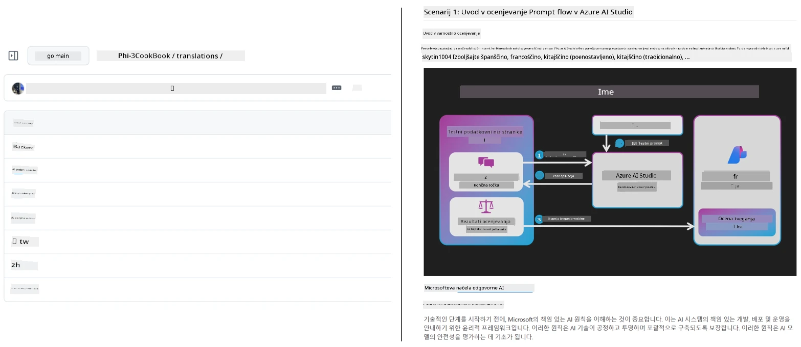
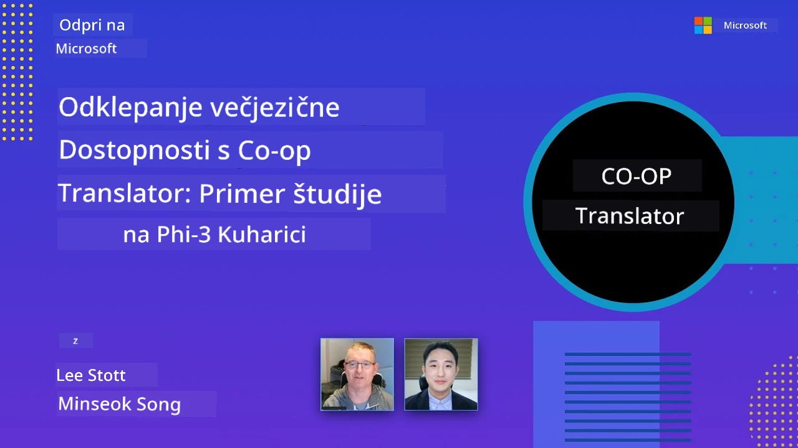

# Co-op Translator

_Preprosto avtomatizirajte in vzdržujte prevode vaših izobraževalnih vsebin na GitHubu v več jezikih, ko se vaš projekt razvija._


[](https://pypi.org/project/co-op-translator/)
[](https://github.com/azure/co-op-translator/blob/main/LICENSE)
[](https://pepy.tech/project/co-op-translator)
[](https://pepy.tech/project/co-op-translator)
[](https://github.com/azure/co-op-translator/pkgs/container/co-op-translator)
[](https://github.com/psf/black)

[](https://GitHub.com/azure/co-op-translator/graphs/contributors/)
[](https://GitHub.com/azure/co-op-translator/issues/)
[](https://GitHub.com/azure/co-op-translator/pulls/)
[](http://makeapullrequest.com)

### 🌐 Večjezična podpora

#### Podprto z [Co-op Translator](https://github.com/Azure/Co-op-Translator)

<!-- CO-OP TRANSLATOR LANGUAGES TABLE START -->
[Arabic](../ar/README.md) | [Bengali](../bn/README.md) | [Bulgarian](../bg/README.md) | [Burmese (Myanmar)](../my/README.md) | [Chinese (Simplified)](../zh-CN/README.md) | [Chinese (Traditional, Hong Kong)](../zh-HK/README.md) | [Chinese (Traditional, Macau)](../zh-MO/README.md) | [Chinese (Traditional, Taiwan)](../zh-TW/README.md) | [Croatian](../hr/README.md) | [Czech](../cs/README.md) | [Danish](../da/README.md) | [Dutch](../nl/README.md) | [Estonian](../et/README.md) | [Finnish](../fi/README.md) | [French](../fr/README.md) | [German](../de/README.md) | [Greek](../el/README.md) | [Hebrew](../he/README.md) | [Hindi](../hi/README.md) | [Hungarian](../hu/README.md) | [Indonesian](../id/README.md) | [Italian](../it/README.md) | [Japanese](../ja/README.md) | [Kannada](../kn/README.md) | [Khmer](../km/README.md) | [Korean](../ko/README.md) | [Lithuanian](../lt/README.md) | [Malay](../ms/README.md) | [Malayalam](../ml/README.md) | [Marathi](../mr/README.md) | [Nepali](../ne/README.md) | [Nigerian Pidgin](../pcm/README.md) | [Norwegian](../no/README.md) | [Persian (Farsi)](../fa/README.md) | [Polish](../pl/README.md) | [Portuguese (Brazil)](../pt-BR/README.md) | [Portuguese (Portugal)](../pt-PT/README.md) | [Punjabi (Gurmukhi)](../pa/README.md) | [Romanian](../ro/README.md) | [Russian](../ru/README.md) | [Serbian (Cyrillic)](../sr/README.md) | [Slovak](../sk/README.md) | [Slovenian](./README.md) | [Spanish](../es/README.md) | [Swahili](../sw/README.md) | [Swedish](../sv/README.md) | [Tagalog (Filipino)](../tl/README.md) | [Tamil](../ta/README.md) | [Telugu](../te/README.md) | [Thai](../th/README.md) | [Turkish](../tr/README.md) | [Ukrainian](../uk/README.md) | [Urdu](../ur/README.md) | [Vietnamese](../vi/README.md)

> **Raje klonirati lokalno?**
>
> Ta repozitorij vključuje več kot 50 jezikovnih prevodov, kar bistveno poveča velikost prenosa. Če želite klonirati brez prevodov, uporabite sparse checkout:
>
> **Bash / macOS / Linux:**
> ```bash
> git clone --filter=blob:none --sparse https://github.com/Azure/co-op-translator.git
> cd co-op-translator
> git sparse-checkout set --no-cone '/*' '!translations' '!translated_images'
> ```
>
> **CMD (Windows):**
> ```cmd
> git clone --filter=blob:none --sparse https://github.com/Azure/co-op-translator.git
> cd co-op-translator
> git sparse-checkout set --no-cone "/*" "!translations" "!translated_images"
> ```
>
> Tako imate vse, kar potrebujete za dokončanje tečaja, a z veliko hitrejšo prenosno hitrostjo.
<!-- CO-OP TRANSLATOR LANGUAGES TABLE END -->

[](https://GitHub.com/azure/co-op-translator/watchers/)
[](https://GitHub.com/azure/co-op-translator/network/)
[](https://GitHub.com/azure/co-op-translator/stargazers/)

[](https://discord.gg/nTYy5BXMWG)

[](https://codespaces.new/azure/co-op-translator)

## Pregled

**Co-op Translator** vam pomaga prevesti vaše izobraževalne vsebine na GitHubu v več jezikov brez težav.  
Ko posodobite svoje datoteke Markdown, slike ali zapiske, se prevodi samodejno sinhronizirajo, s čimer zagotovite, da vaša vsebina ostaja točna in ažurna za učence po vsem svetu.

Primer organizacije prevedene vsebine:



## Kako je upravljano stanje prevodov

Co-op Translator upravlja prevedeno vsebino kot **različne različice programske opreme**,  
ne kot statične datoteke.

Orodje sledi stanju prevedenih Markdown datotek, slik in zapiskov  
z uporabo **metapodatkov, omejenih na jezik**.

Ta zasnova omogoča Co-op Translatorju:

- Zanesljivo zaznati zastarele prevode  
- Ravnotežno ravnati z Markdown, slikami in zapiski  
- Varnostno skalirati velike, hitro spreminjajoče se, večjezične repozitorije

Z modeliranjem prevodov kot upravljanih artefaktov,  
prevodni delovni tokovi naravno sledijo sodobnim  
praksam upravljanja odvisnosti in artefaktov v programski opremi.

→ [Kako je upravljano stanje prevodov](https://techcommunity.microsoft.com/blog/azuredevcommunityblog/rethinking-documentation-translation-treating-translations-as-versioned-software/4491755)


## Hiter začetek

```bash
# Ustvari in aktiviraj virtualno okolje (priporočeno)
python -m venv .venv
# Windows
.venv\Scripts\activate
# macOS/Linux
source .venv/bin/activate
# Namesti paket
pip install co-op-translator
# Prevedi
translate -l "ko ja fr" -md
```

Docker:

```bash
# Prenesite javno sliko iz GHCR
docker pull ghcr.io/azure/co-op-translator:latest
# Zaženite s pripeto trenutno mapo in zagotovljeno datoteko .env (Bash/Zsh)
docker run --rm -it --env-file .env -v "${PWD}:/work" ghcr.io/azure/co-op-translator:latest -l "ko ja fr" -md
```

## Minimalna namestitev

1. Preverite, da imate podprto različico Pythona (trenutno 3.10-3.12). V poetry (pyproject.toml) je to samodejno urejeno.  
2. Ustvarite `.env` datoteko s predlogo: [.env.template](../../.env.template)  
3. Nastavite enega ponudnika LLM (Azure OpenAI ali OpenAI)  
4. (Neobvezno) Za prevajanje slik (`-img`) nastavite Azure AI Vision  
5. (Neobvezno) Lahko nastavite več naborov poverilnic s podvajanjem spremenljivk s priponasmi, kot so `_1`, `_2` itd. Vse spremenljivke v naboru morajo imeti isto pripono.  
6. (Priporočeno) Počistite vse prejšnje prevode, da se izognete konfliktom (npr. `translations/`)  
7. (Priporočeno) Dodajte prevodno sekcijo v vaš README z uporabo [README languages template](./getting_started/README_languages_template.md)  
8. Oglejte si: [Namestitev Azure AI](./getting_started/set-up-azure-ai.md)

## Uporaba

Prevedite vse podprte vrste:

```bash
translate -l "ko ja"
```

Samo Markdown:

```bash
translate -l "de" -md
```

Markdown + slike:

```bash
translate -l "pt" -md -img
```

Samo zapiski:

```bash
translate -l "zh" -nb
```

Več zastavic: [Referenca ukazov](./getting_started/command-reference.md)

## Značilnosti

- Avtomatizirano prevajanje za Markdown, zapiske in slike  
- Prevode drži sinhronizirane s spremembami izvornih datotek  
- Deluje lokalno (CLI) in v CI (GitHub Actions)  
- Uporablja Azure OpenAI ali OpenAI; neobvezno Azure AI Vision za slike  
- Ohranja oblikovanje in strukturo Markdowna

## Dokumentacija

- [Vodnik po ukazni vrstici](./getting_started/command-line-guide/command-line-guide.md)  
- [Vodnik GitHub Actions (Javni repozitoriji in standardne skrivnosti)](./getting_started/github-actions-guide/github-actions-guide-public.md)  
- [Vodnik GitHub Actions (Microsoft-organizacijski repozitoriji & organizacijske nastavitve)](./getting_started/github-actions-guide/github-actions-guide-org.md)  
- [Predloga jezika za README](./getting_started/README_languages_template.md)  
- [Podprti jeziki](./getting_started/supported-languages.md)  
- [Prispevanje](./CONTRIBUTING.md)  
- [Reševanje težav](./getting_started/troubleshooting.md)

### Microsoft-specifični vodnik
> [!NOTE]
> Za vzdrževalce Microsoftovih repozitorijev “Za začetnike”.

- [Posodobitev seznama “drugih tečajev” (samo za MS začetniške repozitorije)](./getting_started/update-other-courses.md)

## Podprite nas in spodbujajte globalno učenje

Pridružite se nam pri revolucioniranju načina deljenja izobraževalnih vsebin po svetu! Podprite [Co-op Translator](https://github.com/azure/co-op-translator) z zvezdico na GitHubu in pomagajte pri naši nalogi odpravljanja jezikovnih ovir v učenju in tehnologiji. Vaš interes in prispevki imajo velik pomen! Prispevki kode in predlogi funkcij so vedno dobrodošli.

### Raziščite Microsoftove izobraževalne vsebine v vašem jeziku

- [LangChain4j-for-Beginners](https://github.com/microsoft/LangChain4j-for-Beginners)
- [AZD for Beginners](https://github.com/microsoft/AZD-for-beginners)
- [Edge AI for Beginners](https://github.com/microsoft/edgeai-for-beginners)
- [Model Context Protocol (MCP) For Beginners](https://github.com/microsoft/mcp-for-beginners)
- [AI Agents for Beginners](https://github.com/microsoft/ai-agents-for-beginners)
- [Generative AI for Beginners using .NET](https://github.com/microsoft/Generative-AI-for-beginners-dotnet)
- [Generative AI for Beginners](https://github.com/microsoft/generative-ai-for-beginners)
- [Generative AI for Beginners using Java](https://github.com/microsoft/generative-ai-for-beginners-java)
- [ML for Beginners](https://aka.ms/ml-beginners)
- [Data Science for Beginners](https://aka.ms/datascience-beginners)
- [AI for Beginners](https://aka.ms/ai-beginners)
- [Cybersecurity for Beginners](https://github.com/microsoft/Security-101)
- [Web Dev for Beginners](https://aka.ms/webdev-beginners)
- [IoT for Beginners](https://aka.ms/iot-beginners)
- [PhiCookBook](https://github.com/microsoft/PhiCookBook)

## Video predstavitve

👉 Kliknite na sliko spodaj, da si ogledate na YouTube.

- **Open at Microsoft**: Kratek 18-minutni uvod in hiter vodnik o uporabi Co-op Translatorja.

  [](https://www.youtube.com/watch?v=jX_swfH_KNU)

## Prispevanje

Ta projekt sprejema prispevke in predloge. Vas zanima prispevanje k Azure Co-op Translatorju? Prosimo, oglejte si naš [CONTRIBUTING.md](./CONTRIBUTING.md) za navodila, kako lahko pomagate narediti Co-op Translator bolj dostopen.

## Prispevalci
[](https://github.com/Azure/co-op-translator/graphs/contributors)

## Kodeks ravnanja

Ta projekt je sprejel [Microsoft Open Source Code of Conduct](https://opensource.microsoft.com/codeofconduct/).
Za več informacij si oglejte [Pogosta vprašanja o kodeksu ravnanja](https://opensource.microsoft.com/codeofconduct/faq/) ali 
kontaktirajte [opencode@microsoft.com](mailto:opencode@microsoft.com) za dodatna vprašanja ali komentarje.

## Odgovorna umetna inteligenca

Microsoft si prizadeva pomagati našim strankam pri odgovorni uporabi naših AI izdelkov, deliti naše izkušnje ter graditi partnerske odnose, ki temeljijo na zaupanju, preko orodij, kot so Zapisi o preglednosti in Ocenjevanje vpliva. Veliko teh virov lahko najdete na [https://aka.ms/RAI](https://aka.ms/RAI).
Microsoftov pristop k odgovorni umetni inteligenci temelji na naših načelih AI pravičnosti, zanesljivosti in varnosti, zasebnosti in varnosti, vključenosti, preglednosti ter odgovornosti.

Veliki modeli za naravni jezik, slike in govor - kot tisti, ki so uporabljeni v tem vzorcu - se lahko potencialno obnašajo na načine, ki niso pravični, zanesljivi ali so žaljivi, kar lahko povzroči škodo. Prosimo, preberite [Azure OpenAI service Transparency note](https://learn.microsoft.com/legal/cognitive-services/openai/transparency-note?tabs=text), da ste obveščeni o tveganjih in omejitvah.

Priporočeni pristop za zmanjšanje teh tveganj je vključitev varnostnega sistema v vašo arhitekturo, ki lahko zazna in prepreči škodljivo vedenje. [Azure AI Content Safety](https://learn.microsoft.com/azure/ai-services/content-safety/overview) zagotavlja neodvisno zaščitno plast, ki lahko zazna škodljivo vsebino, ki jo ustvarijo uporabniki in AI, v aplikacijah in storitvah. Azure AI Content Safety vključuje API-je za besedilo in slike, ki vam omogočajo zaznavanje škodljivega gradiva. Na voljo imamo tudi interaktivno Content Safety Studio, kjer si lahko ogledate, raziskujete in preizkusite vzorčno kodo za zaznavanje škodljive vsebine v različnih modalitetah. Naslednja [dokumentacija za hitro začetek](https://learn.microsoft.com/azure/ai-services/content-safety/quickstart-text?tabs=visual-studio%2Clinux&pivots=programming-language-rest) vas vodi skozi postopke poizvedb do storitve.

Drugi vidik, ki ga je treba upoštevati, je splošna učinkovitost aplikacije. Pri aplikacijah z večmodalnimi in večmodelnimi pristopi razumemo učinkovitost kot to, da sistem deluje tako, kot vi in vaši uporabniki pričakujete, vključno s tem, da ne generira škodljivih izhodov. Pomembno je oceniti učinkovitost vaše celotne aplikacije z uporabo [meril kakovosti generiranja in meritev tveganja ter varnosti](https://learn.microsoft.com/azure/ai-studio/concepts/evaluation-metrics-built-in).

Svojo AI aplikacijo lahko ocenite v vašem razvojno okolju z uporabo [prompt flow SDK](https://microsoft.github.io/promptflow/index.html). Glede na testni podatkovni niz ali cilj se generacije vaše generativne AI aplikacije kvantitativno ocenijo z vgrajenimi ocenjevalci ali z vašimi lastnimi po meri izdelanimi ocenami. Za začetek z uporabo prompt flow SDK za ocenjevanje vašega sistema lahko sledite [vodniku za hitro začetek](https://learn.microsoft.com/azure/ai-studio/how-to/develop/flow-evaluate-sdk). Ko izvedete ocenjevalno izvajanje, lahko [vizualizirate rezultate v Azure AI Studio](https://learn.microsoft.com/azure/ai-studio/how-to/evaluate-flow-results).

## Zaščitni znaki

Ta projekt lahko vsebuje zaščitne znake ali logotipe za projekte, izdelke ali storitve. Pooblaščena uporaba Microsoftovih
zaščitnih znakov ali logotipov mora slediti
[Smernicam Microsoftovih zaščitnih znakov in blagovnih znamk](https://www.microsoft.com/en-us/legal/intellectualproperty/trademarks/usage/general).
Uporaba Microsoftovih zaščitnih znakov ali logotipov v spremenjenih različicah tega projekta ne sme povzročiti zmede ali nakazovati Microsoftovega sponzorstva.
Vsaka uporaba zaščitnih znakov ali logotipov tretjih oseb podlega pravilom teh tretjih oseb.

## Pomoč

Če se zataknete ali imate vprašanja o razvoju AI aplikacij, se pridružite:

[](https://discord.gg/nTYy5BXMWG)

Če imate povratne informacije o izdelku ali naletite na napake med razvojem, obiščite:

[](https://aka.ms/foundry/forum)

---

<!-- CO-OP TRANSLATOR DISCLAIMER START -->
**Omejitev odgovornosti**:  
Ta dokument je bil preveden z uporabo AI prevajalske storitve [Co-op Translator](https://github.com/Azure/co-op-translator). Medtem ko si prizadevamo za natančnost, upoštevajte, da lahko avtomatizirani prevodi vsebujejo napake ali netočnosti. Izvirni dokument v njegovi izvorni različici velja za avtoritativni vir. Za ključne informacije priporočamo strokovni človeški prevod. Ne odgovarjamo za morebitna nesporazume ali napačne interpretacije, ki izhajajo iz uporabe tega prevoda.
<!-- CO-OP TRANSLATOR DISCLAIMER END -->