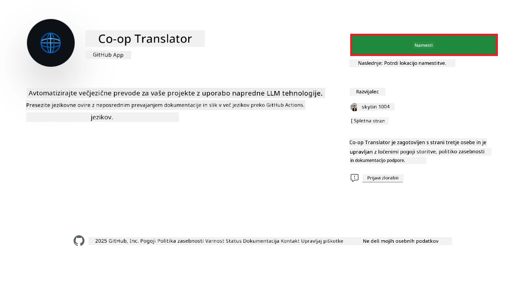
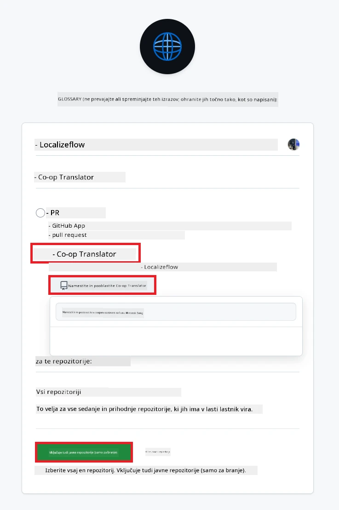
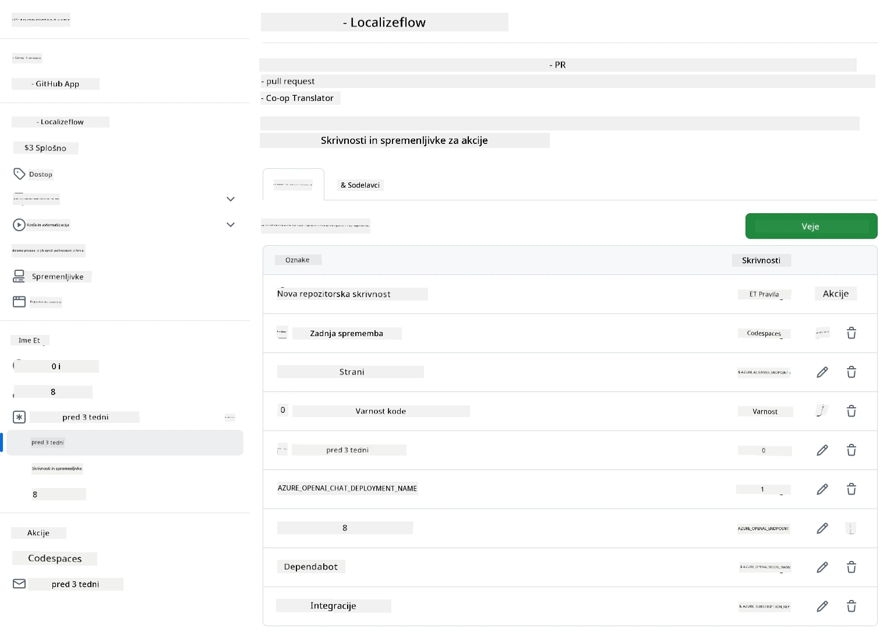

# Uporaba Co-op Translator GitHub Action (Organizacijski vodič)

**Ciljna skupina:** Ta vodič je namenjen **internim uporabnikom Microsofta** ali **ekipam, ki imajo dostop do potrebnih poverilnic za vnaprej pripravljeno Co-op Translator GitHub aplikacijo** ali si lahko ustvarijo svojo lastno GitHub aplikacijo.

Avtomatizirajte prevajanje dokumentacije v svojem repozitoriju brez težav z uporabo Co-op Translator GitHub Action. Ta vodič vas vodi skozi nastavitev akcije, ki samodejno ustvari pull requeste s posodobljenimi prevodi, kadar koli se spremenijo izvorne Markdown datoteke ali slike.

> [!IMPORTANT]
> 
> **Izbira pravega vodiča:**
>
> Ta vodič opisuje nastavitev z uporabo **GitHub App ID in zasebnega ključa**. Običajno potrebujete ta "Organizacijski vodič", če: **`GITHUB_TOKEN` dovoljenja so omejena:** Nastavitve vaše organizacije ali repozitorija omejujejo privzeta dovoljenja, ki jih ima standardni `GITHUB_TOKEN`. Če `GITHUB_TOKEN` nima potrebnih `write` dovoljenj (npr. `contents: write` ali `pull-requests: write`), bo potek dela iz [javnega vodiča](./github-actions-guide-public.md) spodletel zaradi pomanjkanja dovoljenj. Uporaba namensko dodeljene GitHub aplikacije z eksplicitno dodeljenimi dovoljenji zaobide to omejitev.
>
> **Če zgornje ne velja za vas:**
>
> Če ima standardni `GITHUB_TOKEN` dovolj dovoljenj v vašem repozitoriju (torej niste omejeni z organizacijskimi pravili), uporabite **[Javni vodič z uporabo GITHUB_TOKEN](./github-actions-guide-public.md)**. Javni vodič ne zahteva pridobivanja ali upravljanja App ID-jev ali zasebnih ključev in temelji le na standardnem `GITHUB_TOKEN` in dovoljenjih repozitorija.

## Predpogoji

Preden nastavite GitHub Action, poskrbite, da imate pripravljene potrebne poverilnice za AI storitve.

**1. Obvezno: Poverilnice za jezikovni model AI**
Potrebujete poverilnice za vsaj en podprt jezikovni model:

- **Azure OpenAI**: Potrebujete Endpoint, API Key, imena modelov/deploymentov, verzijo API-ja.
- **OpenAI**: Potrebujete API Key, (opcijsko: Org ID, Base URL, Model ID).
- Podrobnosti najdete v [Podprti modeli in storitve](../../../../README.md).
- Vodič za nastavitev: [Nastavitev Azure OpenAI](../set-up-resources/set-up-azure-openai.md).

**2. Opcijsko: Poverilnice za Computer Vision (za prevajanje slik)**

- Potrebno le, če želite prevajati besedilo v slikah.
- **Azure Computer Vision**: Potrebujete Endpoint in Subscription Key.
- Če ni podano, akcija privzeto deluje v [samo Markdown načinu](../markdown-only-mode.md).
- Vodič za nastavitev: [Nastavitev Azure Computer Vision](../set-up-resources/set-up-azure-computer-vision.md).

## Nastavitev in konfiguracija

Sledite tem korakom za nastavitev Co-op Translator GitHub Action v vašem repozitoriju:

### Korak 1: Namestite in konfigurirajte GitHub App avtentikacijo

Potek dela uporablja avtentikacijo GitHub aplikacije za varno interakcijo z vašim repozitorijem (npr. ustvarjanje pull requestov) v vašem imenu. Izberite eno možnost:

#### **Možnost A: Namestite vnaprej pripravljeno Co-op Translator GitHub aplikacijo (za interno uporabo v Microsoftu)**

1. Obiščite stran [Co-op Translator GitHub App](https://github.com/apps/co-op-translator).

1. Izberite **Install** in izberite račun ali organizacijo, kjer se nahaja vaš ciljni repozitorij.

    

1. Izberite **Only select repositories** in izberite svoj ciljni repozitorij (npr. `PhiCookBook`). Kliknite **Install**. Morda boste morali potrditi svojo identiteto.

    

1. **Pridobite poverilnice aplikacije (interni postopek):** Da omogočite avtentikacijo poteka dela kot aplikacija, potrebujete dve informaciji, ki ju zagotovi ekipa Co-op Translator:
  - **App ID:** Edinstveni identifikator za Co-op Translator aplikacijo. App ID je: `1164076`.
  - **Zasebni ključ:** Pridobiti morate **celotno vsebino** `.pem` datoteke zasebnega ključa od kontaktne osebe vzdrževalca. **S tem ključem ravnajte kot z geslom in ga hranite varno.**

1. Nadaljujte s korakom 2.

#### **Možnost B: Uporabite svojo lastno GitHub aplikacijo**

- Če želite, lahko ustvarite in nastavite svojo GitHub aplikacijo. Poskrbite, da ima bralni in pisalni dostop do Contents in Pull requests. Potrebovali boste njen App ID in generiran zasebni ključ.

### Korak 2: Nastavite skrivnosti repozitorija

Dodati morate poverilnice GitHub aplikacije in poverilnice AI storitev kot šifrirane skrivnosti v nastavitvah repozitorija.

1. Obiščite svoj ciljni GitHub repozitorij (npr. `PhiCookBook`).

1. Pojdite na **Settings** > **Secrets and variables** > **Actions**.

1. Pod **Repository secrets** kliknite **New repository secret** za vsako spodaj navedeno skrivnost.

   

**Obvezne skrivnosti (za avtentikacijo GitHub aplikacije):**

| Ime skrivnosti        | Opis                                            | Vir vrednosti                                   |
| :------------------- | :---------------------------------------------- | :---------------------------------------------- |
| `GH_APP_ID`          | App ID GitHub aplikacije (iz koraka 1).         | Nastavitve GitHub aplikacije                    |
| `GH_APP_PRIVATE_KEY` | **Celotna vsebina** prenesene `.pem` datoteke.  | `.pem` datoteka (iz koraka 1)                   |

**Skrivnosti AI storitev (dodajte VSE, ki veljajo glede na vaše predpogoje):**

| Ime skrivnosti                        | Opis                                    | Vir vrednosti                  |
| :------------------------------------ | :-------------------------------------- | :----------------------------- |
| `AZURE_AI_SERVICE_API_KEY`            | Ključ za Azure AI Service (Computer Vision)  | Azure AI Foundry               |
| `AZURE_AI_SERVICE_ENDPOINT`           | Endpoint za Azure AI Service (Computer Vision) | Azure AI Foundry               |
| `AZURE_OPENAI_API_KEY`                | Ključ za Azure OpenAI storitev          | Azure AI Foundry               |
| `AZURE_OPENAI_ENDPOINT`               | Endpoint za Azure OpenAI storitev       | Azure AI Foundry               |
| `AZURE_OPENAI_MODEL_NAME`             | Ime vašega Azure OpenAI modela          | Azure AI Foundry               |
| `AZURE_OPENAI_CHAT_DEPLOYMENT_NAME`   | Ime vašega Azure OpenAI deploymenta     | Azure AI Foundry               |
| `AZURE_OPENAI_API_VERSION`            | Verzija API-ja za Azure OpenAI          | Azure AI Foundry               |
| `OPENAI_API_KEY`                      | API ključ za OpenAI                     | OpenAI Platform                |
| `OPENAI_ORG_ID`                       | OpenAI Organization ID                  | OpenAI Platform                |
| `OPENAI_CHAT_MODEL_ID`                | Specifičen OpenAI model ID              | OpenAI Platform                |
| `OPENAI_BASE_URL`                     | Custom OpenAI API Base URL              | OpenAI Platform                |



### Korak 3: Ustvarite datoteko poteka dela

Na koncu ustvarite YAML datoteko, ki definira avtomatiziran potek dela.

1. V korenski mapi vašega repozitorija ustvarite mapo `.github/workflows/`, če še ne obstaja.

1. V `.github/workflows/` ustvarite datoteko z imenom `co-op-translator.yml`.

1. V datoteko co-op-translator.yml prilepite naslednjo vsebino.

```
name: Co-op Translator

on:
  push:
    branches:
      - main

jobs:
  co-op-translator:
    runs-on: ubuntu-latest

    permissions:
      contents: write
      pull-requests: write

    steps:
      - name: Checkout repository
        uses: actions/checkout@v4
        with:
          fetch-depth: 0

      - name: Set up Python
        uses: actions/setup-python@v4
        with:
          python-version: '3.10'

      - name: Install Co-op Translator
        run: |
          python -m pip install --upgrade pip
          pip install co-op-translator

      - name: Run Co-op Translator
        env:
          PYTHONIOENCODING: utf-8
          # Azure AI Service Credentials
          AZURE_AI_SERVICE_API_KEY: ${{ secrets.AZURE_AI_SERVICE_API_KEY }}
          AZURE_AI_SERVICE_ENDPOINT: ${{ secrets.AZURE_AI_SERVICE_ENDPOINT }}

          # Azure OpenAI Credentials
          AZURE_OPENAI_API_KEY: ${{ secrets.AZURE_OPENAI_API_KEY }}
          AZURE_OPENAI_ENDPOINT: ${{ secrets.AZURE_OPENAI_ENDPOINT }}
          AZURE_OPENAI_MODEL_NAME: ${{ secrets.AZURE_OPENAI_MODEL_NAME }}
          AZURE_OPENAI_CHAT_DEPLOYMENT_NAME: ${{ secrets.AZURE_OPENAI_CHAT_DEPLOYMENT_NAME }}
          AZURE_OPENAI_API_VERSION: ${{ secrets.AZURE_OPENAI_API_VERSION }}

          # OpenAI Credentials
          OPENAI_API_KEY: ${{ secrets.OPENAI_API_KEY }}
          OPENAI_ORG_ID: ${{ secrets.OPENAI_ORG_ID }}
          OPENAI_CHAT_MODEL_ID: ${{ secrets.OPENAI_CHAT_MODEL_ID }}
          OPENAI_BASE_URL: ${{ secrets.OPENAI_BASE_URL }}
        run: |
          # =====================================================================
          # IMPORTANT: Set your target languages here (REQUIRED CONFIGURATION)
          # =====================================================================
          # Example: Translate to Spanish, French, German. Add -y to auto-confirm.
          translate -l "es fr de" -y  # <--- MODIFY THIS LINE with your desired languages

      - name: Authenticate GitHub App
        id: generate_token
        uses: tibdex/github-app-token@v1
        with:
          app_id: ${{ secrets.GH_APP_ID }}
          private_key: ${{ secrets.GH_APP_PRIVATE_KEY }}

      - name: Create Pull Request with translations
        uses: peter-evans/create-pull-request@v5
        with:
          token: ${{ steps.generate_token.outputs.token }}
          commit-message: "🌐 Update translations via Co-op Translator"
          title: "🌐 Update translations via Co-op Translator"
          body: |
            This PR updates translations for recent changes to the main branch.

            ### 📋 Changes included
            - Translated contents are available in the `translations/` directory
            - Translated images are available in the `translated_images/` directory

            ---
            🌐 Automatically generated by the [Co-op Translator](https://github.com/Azure/co-op-translator) GitHub Action.
          branch: update-translations
          base: main
          labels: translation, automated-pr
          delete-branch: true
          add-paths: |
            translations/
            translated_images/

```

4.  **Prilagodite potek dela:**
  - **[!IMPORTANT] Ciljni jeziki:** V koraku `Run Co-op Translator` **MORATE pregledati in spremeniti seznam jezikovnih kod** v ukazu `translate -l "..." -y`, da ustreza potrebam vašega projekta. Primer seznama (`ar de es...`) je treba zamenjati ali prilagoditi.
  - **Sprožilec (`on:`):** Trenutni sprožilec se zažene ob vsakem pushu na `main`. Pri večjih repozitorijih razmislite o dodajanju filtra `paths:` (glejte komentiran primer v YAML-u), da se potek dela zažene le ob spremembah relevantnih datotek (npr. izvorne dokumentacije), kar prihrani čas izvajanja.
  - **Podrobnosti PR:** Po potrebi prilagodite `commit-message`, `title`, `body`, ime `branch` in `labels` v koraku `Create Pull Request`.

## Upravljanje poverilnic in obnavljanje

- **Varnost:** Občutljive poverilnice (API ključi, zasebni ključi) vedno shranjujte kot skrivnosti GitHub Actions. Nikoli jih ne izpostavljajte v datoteki poteka dela ali kodi repozitorija.
- **[!IMPORTANT] Obnavljanje ključev (interni uporabniki Microsofta):** Zavedajte se, da je Azure OpenAI ključ, ki se uporablja znotraj Microsofta, morda treba obnavljati (npr. vsakih 5 mesecev). Poskrbite, da ustrezne skrivnosti GitHub (`AZURE_OPENAI_...` ključe) **posodobite pred iztekom**, da preprečite napake v poteku dela.

## Zaganjanje poteka dela

> [!WARNING]  
> **Časovna omejitev GitHub-hosted runnerjev:**  
> GitHub-hosted runnerji, kot je `ubuntu-latest`, imajo **najdaljši čas izvajanja 6 ur**.  
> Pri večjih repozitorijih z dokumentacijo, če postopek prevajanja preseže 6 ur, bo potek dela samodejno prekinjen.  
> Da to preprečite, razmislite o:  
> - Uporabi **self-hosted runnerja** (brez časovne omejitve)  
> - Zmanjšanju števila ciljnih jezikov na posamezno izvajanje

Ko je datoteka `co-op-translator.yml` združena v vašo glavno vejo (ali vejo, določeno v sprožilcu `on:`), se bo potek dela samodejno zagnal ob vsaki spremembi, ki je potisnjena v to vejo (in ustreza filtru `paths`, če je nastavljen).

Če so prevodi ustvarjeni ali posodobljeni, bo akcija samodejno ustvarila Pull Request s spremembami, pripravljenimi za vaš pregled in združitev.

---

**Izjava o omejitvi odgovornosti**:
Ta dokument je bil preveden s pomočjo storitve za strojno prevajanje [Co-op Translator](https://github.com/Azure/co-op-translator). Čeprav si prizadevamo za natančnost, vas opozarjamo, da lahko avtomatski prevodi vsebujejo napake ali netočnosti. Izvirni dokument v svojem maternem jeziku naj velja za avtoritativni vir. Za ključne informacije priporočamo strokovni človeški prevod. Ne prevzemamo odgovornosti za morebitne nesporazume ali napačne razlage, ki bi izhajale iz uporabe tega prevoda.