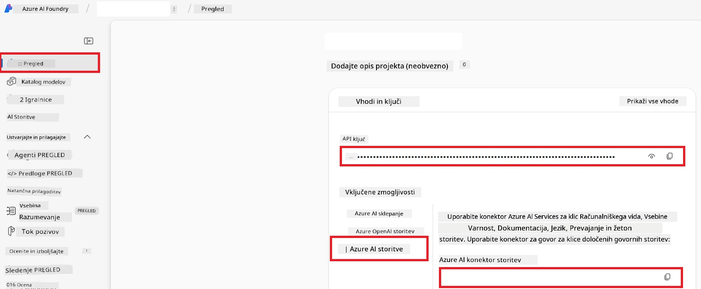

# Nastavitev Azure AI za Co-op Translator (Azure OpneAI & Azure AI Vision)

Ta vodnik vas vodi skozi postopek nastavitev Azure OpenAI za prevajanje jezikov in Azure Computer Vision za analizo vsebine slik (ki se lahko nato uporabijo za prevajanje na osnovi slik) znotraj Azure AI Foundry.

**Predpogoji:**
- Račun Azure z aktivno naročnino.
- Zadostna dovoljenja za ustvarjanje virov in namestitev v vaši naročnini Azure.

## Ustvarite Azure AI projekt

Začeli boste z ustvarjanjem Azure AI projekta, ki deluje kot osrednje mesto za upravljanje vaših AI virov.

1. Pojdite na [https://ai.azure.com](https://ai.azure.com) in se prijavite s svojim računom Azure.

1. Izberite **+Create** za ustvarjanje novega projekta.

1. Izvedite naslednje naloge:
   - Vnesite **Ime projekta** (npr. `CoopTranslator-Project`).
   - Izberite **AI hub** (npr. `CoopTranslator-Hub`) (po potrebi ustvarite novega).

1. Kliknite "**Review and Create**" za nastavitev vašega projekta. Odpre se pregledna stran vašega projekta.

## Nastavite Azure OpenAI za prevajanje jezika

Znotraj vašega projekta boste namestili Azure OpenAI model, ki bo služil kot podium za prevajanje besedila.

### Pojdite do vašega projekta

Če še niste, odprite vaš novo ustvarjen projekt (npr. `CoopTranslator-Project`) v Azure AI Foundry.

### Namestite OpenAI model

1. V levem meniju vašega projekta, pod "My assets", izberite "**Models + endpoints**".

1. Izberite **+ Deploy model**.

1. Izberite **Deploy Base Model**.

1. Predstavljena vam bo lista razpoložljivih modelov. Filtrirajte ali poiščite primeren GPT model. Priporočamo `gpt-4o`.

1. Izberite želeni model in kliknite **Confirm**.

1. Izberite **Deploy**.

### Nastavitev Azure OpenAI

Ko je model nameščen, ga lahko izberete na strani "**Models + endpoints**", kjer boste našli **REST endpoint URL**, **ključ**, **ime namestitve**, **ime modela** in **API verzijo**. Te informacije boste potrebovali za integracijo prevajalskega modela v vašo aplikacijo.

> [!NOTE]
> API različice lahko izberete na strani [API version deprecation](https://learn.microsoft.com/azure/ai-services/openai/api-version-deprecation) glede na vaše zahteve. Zavedajte se, da se **API verzija** razlikuje od **verzije modela**, prikazane na strani **Models + endpoints** v Azure AI Foundry.

## Nastavite Azure Computer Vision za prevajanje slik

Za omogočanje prevajanja besedila znotraj slik morate pridobiti Azure AI Service API ključ in endpoint.

1. Pojdite do vašega Azure AI projekta (npr. `CoopTranslator-Project`). Prepričajte se, da ste na pregledni strani projekta.

### Nastavitev Azure AI storitve

Pridobite API ključ in endpoint iz storitve Azure AI.

1. Pojdite do vašega Azure AI projekta (npr. `CoopTranslator-Project`). Prepričajte se, da ste na pregledni strani projekta.

1. Pridobite **API ključ** in **Endpoint** na zavihku Azure AI Service.

    

Ta povezava omogoča uporabo zmogljivosti povezanega vira Azure AI Service (vključno z analizo slik) v vašem AI Foundry projektu. To povezavo lahko nato uporabite v svojih zvezkih ali aplikacijah za izvlečenje besedila iz slik, ki ga lahko pošljete modelu Azure OpenAI za prevajanje.

## Združevanje vaših poverilnic

Do sedaj bi morali imeti naslednje podatke:

**Za Azure OpenAI (prevajanje besedila):**
- Azure OpenAI Endpoint
- Azure OpenAI API ključ
- Azure OpenAI ime modela (npr. `gpt-4o`)
- Azure OpenAI ime namestitve (npr. `cooptranslator-gpt4o`)
- Azure OpenAI API verzija

**Za Azure AI Services (izvleček besedila iz slik preko Vision):**
- Azure AI Service Endpoint
- Azure AI Service API ključ

### Primer: Nastavitev okoljskih spremenljivk (Predogled)

Kasneje, ko boste gradili svojo aplikacijo, jih boste verjetno nastavili kot okoljske spremenljivke, tako kot spodaj:

```bash
# Azure AI poverilnice za storitev (zahtevano za prevajanje slik)
AZURE_AI_SERVICE_API_KEY="your_azure_ai_service_api_key" # npr., 21xasd...
AZURE_AI_SERVICE_ENDPOINT="https://your_azure_ai_service_endpoint.cognitiveservices.azure.com/"

# Izbirni nadomestni nizi: podvojite spremenljivke s pripono _1/_2 (isti indeks za vse spremenljivke v nizu)
AZURE_AI_SERVICE_API_KEY_1="your_azure_ai_service_api_key_1"
AZURE_AI_SERVICE_ENDPOINT_1="https://your_azure_ai_service_endpoint_1.cognitiveservices.azure.com/"

# Azure OpenAI poverilnice (zahtevano za prevajanje besedila)
AZURE_OPENAI_API_KEY="your_azure_openai_api_key" # npr., 21xasd...
AZURE_OPENAI_ENDPOINT="https://your_azure_openai_endpoint.openai.azure.com/"
AZURE_OPENAI_MODEL_NAME="your_model_name" # npr., gpt-4o
AZURE_OPENAI_CHAT_DEPLOYMENT_NAME="your_deployment_name" # npr., cooptranslator-gpt4o
AZURE_OPENAI_API_VERSION="your_api_version" # npr., 2024-12-01-preview

# Izbirni nadomestni nizi: podvojite celoten niz AZURE_OPENAI_* s pripono _1/_2 (isti indeks za vse spremenljivke)
```

---

### Nadaljnje branje

- [Kako ustvariti projekt v Azure AI Foundry](https://learn.microsoft.com/azure/ai-foundry/how-to/create-projects?tabs=ai-studio)
- [Kako ustvariti Azure AI vire](https://learn.microsoft.com/azure/ai-foundry/how-to/create-azure-ai-resource?tabs=portal)
- [Kako namestiti OpenAI modele v Azure AI Foundry](https://learn.microsoft.com/en-us/azure/ai-foundry/how-to/deploy-models-openai)

---

<!-- CO-OP TRANSLATOR DISCLAIMER START -->
**Omejitev odgovornosti**:
Ta dokument je bil preveden z uporabo storitve za prevajanje z umetno inteligenco [Co-op Translator](https://github.com/Azure/co-op-translator). Čeprav si prizadevamo za natančnost, upoštevajte, da lahko avtomatizirani prevodi vsebujejo napake ali netočnosti. Izvirni dokument v izvorni jezik je treba obravnavati kot avtoritativni vir. Za kritične informacije je priporočljivo strokovno človeško prevajanje. Ne odgovarjamo za morebitne nesporazume ali napačne interpretacije, ki izhajajo iz uporabe tega prevoda.
<!-- CO-OP TRANSLATOR DISCLAIMER END -->