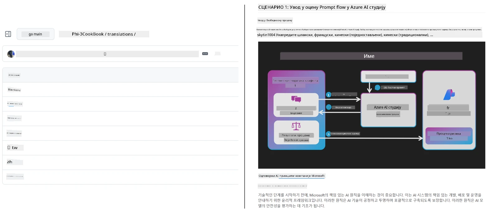
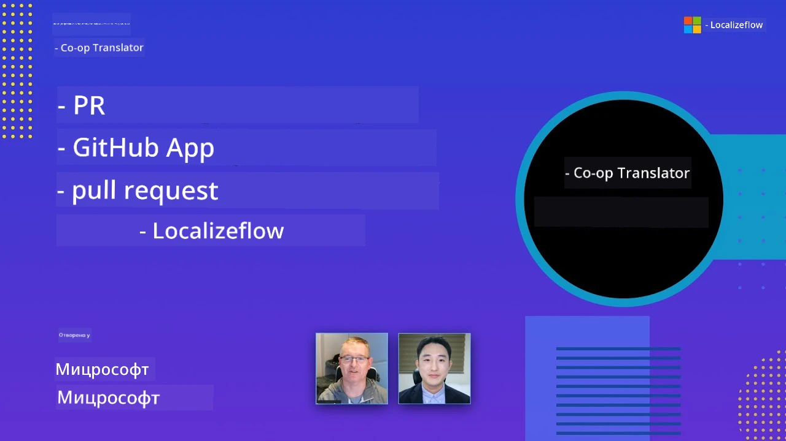

# Co-op Translator

_Лако аутоматизујте и одржавајте преводе за свој образовни GitHub садржај на више језика како ваш пројекат буде напредовао._


[](https://pypi.org/project/co-op-translator/)
[](https://github.com/azure/co-op-translator/blob/main/LICENSE)
[](https://pepy.tech/project/co-op-translator)
[](https://pepy.tech/project/co-op-translator)
[](https://github.com/azure/co-op-translator/pkgs/container/co-op-translator)
[](https://github.com/psf/black)

[](https://GitHub.com/azure/co-op-translator/graphs/contributors/)
[](https://GitHub.com/azure/co-op-translator/issues/)
[](https://GitHub.com/azure/co-op-translator/pulls/)
[](http://makeapullrequest.com)

### 🌐 Подршка за више језика

#### Подржано од стране [Co-op Translator](https://github.com/Azure/Co-op-Translator)

<!-- CO-OP TRANSLATOR LANGUAGES TABLE START -->
[Arabски](../ar/README.md) | [Бенгалски](../bn/README.md) | [Бугарски](../bg/README.md) | [Бирмански (Мјанмар)](../my/README.md) | [Кинески (поједностављени)](../zh-CN/README.md) | [Кинески (традиционални, Хонг Конг)](../zh-HK/README.md) | [Кинески (традиционални, Макао)](../zh-MO/README.md) | [Кинески (традиционални, Тајван)](../zh-TW/README.md) | [Хрватски](../hr/README.md) | [Чешки](../cs/README.md) | [Дански](../da/README.md) | [Холандски](../nl/README.md) | [Естонски](../et/README.md) | [Фински](../fi/README.md) | [Француски](../fr/README.md) | [Немачки](../de/README.md) | [Грчки](../el/README.md) | [Хебрејски](../he/README.md) | [Хинди](../hi/README.md) | [Мађарски](../hu/README.md) | [Индијски](../id/README.md) | [Италијански](../it/README.md) | [Јапански](../ja/README.md) | [Канада](../kn/README.md) | [Кмер](../km/README.md) | [Корејски](../ko/README.md) | [Литвански](../lt/README.md) | [Малајски](../ms/README.md) | [Малајалам](../ml/README.md) | [Марати](../mr/README.md) | [Непали](../ne/README.md) | [Нигеријски Пидгин](../pcm/README.md) | [Норвешки](../no/README.md) | [Персијски (Фарси)](../fa/README.md) | [Пољски](../pl/README.md) | [Португалски (Бразил)](../pt-BR/README.md) | [Португалски (Португалија)](../pt-PT/README.md) | [Пунџаби (Гурумкхи)](../pa/README.md) | [Румунски](../ro/README.md) | [Руски](../ru/README.md) | [Српски (ћирилица)](./README.md) | [Словачки](../sk/README.md) | [Словеначки](../sl/README.md) | [Шпански](../es/README.md) | [Свахили](../sw/README.md) | [Шведски](../sv/README.md) | [Тагалог (Филипински)](../tl/README.md) | [Тамилски](../ta/README.md) | [Телугу](../te/README.md) | [Тајландски](../th/README.md) | [Турски](../tr/README.md) | [Украјински](../uk/README.md) | [Урду](../ur/README.md) | [Вијетнамски](../vi/README.md)

> **Преферирате да клонирате локално?**
>
> Ово складиште садржи преводе на више од 50 језика што значајно увећава величину преузимања. Да бисте клонирали без превода, користите sparse checkout:
>
> **Bash / macOS / Linux:**
> ```bash
> git clone --filter=blob:none --sparse https://github.com/skytin1004/co-op-translator.git
> cd co-op-translator
> git sparse-checkout set --no-cone '/*' '!translations' '!translated_images'
> ```
>
> **CMD (Windows):**
> ```cmd
> git clone --filter=blob:none --sparse https://github.com/skytin1004/co-op-translator.git
> cd co-op-translator
> git sparse-checkout set --no-cone "/*" "!translations" "!translated_images"
> ```
>
> Ово вам даје све што вам је потребно да завршите курс са много бржим преузимањем.
<!-- CO-OP TRANSLATOR LANGUAGES TABLE END -->

[](https://GitHub.com/azure/co-op-translator/watchers/)
[](https://GitHub.com/azure/co-op-translator/network/)
[](https://GitHub.com/azure/co-op-translator/stargazers/)

[](https://discord.gg/nTYy5BXMWG)

[](https://codespaces.new/azure/co-op-translator)

## Преглед

**Co-op Translator** вам помаже да лако локализујете свој образовни GitHub садржај на више језика.  
Када ажурирате своје Markdown фајлове, слике или бележнице, преводи се аутоматски синхронизују, осигуравајући да ваш садржај остане тачан и ажуран за ученике широм света.

Пример како је преведени садржај организован:



## Како се управља стањем превода

Co-op Translator управља преведеним садржајем као **верзионисаним софтверским артефактима**,  
а не као статичним фајловима.

Алат прати стање преведеног Markdown-а, слика и бележница
користећи **метаподатке ограничене на језик**.

Овај дизајн омогућава Co-op Translator-у да:

- Поуздано детектује застареле преводе
- Поступа према Markdown-у, сликама и бележницама доследно
- Безбедно скалира кроз велика, брзо покретна мултијезичка складишта

Моделирањем превода као управљаних артефаката,
радни токови превођења природно се уклапају у модерне
праксе управљања зависностима и артефактима софтвера.

→ [Како се управља стањем превода](https://techcommunity.microsoft.com/blog/azuredevcommunityblog/rethinking-documentation-translation-treating-translations-as-versioned-software/4491755)


## Брзи почетак

```bash
# Креирајте и активирајте виртуелно окружење (препоручено)
python -m venv .venv
# Виндоус
.venv\Scripts\activate
# мАцоС/Линукс
source .venv/bin/activate
# Инсталирајте пакет
pip install co-op-translator
# Преведи
translate -l "ko ja fr" -md
```

Docker:

```bash
# Превуците јавну слику са GHCR
docker pull ghcr.io/azure/co-op-translator:latest
# Покрените са монтираном тренутном фасциклом и обезбеђеним .env (Bash/Zsh)
docker run --rm -it --env-file .env -v "${PWD}:/work" ghcr.io/azure/co-op-translator:latest -l "ko ja fr" -md
```

## Минимална конфигурација

1. Уверите се да имате подржану Python верзију (тренутно 3.10-3.12). У poetry (pyproject.toml) ово се аутоматски обрађује.
2. Креирајте `.env` фајл користећи шаблон: [.env.template](../../.env.template)
3. Конфигуришите једног LLM провајдера (Azure OpenAI или OpenAI)
4. (Опционо) За превод слика (`-img`), конфигуришите Azure AI Vision
5. (Опционо) Можете конфигурисати више сетова акредитива дуплирањем променљивих са наставцима као што су `_1`, `_2` итд. Све променљиве у скупу морају имати исти наставак.
6. (Препоручено) Очистите све претходне преводе да бисте избегли конфликте (нпр. `translations/`)
7. (Препоручено) Додајте одељак о преводима у свој README користећи [README languages template](./getting_started/README_languages_template.md)
8. Погледајте: [Подешавање Azure AI](./getting_started/set-up-azure-ai.md)

## Употреба

Преведи све подржане типове:

```bash
translate -l "ko ja"
```

Само Markdown:

```bash
translate -l "de" -md
```

Markdown + слике:

```bash
translate -l "pt" -md -img
```

Само бележнице:

```bash
translate -l "zh" -nb
```

Више опција: [Приручник за команде](./getting_started/command-reference.md)

## Карактеристике

- Аутоматски превод за Markdown, бележнице и слике
- Одржава преводе у складу са изменама извора
- Ради локално (CLI) или у CI (GitHub Actions)
- Користи Azure OpenAI или OpenAI; опционално Azure AI Vision за слике
- Очувава Markdown формат и структуру

## Документација

- [Водич за командну линију](./getting_started/command-line-guide/command-line-guide.md)
- [Водич за GitHub Actions (Јавна складишта и стандардни секрети)](./getting_started/github-actions-guide/github-actions-guide-public.md)
- [Водич за GitHub Actions (Microsoft организациона складишта и организациона подешавања)](./getting_started/github-actions-guide/github-actions-guide-org.md)
- [README languages template](./getting_started/README_languages_template.md)
- [Подржани језици](./getting_started/supported-languages.md)
- [Допринoси](./CONTRIBUTING.md)
- [Решавање проблема](./getting_started/troubleshooting.md)

### Microsoft-специфичан водич
> [!NOTE]
> Само за одржаваоце Microsoft „For Beginners“ складишта.

- [Ажурирање листе „други курсеви“ (само за MS Beginners складишта)](./getting_started/update-other-courses.md)

## Подржите нас и унапређујте глобално учење

Придружите нам се у револуционарном начину на који се образовни садржај дели глобално! Дајте ⭐ [Co-op Translator](https://github.com/azure/co-op-translator) на GitHub-у и подржите нашу мисију да срушимо језичке баријере у учењу и технологији. Ваш интерес и доприноси имају значајан утицај! Код и предлози за функције су увек добродошли.

### Истражите Microsoft образовни садржај на свом језику

- [LangChain4j-for-Beginners](https://github.com/microsoft/LangChain4j-for-Beginners)
- [AZD for Beginners](https://github.com/microsoft/AZD-for-beginners)
- [Edge AI for Beginners](https://github.com/microsoft/edgeai-for-beginners)
- [Model Context Protocol (MCP) For Beginners](https://github.com/microsoft/mcp-for-beginners)
- [AI Agents for Beginners](https://github.com/microsoft/ai-agents-for-beginners)
- [Generative AI for Beginners using .NET](https://github.com/microsoft/Generative-AI-for-beginners-dotnet)
- [Generative AI for Beginners](https://github.com/microsoft/generative-ai-for-beginners)
- [Generative AI for Beginners using Java](https://github.com/microsoft/generative-ai-for-beginners-java)
- [ML for Beginners](https://aka.ms/ml-beginners)
- [Data Science for Beginners](https://aka.ms/datascience-beginners)
- [AI for Beginners](https://aka.ms/ai-beginners)
- [Cybersecurity for Beginners](https://github.com/microsoft/Security-101)
- [Web Dev for Beginners](https://aka.ms/webdev-beginners)
- [IoT for Beginners](https://aka.ms/iot-beginners)
- [PhiCookBook](https://github.com/microsoft/PhiCookBook)

## Видео презентације

👉 Кликните слику испод да гледате на YouTube-у.

- **Open at Microsoft**: Кратак 18-минутни увод и брзи водич како користити Co-op Translator.

  [](https://www.youtube.com/watch?v=jX_swfH_KNU)

## Доприноси

Овај пројекат прихвата доприносе и предлоге. Заинтересовани сте да допринесете Azure Co-op Translator-у? Молимо погледајте наш [CONTRIBUTING.md](./CONTRIBUTING.md) за смернице о томе како можете помоћи да Co-op Translator буде приступачнији.

## Сарадници
[](https://github.com/Azure/co-op-translator/graphs/contributors)

## Кодекс понашања

Овај пројекат је усвојио [Microsoft Open Source Code of Conduct](https://opensource.microsoft.com/codeofconduct/).
За више информација погледајте [Често постављана питања о Кодексу понашања](https://opensource.microsoft.com/codeofconduct/faq/) или
контактирајте [opencode@microsoft.com](mailto:opencode@microsoft.com) за додатна питања или коментаре.

## Одговорни вештачка интелигенција

Мајкрософт је посвећен помагању нашим корисницима да одговорно користе наше AI производе, делећи наша сазнања и градећи партнерства заснована на поверењу кроз алате као што су Белешке о транспарентности и Процене утицаја. Многи од ових ресурса могу се пронаћи на [https://aka.ms/RAI](https://aka.ms/RAI).
Приступ компаније Microsoft одговорној AI је заснован на нашим AI принципима правичности, поузданости и безбедности, приватности и заштите, инклузивности, транспарентности и одговорности.

Велики модели природног језика, слика и говора – као они коришћени у овом примеру – могу потенцијално имати понашање које је неправедно, непоуздано или увредљиво, што може изазвати штету. Молимо вас да консултујете [Белешку о транспарентности Azure OpenAI услуге](https://learn.microsoft.com/legal/cognitive-services/openai/transparency-note?tabs=text) да бисте били упознати са ризицима и ограничењима.

Препоручени приступ смањењу ових ризика је укључивање сигурносног система у вашу архитектуру који може открити и спречити штетно понашање. [Azure AI Content Safety](https://learn.microsoft.com/azure/ai-services/content-safety/overview) пружа независни слој заштите, способан да открије штетни кориснички и AI генерисани садржај у апликацијама и услугама. Azure AI Content Safety укључује текстуалне и сликовне API-је који вам омогућавају да детектујете штетни материјал. Такође имамо интерактивни Content Safety Studio који вам омогућава да прегледате, истражујете и испробате пример кода за откривање штетног садржаја кроз различите модалитете. Следећа [документација за брзи почетак](https://learn.microsoft.com/azure/ai-services/content-safety/quickstart-text?tabs=visual-studio%2Clinux&pivots=programming-language-rest) води вас кроз слање захтева ка сервису.

Још један аспект који треба узети у обзир је укупна перформанса апликације. Код мултимодалних и мултимоделских апликација, перформансе подразумевају да систем функционише како ви и ваши корисници очекујете, укључујући и то да не генерише штетне резултате. Важно је проценити перформансе ваше укупне апликације користећи [метрике квалитета генерације и ризика и безбедности](https://learn.microsoft.com/azure/ai-studio/concepts/evaluation-metrics-built-in).

Своју AI апликацију можете оценити у развојном окружењу користећи [prompt flow SDK](https://microsoft.github.io/promptflow/index.html). Уз тестирајући скуп података или циљ, ваше генеративне AI генерације се квантитативно мере помоћу уграђених или прилагођених оцењивача по вашем избору. За почетак коришћења prompt flow SDK за процену вашег система, можете пратити [водич за брзи почетак](https://learn.microsoft.com/azure/ai-studio/how-to/develop/flow-evaluate-sdk). Када извршите процену, можете [визуализовати резултате у Azure AI студију](https://learn.microsoft.com/azure/ai-studio/how-to/evaluate-flow-results).

## Заштитни знаци

Овај пројекат може садржати заштитне знаке или логотипе пројеката, производа или услуга. Овлашћена употреба Microsoft
заштитних знакова или логотипа подлеже и мора бити у складу са
[Microsoft's Trademark & Brand Guidelines](https://www.microsoft.com/en-us/legal/intellectualproperty/trademarks/usage/general).
Употреба Microsoft заштитних знакова или логотипа у модификованим верзијама овог пројекта не сме изазвати конфузију или имплицирати спонзорство од стране Microsoft-а.
Свако коришћење заштитних знакова или логотипа трећих страна подлеже политикама тих трећих страна.

## Добијање помоћи

Ако запнете или имате питања о изградњи AI апликација, придружите се:

[](https://discord.gg/nTYy5BXMWG)

Ако имате повратне информације о производу или грешке приликом изградње посетите:

[](https://aka.ms/foundry/forum)

---

<!-- CO-OP TRANSLATOR DISCLAIMER START -->
**Одрицање од одговорности**:  
Овај документ је преведен помоћу AI сервиса за превођење [Co-op Translator](https://github.com/Azure/co-op-translator). Иако тежимо тачности, молимо имајте у виду да аутоматски преводи могу садржати грешке или нетачности. Оригинални документ на његовом изворном језику треба сматрати ауторитетним извором. За критичне информације се препоручује професионални људски превод. Не одговарамо за било какве неспоразуме или погрешне тумачења настале употребом овог превода.
<!-- CO-OP TRANSLATOR DISCLAIMER END -->