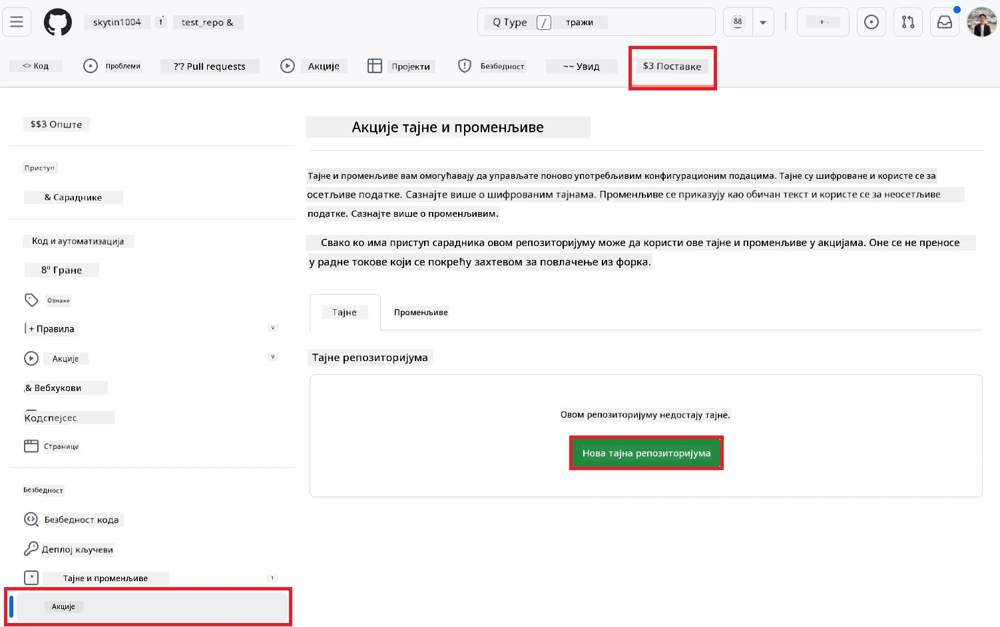
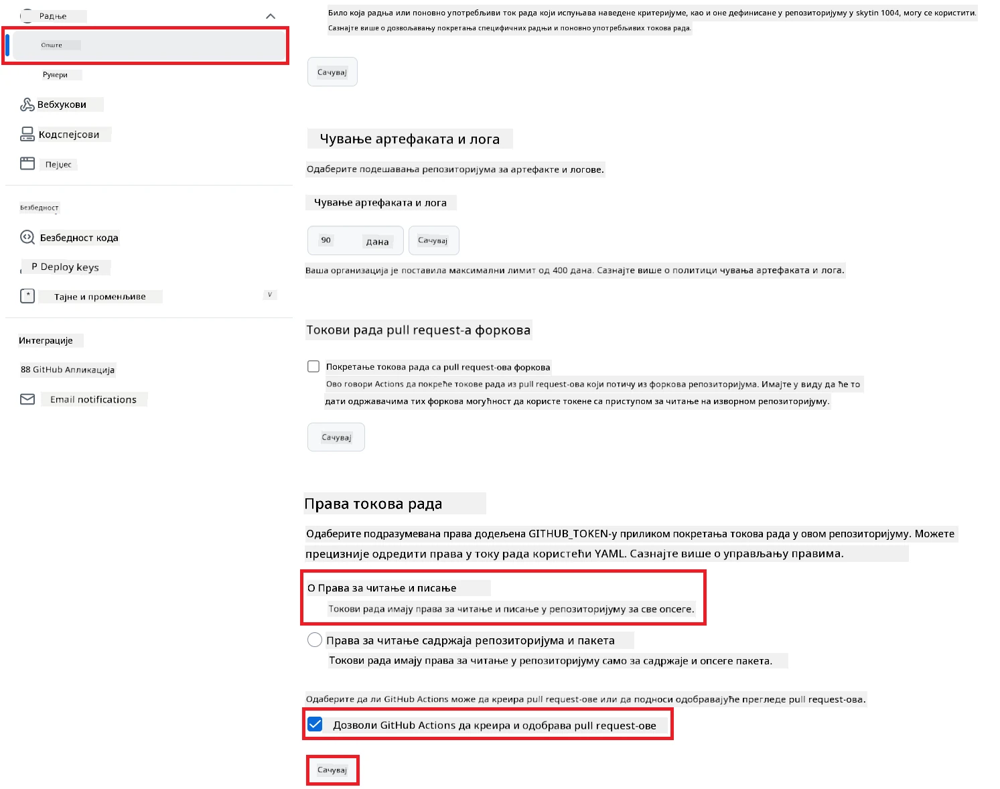

# Коришћење Co-op Translator GitHub Action (Јавно подешавање)

**Циљна публика:** Ово упутство је намењено корисницима у већини јавних или приватних репозиторијума где су стандардне GitHub Actions дозволе довољне. Користи уграђени `GITHUB_TOKEN`.

Аутоматизујте превођење документације вашег репозиторијума без напора помоћу Co-op Translator GitHub Action-а. Ово упутство вас води кроз подешавање акције која аутоматски креира pull request-ове са ажурираним преводима кад год се изворни Markdown фајлови или слике промене.

> [!IMPORTANT]
>
> **Избор правог упутства:**
>
> Ово упутство описује **једноставније подешавање користећи стандардни `GITHUB_TOKEN`**. Ово је препоручени метод за већину корисника јер не захтева руковање осетљивим приватним кључевима GitHub апликација.
>

## Предуслови

Пре него што конфигуришете GitHub Action, уверите се да имате спремне потребне акредитиве за AI сервис.

**1. Обавезно: Акредитиви за AI језички модел**
Потребни су вам акредитиви за бар један подржани језички модел:

- **Azure OpenAI**: Потребан је Endpoint, API кључ, име модела/деплојмента, верзија API-ја.
- **OpenAI**: Потребан је API кључ, (опционо: Org ID, Base URL, Model ID).
- Погледајте [Подржани модели и сервиси](../../../../README.md) за детаље.

**2. Опционо: Акредитиви за AI Vision (за превођење слика)**

- Потребно само ако желите да преводите текст унутар слика.
- **Azure AI Vision**: Потребан је Endpoint и Subscription Key.
- Ако није обезбеђено, акција подразумевано ради у [Markdown-only режиму](../markdown-only-mode.md).

## Подешавање и конфигурација

Пратите ове кораке да конфигуришете Co-op Translator GitHub Action у вашем репозиторијуму користећи стандардни `GITHUB_TOKEN`.

### Корак 1: Разумевање аутентификације (коришћење `GITHUB_TOKEN`)

Овај workflow користи уграђени `GITHUB_TOKEN` који обезбеђује GitHub Actions. Овај токен аутоматски даје дозволе workflow-у да интерагује са вашим репозиторијумом на основу подешавања из **Корака 3**.

### Корак 2: Конфигуришите тајне репозиторијума

Потребно је само да додате **AI сервис акредитиве** као шифроване тајне у подешавањима вашег репозиторијума.

1.  Идите на жељени GitHub репозиторијум.
2.  Идите на **Settings** > **Secrets and variables** > **Actions**.
3.  Под **Repository secrets**, кликните на **New repository secret** за сваку потребну AI тајну са листе испод.

     *(Референца слике: Приказује где се додају тајне)*

**Потребне AI сервис тајне (Додајте СВЕ које важе на основу ваших предуслова):**

| Име тајне                         | Опис                               | Извор вредности                     |
| :---------------------------------- | :---------------------------------------- | :------------------------------- |
| `AZURE_AI_SERVICE_API_KEY`            | Кључ за Azure AI Service (Computer Vision)  | Ваш Azure AI Foundry               |
| `AZURE_AI_SERVICE_ENDPOINT`         | Endpoint за Azure AI Service (Computer Vision) | Ваш Azure AI Foundry               |
| `AZURE_OPENAI_API_KEY`              | Кључ за Azure OpenAI сервис              | Ваш Azure AI Foundry               |
| `AZURE_OPENAI_ENDPOINT`             | Endpoint за Azure OpenAI сервис         | Ваш Azure AI Foundry               |
| `AZURE_OPENAI_MODEL_NAME`           | Име вашег Azure OpenAI модела              | Ваш Azure AI Foundry               |
| `AZURE_OPENAI_CHAT_DEPLOYMENT_NAME` | Име вашег Azure OpenAI деплојмента         | Ваш Azure AI Foundry               |
| `AZURE_OPENAI_API_VERSION`          | Верзија API-ја за Azure OpenAI              | Ваш Azure AI Foundry               |
| `OPENAI_API_KEY`                    | API кључ за OpenAI                        | Ваша OpenAI платформа              |
| `OPENAI_ORG_ID`                     | OpenAI Organization ID (опционо)         | Ваша OpenAI платформа              |
| `OPENAI_CHAT_MODEL_ID`              | ID специфичног OpenAI модела (опционо)       | Ваша OpenAI платформа              |
| `OPENAI_BASE_URL`                   | Прилагођени OpenAI API Base URL (опционо)     | Ваша OpenAI платформа              |

### Корак 3: Подесите дозволе workflow-а

GitHub Action-у су потребне дозволе преко `GITHUB_TOKEN` да би могао да преузме код и креира pull request-ове.

1.  У вашем репозиторијуму идите на **Settings** > **Actions** > **General**.
2.  Скролујте до секције **Workflow permissions**.
3.  Одаберите **Read and write permissions**. Ово даје `GITHUB_TOKEN` неопходне `contents: write` и `pull-requests: write` дозволе за овај workflow.
4.  Уверите се да је поље **Allow GitHub Actions to create and approve pull requests** **штиклирано**.
5.  Кликните на **Save**.



### Корак 4: Креирајте workflow фајл

На крају, креирајте YAML фајл који дефинише аутоматизовани workflow користећи `GITHUB_TOKEN`.

1.  У кореном директоријуму вашег репозиторијума, креирајте `.github/workflows/` директоријум ако већ не постоји.
2.  Унутар `.github/workflows/`, креирајте фајл са именом `co-op-translator.yml`.
3.  Налепите следећи садржај у `co-op-translator.yml`.

```yaml
name: Co-op Translator

on:
  push:
    branches:
      - main

jobs:
  co-op-translator:
    runs-on: ubuntu-latest

    permissions:
      contents: write
      pull-requests: write

    steps:
      - name: Checkout repository
        uses: actions/checkout@v4
        with:
          fetch-depth: 0

      - name: Set up Python
        uses: actions/setup-python@v4
        with:
          python-version: '3.10'

      - name: Install Co-op Translator
        run: |
          python -m pip install --upgrade pip
          pip install co-op-translator

      - name: Run Co-op Translator
        env:
          PYTHONIOENCODING: utf-8
          # === AI Service Credentials ===
          AZURE_AI_SERVICE_API_KEY: ${{ secrets.AZURE_AI_SERVICE_API_KEY }}
          AZURE_AI_SERVICE_ENDPOINT: ${{ secrets.AZURE_AI_SERVICE_ENDPOINT }}
          AZURE_OPENAI_API_KEY: ${{ secrets.AZURE_OPENAI_API_KEY }}
          AZURE_OPENAI_ENDPOINT: ${{ secrets.AZURE_OPENAI_ENDPOINT }}
          AZURE_OPENAI_MODEL_NAME: ${{ secrets.AZURE_OPENAI_MODEL_NAME }}
          AZURE_OPENAI_CHAT_DEPLOYMENT_NAME: ${{ secrets.AZURE_OPENAI_CHAT_DEPLOYMENT_NAME }}
          AZURE_OPENAI_API_VERSION: ${{ secrets.AZURE_OPENAI_API_VERSION }}
          OPENAI_API_KEY: ${{ secrets.OPENAI_API_KEY }}
          OPENAI_ORG_ID: ${{ secrets.OPENAI_ORG_ID }}
          OPENAI_CHAT_MODEL_ID: ${{ secrets.OPENAI_CHAT_MODEL_ID }}
          OPENAI_BASE_URL: ${{ secrets.OPENAI_BASE_URL }}
        run: |
          # =====================================================================
          # IMPORTANT: Set your target languages here (REQUIRED CONFIGURATION)
          # =====================================================================
          # Example: Translate to Spanish, French, German. Add -y to auto-confirm.
          translate -l "es fr de" -y  # <--- MODIFY THIS LINE with your desired languages

      - name: Create Pull Request with translations
        uses: peter-evans/create-pull-request@v5
        with:
          token: ${{ secrets.GITHUB_TOKEN }}
          commit-message: "🌐 Update translations via Co-op Translator"
          title: "🌐 Update translations via Co-op Translator"
          body: |
            This PR updates translations for recent changes to the main branch.

            ### 📋 Changes included
            - Translated contents are available in the `translations/` directory
            - Translated images are available in the `translated_images/` directory

            ---
            🌐 Automatically generated by the [Co-op Translator](https://github.com/Azure/co-op-translator) GitHub Action.
          branch: update-translations
          base: main
          labels: translation, automated-pr
          delete-branch: true
          add-paths: |
            translations/
            translated_images/
```
4.  **Прилагодите workflow:**
  - **[!IMPORTANT] Циљни језици:** У кораку `Run Co-op Translator` **МОРАЈТЕ да прегледате и измените листу језичких кодова** унутар команде `translate -l "..." -y` тако да одговара потребама вашег пројекта. Пример листа (`ar de es...`) треба да се замени или прилагоди.
  - **Окидач (`on:`):** Тренутни окидач покреће workflow на сваки push на `main`. За велике репозиторијуме, размислите о додавању `paths:` филтера (погледајте коментарисани пример у YAML-у) да би се workflow покретао само када се релевантни фајлови (нпр. изворна документација) промене, чиме се штеде runner минути.
  - **Детаљи PR-а:** Прилагодите `commit-message`, `title`, `body`, име `branch`-а и `labels` у кораку `Create Pull Request` ако је потребно.

## Покретање workflow-а

> [!WARNING]  
> **Временско ограничење за GitHub-hosted runner:**  
> GitHub-hosted runner-и као што је `ubuntu-latest` имају **максимално време извршавања од 6 сати**.  
> За велике репозиторијуме са документацијом, ако процес превођења пређе 6 сати, workflow ће бити аутоматски прекинут.  
> Да бисте то спречили, размислите о:  
> - Коришћењу **self-hosted runner-а** (без временског ограничења)  
> - Смањењу броја циљних језика по покретању

Када се `co-op-translator.yml` фајл споји у ваш main branch (или грану наведену у `on:` окидачу), workflow ће се аутоматски покренути кад год се промене пошаљу на ту грану (и одговарају `paths` филтеру, ако је конфигурисан).

---

**Одрицање од одговорности**:  
Овај документ је преведен коришћењем AI услуге за превођење [Co-op Translator](https://github.com/Azure/co-op-translator). Иако тежимо тачности, имајте у виду да аутоматски преводи могу садржати грешке или нетачности. Оригинални документ на изворном језику треба сматрати ауторитативним извором. За критичне информације препоручује се професионални људски превод. Не сносимо одговорност за било каква неспоразума или погрешна тумачења настала коришћењем овог превода.