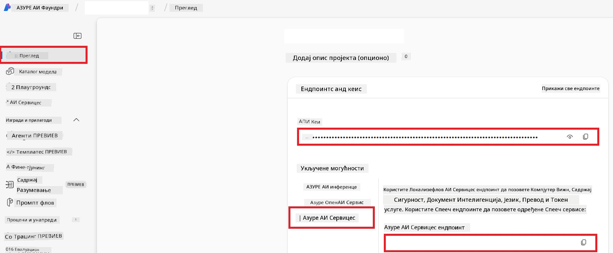

# Подешавање Azure AI за Co-op Translator (Azure OpneAI & Azure AI Vision)

Овај водич вас води кроз подешавање Azure OpenAI за превод језика и Azure Computer Vision за анализу садржаја слика (која се потом може користити за превод заснован на сликама) унутар Azure AI Foundry.

**Услови:**
- Azure налог са активном претплатом.
- Довољне дозволе за креирање ресурса и деплојмената у вашој Azure претплати.

## Креирајте Azure AI пројекат

Почињете креирањем Azure AI пројекта, који служи као централно место за управљање вашим AI ресурсима.

1. Идите на [https://ai.azure.com](https://ai.azure.com) и пријавите се са својим Azure налогом.

1. Изаберите **+Create** да бисте креирали нови пројекат.

1. Обавите следеће радње:
   - Унесите **Назив пројекта** (нпр. `CoopTranslator-Project`).
   - Изаберите **AI hub**  (нпр. `CoopTranslator-Hub`) (Креирајте нови ако је потребно).

1. Кликните "**Review and Create**" да подесите свој пројекат. Бићете преусмерени на страницу прегледа вашег пројекта.

## Подешавање Azure OpenAI за превод језика

Унутар вашег пројекта, распоредићете Azure OpenAI модел који ће служити као позадина за превод текста.

### Идите на свој пројекат

Ако већ нисте тамо, отворите свој новокреирани пројекат (нпр. `CoopTranslator-Project`) у Azure AI Foundry.

### Распоредите OpenAI модел

1. У левом менију вашег пројекта, у оквиру "My assets", изаберите "**Models + endpoints**".

1. Изаберите **+ Deploy model**.

1. Изаберите **Deploy Base Model**.

1. Биће вам представљена листа доступних модела. Филтрирајте или претражите одговарајући GPT модел. Препоручујемо `gpt-4o`.

1. Изаберите жељени модел и кликните **Confirm**.

1. Изаберите **Deploy**.

### Конфигурација Azure OpenAI

Када је модел распоређен, можете изабрати деплојмент са странице "**Models + endpoints**" да бисте пронашли његов **REST endpoint URL**, **Key**, **Име деплојмента**, **Име модела** и **API верзију**. Ово ће бити потребно за интеграцију модела за превод у вашу апликацију.

> [!NOTE]
> Можете одабрати API верзије са странице [API version deprecation](https://learn.microsoft.com/azure/ai-services/openai/api-version-deprecation) на основу ваших захтева. Имајте у виду да је **API верзија** различита од **Верзије модела** која се приказује на страници **Models + endpoints** у Azure AI Foundry.

## Подешавање Azure Computer Vision за превод слика

Да бисте омогућили превод текста унутар слика, потребно је да пронађете Azure AI Service API Key и Endpoint.

1. Идите на свој Azure AI пројекат (нпр. `CoopTranslator-Project`). Уверите се да сте на страници прегледа пројекта.

### Конфигурација Azure AI Service

Пронађите API Key и Endpoint са Azure AI Service.

1. Идите на свој Azure AI пројекат (нпр. `CoopTranslator-Project`). Уверите се да сте на страници прегледа пројекта.

1. Пронађите **API Key** и **Endpoint** на картици Azure AI Service.

    

Ова веза чини доступним могућности повезаног Azure AI Services ресурса (укључујући анализу слика) вашем AI Foundry пројекту. Ову везу затим можете користити у својим нотебоок-овима или апликацијама да бисте извукли текст из слика, који потом може бити послат Azure OpenAI моделу ради превођења.

## Консолидовање ваших акредитива

До сада бисте требали имати скупљене следеће податке:

**За Azure OpenAI (превод текста):**
- Azure OpenAI Endpoint
- Azure OpenAI API Key
- Azure OpenAI име модела (нпр. `gpt-4o`)
- Azure OpenAI име деплојмента (нпр. `cooptranslator-gpt4o`)
- Azure OpenAI API верзију

**За Azure AI Services (извлачење текста из слика преко Vision):**
- Azure AI Service Endpoint
- Azure AI Service API Key

### Пример: Конфигурација променљивих окружења (преглед)

Касније, када будете правили апликацију, вероватно ћете је конфигурисати користећи ове прикупљене акредитиве. На пример, може их поставити као променљиве окружења овако:

```bash
# Акредитиви за Azure AI сервис (потребно за превођење слика)
AZURE_AI_SERVICE_API_KEY="your_azure_ai_service_api_key" # нпр., 21xasd...
AZURE_AI_SERVICE_ENDPOINT="https://your_azure_ai_service_endpoint.cognitiveservices.azure.com/"

# Опционо резервне групе: дуплирајте променљиве са суфиксом _1/_2 (иста индексација за све променљиве у скупу)
AZURE_AI_SERVICE_API_KEY_1="your_azure_ai_service_api_key_1"
AZURE_AI_SERVICE_ENDPOINT_1="https://your_azure_ai_service_endpoint_1.cognitiveservices.azure.com/"

# Акредитиви за Azure OpenAI (потребно за превођење текста)
AZURE_OPENAI_API_KEY="your_azure_openai_api_key" # нпр., 21xasd...
AZURE_OPENAI_ENDPOINT="https://your_azure_openai_endpoint.openai.azure.com/"
AZURE_OPENAI_MODEL_NAME="your_model_name" # нпр., gpt-4o
AZURE_OPENAI_CHAT_DEPLOYMENT_NAME="your_deployment_name" # нпр., cooptranslator-gpt4o
AZURE_OPENAI_API_VERSION="your_api_version" # нпр., 2024-12-01-preview

# Опционо резервне групе: дуплирајте цео скуп AZURE_OPENAI_* са суфиксом _1/_2 (иста индексација за све променљиве)
```

---

### Додатно читање

- [Како креирати пројекат у Azure AI Foundry](https://learn.microsoft.com/azure/ai-foundry/how-to/create-projects?tabs=ai-studio)
- [Како креирати Azure AI ресурсе](https://learn.microsoft.com/azure/ai-foundry/how-to/create-azure-ai-resource?tabs=portal)
- [Како распоредити OpenAI моделе у Azure AI Foundry](https://learn.microsoft.com/en-us/azure/ai-foundry/how-to/deploy-models-openai)

---

<!-- CO-OP TRANSLATOR DISCLAIMER START -->
**Одрицање одговорности**:
Овај документ је преведен уз помоћ AI преводилачке услуге [Co-op Translator](https://github.com/Azure/co-op-translator). Иако тежимо прецизности, молимо вас да имате у виду да аутоматски преводи могу садржати грешке или нетачности. Оригинални документ на његовом матерњем језику треба сматрати ауторитетним извором. За критичне информације препорука је професионални људски превод. Нисмо одговорни за било каква неспоразума или погрешна тумачења настала коришћењем овог превода.
<!-- CO-OP TRANSLATOR DISCLAIMER END -->