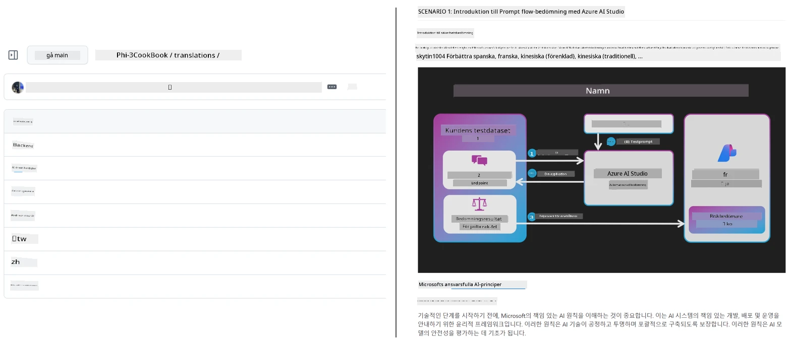
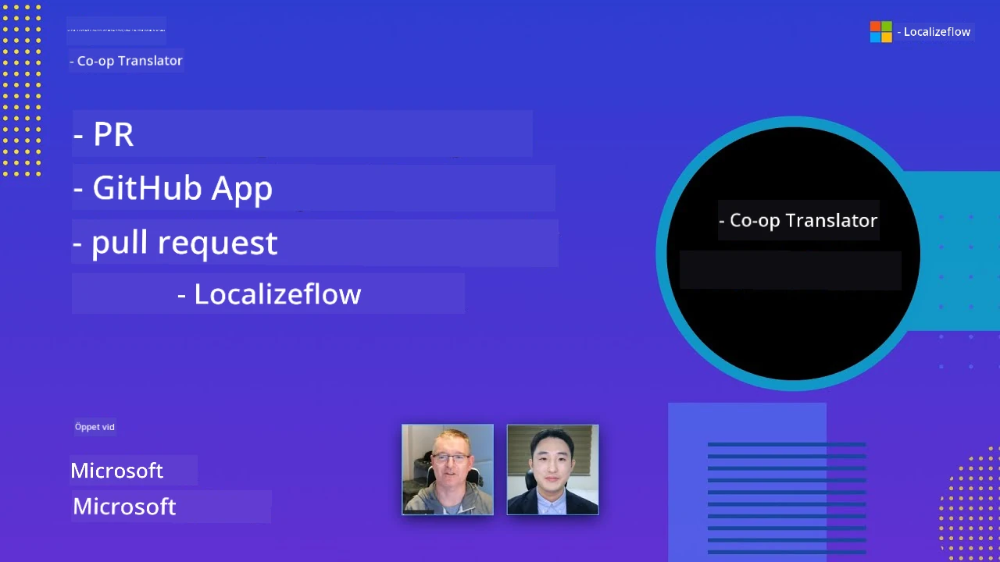

# Co-op Translator

_Lättautomatisera och underhåll översättningar för ditt utbildningsinnehåll på GitHub över flera språk allteftersom ditt projekt utvecklas._


[](https://pypi.org/project/co-op-translator/)
[](https://github.com/azure/co-op-translator/blob/main/LICENSE)
[](https://pepy.tech/project/co-op-translator)
[](https://pepy.tech/project/co-op-translator)
[](https://github.com/azure/co-op-translator/pkgs/container/co-op-translator)
[](https://github.com/psf/black)

[](https://GitHub.com/azure/co-op-translator/graphs/contributors/)
[](https://GitHub.com/azure/co-op-translator/issues/)
[](https://GitHub.com/azure/co-op-translator/pulls/)
[](http://makeapullrequest.com)

### 🌐 Fler språkstöd

#### Stöds av [Co-op Translator](https://github.com/Azure/Co-op-Translator)

<!-- CO-OP TRANSLATOR LANGUAGES TABLE START -->
[Arabiska](../ar/README.md) | [Bengali](../bn/README.md) | [Bulgariska](../bg/README.md) | [Burmese (Myanmar)](../my/README.md) | [Kinesiska (Förenklad)](../zh-CN/README.md) | [Kinesiska (Traditionell, Hongkong)](../zh-HK/README.md) | [Kinesiska (Traditionell, Macau)](../zh-MO/README.md) | [Kinesiska (Traditionell, Taiwan)](../zh-TW/README.md) | [Kroatiska](../hr/README.md) | [Tjeckiska](../cs/README.md) | [Danska](../da/README.md) | [Nederländska](../nl/README.md) | [Estniska](../et/README.md) | [Finska](../fi/README.md) | [Franska](../fr/README.md) | [Tyska](../de/README.md) | [Grekiska](../el/README.md) | [Hebreiska](../he/README.md) | [Hindi](../hi/README.md) | [Ungerska](../hu/README.md) | [Indonesiska](../id/README.md) | [Italienska](../it/README.md) | [Japanska](../ja/README.md) | [Kannada](../kn/README.md) | [Khmer](../km/README.md) | [Koreanska](../ko/README.md) | [Litauiska](../lt/README.md) | [Malay](../ms/README.md) | [Malayalam](../ml/README.md) | [Marathi](../mr/README.md) | [Nepali](../ne/README.md) | [Nigeriansk Pidgin](../pcm/README.md) | [Norska](../no/README.md) | [Persiska (Farsi)](../fa/README.md) | [Polska](../pl/README.md) | [Portugisiska (Brasilien)](../pt-BR/README.md) | [Portugisiska (Portugal)](../pt-PT/README.md) | [Punjabi (Gurmukhi)](../pa/README.md) | [Rumänska](../ro/README.md) | [Ryska](../ru/README.md) | [Serbiska (Kyrilliska)](../sr/README.md) | [Slovakiska](../sk/README.md) | [Slovenska](../sl/README.md) | [Spanska](../es/README.md) | [Swahili](../sw/README.md) | [Svenska](./README.md) | [Tagalog (Filipino)](../tl/README.md) | [Tamil](../ta/README.md) | [Telugu](../te/README.md) | [Thailändska](../th/README.md) | [Turkiska](../tr/README.md) | [Ukrainska](../uk/README.md) | [Urdu](../ur/README.md) | [Vietnamesiska](../vi/README.md)

> **Föredrar du att klona lokalt?**
>
> Detta repo inkluderar över 50 språköversättningar som avsevärt ökar nedladdningsstorleken. För att klona utan översättningar, använd sparse checkout:
>
> **Bash / macOS / Linux:**
> ```bash
> git clone --filter=blob:none --sparse https://github.com/skytin1004/co-op-translator.git
> cd co-op-translator
> git sparse-checkout set --no-cone '/*' '!translations' '!translated_images'
> ```
>
> **CMD (Windows):**
> ```cmd
> git clone --filter=blob:none --sparse https://github.com/skytin1004/co-op-translator.git
> cd co-op-translator
> git sparse-checkout set --no-cone "/*" "!translations" "!translated_images"
> ```
>
> Det ger dig allt du behöver för att genomföra kursen med mycket snabbare nedladdning.
<!-- CO-OP TRANSLATOR LANGUAGES TABLE END -->

[](https://GitHub.com/azure/co-op-translator/watchers/)
[](https://GitHub.com/azure/co-op-translator/network/)
[](https://GitHub.com/azure/co-op-translator/stargazers/)

[](https://discord.gg/nTYy5BXMWG)

[](https://codespaces.new/azure/co-op-translator)

## Översikt

**Co-op Translator** hjälper dig att enkelt lokalisera ditt utbildningsinnehåll på GitHub till flera språk.  
När du uppdaterar dina Markdown-filer, bilder eller notebooks hålls översättningarna automatiskt synkroniserade, vilket säkerställer att ditt innehåll förblir korrekt och uppdaterat för elever världen över.

Exempel på hur översatt innehåll är organiserat:



## Hur översättningsstatus hanteras

Co-op Translator hanterar översatt innehåll som **versionerade mjukvaruobjekt**,  
inte som statiska filer.

Verktyget spårar status för översatt Markdown, bilder och notebooks  
med hjälp av **språkavgränsad metadata**.

Denna design gör att Co-op Translator kan:

- Tillförlitligt upptäcka föråldrade översättningar
- Hantera Markdown, bilder och notebooks konsekvent
- Skala säkert över stora, snabbrörliga, flerspråkiga repos

Genom att modellera översättningar som hanterade artefakter,  
anpassas översättningsarbetsflöden naturligt med modern  
mjukvaruberoende- och artefakthantering.

→ [Hur översättningsstatus hanteras](https://techcommunity.microsoft.com/blog/azuredevcommunityblog/rethinking-documentation-translation-treating-translations-as-versioned-software/4491755)


## Snabbstart

```bash
# Skapa och aktivera en virtuell miljö (rekommenderas)
python -m venv .venv
# Windows
.venv\Scripts\activate
# macOS/Linux
source .venv/bin/activate
# Installera paketet
pip install co-op-translator
# Översätt
translate -l "ko ja fr" -md
```

Docker:

```bash
# Hämta den offentliga bilden från GHCR
docker pull ghcr.io/azure/co-op-translator:latest
# Kör med aktuell mapp monterad och .env tillhandahållen (Bash/Zsh)
docker run --rm -it --env-file .env -v "${PWD}:/work" ghcr.io/azure/co-op-translator:latest -l "ko ja fr" -md
```

## Minimal installation

1. Säkerställ att du har en stödjad Python-version (just nu 3.10-3.12). I poetry (pyproject.toml) hanteras detta automatiskt.  
2. Skapa en `.env`-fil med mallen: [.env.template](../../.env.template)  
3. Konfigurera en LLM-leverantör (Azure OpenAI eller OpenAI)  
4. (Valfritt) För bildöversättning (`-img`), konfigurera Azure AI Vision  
5. (Valfritt) Du kan konfigurera flera autentiseringsuppsättningar genom att duplicera variabler med suffix som `_1`, `_2` osv. Alla variabler i en uppsättning måste ha samma suffix.  
6. (Rekommenderas) Rensa eventuella tidigare översättningar för att undvika konflikter (t.ex. `translations/`)  
7. (Rekommenderas) Lägg till en översättningssektion i din README med [språk-mallen för README](./getting_started/README_languages_template.md)  
8. Se: [Ställ in Azure AI](./getting_started/set-up-azure-ai.md)

## Användning

Översätt alla stödda typer:

```bash
translate -l "ko ja"
```

Endast Markdown:

```bash
translate -l "de" -md
```

Markdown + bilder:

```bash
translate -l "pt" -md -img
```

Endast notebooks:

```bash
translate -l "zh" -nb
```

Fler flaggor: [Kommandoreferens](./getting_started/command-reference.md)

## Funktioner

- Automatiserad översättning för Markdown, notebooks och bilder  
- Håller översättningar synkroniserade med källändringar  
- Fungerar lokalt (CLI) eller i CI (GitHub Actions)  
- Använder Azure OpenAI eller OpenAI; valfritt Azure AI Vision för bilder  
- Bevarar Markdown-formattering och struktur

## Dokumentation

- [Kommandoradsguide](./getting_started/command-line-guide/command-line-guide.md)
- [GitHub Actions Guide (offentliga repos & standardhemligheter)](./getting_started/github-actions-guide/github-actions-guide-public.md)
- [GitHub Actions Guide (Microsoft organisationsrepos & organisationsnivå-inställningar)](./getting_started/github-actions-guide/github-actions-guide-org.md)
- [README språk-mall](./getting_started/README_languages_template.md)
- [Stödda språk](./getting_started/supported-languages.md)
- [Bidra](./CONTRIBUTING.md)
- [Felsökning](./getting_started/troubleshooting.md)

### Microsoft-specifik guide
> [!NOTE]
> Endast för underhållare av Microsoft “För nybörjare”-repos.

- [Uppdatera listan “andra kurser” (endast för MS Beginners-repos)](./getting_started/update-other-courses.md)

## Stöd oss och främja globalt lärande

Var med och revolutionera hur utbildningsinnehåll delas globalt! Ge [Co-op Translator](https://github.com/azure/co-op-translator) en ⭐ på GitHub och stöd vårt uppdrag att bryta ner språkbarriärer inom lärande och teknik. Ditt intresse och dina bidrag gör stor skillnad! Kodbidrag och förslag på funktioner är alltid välkomna.

### Utforska Microsofts utbildningsinnehåll på ditt språk

- [LangChain4j-for-Beginners](https://github.com/microsoft/LangChain4j-for-Beginners)
- [AZD for Beginners](https://github.com/microsoft/AZD-for-beginners)
- [Edge AI for Beginners](https://github.com/microsoft/edgeai-for-beginners)
- [Model Context Protocol (MCP) For Beginners](https://github.com/microsoft/mcp-for-beginners)
- [AI Agents for Beginners](https://github.com/microsoft/ai-agents-for-beginners)
- [Generative AI for Beginners using .NET](https://github.com/microsoft/Generative-AI-for-beginners-dotnet)
- [Generative AI for Beginners](https://github.com/microsoft/generative-ai-for-beginners)
- [Generative AI for Beginners using Java](https://github.com/microsoft/generative-ai-for-beginners-java)
- [ML for Beginners](https://aka.ms/ml-beginners)
- [Data Science for Beginners](https://aka.ms/datascience-beginners)
- [AI for Beginners](https://aka.ms/ai-beginners)
- [Cybersecurity for Beginners](https://github.com/microsoft/Security-101)
- [Web Dev for Beginners](https://aka.ms/webdev-beginners)
- [IoT for Beginners](https://aka.ms/iot-beginners)
- [PhiCookBook](https://github.com/microsoft/PhiCookBook)

## Videopresentationer

👉 Klicka på bilden nedan för att titta på YouTube.

- **Open at Microsoft**: En kort 18-minuters introduktion och snabbguide för hur du använder Co-op Translator.

  [](https://www.youtube.com/watch?v=jX_swfH_KNU)

## Bidra

Detta projekt välkomnar bidrag och förslag. Intresserad av att bidra till Azure Co-op Translator? Se vår [CONTRIBUTING.md](./CONTRIBUTING.md) för riktlinjer om hur du kan hjälpa till att göra Co-op Translator mer tillgängligt.

## Bidragsgivare
[](https://github.com/Azure/co-op-translator/graphs/contributors)

## Uppförandekod

Detta projekt har antagit [Microsofts uppförandekod för öppen källkod](https://opensource.microsoft.com/codeofconduct/).
För mer information se [FAQ om uppförandekoden](https://opensource.microsoft.com/codeofconduct/faq/) eller
kontakta [opencode@microsoft.com](mailto:opencode@microsoft.com) för ytterligare frågor eller kommentarer.

## Ansvarsfull AI

Microsoft är engagerat i att hjälpa våra kunder använda våra AI-produkter ansvarsfullt, dela våra erfarenheter och bygga förtroendebaserade partnerskap genom verktyg som Transparency Notes och Impact Assessments. Många av dessa resurser finns på [https://aka.ms/RAI](https://aka.ms/RAI).
Microsofts tillvägagångssätt för ansvarsfull AI är grundat på våra AI-principer om rättvisa, tillförlitlighet och säkerhet, integritet och säkerhet, inkludering, transparens och ansvarstagande.

Storskaliga modeller för naturligt språk, bild och tal - som de som används i detta exempel - kan potentiellt bete sig på sätt som är orättvisa, otillförlitliga eller stötande, vilket i sin tur kan orsaka skada. Vänligen se [Azure OpenAI-tjänstens Transparency note](https://learn.microsoft.com/legal/cognitive-services/openai/transparency-note?tabs=text) för att bli informerad om risker och begränsningar.

Den rekommenderade metoden för att mildra dessa risker är att inkludera ett säkerhetssystem i din arkitektur som kan upptäcka och förhindra skadligt beteende. [Azure AI Content Safety](https://learn.microsoft.com/azure/ai-services/content-safety/overview) tillhandahåller ett oberoende skyddsskikt som kan upptäcka skadligt användargenererat och AI-genererat innehåll i applikationer och tjänster. Azure AI Content Safety inkluderar text- och bild-API:er som gör att du kan upptäcka material som är skadligt. Vi har också en interaktiv Content Safety Studio som låter dig visa, utforska och prova exempel på kod för att upptäcka skadligt innehåll över olika modaliteter. Följande [quickstart-dokumentation](https://learn.microsoft.com/azure/ai-services/content-safety/quickstart-text?tabs=visual-studio%2Clinux&pivots=programming-language-rest) guidar dig genom att göra förfrågningar till tjänsten.

En annan aspekt att ta hänsyn till är den övergripande applikationsprestandan. Med multimodala och multimodellsapplikationer avser vi prestanda som att systemet fungerar som du och dina användare förväntar sig, inklusive att inte generera skadliga resultat. Det är viktigt att bedöma prestandan för din övergripande applikation med hjälp av [genereringskvalitets- samt risk- och säkerhetsmått](https://learn.microsoft.com/azure/ai-studio/concepts/evaluation-metrics-built-in).

Du kan utvärdera din AI-applikation i din utvecklingsmiljö med hjälp av [prompt flow SDK](https://microsoft.github.io/promptflow/index.html). Med antingen en testdatamängd eller ett mål mäts dina generativa AI-applikationsgenereringar kvantitativt med inbyggda eller anpassade evaluatorer efter eget val. För att komma igång med prompt flow sdk för att utvärdera ditt system kan du följa [quickstart-guiden](https://learn.microsoft.com/azure/ai-studio/how-to/develop/flow-evaluate-sdk). När du har kört en utvärdering kan du [visualisera resultaten i Azure AI Studio](https://learn.microsoft.com/azure/ai-studio/how-to/evaluate-flow-results).

## Varumärken

Detta projekt kan innehålla varumärken eller logotyper för projekt, produkter eller tjänster. Auktoriserad användning av Microsofts
varumärken eller logotyper måste följa
[Microsofts riktlinjer för varumärken och varumärkesanvändning](https://www.microsoft.com/en-us/legal/intellectualproperty/trademarks/usage/general).
Användning av Microsofts varumärken eller logotyper i modifierade versioner av detta projekt får inte orsaka förvirring eller antyda Microsofts sponsring.
All användning av tredjeparts varumärken eller logotyper är föremål för de respektive tredjepartsföretagens policyer.

## Få hjälp

Om du fastnar eller har frågor om att bygga AI-appar, gå med i:

[](https://discord.gg/nTYy5BXMWG)

Om du har produktfeedback eller hittar fel vid utveckling besök:

[](https://aka.ms/foundry/forum)

---

<!-- CO-OP TRANSLATOR DISCLAIMER START -->
**Ansvarsfriskrivning**:  
Detta dokument har översatts med hjälp av AI-översättningstjänsten [Co-op Translator](https://github.com/Azure/co-op-translator). Även om vi strävar efter noggrannhet, vänligen observera att automatiska översättningar kan innehålla fel eller brister. Det ursprungliga dokumentet på dess modersmål bör betraktas som den auktoritativa källan. För kritisk information rekommenderas professionell mänsklig översättning. Vi ansvarar inte för några missförstånd eller feltolkningar som uppstår från användningen av denna översättning.
<!-- CO-OP TRANSLATOR DISCLAIMER END -->