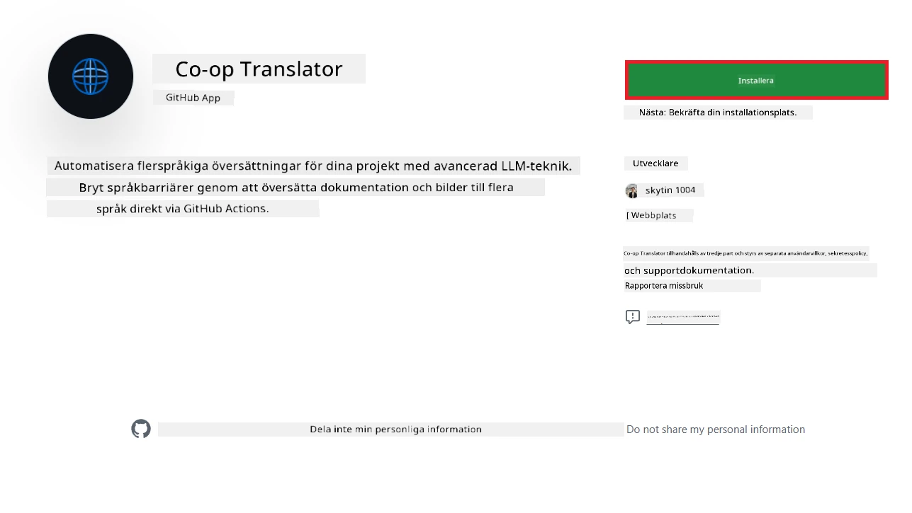
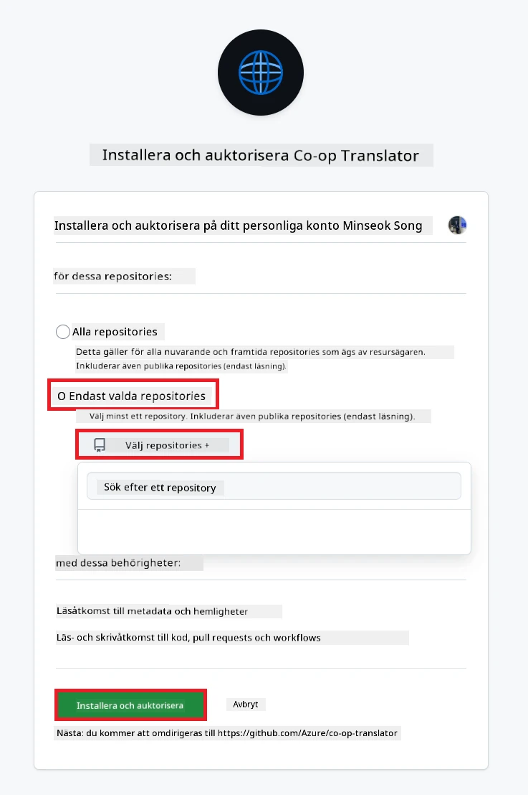
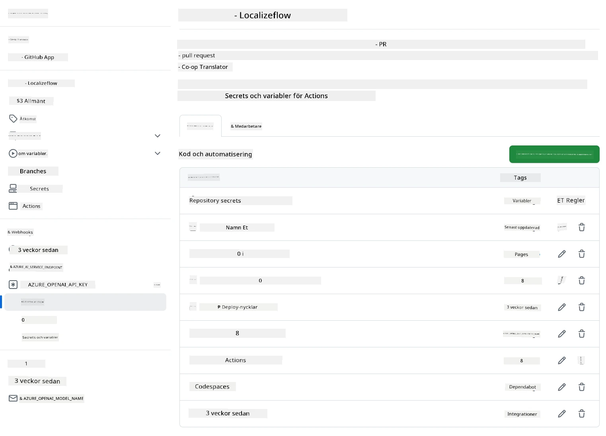

# Använda Co-op Translator GitHub Action (Organisationsguide)

**Målgrupp:** Den här guiden är avsedd för **Microsoft-interna användare** eller **team som har tillgång till nödvändiga autentiseringsuppgifter för den färdigbyggda Co-op Translator GitHub Appen** eller kan skapa sin egen anpassade GitHub App.

Automatisera översättningen av dokumentationen i ditt repository enkelt med Co-op Translator GitHub Action. Den här guiden visar hur du ställer in actionen så att den automatiskt skapar pull requests med uppdaterade översättningar när dina ursprungliga Markdown-filer eller bilder ändras.

> [!IMPORTANT]
> 
> **Välj rätt guide:**
>
> Den här guiden beskriver installation med **GitHub App ID och en privat nyckel**. Du behöver oftast denna "Organisationsguide" om: **`GITHUB_TOKEN`-behörigheter är begränsade:** Din organisation eller repository-inställningar begränsar de standardbehörigheter som ges till `GITHUB_TOKEN`. Om `GITHUB_TOKEN` inte har nödvändiga `write`-behörigheter (som `contents: write` eller `pull-requests: write`), kommer workflowen i [Public Setup Guide](./github-actions-guide-public.md) att misslyckas på grund av otillräckliga behörigheter. Genom att använda en dedikerad GitHub App med explicit tilldelade behörigheter kringgår du denna begränsning.
>
> **Om ovanstående inte gäller dig:**
>
> Om standard-`GITHUB_TOKEN` har tillräckliga behörigheter i ditt repository (dvs. du är inte blockerad av organisationsbegränsningar), använd **[Public Setup Guide med GITHUB_TOKEN](./github-actions-guide-public.md)**. Den publika guiden kräver inte att du hämtar eller hanterar App ID eller privata nycklar och använder endast standard-`GITHUB_TOKEN` och repository-behörigheter.

## Förutsättningar

Innan du konfigurerar GitHub Action, se till att du har nödvändiga AI-tjänstautentiseringsuppgifter redo.

**1. Obligatoriskt: Autentiseringsuppgifter för AI-språkmodell**
Du behöver autentiseringsuppgifter för minst en stödd språkmodell:

- **Azure OpenAI**: Kräver Endpoint, API-nyckel, Modell-/Deploymentsnamn, API-version.
- **OpenAI**: Kräver API-nyckel, (Valfritt: Org ID, Base URL, Modell-ID).
- Se [Supported Models and Services](../../../../README.md) för detaljer.
- Installationsguide: [Set up Azure OpenAI](../set-up-resources/set-up-azure-openai.md).

**2. Valfritt: Computer Vision-autentiseringsuppgifter (för bildöversättning)**

- Krävs endast om du behöver översätta text i bilder.
- **Azure Computer Vision**: Kräver Endpoint och Subscription Key.
- Om du inte anger dessa, körs actionen i [Markdown-only mode](../markdown-only-mode.md).
- Installationsguide: [Set up Azure Computer Vision](../set-up-resources/set-up-azure-computer-vision.md).

## Installation och konfiguration

Följ dessa steg för att konfigurera Co-op Translator GitHub Action i ditt repository:

### Steg 1: Installera och konfigurera GitHub App-autentisering

Workflowen använder GitHub App-autentisering för att säkert interagera med ditt repository (t.ex. skapa pull requests) åt dig. Välj ett alternativ:

#### **Alternativ A: Installera den färdigbyggda Co-op Translator GitHub Appen (för Microsoft-intern användning)**

1. Gå till sidan för [Co-op Translator GitHub App](https://github.com/apps/co-op-translator).

1. Välj **Installera** och välj det konto eller den organisation där ditt repository finns.

    

1. Välj **Endast utvalda repositories** och välj ditt repository (t.ex. `PhiCookBook`). Klicka på **Installera**. Du kan behöva autentisera dig.

    

1. **Hämta appens autentiseringsuppgifter (intern process krävs):** För att workflowen ska kunna autentisera som appen behöver du två saker från Co-op Translator-teamet:
  - **App ID:** Det unika ID:t för Co-op Translator-appen. App ID är: `1164076`.
  - **Privat nyckel:** Du måste få **hela innehållet** i `.pem`-filen med den privata nyckeln från kontaktpersonen. **Behandla denna nyckel som ett lösenord och håll den säker.**

1. Fortsätt till Steg 2.

#### **Alternativ B: Använd din egen anpassade GitHub App**

- Om du föredrar kan du skapa och konfigurera din egen GitHub App. Se till att den har läs- och skrivbehörighet till Contents och Pull requests. Du behöver dess App ID och en genererad privat nyckel.

### Steg 2: Konfigurera repository-secrets

Du behöver lägga till GitHub App-autentiseringsuppgifter och dina AI-tjänstautentiseringsuppgifter som krypterade secrets i repository-inställningarna.

1. Gå till ditt repository (t.ex. `PhiCookBook`).

1. Gå till **Settings** > **Secrets and variables** > **Actions**.

1. Under **Repository secrets**, klicka på **New repository secret** för varje secret nedan.

   

**Obligatoriska secrets (för GitHub App-autentisering):**

| Secret Name          | Beskrivning                                      | Värdekälla                                     |
| :------------------- | :----------------------------------------------- | :---------------------------------------------- |
| `GH_APP_ID`          | App ID för GitHub App (från Steg 1).             | GitHub App-inställningar                       |
| `GH_APP_PRIVATE_KEY` | **Hela innehållet** i den nedladdade `.pem`-filen. | `.pem`-fil (från Steg 1)                      |

**AI-tjänstsecrets (lägg till ALLA som gäller enligt dina förutsättningar):**

| Secret Name                         | Beskrivning                               | Värdekälla                     |
| :---------------------------------- | :---------------------------------------- | :----------------------------- |
| `AZURE_AI_SERVICE_API_KEY`            | Nyckel för Azure AI Service (Computer Vision)  | Azure AI Foundry                    |
| `AZURE_AI_SERVICE_ENDPOINT`         | Endpoint för Azure AI Service (Computer Vision) | Azure AI Foundry                     |
| `AZURE_OPENAI_API_KEY`              | Nyckel för Azure OpenAI-tjänsten              | Azure AI Foundry                     |
| `AZURE_OPENAI_ENDPOINT`             | Endpoint för Azure OpenAI-tjänsten         | Azure AI Foundry                     |
| `AZURE_OPENAI_MODEL_NAME`           | Ditt Azure OpenAI-modellnamn              | Azure AI Foundry                     |
| `AZURE_OPENAI_CHAT_DEPLOYMENT_NAME` | Ditt Azure OpenAI Deployment-namn         | Azure AI Foundry                     |
| `AZURE_OPENAI_API_VERSION`          | API-version för Azure OpenAI              | Azure AI Foundry                     |
| `OPENAI_API_KEY`                    | API-nyckel för OpenAI                        | OpenAI Platform                  |
| `OPENAI_ORG_ID`                     | OpenAI Organization ID                    | OpenAI Platform                  |
| `OPENAI_CHAT_MODEL_ID`              | Specifikt OpenAI-modell-ID                  | OpenAI Platform                    |
| `OPENAI_BASE_URL`                   | Anpassad OpenAI API Base URL                | OpenAI Platform                    |



### Steg 3: Skapa workflow-filen

Slutligen, skapa YAML-filen som definierar den automatiserade workflowen.

1. I root-mappen av ditt repository, skapa katalogen `.github/workflows/` om den inte redan finns.

1. Inuti `.github/workflows/`, skapa en fil som heter `co-op-translator.yml`.

1. Klistra in följande innehåll i co-op-translator.yml.

```
name: Co-op Translator

on:
  push:
    branches:
      - main

jobs:
  co-op-translator:
    runs-on: ubuntu-latest

    permissions:
      contents: write
      pull-requests: write

    steps:
      - name: Checkout repository
        uses: actions/checkout@v4
        with:
          fetch-depth: 0

      - name: Set up Python
        uses: actions/setup-python@v4
        with:
          python-version: '3.10'

      - name: Install Co-op Translator
        run: |
          python -m pip install --upgrade pip
          pip install co-op-translator

      - name: Run Co-op Translator
        env:
          PYTHONIOENCODING: utf-8
          # Azure AI Service Credentials
          AZURE_AI_SERVICE_API_KEY: ${{ secrets.AZURE_AI_SERVICE_API_KEY }}
          AZURE_AI_SERVICE_ENDPOINT: ${{ secrets.AZURE_AI_SERVICE_ENDPOINT }}

          # Azure OpenAI Credentials
          AZURE_OPENAI_API_KEY: ${{ secrets.AZURE_OPENAI_API_KEY }}
          AZURE_OPENAI_ENDPOINT: ${{ secrets.AZURE_OPENAI_ENDPOINT }}
          AZURE_OPENAI_MODEL_NAME: ${{ secrets.AZURE_OPENAI_MODEL_NAME }}
          AZURE_OPENAI_CHAT_DEPLOYMENT_NAME: ${{ secrets.AZURE_OPENAI_CHAT_DEPLOYMENT_NAME }}
          AZURE_OPENAI_API_VERSION: ${{ secrets.AZURE_OPENAI_API_VERSION }}

          # OpenAI Credentials
          OPENAI_API_KEY: ${{ secrets.OPENAI_API_KEY }}
          OPENAI_ORG_ID: ${{ secrets.OPENAI_ORG_ID }}
          OPENAI_CHAT_MODEL_ID: ${{ secrets.OPENAI_CHAT_MODEL_ID }}
          OPENAI_BASE_URL: ${{ secrets.OPENAI_BASE_URL }}
        run: |
          # =====================================================================
          # IMPORTANT: Set your target languages here (REQUIRED CONFIGURATION)
          # =====================================================================
          # Example: Translate to Spanish, French, German. Add -y to auto-confirm.
          translate -l "es fr de" -y  # <--- MODIFY THIS LINE with your desired languages

      - name: Authenticate GitHub App
        id: generate_token
        uses: tibdex/github-app-token@v1
        with:
          app_id: ${{ secrets.GH_APP_ID }}
          private_key: ${{ secrets.GH_APP_PRIVATE_KEY }}

      - name: Create Pull Request with translations
        uses: peter-evans/create-pull-request@v5
        with:
          token: ${{ steps.generate_token.outputs.token }}
          commit-message: "🌐 Update translations via Co-op Translator"
          title: "🌐 Update translations via Co-op Translator"
          body: |
            This PR updates translations for recent changes to the main branch.

            ### 📋 Changes included
            - Translated contents are available in the `translations/` directory
            - Translated images are available in the `translated_images/` directory

            ---
            🌐 Automatically generated by the [Co-op Translator](https://github.com/Azure/co-op-translator) GitHub Action.
          branch: update-translations
          base: main
          labels: translation, automated-pr
          delete-branch: true
          add-paths: |
            translations/
            translated_images/

```

4.  **Anpassa workflowen:**
  - **[!IMPORTANT] Mål-språk:** I steget `Run Co-op Translator` måste du **granska och ändra listan med språkkoder** i kommandot `translate -l "..." -y` så att det passar ditt projekt. Exempellistan (`ar de es...`) behöver bytas ut eller justeras.
  - **Trigger (`on:`):** Nuvarande trigger körs vid varje push till `main`. För stora repositories, överväg att lägga till ett `paths:`-filter (se kommenterat exempel i YAML) för att köra workflowen endast när relevanta filer (t.ex. dokumentation) ändras, vilket sparar runner-minuter.
  - **PR-detaljer:** Anpassa `commit-message`, `title`, `body`, `branch`-namn och `labels` i steget `Create Pull Request` om det behövs.

## Hantering och förnyelse av autentiseringsuppgifter

- **Säkerhet:** Förvara alltid känsliga autentiseringsuppgifter (API-nycklar, privata nycklar) som GitHub Actions-secrets. Exponera dem aldrig i workflow-filen eller repository-koden.
- **[!IMPORTANT] Nyckelförnyelse (Microsoft-interna användare):** Observera att Azure OpenAI-nyckeln som används inom Microsoft kan ha en obligatorisk förnyelsepolicy (t.ex. var 5:e månad). Se till att du uppdaterar motsvarande GitHub-secrets (`AZURE_OPENAI_...`-nycklar) **innan de går ut** för att undvika att workflowen misslyckas.

## Köra workflowen

> [!WARNING]  
> **Tidsgräns för GitHub-hostade runners:**  
> GitHub-hostade runners som `ubuntu-latest` har en **maximal körtid på 6 timmar**.  
> För stora dokumentationsrepositories, om översättningsprocessen överskrider 6 timmar, avslutas workflowen automatiskt.  
> För att undvika detta, överväg:  
> - Att använda en **egen hostad runner** (ingen tidsgräns)  
> - Att minska antalet mål-språk per körning

När filen `co-op-translator.yml` har mergats till din main-branch (eller den branch som anges i `on:`-triggern), körs workflowen automatiskt när ändringar pushas till den branchen (och matchar `paths`-filtret, om det är konfigurerat).

Om översättningar genereras eller uppdateras, skapar actionen automatiskt en Pull Request med ändringarna, redo för din granskning och merge.

---

**Ansvarsfriskrivning**:
Detta dokument har översatts med hjälp av AI-översättningstjänsten [Co-op Translator](https://github.com/Azure/co-op-translator). Vi strävar efter noggrannhet, men var medveten om att automatiska översättningar kan innehålla fel eller brister. Det ursprungliga dokumentet på dess originalspråk ska betraktas som den auktoritativa källan. För kritisk information rekommenderas professionell mänsklig översättning. Vi ansvarar inte för eventuella missförstånd eller feltolkningar som uppstår vid användning av denna översättning.