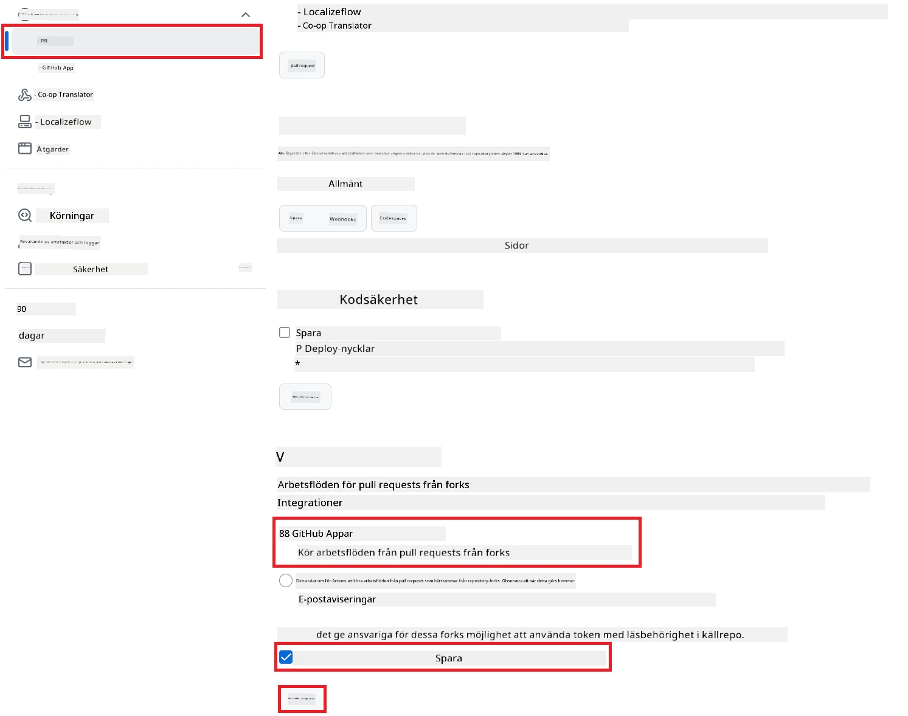

# Använda Co-op Translator GitHub Action (Offentlig installation)

**Målgrupp:** Den här guiden är avsedd för användare i de flesta offentliga eller privata arkiv där standardbehörigheter för GitHub Actions räcker. Den använder den inbyggda `GITHUB_TOKEN`.

Automatisera översättningen av ditt arkivs dokumentation smidigt med Co-op Translator GitHub Action. Den här guiden visar hur du ställer in åtgärden så att den automatiskt skapar pull requests med uppdaterade översättningar när dina käll-Markdownfiler eller bilder ändras.

> [!IMPORTANT]
>
> **Välj rätt guide:**
>
> Den här guiden beskriver **enklare installation med standard-`GITHUB_TOKEN`**. Detta är den rekommenderade metoden för de flesta användare eftersom du slipper hantera känsliga privata nycklar för GitHub App.
>

## Förutsättningar

Innan du konfigurerar GitHub Action, se till att du har nödvändiga AI-tjänstuppgifter redo.

**1. Obligatoriskt: AI Language Model-uppgifter**
Du behöver uppgifter för minst en stödd språkmodell:

- **Azure OpenAI**: Kräver Endpoint, API-nyckel, Modell-/Deploymentsnamn, API-version.
- **OpenAI**: Kräver API-nyckel, (Valfritt: Org ID, Base URL, Model ID).
- Se [Supported Models and Services](../../../../README.md) för detaljer.

**2. Valfritt: AI Vision-uppgifter (för bildöversättning)**

- Krävs endast om du behöver översätta text i bilder.
- **Azure AI Vision**: Kräver Endpoint och Subscription Key.
- Om du inte anger dessa körs åtgärden i [Markdown-only mode](../markdown-only-mode.md).

## Installation och konfiguration

Följ dessa steg för att konfigurera Co-op Translator GitHub Action i ditt arkiv med standard-`GITHUB_TOKEN`.

### Steg 1: Förstå autentisering (med `GITHUB_TOKEN`)

Detta arbetsflöde använder den inbyggda `GITHUB_TOKEN` som tillhandahålls av GitHub Actions. Denna token ger automatiskt arbetsflödet rättigheter att interagera med ditt arkiv baserat på inställningarna du gör i **Steg 3**.

### Steg 2: Lägg till arkivhemligheter

Du behöver bara lägga till dina **AI-tjänstuppgifter** som krypterade hemligheter i arkivets inställningar.

1.  Gå till ditt aktuella GitHub-arkiv.
2.  Gå till **Settings** > **Secrets and variables** > **Actions**.
3.  Under **Repository secrets**, klicka på **New repository secret** för varje nödvändig AI-tjänsthemlighet nedan.

     *(Bildreferens: Visar var du lägger till hemligheter)*

**Nödvändiga AI-tjänsthemligheter (lägg till ALLA som gäller enligt dina förutsättningar):**

| Secret Name                         | Beskrivning                               | Värdekälla                     |
| :---------------------------------- | :---------------------------------------- | :----------------------------- |
| `AZURE_AI_SERVICE_API_KEY`            | Nyckel för Azure AI Service (Computer Vision)  | Din Azure AI Foundry               |
| `AZURE_AI_SERVICE_ENDPOINT`         | Endpoint för Azure AI Service (Computer Vision) | Din Azure AI Foundry               |
| `AZURE_OPENAI_API_KEY`              | Nyckel för Azure OpenAI-tjänst              | Din Azure AI Foundry               |
| `AZURE_OPENAI_ENDPOINT`             | Endpoint för Azure OpenAI-tjänst         | Din Azure AI Foundry               |
| `AZURE_OPENAI_MODEL_NAME`           | Ditt Azure OpenAI-modellnamn              | Din Azure AI Foundry               |
| `AZURE_OPENAI_CHAT_DEPLOYMENT_NAME` | Ditt Azure OpenAI Deployment-namn         | Din Azure AI Foundry               |
| `AZURE_OPENAI_API_VERSION`          | API-version för Azure OpenAI              | Din Azure AI Foundry               |
| `OPENAI_API_KEY`                    | API-nyckel för OpenAI                        | Din OpenAI Platform              |
| `OPENAI_ORG_ID`                     | OpenAI Organization ID (valfritt)         | Din OpenAI Platform              |
| `OPENAI_CHAT_MODEL_ID`              | Specifik OpenAI-modell-ID (valfritt)       | Din OpenAI Platform              |
| `OPENAI_BASE_URL`                   | Anpassad OpenAI API Base URL (valfritt)     | Din OpenAI Platform              |

### Steg 3: Ställ in arbetsflödesbehörigheter

GitHub Action behöver rättigheter via `GITHUB_TOKEN` för att checka ut kod och skapa pull requests.

1.  I ditt arkiv, gå till **Settings** > **Actions** > **General**.
2.  Scrolla ner till avsnittet **Workflow permissions**.
3.  Välj **Read and write permissions**. Detta ger `GITHUB_TOKEN` nödvändiga rättigheter `contents: write` och `pull-requests: write` för detta arbetsflöde.
4.  Se till att kryssrutan **Allow GitHub Actions to create and approve pull requests** är **ikryssad**.
5.  Klicka på **Save**.



### Steg 4: Skapa arbetsflödesfilen

Skapa slutligen YAML-filen som definierar det automatiserade arbetsflödet med `GITHUB_TOKEN`.

1.  I rotkatalogen för ditt arkiv, skapa katalogen `.github/workflows/` om den inte redan finns.
2.  Inuti `.github/workflows/`, skapa en fil som heter `co-op-translator.yml`.
3.  Klistra in följande innehåll i `co-op-translator.yml`.

```yaml
name: Co-op Translator

on:
  push:
    branches:
      - main

jobs:
  co-op-translator:
    runs-on: ubuntu-latest

    permissions:
      contents: write
      pull-requests: write

    steps:
      - name: Checkout repository
        uses: actions/checkout@v4
        with:
          fetch-depth: 0

      - name: Set up Python
        uses: actions/setup-python@v4
        with:
          python-version: '3.10'

      - name: Install Co-op Translator
        run: |
          python -m pip install --upgrade pip
          pip install co-op-translator

      - name: Run Co-op Translator
        env:
          PYTHONIOENCODING: utf-8
          # === AI Service Credentials ===
          AZURE_AI_SERVICE_API_KEY: ${{ secrets.AZURE_AI_SERVICE_API_KEY }}
          AZURE_AI_SERVICE_ENDPOINT: ${{ secrets.AZURE_AI_SERVICE_ENDPOINT }}
          AZURE_OPENAI_API_KEY: ${{ secrets.AZURE_OPENAI_API_KEY }}
          AZURE_OPENAI_ENDPOINT: ${{ secrets.AZURE_OPENAI_ENDPOINT }}
          AZURE_OPENAI_MODEL_NAME: ${{ secrets.AZURE_OPENAI_MODEL_NAME }}
          AZURE_OPENAI_CHAT_DEPLOYMENT_NAME: ${{ secrets.AZURE_OPENAI_CHAT_DEPLOYMENT_NAME }}
          AZURE_OPENAI_API_VERSION: ${{ secrets.AZURE_OPENAI_API_VERSION }}
          OPENAI_API_KEY: ${{ secrets.OPENAI_API_KEY }}
          OPENAI_ORG_ID: ${{ secrets.OPENAI_ORG_ID }}
          OPENAI_CHAT_MODEL_ID: ${{ secrets.OPENAI_CHAT_MODEL_ID }}
          OPENAI_BASE_URL: ${{ secrets.OPENAI_BASE_URL }}
        run: |
          # =====================================================================
          # IMPORTANT: Set your target languages here (REQUIRED CONFIGURATION)
          # =====================================================================
          # Example: Translate to Spanish, French, German. Add -y to auto-confirm.
          translate -l "es fr de" -y  # <--- MODIFY THIS LINE with your desired languages

      - name: Create Pull Request with translations
        uses: peter-evans/create-pull-request@v5
        with:
          token: ${{ secrets.GITHUB_TOKEN }}
          commit-message: "🌐 Update translations via Co-op Translator"
          title: "🌐 Update translations via Co-op Translator"
          body: |
            This PR updates translations for recent changes to the main branch.

            ### 📋 Changes included
            - Translated contents are available in the `translations/` directory
            - Translated images are available in the `translated_images/` directory

            ---
            🌐 Automatically generated by the [Co-op Translator](https://github.com/Azure/co-op-translator) GitHub Action.
          branch: update-translations
          base: main
          labels: translation, automated-pr
          delete-branch: true
          add-paths: |
            translations/
            translated_images/
```
4.  **Anpassa arbetsflödet:**
  - **[!IMPORTANT] Mål-språk:** I steget `Run Co-op Translator` måste du **granska och ändra listan med språkkoder** i kommandot `translate -l "..." -y` så att det passar ditt projekt. Exempellistan (`ar de es...`) behöver bytas ut eller justeras.
  - **Trigger (`on:`):** Nuvarande trigger körs vid varje push till `main`. För stora arkiv, överväg att lägga till ett `paths:`-filter (se kommenterat exempel i YAML) så att arbetsflödet bara körs när relevanta filer (t.ex. källdokumentation) ändras, vilket sparar runner-minuter.
  - **PR-detaljer:** Anpassa `commit-message`, `title`, `body`, `branch`-namn och `labels` i steget `Create Pull Request` om det behövs.

## Köra arbetsflödet

> [!WARNING]  
> **Tidsgräns för GitHub-hostad runner:**  
> GitHub-hostade runners som `ubuntu-latest` har en **maximal körtid på 6 timmar**.  
> För stora dokumentationsarkiv, om översättningsprocessen överskrider 6 timmar, avbryts arbetsflödet automatiskt.  
> För att undvika detta, överväg:  
> - Att använda en **självhostad runner** (ingen tidsgräns)  
> - Att minska antalet mål-språk per körning

När filen `co-op-translator.yml` har slagits ihop med din main-bransch (eller den gren som anges i `on:`-triggern), kommer arbetsflödet automatiskt att köras när ändringar pushas till den grenen (och matchar `paths`-filtret, om det är konfigurerat).

---

**Ansvarsfriskrivning**:
Detta dokument har översatts med hjälp av AI-översättningstjänsten [Co-op Translator](https://github.com/Azure/co-op-translator). Vi strävar efter noggrannhet, men var medveten om att automatiska översättningar kan innehålla fel eller brister. Det ursprungliga dokumentet på dess originalspråk ska betraktas som den auktoritativa källan. För kritisk information rekommenderas professionell mänsklig översättning. Vi ansvarar inte för eventuella missförstånd eller feltolkningar som uppstår vid användning av denna översättning.