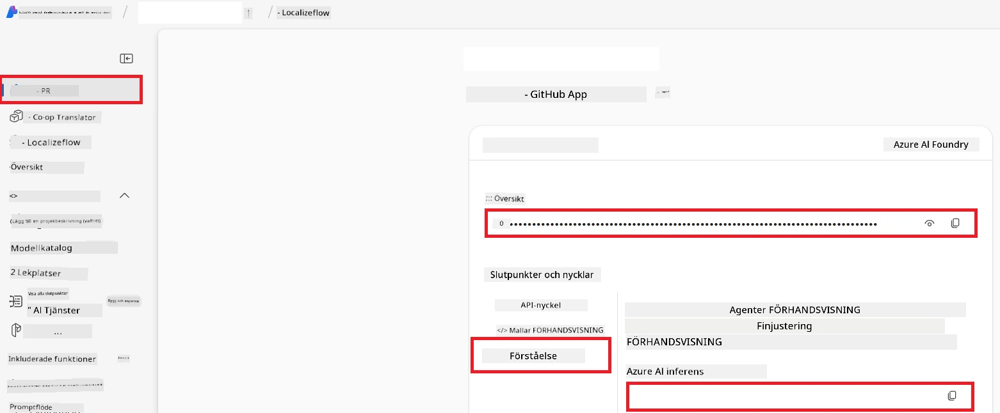

# Ställ in Azure AI för Co-op Translator (Azure OpneAI & Azure AI Vision)

Denna guide går igenom hur du ställer in Azure OpenAI för språktranslation och Azure Computer Vision för bildinnehållsanalys (vilket sedan kan användas för bildbaserad översättning) inom Azure AI Foundry.

**Förutsättningar:**
- Ett Azure-konto med en aktiv prenumeration.
- Tillräckliga behörigheter för att skapa resurser och distributioner i din Azure-prenumeration.

## Skapa ett Azure AI-projekt

Du börjar med att skapa ett Azure AI-projekt, som fungerar som en central plats för att hantera dina AI-resurser.

1. Navigera till [https://ai.azure.com](https://ai.azure.com) och logga in med ditt Azure-konto.

1. Välj **+Create** för att skapa ett nytt projekt.

1. Utför följande uppgifter:
   - Ange ett **projektnamn** (t.ex. `CoopTranslator-Project`).
   - Välj **AI hub** (t.ex. `CoopTranslator-Hub`) (Skapa en ny om det behövs).

1. Klicka på "**Review and Create**" för att skapa ditt projekt. Du kommer att tas till projektets översiktssida.

## Ställ in Azure OpenAI för språköversättning

Inom ditt projekt distribuerar du en Azure OpenAI-modell som fungerar som backend för textöversättning.

### Navigera till ditt projekt

Om du inte redan är där, öppna ditt nyss skapade projekt (t.ex. `CoopTranslator-Project`) i Azure AI Foundry.

### Distribuera en OpenAI-modell

1. Från projektets vänstermeny, under "My assets", välj "**Models + endpoints**".

1. Välj **+ Deploy model**.

1. Välj **Deploy Base Model**.

1. Du kommer att mötas av en lista över tillgängliga modeller. Filtrera eller sök efter en lämplig GPT-modell. Vi rekommenderar `gpt-4o`.

1. Välj önskad modell och klicka på **Confirm**.

1. Välj **Deploy**.

### Azure OpenAI-konfiguration

När modellen är distribuerad kan du välja distributionen från sidan "**Models + endpoints**" för att hitta dess **REST endpoint URL**, **Key**, **Deployment name**, **Model name** och **API version**. Dessa behövs för att integrera översättningsmodellen i din applikation.

> [!NOTE]
> Du kan välja API-versioner från sidan [API version deprecation](https://learn.microsoft.com/azure/ai-services/openai/api-version-deprecation) baserat på dina krav. Var medveten om att **API version** skiljer sig från **Model version** som visas på sidan **Models + endpoints** i Azure AI Foundry.

## Ställ in Azure Computer Vision för bildöversättning

För att möjliggöra översättning av text i bilder behöver du hitta Azure AI Service API-nyckel och slutpunkt.

1. Navigera till ditt Azure AI-projekt (t.ex. `CoopTranslator-Project`). Se till att du är på projektets översiktssida.

### Azure AI Service-konfiguration

Hitta API-nyckeln och slutpunkten från Azure AI Service.

1. Navigera till ditt Azure AI-projekt (t.ex. `CoopTranslator-Project`). Se till att du är på projektets översiktssida.

1. Hitta **API Key** och **Endpoint** under fliken Azure AI Service.

    

Den här kopplingen gör funktionerna för den länkade Azure AI Services-resursen (inklusive bildanalys) tillgängliga för ditt AI Foundry-projekt. Du kan sedan använda denna koppling i dina notebookar eller applikationer för att extrahera text från bilder, som därefter kan skickas till Azure OpenAI-modellen för översättning.

## Sammanställ dina autentiseringsuppgifter

Vid det här laget bör du ha samlat följande:

**För Azure OpenAI (textöversättning):**
- Azure OpenAI Endpoint
- Azure OpenAI API Key
- Azure OpenAI Model Name (t.ex. `gpt-4o`)
- Azure OpenAI Deployment Name (t.ex. `cooptranslator-gpt4o`)
- Azure OpenAI API Version

**För Azure AI Services (textutdrag från bilder via Vision):**
- Azure AI Service Endpoint
- Azure AI Service API Key

### Exempel: Konfigurering av miljövariabler (förhandsversion)

Senare, när du bygger din applikation, kommer du troligtvis att konfigurera den med dessa samlade autentiseringsuppgifter. Till exempel kan du sätta dem som miljövariabler så här:

```bash
# Azure AI-tjänstuppgifter (obligatoriskt för bildöversättning)
AZURE_AI_SERVICE_API_KEY="your_azure_ai_service_api_key" # t.ex. 21xasd...
AZURE_AI_SERVICE_ENDPOINT="https://your_azure_ai_service_endpoint.cognitiveservices.azure.com/"

# Valfria reservuppsättningar: duplicera variabler med suffix _1/_2 (samma index för alla variabler i uppsättningen)
AZURE_AI_SERVICE_API_KEY_1="your_azure_ai_service_api_key_1"
AZURE_AI_SERVICE_ENDPOINT_1="https://your_azure_ai_service_endpoint_1.cognitiveservices.azure.com/"

# Azure OpenAI-uppgifter (obligatoriskt för textöversättning)
AZURE_OPENAI_API_KEY="your_azure_openai_api_key" # t.ex. 21xasd...
AZURE_OPENAI_ENDPOINT="https://your_azure_openai_endpoint.openai.azure.com/"
AZURE_OPENAI_MODEL_NAME="your_model_name" # t.ex. gpt-4o
AZURE_OPENAI_CHAT_DEPLOYMENT_NAME="your_deployment_name" # t.ex. cooptranslator-gpt4o
AZURE_OPENAI_API_VERSION="your_api_version" # t.ex. 2024-12-01-preview

# Valfria reservuppsättningar: duplicera hela AZURE_OPENAI_*-uppsättningen med suffix _1/_2 (samma index för alla variabler)
```

---

### Vidare läsning

- [How to Create a project in Azure AI Foundry](https://learn.microsoft.com/azure/ai-foundry/how-to/create-projects?tabs=ai-studio)
- [How to Create Azure AI resources](https://learn.microsoft.com/azure/ai-foundry/how-to/create-azure-ai-resource?tabs=portal)
- [How to Deploy OpenAI models in Azure AI Foundry](https://learn.microsoft.com/en-us/azure/ai-foundry/how-to/deploy-models-openai)

---

<!-- CO-OP TRANSLATOR DISCLAIMER START -->
**Ansvarsfriskrivning**:  
Detta dokument har översatts med hjälp av AI-översättningstjänsten [Co-op Translator](https://github.com/Azure/co-op-translator). Även om vi strävar efter noggrannhet, var vänlig notera att automatiska översättningar kan innehålla fel eller brister. Det ursprungliga dokumentet på dess modersmål bör betraktas som den auktoritativa källan. För kritisk information rekommenderas professionell mänsklig översättning. Vi ansvarar inte för några missförstånd eller feltolkningar som kan uppstå från användningen av denna översättning.
<!-- CO-OP TRANSLATOR DISCLAIMER END -->