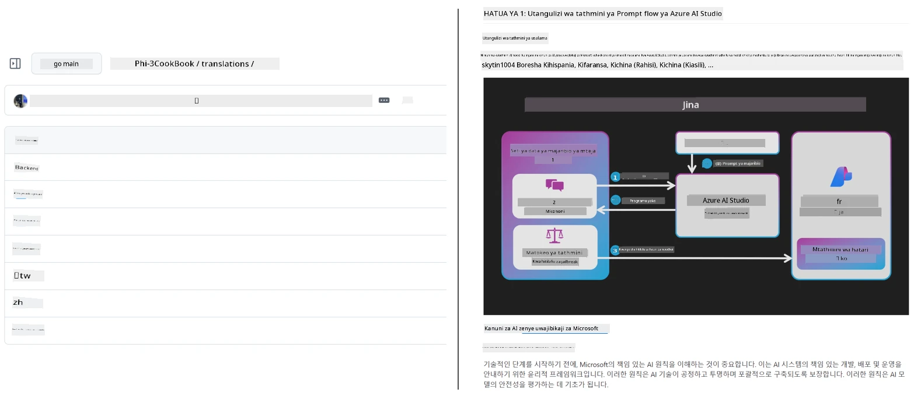
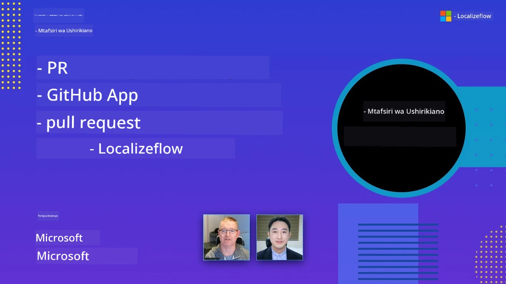

# Co-op Translator

_Kwa urahisi otomati na kudumisha tafsiri za maudhui yako ya elimu ya GitHub katika lugha nyingi kadri mradi wako unavyobadilika._


[](https://pypi.org/project/co-op-translator/)
[](https://github.com/azure/co-op-translator/blob/main/LICENSE)
[](https://pepy.tech/project/co-op-translator)
[](https://pepy.tech/project/co-op-translator)
[](https://github.com/azure/co-op-translator/pkgs/container/co-op-translator)
[](https://github.com/psf/black)

[](https://GitHub.com/azure/co-op-translator/graphs/contributors/)
[](https://GitHub.com/azure/co-op-translator/issues/)
[](https://GitHub.com/azure/co-op-translator/pulls/)
[](http://makeapullrequest.com)

### 🌐 Msaada wa Lugha Nyingi

#### Inasaidiwa na [Co-op Translator](https://github.com/Azure/Co-op-Translator)

<!-- CO-OP TRANSLATOR LANGUAGES TABLE START -->
[Arabic](../ar/README.md) | [Bengali](../bn/README.md) | [Bulgarian](../bg/README.md) | [Burmese (Myanmar)](../my/README.md) | [Chinese (Simplified)](../zh-CN/README.md) | [Chinese (Traditional, Hong Kong)](../zh-HK/README.md) | [Chinese (Traditional, Macau)](../zh-MO/README.md) | [Chinese (Traditional, Taiwan)](../zh-TW/README.md) | [Croatian](../hr/README.md) | [Czech](../cs/README.md) | [Danish](../da/README.md) | [Dutch](../nl/README.md) | [Estonian](../et/README.md) | [Finnish](../fi/README.md) | [French](../fr/README.md) | [German](../de/README.md) | [Greek](../el/README.md) | [Hebrew](../he/README.md) | [Hindi](../hi/README.md) | [Hungarian](../hu/README.md) | [Indonesian](../id/README.md) | [Italian](../it/README.md) | [Japanese](../ja/README.md) | [Kannada](../kn/README.md) | [Khmer](../km/README.md) | [Korean](../ko/README.md) | [Lithuanian](../lt/README.md) | [Malay](../ms/README.md) | [Malayalam](../ml/README.md) | [Marathi](../mr/README.md) | [Nepali](../ne/README.md) | [Nigerian Pidgin](../pcm/README.md) | [Norwegian](../no/README.md) | [Persian (Farsi)](../fa/README.md) | [Polish](../pl/README.md) | [Portuguese (Brazil)](../pt-BR/README.md) | [Portuguese (Portugal)](../pt-PT/README.md) | [Punjabi (Gurmukhi)](../pa/README.md) | [Romanian](../ro/README.md) | [Russian](../ru/README.md) | [Serbian (Cyrillic)](../sr/README.md) | [Slovak](../sk/README.md) | [Slovenian](../sl/README.md) | [Spanish](../es/README.md) | [Swahili](./README.md) | [Swedish](../sv/README.md) | [Tagalog (Filipino)](../tl/README.md) | [Tamil](../ta/README.md) | [Telugu](../te/README.md) | [Thai](../th/README.md) | [Turkish](../tr/README.md) | [Ukrainian](../uk/README.md) | [Urdu](../ur/README.md) | [Vietnamese](../vi/README.md)

> **Unapendelea Kuiga Kwenye eneo lako?**
>
> Hifadhi hii ina tafsiri zaidi ya 50 za lugha ambazo huongeza kiasi cha kupakua kwa kiasi kikubwa. Ili kuiga bila tafsiri, tumia sparse checkout:
>
> **Bash / macOS / Linux:**
> ```bash
> git clone --filter=blob:none --sparse https://github.com/skytin1004/co-op-translator.git
> cd co-op-translator
> git sparse-checkout set --no-cone '/*' '!translations' '!translated_images'
> ```
>
> **CMD (Windows):**
> ```cmd
> git clone --filter=blob:none --sparse https://github.com/skytin1004/co-op-translator.git
> cd co-op-translator
> git sparse-checkout set --no-cone "/*" "!translations" "!translated_images"
> ```
>
> Hii inakupa kila unachohitaji kumaliza kozi kwa kasi zaidi ya kupakua.
<!-- CO-OP TRANSLATOR LANGUAGES TABLE END -->

[](https://GitHub.com/azure/co-op-translator/watchers/)
[](https://GitHub.com/azure/co-op-translator/network/)
[](https://GitHub.com/azure/co-op-translator/stargazers/)

[](https://discord.gg/nTYy5BXMWG)

[](https://codespaces.new/azure/co-op-translator)

## Muhtasari

**Co-op Translator** inakusaidia kuweka maudhui yako ya elimu ya GitHub katika lugha nyingi kwa urahisi.  
Unapoboresha mafaili yako ya Markdown, picha, au daftari, tafsiri zinabaki ziko sawa moja kwa moja, zikihakikisha maudhui yako ni sahihi na ya kisasa kwa wanafunzi duniani kote.

Mfano wa jinsi maudhui yaliyotafsiriwa yanavyopangwa:



## Jinsi hali ya tafsiri inavyosimamiwa

Co-op Translator inasimamia maudhui yaliyotafsiriwa kama **vitu vya programu vilivyo na toleo**,  
sio kama mafaili tulivu.

Zana hii inafuatilia hali ya Markdown, picha, na daftari yaliyotafsiriwa  
kwa kutumia **metadata iliyobainishwa kwa lugha**.

Muundo huu unaruhusu Co-op Translator:

- Kugundua tafsiri zilizozidiwa kuwa za zamani kwa uhakika  
- Kutendea Markdown, picha, na daftari kwa njia sawa  
- Kupanua kwa usalama katika hazina kubwa, zinazobadilika haraka, zenye lugha nyingi

Kwa kufanikisha tafsiri kama vitu vinavyosimamiwa,  
mchakato wa tafsiri unaendana kwa asili na  
masharti ya kisasa ya usimamizi wa utegemezi wa programu na vitu.

→ [Jinsi hali ya tafsiri inavyosimamiwa](https://techcommunity.microsoft.com/blog/azuredevcommunityblog/rethinking-documentation-translation-treating-translations-as-versioned-software/4491755)


## Maanzo ya haraka

```bash
# Unda na wezesha mazingira ya mtandaoni (inayopendekezwa)
python -m venv .venv
# Windows
.venv\Scripts\activate
# macOS/Linux
source .venv/bin/activate
# Sakinisha kifurushi
pip install co-op-translator
# Tafsiri
translate -l "ko ja fr" -md
```

Docker:

```bash
# Vuta picha ya umma kutoka GHCR
docker pull ghcr.io/azure/co-op-translator:latest
# Endesha ukifanya folda ya sasa ikiwa imewekwa na .env ikitolewa (Bash/Zsh)
docker run --rm -it --env-file .env -v "${PWD}:/work" ghcr.io/azure/co-op-translator:latest -l "ko ja fr" -md
```

## Usanidi wa chini kabisa

1. Thibitisha kuwa una toleo la Python linalosaidiwa (kwa sasa 3.10-3.12). Katika poetry (pyproject.toml) hili linashughulikiwa kwa otomatiki.  
2. Unda faili la `.env` kwa kutumia templeti: [.env.template](../../.env.template)  
3. Sanidi mtoa huduma mmoja wa LLM (Azure OpenAI au OpenAI)  
4. (Hiari) Kwa tafsiri ya picha (`-img`), sanidi Azure AI Vision  
5. (Hiari) Unaweza kusanidi seti nyingi za kibali kwa kurudia mabadiliko na viambishi kama `_1`, `_2`, nk. Vigezo vyote katika seti lazima vyawe na kiambishi sawa.  
6. (Inapendekezwa) Safisha tafsiri za awali ili kuepuka migongano (kwa mfano, `translations/`)  
7. (Inapendekezwa) Ongeza sehemu ya tafsiri kwa README yako kwa kutumia [README languages template](./getting_started/README_languages_template.md)  
8. Tazama: [Sanidi Azure AI](./getting_started/set-up-azure-ai.md)

## Matumizi

Tafsiri aina zote zinazosaidiwa:

```bash
translate -l "ko ja"
```

Markdown pekee:

```bash
translate -l "de" -md
```

Markdown + picha:

```bash
translate -l "pt" -md -img
```

Daftari pekee:

```bash
translate -l "zh" -nb
```

Bendera zaidi: [Marejeleo ya amri](./getting_started/command-reference.md)

## Sifa

- Tafsiri za otomatiki kwa Markdown, daftari, na picha  
- Inahakikisha tafsiri zinakuwa sawa na mabadiliko ya chanzo  
- Inafanya kazi kwa ndani (CLI) au katika CI (GitHub Actions)  
- Inatumia Azure OpenAI au OpenAI; hiari Azure AI Vision kwa picha  
- Inahifadhi muundo na mpangilio wa Markdown

## Nyaraka

- [Mwongozo wa mstari wa amri](./getting_started/command-line-guide/command-line-guide.md)
- [Mwongozo wa GitHub Actions (Hazina za umma & siri za kawaida)](./getting_started/github-actions-guide/github-actions-guide-public.md)
- [Mwongozo wa GitHub Actions (Hazina za shirika la Microsoft & usanidi wa ngazi ya shirika)](./getting_started/github-actions-guide/github-actions-guide-org.md)
- [Templeti ya lugha za README](./getting_started/README_languages_template.md)
- [Lugha zinazosaidiwa](./getting_started/supported-languages.md)
- [Kushiriki](./CONTRIBUTING.md)
- [Kutatua matatizo](./getting_started/troubleshooting.md)

### Mwongozo wa Microsoft maalum
> [!NOTE]
> Kwa watunzaji wa hazina za Microsoft “Kwa Waanzilishi” tu.

- [Kusasa orodha ya “kozi zingine” (kwa hazina za MS Beginners tu)](./getting_started/update-other-courses.md)

## Tuunge mkono na kuendeleza kujifunza duniani kote

Jiunge nasi katika mapinduzi ya jinsi maudhui ya elimu yanavyoshirikishwa duniani! Piga sasa [Co-op Translator](https://github.com/azure/co-op-translator) ⭐ kwenye GitHub na saidia azma yetu ya kuvunja kizuizi cha lugha katika kujifunza na teknolojia. Wasiwasi na michango yako yana athari kubwa! Michango ya msimbo na mapendekezo ya vipengele daima yanakubaliwa.

### Gunduzi maudhui ya elimu ya Microsoft kwa lugha yako

- [LangChain4j-for-Beginners](https://github.com/microsoft/LangChain4j-for-Beginners)
- [AZD for Beginners](https://github.com/microsoft/AZD-for-beginners)
- [Edge AI for Beginners](https://github.com/microsoft/edgeai-for-beginners)
- [Model Context Protocol (MCP) For Beginners](https://github.com/microsoft/mcp-for-beginners)
- [AI Agents for Beginners](https://github.com/microsoft/ai-agents-for-beginners)
- [Generative AI for Beginners using .NET](https://github.com/microsoft/Generative-AI-for-beginners-dotnet)
- [Generative AI for Beginners](https://github.com/microsoft/generative-ai-for-beginners)
- [Generative AI for Beginners using Java](https://github.com/microsoft/generative-ai-for-beginners-java)
- [ML for Beginners](https://aka.ms/ml-beginners)
- [Data Science for Beginners](https://aka.ms/datascience-beginners)
- [AI for Beginners](https://aka.ms/ai-beginners)
- [Cybersecurity for Beginners](https://github.com/microsoft/Security-101)
- [Web Dev for Beginners](https://aka.ms/webdev-beginners)
- [IoT for Beginners](https://aka.ms/iot-beginners)
- [PhiCookBook](https://github.com/microsoft/PhiCookBook)

## Uwasilishaji wa video

👉 Bonyeza picha hapa chini kutazama kwenye YouTube.

- **Open at Microsoft**: Utangulizi mfupi wa dakika 18 na mwongozo wa haraka wa kutumia Co-op Translator.

  [](https://www.youtube.com/watch?v=jX_swfH_KNU)

## Kushiriki

Mradi huu unakaribisha michango na mapendekezo. Unavutiwa kuchangia Azure Co-op Translator? Tafadhali angalia [CONTRIBUTING.md](./CONTRIBUTING.md) kwa miongozo ya jinsi unavyoweza kusaidia kufanya Co-op Translator ipatikane zaidi.

## Washiriki
[](https://github.com/Azure/co-op-translator/graphs/contributors)

## Kanuni za Maadili

Mradi huu umechukua [Kanuni za Maadili za Chanzo Huru za Microsoft](https://opensource.microsoft.com/codeofconduct/).
Kwa maelezo zaidi tazama [Maswali Yanayoulizwa Mara kwa Mara kuhusu Kanuni za Maadili](https://opensource.microsoft.com/codeofconduct/faq/) au
wasiliana na [opencode@microsoft.com](mailto:opencode@microsoft.com) kwa maswali au maoni zaidi.

## AI ya Kuwajibika

Microsoft imejitolea kusaidia wateja wetu kutumia bidhaa zetu za AI kwa uwajibikaji, kushiriki miongozo yetu, na kujenga ushirikiano unaotegemea imani kupitia zana kama Vidokezo vya Uwajibikaji na Tathmini za Athari. Rasilimali nyingi za aina hii zinaweza kupatikana kwenye [https://aka.ms/RAI](https://aka.ms/RAI).
Njia ya Microsoft kwa AI inayowajibika inatokana na kanuni zetu za AI za usawa, kuaminika na usalama, faragha na usalama, ujumuishaji, uwazi, na uwajibikaji.

Modeli kubwa za lugha ya asili, picha, na hotuba - kama zile zinazotumika katika sampuli hii - zinaweza kuonyesha tabia zisizokuwa za haki, zisizoaminika, au zenye kuudhi, na kusababisha madhara. Tafadhali kusoma [kidokezo cha uwazi cha huduma ya Azure OpenAI](https://learn.microsoft.com/legal/cognitive-services/openai/transparency-note?tabs=text) ili kufahamishwa kuhusu hatari na mipaka.

Njia inayopendekezwa ya kupunguza hatari hizi ni kujumuisha mfumo wa usalama katika usanifu wako unaoweza kugundua na kuzuia tabia zenye madhara. [Azure AI Content Safety](https://learn.microsoft.com/azure/ai-services/content-safety/overview) hutoa tabaka huru la ulinzi, linaloweza kugundua maudhui yenye madhara yaliyotokana na watumiaji na AI katika programu na huduma. Azure AI Content Safety inajumuisha API za maandishi na picha zinazokuwezesha kugundua nyenzo zenye madhara. Pia tuna Studio la Usalama wa Maudhui linaloingiliana ambalo linakuwezesha kuona, kuchunguza na kujaribu mifano ya msimbo wa kugundua maudhui yenye madhara katika aina tofauti. Hati ya [mwongozo wa haraka](https://learn.microsoft.com/azure/ai-services/content-safety/quickstart-text?tabs=visual-studio%2Clinux&pivots=programming-language-rest) inakuongoza katika kuomba huduma hii.

Jambo lingine la kuzingatia ni utendaji wa jumla wa programu. Kwa programu za modal nyingi na modeli nyingi, tunachukulia utendaji kama mfumo unavyofanya kazi kama unavyotarajiwa na wewe na watumiaji wako, ikiwa ni pamoja na kutotengeneza matokeo yenye madhara. Ni muhimu kutathmini utendaji wa programu yako kwa kutumia [vipimo vya ubora wa uzalishaji na hatari na usalama](https://learn.microsoft.com/azure/ai-studio/concepts/evaluation-metrics-built-in).

Unaweza kutathmini programu yako ya AI katika mazingira yako ya maendeleo kwa kutumia [prompt flow SDK](https://microsoft.github.io/promptflow/index.html). Ikiwa una seti ya data ya majaribio au lengo, uzalishaji wa programu yako ya AI unapangiliwa kwa kiasi kwa kutumia watazamaji waliomo au watu binafsi waliyochagua. Ili kuanza na prompt flow sdk kutathmini mfumo wako, unaweza kufuata [mwongozo wa haraka](https://learn.microsoft.com/azure/ai-studio/how-to/develop/flow-evaluate-sdk). Baada ya kuendesha tathmini, unaweza [kuwaonesha matokeo katika Azure AI Studio](https://learn.microsoft.com/azure/ai-studio/how-to/evaluate-flow-results).

## Hati miliki

Mradi huu unaweza kuwa na hati miliki au nembo za miradi, bidhaa, au huduma. Matumizi halali ya hati miliki au nembo za Microsoft yanahitaji kufuata
[Mwongozo wa Hati Miliki & Brand za Microsoft](https://www.microsoft.com/en-us/legal/intellectualproperty/trademarks/usage/general).
Matumizi ya hati miliki au nembo za Microsoft katika matoleo yaliyorekebishwa ya mradi huu yasibainishe mkanganyiko au kuonyesha kuwa Microsoft inahusiana.
Matumizi yoyote ya hati miliki au nembo za wachambuzi wa tatu yanatii sera za wahusika hao.

## Kupata Msaada

Kama utakamatwa au una maswali kuhusu kujenga programu za AI, jiunge:

[](https://discord.gg/nTYy5BXMWG)

Kama una maoni ya bidhaa au makosa wakati wa kujenga tembelea:

[](https://aka.ms/foundry/forum)

---

<!-- CO-OP TRANSLATOR DISCLAIMER START -->
**Kubainisha**:  
Hati hii imetafsiriwa kwa kutumia huduma ya kutafsiri ya AI [Co-op Translator](https://github.com/Azure/co-op-translator). Wakati tunajitahidi kwa usahihi, tafadhali fahamu kwamba tafsiri za kiotomatiki zinaweza kuwa na makosa au kutokukamilika. Hati ya asili katika lugha yake ya asili inapaswa kuchukuliwa kama chanzo cha mamlaka. Kwa taarifa muhimu, tafsiri ya kitaalamu ya binadamu inashauriwa. Hatuwajibiki kwa maelezo potofu au kutoelewana kunakotokana na matumizi ya tafsiri hii.
<!-- CO-OP TRANSLATOR DISCLAIMER END -->