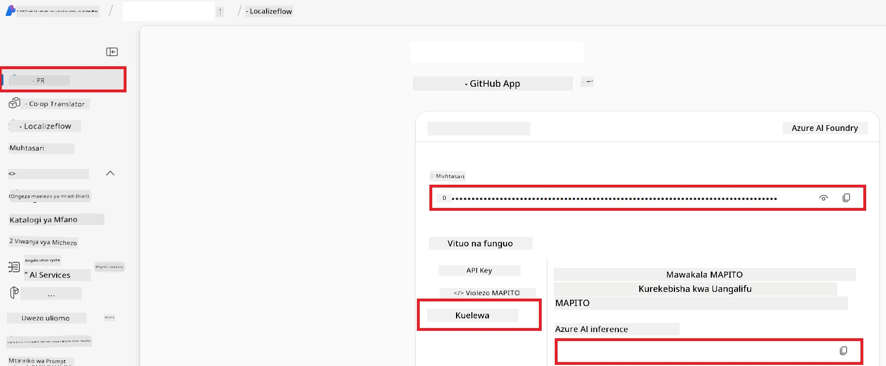

# Weka Azure AI kwa Co-op Translator (Azure OpneAI & Azure AI Vision)

Mwongozo huu utakuelekeza jinsi ya kuweka Azure OpenAI kwa ajili ya tafsiri ya lugha na Azure Computer Vision kwa uchambuzi wa maudhui ya picha (ambayo inaweza kutumika kwa tafsiri inayotegemea picha) ndani ya Azure AI Foundry.

**Mahitaji ya awali:**
- Akaunti ya Azure yenye usajili hai.
- Ruhusa za kutosha za kuunda rasilimali na usambazaji katika usajili wako wa Azure.

## Unda Mradi wa Azure AI

Utaanza kwa kuunda Mradi wa Azure AI, ambao hufanya kama sehemu kuu ya kusimamia rasilimali zako za AI.

1. Nenda kwenye [https://ai.azure.com](https://ai.azure.com) na ingia kwa akaunti yako ya Azure.

1. Chagua **+Create** kuunda mradi mpya.

1. Fanya kazi zifuatazo:
   - Ingiza **Jina la Mradi** (mfano, `CoopTranslator-Project`).
   - Chagua **AI hub** (mfano, `CoopTranslator-Hub`) (Tengeneza mpya ikiwa inahitajika).

1. Bonyeza "**Review and Create**" kuweka mradi wako. Utaelekezwa kwenye ukurasa wa muhtasari wa mradi wako.

## Weka Azure OpenAI kwa Tafsiri ya Lugha

Ndani ya mradi wako, utaweka mfano wa Azure OpenAI kutumika kama sehemu ya nyuma kwa tafsiri ya maandishi.

### Nenda kwenye Mradi Wako

Ikiwa bado hujafikia, fungua mradi mpya ulio tengeneza (mfano, `CoopTranslator-Project`) kwenye Azure AI Foundry.

### Weka Mfano wa OpenAI

1. Kutoka kwenye menyu ya kushoto ya mradi wako, chini ya "My assets", chagua "**Models + endpoints**".

1. Chagua **+ Deploy model**.

1. Chagua **Deploy Base Model**.

1. Utaonyeshwa orodha ya mifano inayopatikana. Tafuta au chujia mfano unaofaa wa GPT. Tunapendekeza `gpt-4o`.

1. Chagua mfano unaotaka na bonyeza **Confirm**.

1. Chagua **Deploy**.

### Ufungaji wa Azure OpenAI

Mara baada ya kuwekwa, unaweza kuchagua usambazaji kutoka kwenye ukurasa wa "**Models + endpoints**" kupata **REST endpoint URL**, **Key**, **Deployment name**, **Model name** na **API version**. Hizi zitahitajika kuunganisha mfano wa tafsiri kwenye programu yako.

> [!NOTE]
> Unaweza kuchagua toleo la API kutoka kwenye ukurasa wa [API version deprecation](https://learn.microsoft.com/azure/ai-services/openai/api-version-deprecation) kulingana na mahitaji yako. Fahamu kuwa **API version** ni tofauti na **Model version** inayoonyeshwa kwenye ukurasa wa **Models + endpoints** katika Azure AI Foundry.

## Weka Azure Computer Vision kwa Tafsiri ya Picha

Ili kuwezesha tafsiri ya maandishi ndani ya picha, unahitaji kupata Azure AI Service API Key na Endpoint.

1. Nenda kwenye Mradi wako wa Azure AI (mfano, `CoopTranslator-Project`). Hakikisha uko kwenye ukurasa wa muhtasari wa mradi.

### Ufungaji wa Azure AI Service

Pata API Key na Endpoint kutoka kwa Azure AI Service.

1. Nenda kwenye Mradi wako wa Azure AI (mfano, `CoopTranslator-Project`). Hakikisha uko kwenye ukurasa wa muhtasari wa mradi.

1. Tafuta **API Key** na **Endpoint** kutoka kwenye kichupo cha Azure AI Service.

    

Muunganisho huu hufanya uwezo wa rasilimali zinazounganishwa za Azure AI Services (pamoja na uchambuzi wa picha) kupatikana kwa mradi wako wa AI Foundry. Kisha unaweza kutumia muunganisho huu katika daftari zako au programu kutoa maandishi kutoka kwa picha, ambayo baadaye inaweza kutumwa kwa mfano wa Azure OpenAI kwa tafsiri.

## Kuhakikisha Nyaraka Zako

Hadi sasa, unapaswa kuwa umekusanya yafuatayo:

**Kwa Azure OpenAI (Tafsiri ya Maandishi):**
- Azure OpenAI Endpoint
- Azure OpenAI API Key
- Azure OpenAI Model Name (mfano, `gpt-4o`)
- Azure OpenAI Deployment Name (mfano, `cooptranslator-gpt4o`)
- Azure OpenAI API Version

**Kwa Azure AI Services (Utoaji Maandishi kutoka Picha kwa kutumia Vision):**
- Azure AI Service Endpoint
- Azure AI Service API Key

### Mfano: Ufungaji wa Variable za Mazingira (Maoni)

Baadaye, unapo jenga programu yako, huenda ukazipanga kwa kutumia nyaraka hizi ulizokusanya. Kwa mfano, unaweza kuzizingatia kama variable za mazingira kama ifuatavyo:

```bash
# Cheti cha Huduma ya Azure AI (Kinahitajika kwa tafsiri ya picha)
AZURE_AI_SERVICE_API_KEY="your_azure_ai_service_api_key" # kwa mfano, 21xasd...
AZURE_AI_SERVICE_ENDPOINT="https://your_azure_ai_service_endpoint.cognitiveservices.azure.com/"

# Msets wa ziada wa uchaguzi: rudia vigezo na kiambishi _1/_2 (nambari sawa kwa vigezo vyote katika seti)
AZURE_AI_SERVICE_API_KEY_1="your_azure_ai_service_api_key_1"
AZURE_AI_SERVICE_ENDPOINT_1="https://your_azure_ai_service_endpoint_1.cognitiveservices.azure.com/"

# Cheti cha Azure OpenAI (Kinahitajika kwa tafsiri ya maandishi)
AZURE_OPENAI_API_KEY="your_azure_openai_api_key" # kwa mfano, 21xasd...
AZURE_OPENAI_ENDPOINT="https://your_azure_openai_endpoint.openai.azure.com/"
AZURE_OPENAI_MODEL_NAME="your_model_name" # kwa mfano, gpt-4o
AZURE_OPENAI_CHAT_DEPLOYMENT_NAME="your_deployment_name" # kwa mfano, cooptranslator-gpt4o
AZURE_OPENAI_API_VERSION="your_api_version" # kwa mfano, 2024-12-01-preview

# Msets wa ziada wa uchaguzi: rudia seti kamili ya AZURE_OPENAI_* na kiambishi _1/_2 (nambari sawa kwa vigezo vyote)
```

---

### Kusoma Zaidi

- [Jinsi ya Kuunda mradi katika Azure AI Foundry](https://learn.microsoft.com/azure/ai-foundry/how-to/create-projects?tabs=ai-studio)
- [Jinsi ya Kuunda rasilimali za Azure AI](https://learn.microsoft.com/azure/ai-foundry/how-to/create-azure-ai-resource?tabs=portal)
- [Jinsi ya Kuweka mifano ya OpenAI ndani ya Azure AI Foundry](https://learn.microsoft.com/en-us/azure/ai-foundry/how-to/deploy-models-openai)

---

<!-- CO-OP TRANSLATOR DISCLAIMER START -->
**Kifungu cha Kutolea Maandishi**:
Hati hii imetafsiriwa kwa kutumia huduma ya tafsiri ya AI [Co-op Translator](https://github.com/Azure/co-op-translator). Wakati tunajitahidi kwa usahihi, tafadhali fahamu kwamba tafsiri za kiotomatiki zinaweza kuwa na makosa au kasoro. Hati asilia katika lugha yake ya asili inapaswa kuchukuliwa kama chanzo cha kuaminika. Kwa taarifa muhimu, tafsiri ya kitaalamu inayo fanywa na mwanadamu inashauriwa. Hatuwezi kuwajibika kwa maelewano au tafsiri zisizo sahihi zinazotokana na matumizi ya tafsiri hii.
<!-- CO-OP TRANSLATOR DISCLAIMER END -->