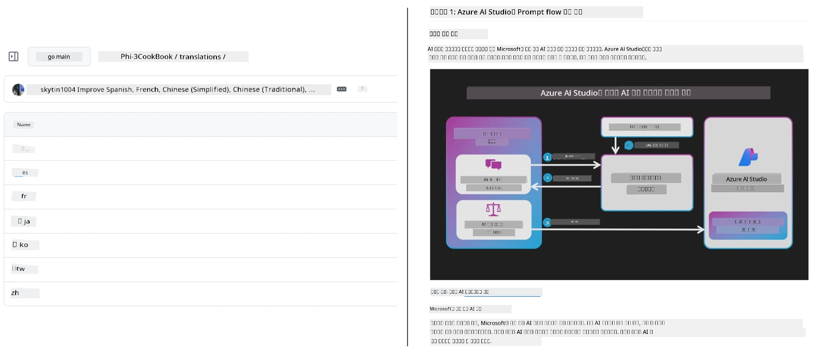
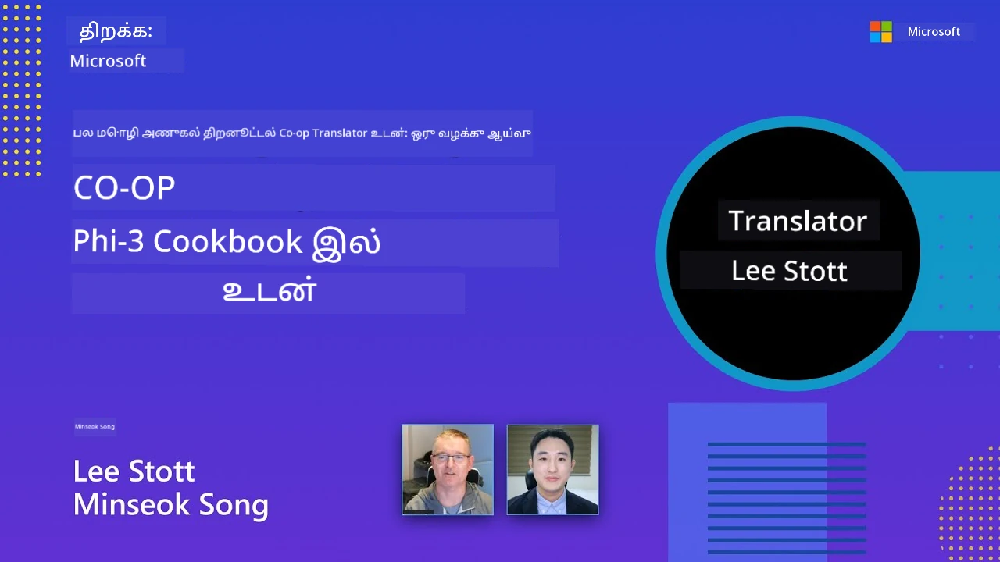

# Co-op Translator

_உங்கள் கல்வி GitHub உள்ளடக்கத்துக்கு பல மொழிகளிலும் எளிதாக தானாக மொழிபெயர்ப்புகளை செயல்முறைப்படுத்தி பராமரிக்கவும், உங்கள் திட்டம் முன்னேறுகின்றபோது._


[](https://pypi.org/project/co-op-translator/)
[](https://github.com/azure/co-op-translator/blob/main/LICENSE)
[](https://pepy.tech/project/co-op-translator)
[](https://pepy.tech/project/co-op-translator)
[](https://github.com/azure/co-op-translator/pkgs/container/co-op-translator)
[](https://github.com/psf/black)

[](https://GitHub.com/azure/co-op-translator/graphs/contributors/)
[](https://GitHub.com/azure/co-op-translator/issues/)
[](https://GitHub.com/azure/co-op-translator/pulls/)
[](http://makeapullrequest.com)

### 🌐 பல்மொழி ஆதரவு

#### [Co-op Translator](https://github.com/Azure/Co-op-Translator) மூலம் ஆதரிக்கப்படுகிறது

<!-- CO-OP TRANSLATOR LANGUAGES TABLE START -->
[Arabic](../ar/README.md) | [Bengali](../bn/README.md) | [Bulgarian](../bg/README.md) | [Burmese (Myanmar)](../my/README.md) | [Chinese (Simplified)](../zh-CN/README.md) | [Chinese (Traditional, Hong Kong)](../zh-HK/README.md) | [Chinese (Traditional, Macau)](../zh-MO/README.md) | [Chinese (Traditional, Taiwan)](../zh-TW/README.md) | [Croatian](../hr/README.md) | [Czech](../cs/README.md) | [Danish](../da/README.md) | [Dutch](../nl/README.md) | [Estonian](../et/README.md) | [Finnish](../fi/README.md) | [French](../fr/README.md) | [German](../de/README.md) | [Greek](../el/README.md) | [Hebrew](../he/README.md) | [Hindi](../hi/README.md) | [Hungarian](../hu/README.md) | [Indonesian](../id/README.md) | [Italian](../it/README.md) | [Japanese](../ja/README.md) | [Kannada](../kn/README.md) | [Khmer](../km/README.md) | [Korean](../ko/README.md) | [Lithuanian](../lt/README.md) | [Malay](../ms/README.md) | [Malayalam](../ml/README.md) | [Marathi](../mr/README.md) | [Nepali](../ne/README.md) | [Nigerian Pidgin](../pcm/README.md) | [Norwegian](../no/README.md) | [Persian (Farsi)](../fa/README.md) | [Polish](../pl/README.md) | [Portuguese (Brazil)](../pt-BR/README.md) | [Portuguese (Portugal)](../pt-PT/README.md) | [Punjabi (Gurmukhi)](../pa/README.md) | [Romanian](../ro/README.md) | [Russian](../ru/README.md) | [Serbian (Cyrillic)](../sr/README.md) | [Slovak](../sk/README.md) | [Slovenian](../sl/README.md) | [Spanish](../es/README.md) | [Swahili](../sw/README.md) | [Swedish](../sv/README.md) | [Tagalog (Filipino)](../tl/README.md) | [Tamil](./README.md) | [Telugu](../te/README.md) | [Thai](../th/README.md) | [Turkish](../tr/README.md) | [Ukrainian](../uk/README.md) | [Urdu](../ur/README.md) | [Vietnamese](../vi/README.md)

> **தொழில்நுட்பத்தை உள்ளூரில் கிளோன் செய்ய விரும்புகிறீர்களா?**
>
> இந்தக் கோப்பகம் 50+ மொழி மொழிபெயர்ப்புகளைக் கொண்டுள்ளது, இது பதிவிறக்கும் அளவை மிகவும் அதிகரிக்கிறது. மொழிபெயர்ப்புகள் இல்லாமல் கிளோன் செய்ய, sparse checkout ஐ பயன்படுத்தவும்:
>
> **Bash / macOS / Linux:**
> ```bash
> git clone --filter=blob:none --sparse https://github.com/Azure/co-op-translator.git
> cd co-op-translator
> git sparse-checkout set --no-cone '/*' '!translations' '!translated_images'
> ```
>
> **CMD (Windows):**
> ```cmd
> git clone --filter=blob:none --sparse https://github.com/Azure/co-op-translator.git
> cd co-op-translator
> git sparse-checkout set --no-cone "/*" "!translations" "!translated_images"
> ```
>
> இது படிப்பை முடிப்பதற்கான எல்லாவற்றையும் மிகவும் வேகமாக நீங்கள் பதிவிறக்கம் செய்யும்.
<!-- CO-OP TRANSLATOR LANGUAGES TABLE END -->

[](https://GitHub.com/azure/co-op-translator/watchers/)
[](https://GitHub.com/azure/co-op-translator/network/)
[](https://GitHub.com/azure/co-op-translator/stargazers/)

[](https://discord.gg/nTYy5BXMWG)

[](https://codespaces.new/azure/co-op-translator)

## மேலோட்டம்

**Co-op Translator** உங்கள் கல்வி GitHub உள்ளடக்கத்தை பல மொழிகளிலும் எளிதாக உள்ளூராட்சியானதாக செய்து உதவுகிறது.  
நீங்கள் உங்கள் Markdown கோப்புகள், படங்கள் அல்லது நோட்புக்களை புதுப்பிக்கும் போதெல்லாம், மொழிபெயர்ப்புகள் தானாக ஒத்திசைக்கப்படுகின்றன, இதன் மூலம் உலகளாவிய மாணவர்களுக்கு உங்கள் உள்ளடக்கம் துல்லியமாகவும் இ最新மாகவும் இருக்கும்.

மொழிபெயர்க்கப்பட்ட உள்ளடக்கம் எப்படிச் சீரமைக்கப்படுகிறது என்பதற்கான உதாரணம்:



## மொழிபெயர்ப்பு நிலை எப்படி நிர்வகிக்கப்படுகிறது

Co-op Translator மொழிபெயர்க்கப்பட்ட உள்ளடக்கத்தை **பதிப்பிடப்பட்ட மென்பொருள் பொருட்களாக** நிர்வகிக்கிறது,  
இணங்காத நிலையான கோப்புகளாக அல்ல.

இந்த கருவி மொழிபெயர்க்கப்பட்ட Markdown, படங்கள் மற்றும் நோட்புக்களின் நிலையை  
**மொழி-குறிப்பிடப்பட்ட மெட்டாடேட்டா** மூலம் கண்காணிக்கிறது.

இந்த வடிவமைப்பு Co-op Translator ஐத் திறம்பட செய்ய உதவுகிறது:

- பழைய மொழிபெயர்ப்புகளை நம்பகமாக கண்டறிதல்
- Markdown, படங்கள் மற்றும் நோட்புக்களை ஒன்றிணைந்த முறையில் கையாளுதல்
- பெரிய, வேகமாக வளரும், பல மொழி கொண்ட தொகுப்புகளில் பாதுகாப்பாக பரிமாணிக்க

மொழிபெயர்ப்புகளை நிர்வகிக்கப்படுகிற பொருட்களாக மாதிரியாக்குவதன் மூலம்,  
மொழிபெயர்ப்பு செயல்முறைகள்  
இன்றைய மென்பொருள் சார்பு மற்றும் பொருள் மேலாண்மை நடைமுறைகளுடன் ஒவ்வாமையில் இணைகின்றன.

→ [மொழிபெயர்ப்பு நிலை எப்படி நிர்வகிக்கப்படுகிறது](https://techcommunity.microsoft.com/blog/azuredevcommunityblog/rethinking-documentation-translation-treating-translations-as-versioned-software/4491755)


## விரைவு தொடக்கம்

```bash
# ஒரு மெய்நிகர் சூழலை உருவாக்கி செயல்படுத்தவும் (பரிந்துரைக்கப்பட்டுள்ளது)
python -m venv .venv
# விண்டோசுகள்
.venv\Scripts\activate
# மேக்OS/லினக்ஸ்
source .venv/bin/activate
# தொகுப்பைப் பொருத்தவும்
pip install co-op-translator
# மொழிபெயர்
translate -l "ko ja fr" -md
```

Docker:

```bash
# GHCR இலிருந்து பொது படம் எடுத்துக்கொள்ளவும்
docker pull ghcr.io/azure/co-op-translator:latest
# தற்போதைய கோப்பு கோப்பகப்படுத்தப்பட்டு .env கொடுக்கப்பட்ட நிலையில் இயக்கவும் (Bash/Zsh)
docker run --rm -it --env-file .env -v "${PWD}:/work" ghcr.io/azure/co-op-translator:latest -l "ko ja fr" -md
```

## குறைந்தபட்ச அமைப்பு

1. ஆதரிக்கப்பட்ட Python பதிப்பு (தற்போது 3.10-3.12) உள்ளதா என்பதை உறுதி செய்யவும். poetry (pyproject.toml) இல் இது தானாக கையாளப்படுகிறது.
2. கீழ்காணும் மாதிரியை பயன்படுத்தி `.env` கோப்பை உருவாக்கவும்: [.env.template](../../.env.template)
3. ஒரு LLM வழங்குனரை அமைக்கவும் (Azure OpenAI அல்லது OpenAI)
4. (விருப்ப) பட மொழிபெயர்ப்புக்கு (`-img`), Azure AI Vision ஐ அமைக்கவும்
5. (விருப்ப) `_1`, `_2` போன்ற அகராதிகளுடன் மாறிலிகளை நகலெடுத்து பல விண்ணப்பப்படிவங்களைக் கையாண்டு அமைக்கலாம். ஒரு வடிவத்தில் உள்ள அனைத்து மாறிலிகளும் ஒரே அகராதியை பகிர்ந்து கொள்ள வேண்டும்.
6. (பரிந்துரைக்கப்படுகிறது) முந்தைய மொழிபெயர்ப்புகளை ஒரு பாதிப்பின்றி நீக்கிக் கொள்ளவும் (உதாரணம், `translations/`)
7. (பரிந்துரைக்கப்படுகிறது) உங்கள் README இல் [README மொழிகள் மாதிரி](./getting_started/README_languages_template.md) பயன்படுத்தி மொழிபெயர்ப்பு பகுதியை சேர்க்கவும்
8. காட்டு: [Azure AI அமைக்க](./getting_started/set-up-azure-ai.md)

## பயன்பாடு

அனைத்து ஆதரிக்கப்பட்ட வகைகளையும் மொழிபெயர்க்கவும்:

```bash
translate -l "ko ja"
```

Markdown மட்டும்:

```bash
translate -l "de" -md
```

Markdown + படங்கள்:

```bash
translate -l "pt" -md -img
```

நோட்புக்கள் மட்டும்:

```bash
translate -l "zh" -nb
```

மேலும் பில்ளைகள்: [கட்டளைகள் குறிப்பு](./getting_started/command-reference.md)

## அம்சங்கள்

- Markdown, நோட்புக்கள், படங்களுக்கு தானியங்கி மொழிபெயர்ப்பு
- மூல மாற்றங்களுடன் மொழிபெயர்ப்புகளை ஒத்திசைக்கிறது
- உள்ளூர் (CLI) அல்லது CI (GitHub Actions) யில் வேலை செய்கிறது
- Azure OpenAI அல்லது OpenAI பயன்படுத்துகிறது; படங்களுக்கு விருப்பமாக Azure AI Vision
- Markdown வடிவமைப்பு மற்றும் அமைப்பை பாதுகாக்கிறது

## ஆவணங்கள்

- [கட்டளை வரி வழிகாட்டி](./getting_started/command-line-guide/command-line-guide.md)
- [GitHub Actions வழிகாட்டி (பொது சேமிப்பகங்களும் ஸ்டான்டர் ரகசியங்களும்)](./getting_started/github-actions-guide/github-actions-guide-public.md)
- [GitHub Actions வழிகாட்டி (Microsoft அமைப்புதான் இயங்கும் சேமிப்பகங்களும் அமைப்புகளும்)](./getting_started/github-actions-guide/github-actions-guide-org.md)
- [README மொழிகள் மாதிரி](./getting_started/README_languages_template.md)
- [ஆதரிக்கப்பட்ட மொழிகள்](./getting_started/supported-languages.md)
- [பங்களிப்பு](./CONTRIBUTING.md)
- [தானியங்கி சிக்கல்கள் தீர்வு](./getting_started/troubleshooting.md)

### Microsoft-க்கு சிறப்பு வழிகாட்டி
> [!NOTE]
> Microsoft “தொடக்கக்காரர்களுக்கான” சேமிப்பகக் கையாள்பவர்களுக்கு மட்டும்.

- [“மற்ற படிப்புகள்” பட்டியலை மேம்படுத்துதல் (MS தொடக்கக்காரர் சேமிப்பகங்களுக்கு மட்டும்)](./getting_started/update-other-courses.md)

## எங்களை ஆதரித்து உலகளாவிய கற்றலை ஊக்குவிக்கவும்

உலகமைப்பாக கல்வி உள்ளடக்கங்கள் பகிர்வது எப்படி மாறுகிறது என்பதை மாற்றுவதில் எங்களுடன் சேருங்கள்! [Co-op Translator](https://github.com/azure/co-op-translator) ஐ GitHub இல் ⭐ தாருங்கள் மற்றும் கற்றல் மற்றும் தொழில்நுட்பத்தில் மொழி தடைகளை வெல்லும் எங்கள் நோக்கை ஆதரியுங்கள். உங்கள் ஆர்வம் மற்றும் பங்களிப்புகள் பெரிய தாக்கம் ஏற்படுத்துகிறது! குறியீடு பங்களிப்புகள் மற்றும் அம்ச பரிந்துரைகள் எப்போதும் வரவேற்கப்படுகின்றன.

### உங்கள் மொழியில் Microsoft கல்வி உள்ளடக்கங்களை ஆராயுங்கள்

- [LangChain4j-for-Beginners](https://github.com/microsoft/LangChain4j-for-Beginners)
- [AZD for Beginners](https://github.com/microsoft/AZD-for-beginners)
- [Edge AI for Beginners](https://github.com/microsoft/edgeai-for-beginners)
- [Model Context Protocol (MCP) For Beginners](https://github.com/microsoft/mcp-for-beginners)
- [AI Agents for Beginners](https://github.com/microsoft/ai-agents-for-beginners)
- [Generative AI for Beginners using .NET](https://github.com/microsoft/Generative-AI-for-beginners-dotnet)
- [Generative AI for Beginners](https://github.com/microsoft/generative-ai-for-beginners)
- [Generative AI for Beginners using Java](https://github.com/microsoft/generative-ai-for-beginners-java)
- [ML for Beginners](https://aka.ms/ml-beginners)
- [Data Science for Beginners](https://aka.ms/datascience-beginners)
- [AI for Beginners](https://aka.ms/ai-beginners)
- [Cybersecurity for Beginners](https://github.com/microsoft/Security-101)
- [Web Dev for Beginners](https://aka.ms/webdev-beginners)
- [IoT for Beginners](https://aka.ms/iot-beginners)
- [PhiCookBook](https://github.com/microsoft/PhiCookBook)

## வீடியோ விளக்கமான நிகழ்ச்சிகள்

👉 YouTube இல் பார்ப்பதற்கு கீழே உள்ள படத்தை கிளிக் செய்யவும்.

- **Microsoft-இல் திறக்கவும்**: Co-op Translator ஐ எப்படி பயன்படுத்துவது என்பதில் 18 நிமிட சிறு அறிமுகம் மற்றும் விரைவு வழிகாட்டி.

  [](https://www.youtube.com/watch?v=jX_swfH_KNU)

## பங்களிப்பு

இந்த திட்டம் பங்களிப்புகளையும் பரிந்துரைகளையும் வரவேற்கிறது. Azure Co-op Translator இல் பங்களிக்க ஆர்வமுள்ளவர்களுக்கான வழிமுறைகளுக்கு எங்கள் [CONTRIBUTING.md](./CONTRIBUTING.md) ஐ பார்க்கவும்.

## பங்களிப்பாளர்கள்
[](https://github.com/Azure/co-op-translator/graphs/contributors)

## நடத்தைக் கோடுகள்

இந்தத் திட்டம் [Microsoft Open Source Code of Conduct](https://opensource.microsoft.com/codeofconduct/) ஐ ஏற்றுக் கொள்ளப்பட்டுள்ளது.
மேலும் தகவலுக்கு [Code of Conduct FAQ](https://opensource.microsoft.com/codeofconduct/faq/) ஐ பார்க்கவும் அல்லது
எந்தவொரு கூடுதல் கேள்விகள் அல்லது கருத்துகளுக்கு [opencode@microsoft.com](mailto:opencode@microsoft.com) என்ற முகவரியை தொடர்பு கொள்ளவும்.

## பொறுப்புள்ள AI

Microsoft, எமது AI தயாரிப்புகளை பொறுப்புடன் பயன்படுத்த எமது வாடிக்கையாளர் குழுவுக்கு உதவ, எமது கற்றுக்கொண்டவற்றை பகிர்ந்து கொள்வதிலும், Transparency Notes மற்றும் Impact Assessments போன்ற கருவிகளின் மூலம் நம்பிக்கைகொண்டு அமைப்புகளை உருவாக்குவதிலும் கடமைபடுத்தப்பட்டுள்ளது. பல்வேறு இந்த வளங்கள் [https://aka.ms/RAI](https://aka.ms/RAI) இல் காணப்படக்கூடியவை.
பொறுப்புள்ள AI க்கான Microsoft அணுகுமுறை நியாயம், நம்பகத்தன்மை மற்றும் பாதுகாப்பு, தனியுரிமை மற்றும் பாதுகாப்பு, உட்புகுத்தல், வெளிப்படைத்தன்மை மற்றும் பொறுப்புத்தன்மை ஆகிய எமது AI கொள்கைகளில் அடிப்படையாக உள்ளது.

பெரிய அளவிலான இயற்கை மொழி, படம் மற்றும் பேச்சு மாதிரிகள் - இந்த மாதிரியில் பயன்படுத்தப்படுபவை போன்றவை - நியாயமற்ற, நம்ப முடியாத அல்லது அவமரியாதையான முறையில் நடக்கக்கூடியவை, இதனால் கெடுதல்களை உண்டாக்கக்கூடும். அபாயங்கள் மற்றும் வரையறைகள் பற்றி அறிவிக்க [Azure OpenAI சேவை Transparency note](https://learn.microsoft.com/legal/cognitive-services/openai/transparency-note?tabs=text) ஐ ஆலோசிக்கவும்.

இந்த அபாயங்களை குறைக்கும் பரிந்துரைக்கப்பட்ட அணுகுமுறை உங்கள் கட்டமைப்பில் கெடுதலை கண்டறிந்து தடுக்கும் பாதுகாப்பு முறையைச் சேர்ப்பது ஆகும். [Azure AI Content Safety](https://learn.microsoft.com/azure/ai-services/content-safety/overview) செயலிகள் மற்றும் சேவைகளில் பயனரால் உருவாக்கப்பட்ட மற்றும் AI உருவாக்கிய கெடுதலான உள்ளடக்கத்தை கண்டறிய தனியார் பாதுகாப்பு அடுக்கை வழங்குகிறது. Azure AI Content Safety கெடுதலான உள்ளடக்கத்தை கண்டறிய உங்களுக்கு உதவும் உரை மற்றும் படம் API களை கொண்டுள்ளது. மேலும், வித்தியாசமான முறைகளில் உள்ளடக்கத்தைக் கண்டறிய உதவும் மாதிரிக் குறியீடுகளை பார்க்க, ஆராய மற்றும் முயற்சிக்க உதவும் Content Safety Studio உண்டு. பின்வரும் [தொடக்கவழிகாட்டி ஆவணம்](https://learn.microsoft.com/azure/ai-services/content-safety/quickstart-text?tabs=visual-studio%2Clinux&pivots=programming-language-rest) அந்த சேவைக்கு கோரிக்கைகள் செய்வதற்கு வழிகாட்டுகிறது.

மற்றொரு முக்கிய அம்சம் என்பது மொத்த பயன்பாட்டு செயல்திறன் ஆகும். பல்வேறு முறைகள் மற்றும் பல மாடல்கள் கொண்ட பயன்பாடுகளில், செயல்திறன் என்பது நீங்கள் மற்றும் உங்கள் பயனர்கள் எதிர்பார்ப்பது போல் அமைப்பு செயல்படும் என்பதைக் குறிக்கிறது, இது கெடுதலான வெளியீடுகளை உருவாக்காமலும் இருக்க வேண்டும். உங்கள் மொத்த பயன்பாட்டின் செயல்திறனை மதிப்பிட [generation quality and risk and safety metrics](https://learn.microsoft.com/azure/ai-studio/concepts/evaluation-metrics-built-in) களை பயன்படுத்தி மதிப்பிடுதல் முக்கியம்.

உங்கள் AI பயன்பாட்டை உங்கள் உருவாக்க சுற்றுப்புறத்தில் [prompt flow SDK](https://microsoft.github.io/promptflow/index.html) மூலம் மதிப்பிடலாம். சோதனை தரவுத்தொகுப்போ அல்லது இலக்கோ இருந்தால், உங்கள் உருவாக்க AI பயன்பாட்டின் உருவாக்கங்கள் ஏற்கனவே உள்ள மதிப்பீட்டாளர்கள் அல்லது உங்கள் விருப்பப்படி தனிப்பயனாக்கப்பட்ட மதிப்பீட்டாளர்களால் அளவிடப்படுகின்றன. உங்கள் அமைப்பைப் பரிசோதிக்க prompt flow sdk பயன்படுத்த தொடங்க, [quickstart guide](https://learn.microsoft.com/azure/ai-studio/how-to/develop/flow-evaluate-sdk) ஐ பின்பற்றலாம். மதிப்பீட்டு ஓட்டம் முடிந்தவுடன், [Azure AI Studio இல் முடிவுகளை கண்ணோட்டம் செய்ய](https://learn.microsoft.com/azure/ai-studio/how-to/evaluate-flow-results) முடியும்.

## வர்த்தக குறியீடுகள்

இந்தத் திட்டத்தில் திட்டங்கள், தயாரிப்புகள் அல்லது சேவைகளுக்கான வர்த்தக குறியீடுகள் அல்லது லோகோக்கள் இருக்கலாம். Microsoft வர்த்தக குறியீடுகள் அல்லது லோகோக்களை அதிகாரபூர்வமாகப் பயன்படுத்துதல் [Microsoft's Trademark & Brand Guidelines](https://www.microsoft.com/en-us/legal/intellectualproperty/trademarks/usage/general) என்பதைப் பின்பற்ற வேண்டும்.
இந்தத் திட்டத்தின் மாற்றப்பட்ட பதிப்புகளில் Microsoft வர்த்தக குறியீடுகள் அல்லது லோகோக்களை பயன்படுத்துவது குழப்பத்தைக் கிளப்பக் கூடாது அல்லது Microsoft ஆக்கிரமிப்பை குறிக்க கூடாது.
மூன்றாம் தரப்பு வர்த்தக குறியீடுகள் அல்லது லோகோக்களைப் பயன்படுத்தும் எந்தவொரு நடவடிக்கையும் அங்கேந்த் அந்த மூன்றாம் தரப்பு கொள்கைகளின் படி அமைய வேண்டும்.

## உதவி பெறுதல்

AI செயலிகள் உருவாக்குவதில் சிக்கி புகுந்தால் அல்லது எந்தவொரு கேள்விகளும் இருந்தால், பங்கேற்கவும்:

[](https://discord.gg/nTYy5BXMWG)

தயாரிப்புக் கருத்துக்களையோ பிழைகளையோ உருவாக்கையில் சந்தித்தால், புகுபதிகை செய்யவும்:

[](https://aka.ms/foundry/forum)

---

<!-- CO-OP TRANSLATOR DISCLAIMER START -->
**குறிப்புரை**:  
இந்த ஆவணம் [Co-op Translator](https://github.com/Azure/co-op-translator) என்ற ஏஐ மொழி பெயர்ப்பு சேவையை பயன்படுத்தி மொழிபெயர்க்கப்பட்டுள்ளது. நாங்கள் தெளிவான மொழிபெயர்ப்பிற்காக முயற்சித்தாலும், தானியங்கி மொழிபெயர்ப்புகளில் பிழைகள் அல்லது தவறுகள் ஏற்படக்கூடும் என்பதை கவனத்தில் கொள்ளவும். மூல ஆவணம் அதன் ஏதுவான மொழியில் நிர்மூலமான ஆதாரமாக இருக்க வேண்டும். முக்கியமான தகவல்களுக்கு, தொழில்முறை மனித மொழிபெயர்ப்பு பரிந்துரைக்கப்படுகிறது. இந்த மொழிபெயர்ப்பைப் பயன்படுத்துவதில் ஏற்படும் எந்தவொரு தவறும் அல்லது தவறான புரிதலுக்கும் நாங்கள் பொறுப்பேற்க மாட்டோம்.
<!-- CO-OP TRANSLATOR DISCLAIMER END -->