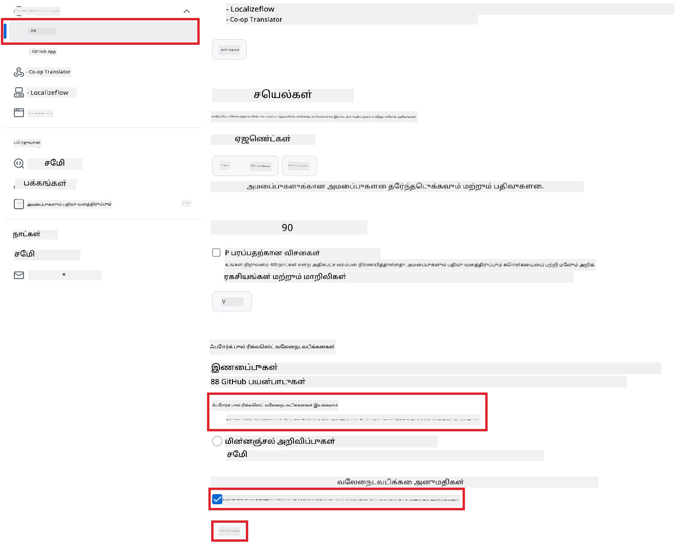

# Co-op Translator GitHub Action ஐ பயன்படுத்துவது (பொது அமைப்பு)

**இலக்கு பயனர்கள்:** இந்த வழிகாட்டி பெரும்பாலான பொது அல்லது தனிப்பட்ட ரெப்போசிட்டரிகளில், சாதாரண GitHub Actions அனுமதிகள் போதுமான இடங்களில் உள்ள பயனர்களுக்காக உருவாக்கப்பட்டுள்ளது. இது உட்பொதிக்கப்பட்ட `GITHUB_TOKEN` ஐ பயன்படுத்துகிறது.

உங்கள் ரெப்போசிட்டரியின் ஆவணங்களை தானாக மொழிபெயர்க்க Co-op Translator GitHub Action ஐ எளிதாக அமைக்கலாம். உங்கள் மூல Markdown கோப்புகள் அல்லது படங்கள் மாற்றப்பட்டால், புதுப்பிக்கப்பட்ட மொழிபெயர்ப்புகளுடன் தானாக Pull Request உருவாக்கும் வகையில் இந்த வழிகாட்டி அமைப்பை உருவாக்கும் முறையை விளக்குகிறது.

> [!IMPORTANT]
>
> **சரியான வழிகாட்டியை தேர்வு செய்வது:**
>
> இந்த வழிகாட்டி **சாதாரண `GITHUB_TOKEN` ஐ பயன்படுத்தும் எளிய அமைப்பை** விளக்குகிறது. பெரும்பாலான பயனர்களுக்கு இது பரிந்துரைக்கப்படுகிறது, ஏனெனில் இது 민감மான GitHub App Private Keys ஐ நிர்வகிக்க தேவையில்லை.
>

## முன்பதிவுகள்

GitHub Action ஐ அமைக்கும் முன், தேவையான AI சேவை சான்றுகளை தயார் வைத்திருக்க வேண்டும்.

**1. அவசியம்: AI மொழி மாதிரி சான்றுகள்**
குறைந்தபட்சம் ஒரு ஆதரிக்கப்படும் Language Model க்கான சான்றுகள் தேவை:

- **Azure OpenAI**: Endpoint, API Key, Model/Deployment Names, API Version தேவை.
- **OpenAI**: API Key தேவை, (விருப்பம்: Org ID, Base URL, Model ID).
- மேலும் விவரங்களுக்கு [Supported Models and Services](../../../../README.md) பார்க்கவும்.

**2. விருப்பம்: AI Vision சான்றுகள் (பட மொழிபெயர்ப்பு தேவைக்கு)**

- படங்களுக்குள் உள்ள உரையை மொழிபெயர்க்க வேண்டுமெனில் மட்டும் தேவை.
- **Azure AI Vision**: Endpoint மற்றும் Subscription Key தேவை.
- வழங்கப்படாவிட்டால், செயலி [Markdown-only mode](../markdown-only-mode.md) ஐ இயல்பாக பயன்படுத்தும்.

## அமைப்பு மற்றும் கட்டமைப்பு

சாதாரண `GITHUB_TOKEN` ஐ பயன்படுத்தி உங்கள் ரெப்போசிட்டரியில் Co-op Translator GitHub Action ஐ அமைக்க கீழ்காணும் படிகளை பின்பற்றவும்.

### படி 1: அங்கீகாரம் எப்படி வேலை செய்கிறது (`GITHUB_TOKEN` பயன்படுத்துதல்)

இந்த workflow, GitHub Actions வழங்கும் உட்பொதிக்கப்பட்ட `GITHUB_TOKEN` ஐ பயன்படுத்துகிறது. இந்த token, **படி 3** இல் அமைக்கப்பட்டுள்ள அனுமதிகளின் அடிப்படையில் உங்கள் ரெப்போசிட்டரியுடன் தொடர்பு கொள்ள workflow க்கு தானாக அனுமதி வழங்கும்.

### படி 2: ரெப்போசிட்டரி ரகசியங்களை அமைக்கவும்

உங்கள் **AI சேவை சான்றுகளை** மட்டும் உங்கள் ரெப்போசிட்டரி அமைப்பில் குறியாக்கப்பட்ட ரகசியங்களாக சேர்க்க வேண்டும்.

1.  உங்கள் இலக்கு GitHub ரெப்போசிட்டரிக்கு செல்லவும்.
2.  **Settings** > **Secrets and variables** > **Actions** என்பதற்கு செல்லவும்.
3.  **Repository secrets** பகுதியில், கீழே பட்டியலிடப்பட்ட ஒவ்வொரு தேவையான AI சேவை ரகசியத்திற்கும் **New repository secret** ஐ கிளிக் செய்யவும்.

     *(பட குறிப்பு: ரகசியங்களை எங்கு சேர்ப்பது என்பதை காட்டுகிறது)*

**தேவையான AI சேவை ரகசியங்கள் (உங்கள் முன்பதிவுகளின் அடிப்படையில் பொருந்தும் அனைத்தையும் சேர்க்கவும்):**

| ரகசியத்தின் பெயர்                         | விளக்கம்                               | Value Source                     |
| :---------------------------------- | :---------------------------------------- | :------------------------------- |
| `AZURE_AI_SERVICE_API_KEY`            | Azure AI சேவைக்கான விசை (Computer Vision)  | உங்கள் Azure AI Foundry               |
| `AZURE_AI_SERVICE_ENDPOINT`         | Azure AI சேவைக்கான Endpoint (Computer Vision) | உங்கள் Azure AI Foundry               |
| `AZURE_OPENAI_API_KEY`              | Azure OpenAI சேவைக்கான விசை              | உங்கள் Azure AI Foundry               |
| `AZURE_OPENAI_ENDPOINT`             | Azure OpenAI சேவைக்கான Endpoint         | உங்கள் Azure AI Foundry               |
| `AZURE_OPENAI_MODEL_NAME`           | உங்கள் Azure OpenAI Model Name              | உங்கள் Azure AI Foundry               |
| `AZURE_OPENAI_CHAT_DEPLOYMENT_NAME` | உங்கள் Azure OpenAI Deployment Name         | உங்கள் Azure AI Foundry               |
| `AZURE_OPENAI_API_VERSION`          | Azure OpenAI க்கான API பதிப்பு              | உங்கள் Azure AI Foundry               |
| `OPENAI_API_KEY`                    | OpenAI க்கான API விசை                        | உங்கள் OpenAI Platform              |
| `OPENAI_ORG_ID`                     | OpenAI நிறுவனம் ID (விருப்பம்)         | உங்கள் OpenAI Platform              |
| `OPENAI_CHAT_MODEL_ID`              | குறிப்பிட்ட OpenAI மாதிரி ID (விருப்பம்)       | உங்கள் OpenAI Platform              |
| `OPENAI_BASE_URL`                   | தனிப்பயன் OpenAI API Base URL (விருப்பம்)     | உங்கள் OpenAI Platform              |

### படி 3: Workflow அனுமதிகளை அமைக்கவும்

GitHub Action க்கு `GITHUB_TOKEN` மூலம் code ஐ checkout செய்யவும், pull request உருவாக்கவும் அனுமதிகள் தேவை.

1.  உங்கள் ரெப்போசிட்டரியில் **Settings** > **Actions** > **General** என்பதற்கு செல்லவும்.
2.  **Workflow permissions** பகுதியை கீழே ஸ்க்ரோல் செய்யவும்.
3.  **Read and write permissions** ஐ தேர்வு செய்யவும். இது `GITHUB_TOKEN` க்கு இந்த workflow க்கான `contents: write` மற்றும் `pull-requests: write` அனுமதிகளை வழங்கும்.
4.  **Allow GitHub Actions to create and approve pull requests** என்ற செக்பாக்ஸ் **checked** என உறுதி செய்யவும்.
5.  **Save** ஐ தேர்வு செய்யவும்.



### படி 4: Workflow கோப்பை உருவாக்கவும்

இப்போது, `GITHUB_TOKEN` ஐ பயன்படுத்தும் தானியங்கி workflow ஐ வரையறுக்கும் YAML கோப்பை உருவாக்கவும்.

1.  உங்கள் ரெப்போசிட்டரியின் root கோப்பகத்தில் `.github/workflows/` என்ற கோப்பகத்தை உருவாக்கவும் (இல்லையெனில்).
2.  `.github/workflows/` உள்ளே `co-op-translator.yml` என்ற கோப்பை உருவாக்கவும்.
3.  கீழ்காணும் உள்ளடக்கத்தை `co-op-translator.yml` இல் ஒட்டவும்.

```yaml
name: Co-op Translator

on:
  push:
    branches:
      - main

jobs:
  co-op-translator:
    runs-on: ubuntu-latest

    permissions:
      contents: write
      pull-requests: write

    steps:
      - name: Checkout repository
        uses: actions/checkout@v4
        with:
          fetch-depth: 0

      - name: Set up Python
        uses: actions/setup-python@v4
        with:
          python-version: '3.10'

      - name: Install Co-op Translator
        run: |
          python -m pip install --upgrade pip
          pip install co-op-translator

      - name: Run Co-op Translator
        env:
          PYTHONIOENCODING: utf-8
          # === AI Service Credentials ===
          AZURE_AI_SERVICE_API_KEY: ${{ secrets.AZURE_AI_SERVICE_API_KEY }}
          AZURE_AI_SERVICE_ENDPOINT: ${{ secrets.AZURE_AI_SERVICE_ENDPOINT }}
          AZURE_OPENAI_API_KEY: ${{ secrets.AZURE_OPENAI_API_KEY }}
          AZURE_OPENAI_ENDPOINT: ${{ secrets.AZURE_OPENAI_ENDPOINT }}
          AZURE_OPENAI_MODEL_NAME: ${{ secrets.AZURE_OPENAI_MODEL_NAME }}
          AZURE_OPENAI_CHAT_DEPLOYMENT_NAME: ${{ secrets.AZURE_OPENAI_CHAT_DEPLOYMENT_NAME }}
          AZURE_OPENAI_API_VERSION: ${{ secrets.AZURE_OPENAI_API_VERSION }}
          OPENAI_API_KEY: ${{ secrets.OPENAI_API_KEY }}
          OPENAI_ORG_ID: ${{ secrets.OPENAI_ORG_ID }}
          OPENAI_CHAT_MODEL_ID: ${{ secrets.OPENAI_CHAT_MODEL_ID }}
          OPENAI_BASE_URL: ${{ secrets.OPENAI_BASE_URL }}
        run: |
          # =====================================================================
          # IMPORTANT: Set your target languages here (REQUIRED CONFIGURATION)
          # =====================================================================
          # Example: Translate to Spanish, French, German. Add -y to auto-confirm.
          translate -l "es fr de" -y  # <--- MODIFY THIS LINE with your desired languages

      - name: Create Pull Request with translations
        uses: peter-evans/create-pull-request@v5
        with:
          token: ${{ secrets.GITHUB_TOKEN }}
          commit-message: "🌐 Update translations via Co-op Translator"
          title: "🌐 Update translations via Co-op Translator"
          body: |
            This PR updates translations for recent changes to the main branch.

            ### 📋 Changes included
            - Translated contents are available in the `translations/` directory
            - Translated images are available in the `translated_images/` directory

            ---
            🌐 Automatically generated by the [Co-op Translator](https://github.com/Azure/co-op-translator) GitHub Action.
          branch: update-translations
          base: main
          labels: translation, automated-pr
          delete-branch: true
          add-paths: |
            translations/
            translated_images/
```
4.  **Workflow ஐ தனிப்பயனாக்கவும்:**
  - **[!IMPORTANT] இலக்கு மொழிகள்:** `Run Co-op Translator` படியில், உங்கள் திட்ட தேவைகளுக்கு ஏற்ப `translate -l "..." -y` கட்டளையில் உள்ள மொழிக் குறியீடுகளின் பட்டியலை **மீண்டும் பரிசீலித்து மாற்ற வேண்டும்**. எடுத்துக்காட்டு பட்டியல் (`ar de es...`) ஐ மாற்றவும் அல்லது திருத்தவும்.
  - **Trigger (`on:`):** தற்போதைய trigger ஒவ்வொரு push க்கும் `main` இல் இயங்கும். பெரிய ரெப்போசிட்டரிகளுக்கு, `paths:` filter ஐ (YAML இல் குறிப்பிட்டுள்ள எடுத்துக்காட்டைப் பார்க்கவும்) சேர்த்து, தேவையான கோப்புகள் (எ.கா., மூல ஆவணங்கள்) மாற்றப்பட்டால் மட்டுமே workflow இயங்கும் வகையில் அமைக்கலாம், இதனால் runner நிமிடங்கள் சேமிக்கப்படும்.
  - **PR விவரங்கள்:** தேவையெனில் `Create Pull Request` படியில் உள்ள `commit-message`, `title`, `body`, `branch` பெயர் மற்றும் `labels` ஐ தனிப்பயனாக்கவும்.

## Workflow ஐ இயக்குவது

> [!WARNING]  
> **GitHub-hosted Runner நேர வரம்பு:**  
> `ubuntu-latest` போன்ற GitHub-hosted runners க்கு **அதிகபட்ச இயக்க நேர வரம்பு 6 மணி நேரம்** உள்ளது.  
> பெரிய ஆவண ரெப்போசிட்டரிகளுக்கு, மொழிபெயர்ப்பு செயல்முறை 6 மணி நேரத்தை மீறினால், workflow தானாக நிறுத்தப்படும்.  
> இதைத் தவிர்க்க:  
> - **Self-hosted runner** ஐ பயன்படுத்தவும் (நேர வரம்பு இல்லை)  
> - ஒவ்வொரு இயக்கத்திலும் இலக்கு மொழிகள் எண்ணிக்கையை குறைக்கவும்

`co-op-translator.yml` கோப்பு உங்கள் main கிளையில் (அல்லது `on:` trigger இல் குறிப்பிடப்பட்ட கிளையில்) இணைக்கப்பட்டவுடன், அந்த கிளையில் மாற்றங்கள் push செய்யப்படும் போதும் (மற்றும் `paths` filter அமைக்கப்பட்டிருந்தால் அதற்கேற்ப) workflow தானாக இயங்கும்.

---

**பொறுப்புத் தவிர்ப்பு**:
இந்த ஆவணம் AI மொழிபெயர்ப்பு சேவையான [Co-op Translator](https://github.com/Azure/co-op-translator) மூலம் மொழிபெயர்க்கப்பட்டுள்ளது. நாங்கள் துல்லியத்திற்காக முயற்சி செய்தாலும், தானாக மொழிபெயர்க்கப்படும் மொழிபெயர்ப்புகளில் பிழைகள் அல்லது தவறுகள் இருக்கலாம் என்பதை தயவுசெய்து கவனிக்கவும். மூல ஆவணம் அதன் சொந்த மொழியில் அதிகாரப்பூர்வ ஆதாரமாக கருதப்பட வேண்டும். முக்கியமான தகவல்களுக்கு, தொழில்முறை மனித மொழிபெயர்ப்பு பரிந்துரைக்கப்படுகிறது. இந்த மொழிபெயர்ப்பைப் பயன்படுத்துவதால் ஏற்படும் எந்தவொரு தவறான புரிதல் அல்லது தவறான விளக்கத்திற்கு நாங்கள் பொறுப்பல்ல.