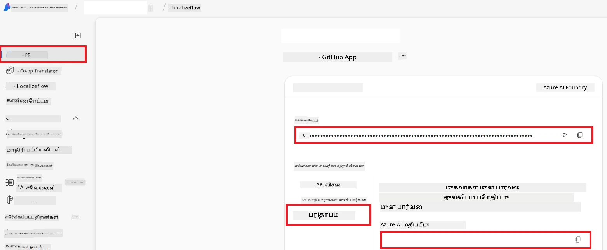

# Co-op Translator க்கான Azure AI அமைக்கவும் (Azure OpneAI & Azure AI Vision)

இந்த வழிகாட்டி Azure AI Foundry உள்ளே மொழிபெயர்க்க Azure OpenAI மற்றும் பட உள்ளடக்கத்தைக் கண்டு பிடிக்க Azure Computer Vision (பின்னர் பட அடிப்படையிலான மொழிபெயர்ப்பு үшін பயன்படுத்தக்கூடியது) அமைப்பதை வழிநடத்துகிறது.

**முந்திய தேவைகள்:**
- செயற்பாட்டில் உள்ள சந்தா கொண்ட Azure கணக்கு.
- உங்கள் Azure சந்தாவில் வளங்கள் மற்றும் வினியோகங்களை உருவாக்க போதுமான அனுமதிகள்.

## Azure AI திட்டத்தை உருவாக்கவும்

உங்கள் AI வளங்களை பராமரிக்க மைய இடமாக செயல்படும் Azure AI திட்டத்தை நீங்கள் முதலில் உருவாக்குவீர்கள்.

1. [https://ai.azure.com](https://ai.azure.com) என்ற முகவரிக்கு சென்று உங்கள் Azure கணக்குடன் உள்நுழைக.

1. புதிய திட்டம் உருவாக்க **+Create** என்பதை தேர்ந்தெடுக்கவும்.

1. பின்வரும் பணிகளை செய்யவும்:
   - **திட்டப் பெயர்** உள்ளிடுக (உதா., `CoopTranslator-Project`).
   - **AI hub** ஐ தேர்ந்தெடுக்க (உதா., `CoopTranslator-Hub`) (தேவையானால் புதியதை உருவாக்கவும்).

1. உங்கள் திட்டத்தை அமைக்க "**Review and Create**" கிளிக் செய்க. உங்களை உங்கள் திட்டத்தின் அவலோக்கத்துக்குச் (overview page) கொண்டு செல்லப்படும்.

## மொழிபெயர்ப்பிற்கு Azure OpenAI ஐ அமைக்கவும்

உங்கள் திட்டத்தில், உரை மொழிபெயர்ப்பிற்கான பின்தளமாக செயல்பட Azure OpenAI மாதிரியை நீங்கள் வினியோகிக்கலாம்.

### உங்கள் திட்டத்திற்கு செல்லவும்

இரவுசெய்யப்படவில்லையெனில், உங்கள் புதிய உருவாக்கிய திட்டத்தை (உதா., `CoopTranslator-Project`) Azure AI Foundry இல் திறக்கவும்.

### OpenAI மாதிரியை வினியோகிக்கவும்

1. உங்கள் திட்டத்தின் இடது பக்க மெனுவில் "My assets" கீழ் "**Models + endpoints**" ஐ தேர்ந்தெடுக்கவும்.

1. **+ Deploy model** ஐ தேர்ந்தெடுக்கவும்.

1. **Deploy Base Model** ஐ தேர்ந்தெடுக்கவும்.

1. கிடைக்கும் மாதிரிகளின் பட்டியல் தோன்றும். பொருத்தமான GPT மாதிரியைத் தேடவும் அல்லது வடிகட்டி இடவும். நாங்கள் பரிந்துரைக்கும் மாதிரி `gpt-4o`.

1. உங்கள் விருப்ப மாதிரியை தேர்ந்தெடுத்து **Confirm** ஐ கிளிக் செய்க.

1. **Deploy** ஐ தேர்ந்தெடுக்கவும்.

### Azure OpenAI கான்பிகரேஷன்

வினியோகிக்கப்பட்ட பிறகு, "**Models + endpoints**" பக்கத்தில் உங்கள் வினியோகத்தை தேர்ந்தெடுத்து அவற்றின் **REST endpoint URL**, **Key**, **Deployment name**, **Model name** மற்றும் **API version** ஐ காணலாம். இவை உங்கள் பயன்பாட்டில் மொழிபெயர்ப்பு மாதிரியை இணைக்கும் போது தேவையாகும்.

> [!NOTE]
> உங்கள் தேவைகளின் அடிப்படையில் [API version deprecation](https://learn.microsoft.com/azure/ai-services/openai/api-version-deprecation) பக்கத்திலிருந்து API பதிப்புகளைத் தேர்ந்தெடுக்க முடியும். **API version** Azure AI Foundry இல் **Models + endpoints** பக்கத்தில் காணப்படும் **Model version** க்குச் வேறுபடுகிறது என்பதை கவனிக்கவும்.

## பட மொழிபெயர்ப்பிற்க Azure Computer Vision ஐ அமைக்கவும்

படங்களில் உள்ள உரையை மொழிபெயர்க்க, Azure AI Service API Key மற்றும் Endpoint ஐ நீங்கள் பெற்றுக்கொள்ள வேண்டும்.

1. உங்கள் Azure AI திட்டத்திற்கு செல்லவும் (உதா., `CoopTranslator-Project`). திட்ட அவலோக்கப் பக்கத்தில் இருப்பதை உறுதிப்படுத்தவும்.

### Azure AI சேவை அமைப்புகள்

Azure AI சேவை தாவலைப் பயன்படுத்தி API Key மற்றும் Endpoint ஐப் பெறவும்.

1. உங்கள் Azure AI திட்டத்திற்குச் செல்லவும் (உதா., `CoopTranslator-Project`). திட்ட அவலோக்கப் பக்கத்தில் இருப்பதை உறுதிப்படுத்தவும்.

1. Azure AI சேவை தாவலில் இருந்து **API Key** மற்றும் **Endpoint** ஐ கண்டறியவும்.

    

இந்த இணைப்புச் சேதுரிவிக்கும் Azure AI சேவைகள் வளத்தின் (படக் கண்டு பிடிப்பும் உட்பட) திறன்களை உங்கள் AI Foundry திட்டத்திற்கு வழங்குகிறது. பின்னர், நீங்கள் உங்கள் நோட்ட்புக் அல்லது பயன்பாடுகளில் இதைப் பயன்படுத்தி படங்களில் இருந்து உரையை எடுக்கலாம், அதைத் தொடர்ந்து மொழிபெயர்க்க Azure OpenAI மாதிரிக்கு அனுப்ப முடியும்.

## உங்கள் சான்றுகளை ஒருங்கிணைத்தல்

இப்போது, நீங்கள் பின்வரும் தகவல்களை சேகரித்திருக்க வேண்டும்:

**Azure OpenAI (உரை மொழிபெயர்ப்பு) க்கான:**
- Azure OpenAI Endpoint
- Azure OpenAI API Key
- Azure OpenAI மாதிரி பெயர் (உதா., `gpt-4o`)
- Azure OpenAI வினியோக பெயர் (உதா., `cooptranslator-gpt4o`)
- Azure OpenAI API பதிப்பு

**Azure AI சேவைகள் (Vision மூலம் படத்தில் உள்ள உரை எடுப்பிற்கு) க்கான:**
- Azure AI சேவை Endpoint
- Azure AI சேவை API Key

### உதாரணம்: சூழல் மாறி அமைப்புகள் (முன்நோக்கு)

பிறகு நீங்கள் உங்கள் பயன்பாட்டை உருவாக்கும்போது, சேகரிக்கப்பட்ட இந்த சான்றுகளைப் பயன்படுத்தி அதைச் சில சூழல் மாறிகளாக அமைக்கலாம்.

```bash
# Azure AI சேவை அங்கீகாரங்கள் (பட மொழிபெயர்ப்புக்கு அவசியம்)
AZURE_AI_SERVICE_API_KEY="your_azure_ai_service_api_key" # உதா., 21xasd...
AZURE_AI_SERVICE_ENDPOINT="https://your_azure_ai_service_endpoint.cognitiveservices.azure.com/"

# விருப்பமான மாற்றுக்கருத்து தொகுப்புகள்: _1/_2 suffix உடன் மாறிலிகள் நகல் (அனைத்து மாறிலிகளுக்கும் ஒரே வரிசை)
AZURE_AI_SERVICE_API_KEY_1="your_azure_ai_service_api_key_1"
AZURE_AI_SERVICE_ENDPOINT_1="https://your_azure_ai_service_endpoint_1.cognitiveservices.azure.com/"

# Azure OpenAI அங்கீகாரங்கள் (உரை மொழிபெயர்ப்புக்கு அவசியம்)
AZURE_OPENAI_API_KEY="your_azure_openai_api_key" # உதா., 21xasd...
AZURE_OPENAI_ENDPOINT="https://your_azure_openai_endpoint.openai.azure.com/"
AZURE_OPENAI_MODEL_NAME="your_model_name" # உதா., gpt-4o
AZURE_OPENAI_CHAT_DEPLOYMENT_NAME="your_deployment_name" # உதா., cooptranslator-gpt4o
AZURE_OPENAI_API_VERSION="your_api_version" # உதா., 2024-12-01-preview

# விருப்பமான மாற்றுக்கருத்து தொகுப்புகள்: முழு AZURE_OPENAI_* தொகுப்பை _1/_2 suffix உடன் நகல் (அனைத்து மாறிலிகளுக்கும் ஒரே வரிசை)
```

---

### மேலும் படிக்க

- [Azure AI Foundry இல் திட்டம் உருவாக்குவது எப்படி](https://learn.microsoft.com/azure/ai-foundry/how-to/create-projects?tabs=ai-studio)
- [Azure AI வளங்களை உருவாக்குவது எப்படி](https://learn.microsoft.com/azure/ai-foundry/how-to/create-azure-ai-resource?tabs=portal)
- [Azure AI Foundry இல் OpenAI மாதிரிகளை வினியோகிப்பது எப்படி](https://learn.microsoft.com/en-us/azure/ai-foundry/how-to/deploy-models-openai)

---

<!-- CO-OP TRANSLATOR DISCLAIMER START -->
**பிரதிபாதிப்பு**:  
இந்த ஆவணம் [Co-op Translator](https://github.com/Azure/co-op-translator) என்ற AI மொழிபெயர்ப்பு சேவையை பயன்படுத்தி மொழிபெயர்க்கப்பட்டுள்ளது. நாங்கள் துல்லியத்திற்காக முயற்சிக்கிறோம் என்றாலும், தானியங்கி மொழிபெயர்ப்புகளில் பிழைகள் அல்லது தவறுகள் இருக்கலாம் என்பதைக் கவனத்தில் கொள்ளவும். அசல் ஆவணம் அதன் இயற்பெயரில் உள்ள மொழியிலேயே அதிகாரப்பூர்வ ஆதாரமாக கருதப்பட வேண்டும். முக்கியமான தகவல்களுக்கு, தொழில்முறை மனித மொழிபெயர்ப்பு பரிந்துரைக்கப்படுகிறது. இந்த மொழிபெயர்ப்பின் பயன்பாட்டில் ஏற்படும் எந்தவொரு தவறான புரிதலுக்கும் அல்லது தவறான விளக்கங்களுக்கு நாங்கள் பொறுப்பேற்கவில்லை.
<!-- CO-OP TRANSLATOR DISCLAIMER END -->