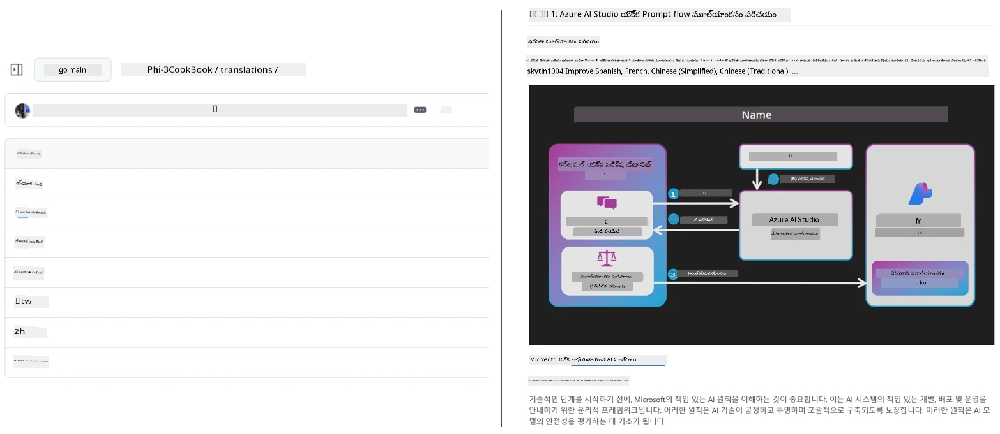
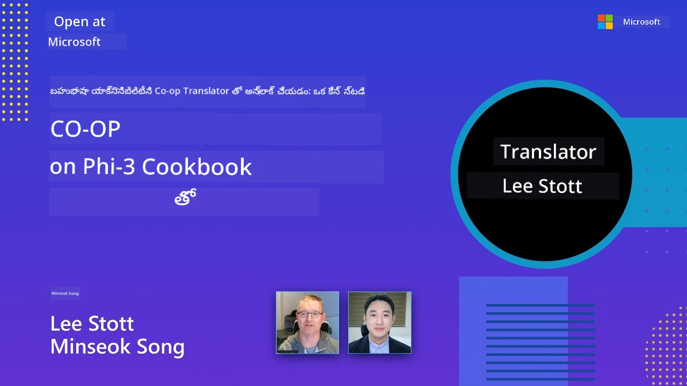

# Co-op Translator

_మీ విద్యా GitHub కంటెంట్ అనువాదాలను అనేక భాషల్లో సులభంగా ఆటోమేట్ చేసి, మీ ప్రాజెక్ట్ అభివృద్ధి క్రమంలో పరిపాలించండి._


[](https://pypi.org/project/co-op-translator/)
[](https://github.com/azure/co-op-translator/blob/main/LICENSE)
[](https://pepy.tech/project/co-op-translator)
[](https://pepy.tech/project/co-op-translator)
[](https://github.com/azure/co-op-translator/pkgs/container/co-op-translator)
[](https://github.com/psf/black)

[](https://GitHub.com/azure/co-op-translator/graphs/contributors/)
[](https://GitHub.com/azure/co-op-translator/issues/)
[](https://GitHub.com/azure/co-op-translator/pulls/)
[](http://makeapullrequest.com)

### 🌐 బహుభాషా మద్దతు

#### [Co-op Translator](https://github.com/Azure/Co-op-Translator) ద్వారా మద్దతు

<!-- CO-OP TRANSLATOR LANGUAGES TABLE START -->
[Arabic](../ar/README.md) | [Bengali](../bn/README.md) | [Bulgarian](../bg/README.md) | [Burmese (Myanmar)](../my/README.md) | [Chinese (Simplified)](../zh-CN/README.md) | [Chinese (Traditional, Hong Kong)](../zh-HK/README.md) | [Chinese (Traditional, Macau)](../zh-MO/README.md) | [Chinese (Traditional, Taiwan)](../zh-TW/README.md) | [Croatian](../hr/README.md) | [Czech](../cs/README.md) | [Danish](../da/README.md) | [Dutch](../nl/README.md) | [Estonian](../et/README.md) | [Finnish](../fi/README.md) | [French](../fr/README.md) | [German](../de/README.md) | [Greek](../el/README.md) | [Hebrew](../he/README.md) | [Hindi](../hi/README.md) | [Hungarian](../hu/README.md) | [Indonesian](../id/README.md) | [Italian](../it/README.md) | [Japanese](../ja/README.md) | [Kannada](../kn/README.md) | [Khmer](../km/README.md) | [Korean](../ko/README.md) | [Lithuanian](../lt/README.md) | [Malay](../ms/README.md) | [Malayalam](../ml/README.md) | [Marathi](../mr/README.md) | [Nepali](../ne/README.md) | [Nigerian Pidgin](../pcm/README.md) | [Norwegian](../no/README.md) | [Persian (Farsi)](../fa/README.md) | [Polish](../pl/README.md) | [Portuguese (Brazil)](../pt-BR/README.md) | [Portuguese (Portugal)](../pt-PT/README.md) | [Punjabi (Gurmukhi)](../pa/README.md) | [Romanian](../ro/README.md) | [Russian](../ru/README.md) | [Serbian (Cyrillic)](../sr/README.md) | [Slovak](../sk/README.md) | [Slovenian](../sl/README.md) | [Spanish](../es/README.md) | [Swahili](../sw/README.md) | [Swedish](../sv/README.md) | [Tagalog (Filipino)](../tl/README.md) | [Tamil](../ta/README.md) | [Telugu](./README.md) | [Thai](../th/README.md) | [Turkish](../tr/README.md) | [Ukrainian](../uk/README.md) | [Urdu](../ur/README.md) | [Vietnamese](../vi/README.md)

> **లోకల్ క్లోన్ చేయాలనుకుంటున్నారా?**
>
> ఈ రిపోజిటరీ 50+ భాషా అనువాదాలను కలిగి ఉంటుంది, ఇది డౌన్లోడ్ పరిమాణాన్ని గణనీయంగా పెంచుతుంది. అనువాదాలు లేకుండా క్లోన్ చేయడానికి, స్పార్స్ చెకౌట్ను ఉపయోగించండి:
>
> **Bash / macOS / Linux:**
> ```bash
> git clone --filter=blob:none --sparse https://github.com/Azure/co-op-translator.git
> cd co-op-translator
> git sparse-checkout set --no-cone '/*' '!translations' '!translated_images'
> ```
>
> **CMD (Windows):**
> ```cmd
> git clone --filter=blob:none --sparse https://github.com/Azure/co-op-translator.git
> cd co-op-translator
> git sparse-checkout set --no-cone "/*" "!translations" "!translated_images"
> ```
>
> ఇది కోర్సును పూర్తిచేసేందుకు కావలసిన దానిటన్ని తక్కువ సమయ డౌన్లోడ్‌తో ఇస్తుంది.
<!-- CO-OP TRANSLATOR LANGUAGES TABLE END -->

[](https://GitHub.com/azure/co-op-translator/watchers/)
[](https://GitHub.com/azure/co-op-translator/network/)
[](https://GitHub.com/azure/co-op-translator/stargazers/)

[](https://discord.gg/nTYy5BXMWG)

[](https://codespaces.new/azure/co-op-translator)

## అవలోకనం

**Co-op Translator** మీ విద్యా GitHub కంటెంట్‌ను అనేక భాషల్లో సులభంగా స్థానీకరించడంలో సహాయపడుతుంది.  
మీ Markdown ఫైళ్ళు, చిత్రాలు లేదా నోట్‌బుక్లు నవీకరించినప్పుడు, అనువాదాలు ఆటోమేటిక్‌గా సమకాలీకృతమవుతాయి, ప్రపంచవ్యాప్తంగా విద్యార్థులకు సరిగ్గా మరియు నవీకరించిన కంటెంట్ అందిస్తుంది.

అనువాదం కలిగిన కంటెంట్ ఎలా క్రమబద్ధీకృతమవుతుందో ఉదాహరణ:



## అనువాద స్థితి ఎలా నిర్వహించబడుతుంది

Co-op Translator అనువాదం గల కంటెంట్ను **వర్షన్ చేయబడిన సాఫ్ట్‌వేర్ ఆర్టిఫాక్ట్స్**గా నిర్వహిస్తుంది,  
నిలిచిన ఫైళ్లుగా కాదు.

ఈ టూల్ అనువాదం గల Markdown, చిత్రాలు, నోట్‌బుక్ల స్థితిని  
**భాష-పరిధి మెటాడేటా** ఉపయోగించి ట్రాక్ చేస్తుంది.

ఈ డిజైన్ తో Co-op Translator:

- పాడయిన అనువాదాలను విశ్వసనీయంగా గుర్తిస్తుంది  
- Markdown, చిత్రాలు మరియు నోట్‌బుక్లను సారూప్యంగా వ్యవహరిస్తుంది  
- పెద్ద, వేగంగా మారుతున్న బహుభాష రిపాజిటరీలను సురక్షితంగా విస్తరించగలదు

అనువాదాలను నిర్వహిత ఆర్టిఫాక్ట్స్ గా మోడలింగ్ చేయడం ద్వారా,  
అనువాద వర్క్‌ఫ్లోలు ఆధునిక సాఫ్ట్‌వేర్ డిపెండెన్సీ మరియు ఆర్టిఫాక్ట్ నిర్వహణ పద్ధతులకు సరిపోయేలా ఏర్పడతాయి.

→ [అనువాద స్థితి ఎలా నిర్వహించబడుతుంది](https://techcommunity.microsoft.com/blog/azuredevcommunityblog/rethinking-documentation-translation-treating-translations-as-versioned-software/4491755)


## త్వరిత ప్రారంభం

```bash
# వర్చువల్ ఎన్విరాన్మెంట్ సృష్టించి యాక్టివేట్ చేయండి (సిఫార్సు చేయబడింది)
python -m venv .venv
# విండోస్
.venv\Scripts\activate
# మాక్OS/లినక్స్
source .venv/bin/activate
# ప్యాకేజీని ఇన్‌స్టాల్ చేయండి
pip install co-op-translator
# అనువదించండి
translate -l "ko ja fr" -md
```

డాకర్:

```bash
# GHCR నుండి సార్వజన ఇమేజ్‌ని తీసుకోండి
docker pull ghcr.io/azure/co-op-translator:latest
# ప్రస్తుత ఫోల్డర్ మౌంట్ చేసి .env ను అందిస్తున్నప్పుడు 실행ించండి (Bash/Zsh)
docker run --rm -it --env-file .env -v "${PWD}:/work" ghcr.io/azure/co-op-translator:latest -l "ko ja fr" -md
```

## కనిష్ట సెటప్

1. మీ వద్ద మద్దతు లభించే Python వెర్షన్ ఉందని నిర్ధారించుకోండి (ప్రస్తుతం 3.10-3.12). poetry (pyproject.toml) లో ఇది ఆటోమేటిక్‌గా హ్యాండిల్ అవుతుంది.  
2. టెంప్లేట్ ఉపయోగించి `.env` ఫైల్ సృష్టించండి: [.env.template](../../.env.template)  
3. ఒక LLM ప్రొవైడర్ (Azure OpenAI లేదా OpenAI) సెట్ చేయండి  
4. (ఐచ్ఛికం) చిత్రం అనువాదం కోసం (`-img`), Azure AI Vision ను సెటప్ చేయండి  
5. (ఐచ్ఛికం) ప్రతి సెట్ లో ఉదాహరణకి `_1`, `_2` వంటి సఫిక్సులతో వేరియబుల్స్ డూప్లికేట్ చేసి, బహుళ క్రెడెన్‌షియల్ సెట్లు సెటప్ చేయవచ్చు. ఒక సెట్లోని అన్ని వేరియబుల్స్ ఈ సఫిక్స్ ని పంచుకోవాలి.  
6. (ఉప ప్రసంసనీయ) పూర్వ అనువాదాలను వివాదాలు నివారించేందుకు క్లియర్ చేయండి (ఉదా: `translations/`)  
7. (ఉప ప్రసంసనీయ) README లో అనువాద విభాగాన్ని జోడించండి, [README భాషల టెంప్లేటు](./getting_started/README_languages_template.md) ఉపయోగించి  
8. చూడండి: [Azure AI సెటప్](./getting_started/set-up-azure-ai.md)

## వినియోగం

అన్ని మద్దతు వస్తువులను అనువదించండి:

```bash
translate -l "ko ja"
```

Markdown మాత్రమే:

```bash
translate -l "de" -md
```

Markdown + చిత్రాలు:

```bash
translate -l "pt" -md -img
```

నోట్‌బుక్స్ మాత్రమే:

```bash
translate -l "zh" -nb
```

ఇంకా旗ʾలు: [కమాండ్ రిఫరెన్స్](./getting_started/command-reference.md)

## లక్షణాలు

- Markdown, నోట్‌బుక్స్, చిత్రాల కోసం ఆటోమేటెడ్ అనువాదం  
- మూల మార్పులతో అనువాదాలను సమకాలీకరిస్తుంది  
- లోకల్ (CLI) లేదా CI (GitHub Actions) లో పనిచేస్తుంది  
- Azure OpenAI లేదా OpenAI ఉపయోగిస్తుంది; చిత్రాలకు ఐచ్ఛిక Azure AI Vision ఉపయోగం  
- Markdown ఫార్మాటింగ్ మరియు నిర్మాణం కాపాడు౦ది

## డాక్స్

- [కమాండ్-లైన్ గైడ్](./getting_started/command-line-guide/command-line-guide.md)
- [GitHub Actions గైడ్ (పబ్లిక్ రిపాజిటరీలు & సాధారణ సీక్రెట్స్)](./getting_started/github-actions-guide/github-actions-guide-public.md)
- [GitHub Actions గైడ్ (Microsoft సంస్థ రిపాజిటరీలు & ఆర్గ్-లెవల్ సెటప్స్)](./getting_started/github-actions-guide/github-actions-guide-org.md)
- [README భాషల టెంప్లేటు](./getting_started/README_languages_template.md)
- [మద్దతు లభించే భాషలు](./getting_started/supported-languages.md)
- [కాన్ట్రిబ్యూటింగ్](./CONTRIBUTING.md)
- [ట్రబ్బుల్శూటింగ్](./getting_started/troubleshooting.md)

### Microsoft-స్పెసిఫిక్ గైడ్
> [!NOTE]
> Microsoft "For Beginners" రిపాజిటరీల నిర్వాహకులకు మాత్రమే.

- [“ఇతర కోర్సులు” జాబితాను నవీకరించడం (MS Beginners రిపాజిటరీలకే)](./getting_started/update-other-courses.md)

## మమ్మల్ని చూడండి మరియు గ్లోబల్ విద్యను ప్రోత్సహించండి

విద్యా కంటెంట్ ప్రపంచవ్యాప్తంగా ఎలా పంచబడుతుందో విప్లవాత్మకంగా మార్చడానికి మాతో చేరండి! [Co-op Translator](https://github.com/azure/co-op-translator) గithub లో⭐ ఇవ్వండి మరియు నేర్చుకునే భాషా అడ్డంకులను తొలగించే మా లక్ష్యాన్ని మద్దతు చేయండి. మీ ఆసక్తి మరియు కాంతి చాలా ప్రభావం చూపిస్తుంది! కోడ్ కాంట్రిబ్యూషన్లు మరియు ఫీచర్ సూచనలు ఎప్పుడూ స్వాగతం.

### Microsoft విద్యా కంటెంట్ మీ భాషలో అన్వేషించండి

- [LangChain4j-for-Beginners](https://github.com/microsoft/LangChain4j-for-Beginners)
- [AZD for Beginners](https://github.com/microsoft/AZD-for-beginners)
- [Edge AI for Beginners](https://github.com/microsoft/edgeai-for-beginners)
- [Model Context Protocol (MCP) For Beginners](https://github.com/microsoft/mcp-for-beginners)
- [AI Agents for Beginners](https://github.com/microsoft/ai-agents-for-beginners)
- [Generative AI for Beginners using .NET](https://github.com/microsoft/Generative-AI-for-beginners-dotnet)
- [Generative AI for Beginners](https://github.com/microsoft/generative-ai-for-beginners)
- [Generative AI for Beginners using Java](https://github.com/microsoft/generative-ai-for-beginners-java)
- [ML for Beginners](https://aka.ms/ml-beginners)
- [Data Science for Beginners](https://aka.ms/datascience-beginners)
- [AI for Beginners](https://aka.ms/ai-beginners)
- [Cybersecurity for Beginners](https://github.com/microsoft/Security-101)
- [Web Dev for Beginners](https://aka.ms/webdev-beginners)
- [IoT for Beginners](https://aka.ms/iot-beginners)
- [PhiCookBook](https://github.com/microsoft/PhiCookBook)

## వీడియో ప్రదర్శనలు

👉 YouTube లో చూడడానికి క్రింది చిత్రాన్ని క్లిక్ చేయండి.

- **Open at Microsoft**: Co-op Translator ఎలా ఉపయోగించాలో 18 నిమిషాల సంక్షిప్త పరిచయం మరియు త్వ‌రిత గైడ్.

  [](https://www.youtube.com/watch?v=jX_swfH_KNU)

## కాంట్రిబ్యూషన్లు

ఈ ప్రాజెక్ట్ కాంట్రిబ్యూషన్‌లు మరియు సూచనలను స్వాగతిస్తుంది. Azure Co-op Translator కు కాంట్రిబ్యూట్ చేయాలనుకుంటే దయచేసి మా [CONTRIBUTING.md](./CONTRIBUTING.md) ను చూడండి, మీరు Co-op Translator ను మరింత అందుబాటులోకి తెచ్చేందుకు ఎలా సహాయపడవచ్చో గైడ్ అందించబడింది.

## కాంట్రిబ్యూటర్లు
[](https://github.com/Azure/co-op-translator/graphs/contributors)

## ప్రవర్తనా నియమాలు

ఈ ప్రాజెక్టు [Microsoft Open Source Code of Conduct](https://opensource.microsoft.com/codeofconduct/) ను అవలంబించింది.
మరిన్ని వివరాలకు [Code of Conduct FAQ](https://opensource.microsoft.com/codeofconduct/faq/) చూడండి లేదా 
ఏమైనా అదనపు ప్రశ్నలు లేదా అభిప్రాయాల కోసం [opencode@microsoft.com](mailto:opencode@microsoft.com) కి సంప్రదించండి.

## బాధ్యతాయుత AI

Microsoft మా కస్టమర్లకు మా AI ఉత్పత్తులను బాధ్యతాయుతంగా ఉపయోగించేందుకు సహాయపడటానికి, మా నేర్పులను పంచుకోవడంలో, Transparency Notes మరియు Impact Assessments లాంటి సాధనాల ద్వారా నమ్మకాన్ని పెంపొందించే భాగస్వామ్యాలను నిర్మించడంలో కట్టుబడి ఉంది. ఈ వనరులలో చాలావి [https://aka.ms/RAI](https://aka.ms/RAI) వద్ద అందుబాటులో ఉన్నాయి.
Microsoft యొక్క బాధ్యతాయుత AI దృష్టिकोణం న్యాయం, నమ్మకమైనత తత్వాలు, భద్రత, గోప్యత మరియు భద్రత, అందరికీ అందుబాటులో ఉండడం, పారదర్శకత మరియు బాధ్యతపై ఆధారపడింది.

బిరుదు-పొందిన ప్రకృతిభాష, చిత్రం మరియు ప్రసంగ మోడళ్ళు - ఈ నమూనాలో ఉపయోగించినవంటివి - అన్యాయమైన, నమ్మకంగా లేనివి లేదా దుష్ప్రభావాలు కలిగించే విధంగా ప్రవర్తించవచ్చు, దీనివల్ల హాని జరుగుతుంది. దయచేసి ప్రమాదాలు మరియు పరిమితులు గురించి సమాచారం కోసం [Azure OpenAI service Transparency note](https://learn.microsoft.com/legal/cognitive-services/openai/transparency-note?tabs=text) ని పరిశీలించండి.

ఈ ప్రమాదాలను తగ్గించేందుకు సిఫార్సు చేయబడిన విధానం మీ ఆర్కిటెక్చర్‌లో ఒక భద్రతా వ్యవస్థను చేర్చడం, దుర్గత ప్రవర్తనను గుర్తించి అడ్డుకునే విధంగా ఉండటం. [Azure AI Content Safety](https://learn.microsoft.com/azure/ai-services/content-safety/overview) ఒక స్వతంత్ర రక్షణ స్థానాన్ని అందిస్తుంది, అప్లికేషన్లు మరియు సేవల్లో హానికరంగా ఉన్న వినియోగదారు సృష్టించిన మరియు AI సృష్టించిన కంటెంట్‌ను గుర్తించగలదు. Azure AI Content Safetyలో హానికరమైన పదాలు మరియు చిత్రాలకు సంబంధించిన APIలూ ఉన్నాయి, ఇవి హానికర పదార్థాన్ని గుర్తించడానికి అనుమతిస్తాయి. మేము ఒక ఇంటరాక్టివ్ Content Safety Studio కూడా కలిగి ఉన్నాము, ఇది మీరు హానికరమైన కంటెంట్‌ను వివిధ మోడాలిటీలలో గుర్తించేందుకు నమూనా కోడ్‌ను వీక్షించటానికి, అన్వేషించడానికి మరియు ప్రయత్నించడానికి అనుమతిస్తుంది. క్రింది [quickstart డొక్కుమెంటేషన్](https://learn.microsoft.com/azure/ai-services/content-safety/quickstart-text?tabs=visual-studio%2Clinux&pivots=programming-language-rest) సేవకు అభ్యర్థనలు పంపడంలో 안내 చేస్తుంది.

మరొక అంశం మొత్తం అప్లికేషన్ పనితీరు. బహుముఖ మరియు బహుమోడల్ అప్లికేషన్లలో, వ్యవస్థ మీరు మరియు మీ వినియోగదారులు ఆశించే విధంగా పని చేయడం అనేది పనితీరుని సూచిస్తుంది, హానికర అవుట్పుట్స్ సృష్టించకుండా ఉండటం సహా. మీ మొత్తం అప్లికేషన్ పనితీరును [generation quality and risk and safety metrics](https://learn.microsoft.com/azure/ai-studio/concepts/evaluation-metrics-built-in) ఉపయోగించి అంచనా వేయడం ముఖ్యమైంది.

మీ AI అప్లికేషన్‌ను అభివృద్ధి పర్యావరణంలో [prompt flow SDK](https://microsoft.github.io/promptflow/index.html) ఉపయోగించి మూల్యాంకనం చేయవచ్చు. ఒక పరీక్షా డేటాసెట్ లేదా ఒక లక్ష్యంతో, మీ సృష్టించబడిన AI అప్లికేషన్ యొక్క తరం సంఖ్యలను నాణ్యతపూర్వకంగా రంగ గతులు లేదా మీ ఇష్టానికి అనుగుణంగా అనుకూల రంగ గతులు ఉపయోగించి కొలవబడతాయి. prompt flow sdk తో మీ వ్యవస్థను మూల్యాంకనం చేయడం ప్రారంభించేందుకు, మీరు [quickstart గైడ్](https://learn.microsoft.com/azure/ai-studio/how-to/develop/flow-evaluate-sdk) ను అనుసరించవచ్చు. ఒకసారి మీరు మూల్యాంకన రన్‌ను అమలు చేయగానే, మీరు [Azure AI Studio లో ఫలితాలను వీక్షించవచ్చు](https://learn.microsoft.com/azure/ai-studio/how-to/evaluate-flow-results).

## ట్రేడ్మార్కులు

ఈ ప్రాజెక్టులో ప్రాజెక్టులు, ఉత్పత్తులు లేదా సేవలకు సంబంధించిన ట్రేడ్మార్కులు లేదా లోగోలు ఉండవచ్చు. Microsoft ట్రేడ్మార్కులు లేదా లోగోల అధికారిక వాడకాలు [Microsoft's Trademark & Brand Guidelines](https://www.microsoft.com/en-us/legal/intellectualproperty/trademarks/usage/general) ను అనుసరించాలి.
Microsoft ట్రేడ్మార్కులు లేదా లోగోల మోడిఫై చేసిన సంస్కరణలలో వాడకాలు Microsoft ప్రాయోజకత్వం ఉన్నట్టు గందరగోళం సృష్టించకూడదు లేదా సూచించకూడదు.
మూడు పక్షాల ట్రేడ్మార్కులు లేదా లోగోల వాడకాలు ఆయా పక్షాల విధానాలకు లోబడి ఉంటాయి.

## సహాయం పొందడం

మీరు చిక్కుకున్నట్లయితే లేదా AI యాప్స్ నిర్మాణం గురించి ఏవైనా ప్రశ్నలు ఉంటే, జాయిన్ అవ్వండి:

[](https://discord.gg/nTYy5BXMWG)

ఉత్పత్తి అభిప్రాయం లేదా నిర్మాణ సమయంలో తప్పిదాలు ఉంటే సందర్శించండి:

[](https://aka.ms/foundry/forum)

---

<!-- CO-OP TRANSLATOR DISCLAIMER START -->
**డిస్క్లైమర్**:  
ఈ డాక్యుమెంట్‌ను AI అనువాద సేవ [Co-op Translator](https://github.com/Azure/co-op-translator) ఉపయోగించి అనువదించాము. మేము సరిగా ఉండేందుకు ప్రయత్నిస్తున్నప్పటికీ, ఆటోమేటెడ్ అనువాదాల్లో పొరపాట్లు లేదా తప్పులు ఉండవచ్చు. అసలైన పాఠ్యం మూల భాషలో అధికారం కలిగినది అని పరిగణించాలి. కీలకమైన సమాచారానికి, వృత్తిపరమైన మానవ అనువాదాన్ని సూచించబడుతుంది. ఈ అనువాదం వలన సంభవించే ఏవైనా గందరగోళాలు లేదా అవగాహన లోపాలకు మేము బాధ్యత వహించము.
<!-- CO-OP TRANSLATOR DISCLAIMER END -->