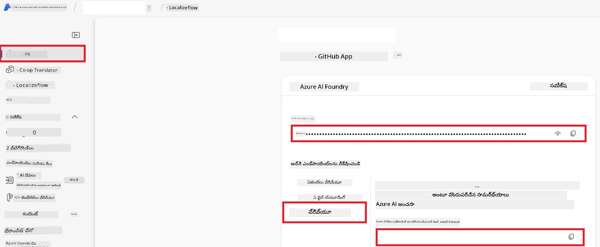

# Co-op Translator కోసం Azure AI సెట్ చేయడం (Azure OpenAI & Azure AI Vision)

ఈ గైడ్ లో, మీరు Azure AI Foundry లో భాషా అనువాదం కోసం Azure OpenAI మరియు చిత్రాధారిత అనువాదం కోసం Azure కంప్యూటర్ విజన్ ను ఎలా సెట్ చేయాలో తెలుసుకోబడుతుంది.

**అవసరమైన విషయాలు:**
- క్రియాశీల సబ్‌స్క్రిప్షన్ ఉన్న Azure ఖాతా.
- మీ Azure సబ్‌స్క్రిప్షన్ లో వనరులు మరియు డిప్లాయ్‌మెంట్‌లు సృష్టించడానికి సరిపడా అనుమతులు.

## Azure AI ప్రాజెక్ట్ సృష్టించండి

మీ AI వనరులను నిర్వహించడానికి ఒక కేంద్ర ప్రదేశంగా పని చేసే Azure AI ప్రాజెక్ట్‌ను మీరు మొదలు పెడతారు.

1. [https://ai.azure.com](https://ai.azure.com) కు వెళ్లి మీ Azure ఖాతాతో సైన్ ఇన్ అవ్వండి.

1. కొత్త ప్రాజెక్ట్ సృష్టించడానికి **+Create** ఎంచుకోండి.

1. ఈ క్రింది పనులు చేయండి:
   - ఒక **Project name** ఇవ్వండి (ఉదా., `CoopTranslator-Project`).
   - **AI hub** ఎంచుకోండి (ఉదా., `CoopTranslator-Hub`) (తాజాగా సృష్టించవచ్చు).

1. మీ ప్రాజెక్ట్ సెట్ చేయడానికి "**Review and Create**" పై క్లిక్ చేయండి. మీరు మీ ప్రాజెక్ట్ అవలోకన పేజీకి తీసుకుపోయేరు.

## భాషా అనువాదం కోసం Azure OpenAI సెట్ చేయండి

మీ ప్రాజెక్ట్‌లో, మీరు వచన అనువాదం కోసం బ్యాకెండ్‌గా పనిచేసే Azure OpenAI మోడల్‌ను డిప్లాయ్ చేస్తారు.

### మీ ప్రాజెక్ట్‌కు వెళ్లండి

ఇప్పటికీ లేకపోతే, కొత్తగా సృష్టించిన ప్రాజెక్ట్ (ఉదా., `CoopTranslator-Project`) ను Azure AI Foundry లో తెరవండి.

### OpenAI మోడల్‌ను డిప్లాయ్ చేయండి

1. మీ ప్రాజెక్ట్ ఎడమవైప్సారి గావా "My assets" కింద "**Models + endpoints**" ఎంచుకోండి.

1. **+ Deploy model** ఎంచుకోండి.

1. **Deploy Base Model** ఎంచుకోండి.

1. అందుబాటులో ఉన్న మోడల్స్ జాబితా చూపబడుతుంది. సరైన GPT మోడల్ కోసం ఫిల్టర్ లేదా శోధించండి. మేము `gpt-4o` మోడల్‌ను సూచిస్తున్నాము.

1. మీ ఇష్టం మేరకు మోడల్ ఎంచుకుని **Confirm** పై క్లిక్ చేయండి.

1. **Deploy** ఎంచుకోండి.

### Azure OpenAI కాన్ఫిగరేషన్

ఒకవేళ డిప్లాయ్ అయిన తర్వాత, మీరు "**Models + endpoints**" పేజీ నుండి డిప్లాయ్‌మెంట్ ఎంచుకుని దాని **REST endpoint URL**, **Key**, **Deployment name**, **Model name**, మరియు **API version** ను తెలుసుకోగలరు. ఇవి అనువాద మోడల్‌ను మీ అప్లికేషన్‌లో ఇంటిగ్రేట్ చేయడానికి అవసరం.

> [!NOTE]
> మీరు మీ అవసరాల మేరకు [API version deprecation](https://learn.microsoft.com/azure/ai-services/openai/api-version-deprecation) పేజీ నుండి API వర్షన్లను ఎంచుకోవచ్చు. గమనించండి, **API version** Azure AI Foundry లోని **Models + endpoints** పేజీలో చూపబడే **Model version** నుండి వేరుగా ఉంటుంది.

## చిత్రం అనువాదం కోసం Azure కంప్యూటర్ విజన్ సెట్ చేయండి

చిత్రాలలో వచనాన్ని అనువదించడానికి Azure AI Service API కీ మరియు ఎండ్‌పాయింట్‌ను కనుగొనాలి.

1. మీ Azure AI ప్రాజెక్ట్ (ఉదా., `CoopTranslator-Project`) కి వెళ్ళండి. ప్రాజెక్ట్ అవలోకన పేజీలో ఉండండి.

### Azure AI సర్వీస్ కాన్ఫిగరేషన్

Azure AI Service నుండి API కీ మరియు ఎండ్‌పాయింట్ కనుగొనండి.

1. మీ Azure AI ప్రాజెక్ట్ (ఉదా., `CoopTranslator-Project`) కి వెళ్ళండి. ప్రాజెక్ట్ అవలోకన పేజీలో ఉండండి.

1. Azure AI Service టాబ్ లోని **API Key** మరియు **Endpoint** కనుగొనండి.

    

ఈ కనెక్షన్ లింక్ చేసిన Azure AI సర్వీసుల వనరుల సామర్థ్యాలను (చిత్ర విశ్లేషణ తో సహా) మీ AI Foundry ప్రాజెక్ట్‌కు అందుబాటులో ఉంచుతుంది. తరువాత మీరు ఈ కనెక్షన్‌ను మీ నోట్బుక్స్ లేదా అప్లికేషన్లలో ఉపయోగించి చిత్రాల నుండి వచనాన్ని తీసుకుని Azure OpenAI మోడల్‌కు అనువాదం కోసం పంపవచ్చు.

## మీ ప్రమాణపత్రాలను సమాహరించడం

ఇప్పటివరకు, మీరు క్రిందివన్నీ సేకరించినట్లు ఉండాలి:

**Azure OpenAI కోసం (వచన అనువాదం):**
- Azure OpenAI ఎండ్‌పాయింట్
- Azure OpenAI API కీ
- Azure OpenAI మోడల్ పేరు (ఉదా., `gpt-4o`)
- Azure OpenAI డిప్లాయ్‌మెంట్ పేరు (ఉదా., `cooptranslator-gpt4o`)
- Azure OpenAI API వర్షన్

**Azure AI సర్వీసులకు (విజన్ ద్వారా చిత్రం వచనం తీసుకోవడం):**
- Azure AI సర్వీస్ ఎండ్‌పాయింట్
- Azure AI సర్వీస్ API కీ

### ఉదాహరణ: ఎన్విరాన్‌మెంట్ వేరియబుల్ కాన్ఫిగరేషన్ (ప్రివ్యూ)

తరువాత, మీ అప్లికేషన్ నిర్మిస్తున్నప్పుడు మీరు ఈ సేకరించిన ప్రమాణపత్రాలతో కాన్ఫిగర్ చేయవచ్చు. ఉదాహరణకు, మీరు వారిని ఎన్విరాన్‌మెంట్ వేరియబుల్స్‌గా ఇలా సెట్చేయవచ్చు:

```bash
# Azure AI సర్వీస్ క్రెడెన్షియల్స్ (ఇమేజ్ అనువాదానికి అవసరం)
AZURE_AI_SERVICE_API_KEY="your_azure_ai_service_api_key" # ఉదాహరణకు, 21xasd...
AZURE_AI_SERVICE_ENDPOINT="https://your_azure_ai_service_endpoint.cognitiveservices.azure.com/"

# ఐచ్ఛిక ఫాల్‌బ్యాక్ సెట్లు: _1/_2 సుఫిక్స్ ఉన్న డుప్లికేట్ వేరియబుల్స్ (సెట్లోని అన్ని వేరియబుల్స్‌కు అదే ఇండెక్స్)
AZURE_AI_SERVICE_API_KEY_1="your_azure_ai_service_api_key_1"
AZURE_AI_SERVICE_ENDPOINT_1="https://your_azure_ai_service_endpoint_1.cognitiveservices.azure.com/"

# Azure OpenAI క్రెడెన్షియల్స్ (టెక్స్ట్ అనువాదానికి అవసరం)
AZURE_OPENAI_API_KEY="your_azure_openai_api_key" # ఉదాహరణకు, 21xasd...
AZURE_OPENAI_ENDPOINT="https://your_azure_openai_endpoint.openai.azure.com/"
AZURE_OPENAI_MODEL_NAME="your_model_name" # ఉదాహరణకు, gpt-4o
AZURE_OPENAI_CHAT_DEPLOYMENT_NAME="your_deployment_name" # ఉదాహరణకు, cooptranslator-gpt4o
AZURE_OPENAI_API_VERSION="your_api_version" # ఉదాహరణకు, 2024-12-01-preview

# ఐచ్ఛిక ఫాల్‌బ్యాక్ సెట్లు: _1/_2 సుఫిక్స్‌తో AZURE_OPENAI_* సెట్‌ను పూర్తి డుప్లికేట్ చేయండి (అందరి వేరియబుల్స్‌కు అదే ఇండెక్స్)
```

---

### మరింత చదవడం

- [Azure AI Foundry లో ప్రాజెక్ట్ సృష్టించడం ఎలా](https://learn.microsoft.com/azure/ai-foundry/how-to/create-projects?tabs=ai-studio)
- [Azure AI వనరులు సృష్టించడం ఎలా](https://learn.microsoft.com/azure/ai-foundry/how-to/create-azure-ai-resource?tabs=portal)
- [Azure AI Foundry లో OpenAI మోడల్స్ డిప్లాయ్ చేయడం ఎలా](https://learn.microsoft.com/en-us/azure/ai-foundry/how-to/deploy-models-openai)

---

<!-- CO-OP TRANSLATOR DISCLAIMER START -->
**విడుదల నిర్ధారణ**:  
ఈ పత్రం AI అనువాద సేవ [Co-op Translator](https://github.com/Azure/co-op-translator) ఉపయోగించి అనువదించబడింది. మేము ఖచ్చితత్వాన్ని సాధించడానికి ప్రయత్నించినప్పటికీ, ఆటోమేటెడ్ అనువాదాల్లో పొరపాట్లు లేదా తప్పిదాలు ఉండవచ్చు అని దయచేసి గమనించండి. మొదలైన భాషలో ఉన్న మౌలిక పత్రమే అధికారిక ఆధారం గా తీసుకోవాలి. ముఖ్యమైన సమాచారం కోసం, నిపుణుల మానవ అనువాదం సిఫార్సు చేయబడుతుంది. ఈ అనువాదం వాడకంలో ఎటువంటి అవగాహన లోపాలు లేదా తప్పు అర్థం చేసుకోవడాలపై మేము బాధ్యత తీసుకోము.
<!-- CO-OP TRANSLATOR DISCLAIMER END -->