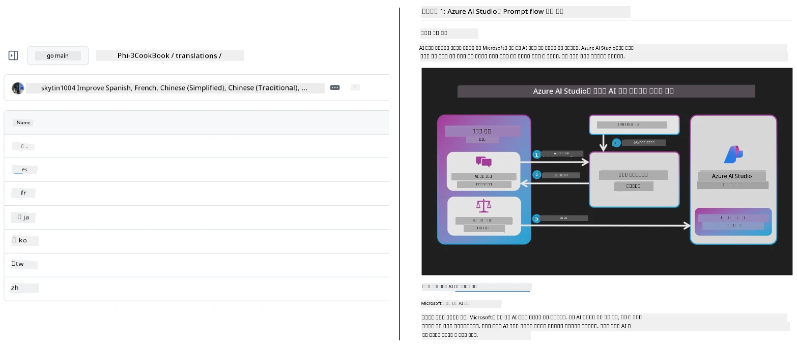
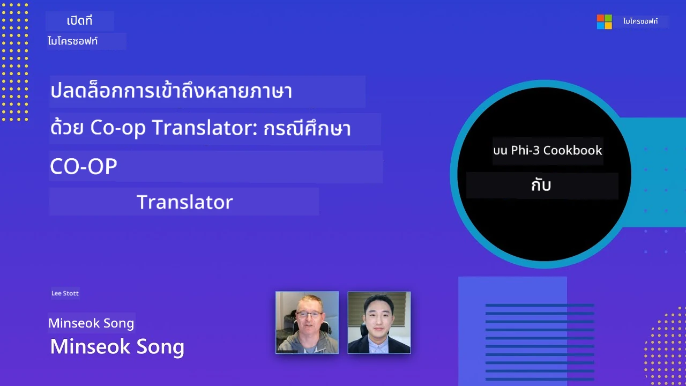

# Co-op Translator

_ช่วยให้คุณอัตโนมัติและดูแลการแปลเนื้อหาการศึกษาบน GitHub ของคุณในหลายภาษาอย่างง่ายดายเมื่อโปรเจกต์ของคุณพัฒนาไป_


[](https://pypi.org/project/co-op-translator/)
[](https://github.com/azure/co-op-translator/blob/main/LICENSE)
[](https://pepy.tech/project/co-op-translator)
[](https://pepy.tech/project/co-op-translator)
[](https://github.com/azure/co-op-translator/pkgs/container/co-op-translator)
[](https://github.com/psf/black)

[](https://GitHub.com/azure/co-op-translator/graphs/contributors/)
[](https://GitHub.com/azure/co-op-translator/issues/)
[](https://GitHub.com/azure/co-op-translator/pulls/)
[](http://makeapullrequest.com)

### 🌐 การสนับสนุนหลายภาษา

#### สนับสนุนโดย [Co-op Translator](https://github.com/Azure/Co-op-Translator)

<!-- CO-OP TRANSLATOR LANGUAGES TABLE START -->
[Arabic](../ar/README.md) | [Bengali](../bn/README.md) | [Bulgarian](../bg/README.md) | [Burmese (Myanmar)](../my/README.md) | [Chinese (Simplified)](../zh-CN/README.md) | [Chinese (Traditional, Hong Kong)](../zh-HK/README.md) | [Chinese (Traditional, Macau)](../zh-MO/README.md) | [Chinese (Traditional, Taiwan)](../zh-TW/README.md) | [Croatian](../hr/README.md) | [Czech](../cs/README.md) | [Danish](../da/README.md) | [Dutch](../nl/README.md) | [Estonian](../et/README.md) | [Finnish](../fi/README.md) | [French](../fr/README.md) | [German](../de/README.md) | [Greek](../el/README.md) | [Hebrew](../he/README.md) | [Hindi](../hi/README.md) | [Hungarian](../hu/README.md) | [Indonesian](../id/README.md) | [Italian](../it/README.md) | [Japanese](../ja/README.md) | [Kannada](../kn/README.md) | [Khmer](../km/README.md) | [Korean](../ko/README.md) | [Lithuanian](../lt/README.md) | [Malay](../ms/README.md) | [Malayalam](../ml/README.md) | [Marathi](../mr/README.md) | [Nepali](../ne/README.md) | [Nigerian Pidgin](../pcm/README.md) | [Norwegian](../no/README.md) | [Persian (Farsi)](../fa/README.md) | [Polish](../pl/README.md) | [Portuguese (Brazil)](../pt-BR/README.md) | [Portuguese (Portugal)](../pt-PT/README.md) | [Punjabi (Gurmukhi)](../pa/README.md) | [Romanian](../ro/README.md) | [Russian](../ru/README.md) | [Serbian (Cyrillic)](../sr/README.md) | [Slovak](../sk/README.md) | [Slovenian](../sl/README.md) | [Spanish](../es/README.md) | [Swahili](../sw/README.md) | [Swedish](../sv/README.md) | [Tagalog (Filipino)](../tl/README.md) | [Tamil](../ta/README.md) | [Telugu](../te/README.md) | [Thai](./README.md) | [Turkish](../tr/README.md) | [Ukrainian](../uk/README.md) | [Urdu](../ur/README.md) | [Vietnamese](../vi/README.md)

> **ต้องการโคลนแบบท้องถิ่น?**
>
> รีโพสิตอรี่นี้ประกอบด้วยการแปลภาษา 50+ ภาษา ซึ่งเพิ่มขนาดการดาวน์โหลดอย่างมาก หากต้องการโคลนโดยไม่รวมการแปล ให้ใช้ sparse checkout:
>
> **Bash / macOS / Linux:**
> ```bash
> git clone --filter=blob:none --sparse https://github.com/skytin1004/co-op-translator.git
> cd co-op-translator
> git sparse-checkout set --no-cone '/*' '!translations' '!translated_images'
> ```
>
> **CMD (Windows):**
> ```cmd
> git clone --filter=blob:none --sparse https://github.com/skytin1004/co-op-translator.git
> cd co-op-translator
> git sparse-checkout set --no-cone "/*" "!translations" "!translated_images"
> ```
>
> วิธีนี้จะให้ทุกอย่างที่คุณต้องการเพื่อทำหลักสูตรให้เสร็จ พร้อมกับการดาวน์โหลดที่รวดเร็วขึ้นมาก
<!-- CO-OP TRANSLATOR LANGUAGES TABLE END -->

[](https://GitHub.com/azure/co-op-translator/watchers/)
[](https://GitHub.com/azure/co-op-translator/network/)
[](https://GitHub.com/azure/co-op-translator/stargazers/)

[](https://discord.gg/nTYy5BXMWG)

[](https://codespaces.new/azure/co-op-translator)

## ภาพรวม

**Co-op Translator** ช่วยคุณแปลเนื้อหาการศึกษาบน GitHub ของคุณเป็นหลายภาษาได้อย่างง่ายดาย  
เมื่อคุณอัพเดตไฟล์ Markdown รูปภาพ หรือโน้ตบุ๊ก การแปลจะซิงโครไนซ์ให้อัตโนมัติ เพื่อให้เนื้อหาของคุณถูกต้องและทันสมัยสำหรับผู้เรียนทั่วโลก

ตัวอย่างการจัดระเบียบเนื้อหาที่แปล:



## วิธีจัดการสถานะการแปล

Co-op Translator จัดการเนื้อหาที่แปลเป็น **อาร์ติแฟกต์ซอฟต์แวร์ที่มีเวอร์ชัน**  
ไม่ใช่ไฟล์แบบคงที่

เครื่องมือติดตามสถานะของ Markdown, รูปภาพ และโน้ตบุ๊กที่แปลแล้วโดยใช้ **เมตาดาต้าที่จำกัดตามภาษา**

การออกแบบนี้ช่วยให้ Co-op Translator:

- ตรวจจับการแปลที่ล้าสมัยได้อย่างน่าเชื่อถือ
- จัดการ Markdown, รูปภาพ และโน้ตบุ๊กอย่างสม่ำเสมอ
- ขยายขนาดได้อย่างปลอดภัยในรีโพสิตอรีขนาดใหญ่และเคลื่อนไหวเร็วหลายภาษา

โดยการจัดการการแปลเป็นอาร์ติแฟกต์ที่มีการจัดการ  
เวิร์กโฟลว์การแปลจึงสอดคล้องตามธรรมชาติกับแนวปฏิบัติการจัดการอาร์ติแฟกต์  
และการพึ่งพาในซอฟต์แวร์สมัยใหม่

→ [วิธีจัดการสถานะการแปล](https://techcommunity.microsoft.com/blog/azuredevcommunityblog/rethinking-documentation-translation-treating-translations-as-versioned-software/4491755)


## เริ่มต้นอย่างรวดเร็ว

```bash
# สร้างและเปิดใช้งานสภาพแวดล้อมเสมือน (แนะนำ)
python -m venv .venv
# วินโดวส์
.venv\Scripts\activate
# แมคโอเอส/ลินุกซ์
source .venv/bin/activate
# ติดตั้งแพ็คเกจ
pip install co-op-translator
# แปล
translate -l "ko ja fr" -md
```

Docker:

```bash
# ดึงภาพสาธารณะจาก GHCR
docker pull ghcr.io/azure/co-op-translator:latest
# รันพร้อมเมาท์โฟลเดอร์ปัจจุบันและจัดเตรียม .env (Bash/Zsh)
docker run --rm -it --env-file .env -v "${PWD}:/work" ghcr.io/azure/co-op-translator:latest -l "ko ja fr" -md
```

## การตั้งค่าขั้นต่ำ

1. ตรวจสอบว่าคุณมี Python เวอร์ชันที่รองรับ (ปัจจุบัน 3.10-3.12) ใน poetry (pyproject.toml) จะจัดการให้อัตโนมัติ
2. สร้างไฟล์ `.env` โดยใช้เทมเพลต: [.env.template](../../.env.template)
3. ตั้งค่าผู้ให้บริการ LLM หนึ่งราย (Azure OpenAI หรือ OpenAI)
4. (ถ้ามี) สำหรับการแปลภาพ (`-img`), ตั้งค่า Azure AI Vision
5. (ถ้ามี) คุณสามารถตั้งค่าชุดข้อมูลรับรองหลายชุดโดยทำซ้ำตัวแปรพร้อมคำต่อท้ายเช่น `_1`, `_2` เป็นต้น ตัวแปรทั้งหมดในชุดต้องมีคำต่อท้ายเหมือนกัน
6. (แนะนำ) ล้างการแปลก่อนหน้าเพื่อหลีกเลี่ยงความขัดแย้ง (เช่น `translations/`)
7. (แนะนำ) เพิ่มส่วนแปลใน README ของคุณโดยใช้ [เทมเพลตภาษา README](./getting_started/README_languages_template.md)
8. ดู: [ตั้งค่า Azure AI](./getting_started/set-up-azure-ai.md)

## การใช้งาน

แปลประเภทที่รองรับทั้งหมด:

```bash
translate -l "ko ja"
```

เฉพาะ Markdown:

```bash
translate -l "de" -md
```

Markdown + รูปภาพ:

```bash
translate -l "pt" -md -img
```

เฉพาะโน้ตบุ๊ก:

```bash
translate -l "zh" -nb
```

ธงเพิ่มเติม: [เอกสารอ้างอิงคำสั่ง](./getting_started/command-reference.md)

## คุณสมบัติ

- การแปลอัตโนมัติสำหรับ Markdown, โน้ตบุ๊ก, และรูปภาพ
- รักษาการแปลให้สอดคล้องกับการเปลี่ยนแปลงต้นฉบับ
- ทำงานในเครื่อง (CLI) หรือใน CI (GitHub Actions)
- ใช้ Azure OpenAI หรือ OpenAI; เลือกใช้ Azure AI Vision สำหรับรูปภาพได้
- รักษารูปแบบและโครงสร้างของ Markdown

## เอกสาร

- [คู่มือบรรทัดคำสั่ง](./getting_started/command-line-guide/command-line-guide.md)
- [คู่มือ GitHub Actions (รีโพสิตอรีสาธารณะ & ความลับมาตรฐาน)](./getting_started/github-actions-guide/github-actions-guide-public.md)
- [คู่มือ GitHub Actions (รีโพสิตอรีขององค์กร Microsoft และการตั้งค่าในระดับองค์กร)](./getting_started/github-actions-guide/github-actions-guide-org.md)
- [เทมเพลตภาษา README](./getting_started/README_languages_template.md)
- [ภาษาที่รองรับ](./getting_started/supported-languages.md)
- [การมีส่วนร่วม](./CONTRIBUTING.md)
- [การแก้ไขปัญหา](./getting_started/troubleshooting.md)

### คู่มือเฉพาะของ Microsoft
> [!NOTE]
> สำหรับผู้ดูแลรีโพสิตอรี “สำหรับผู้เริ่มต้น” ของ Microsoft เท่านั้น

- [การอัพเดตรายการ “หลักสูตรอื่น ๆ” (สำหรับรีโพสิตอรี MS Beginners เท่านั้น)](./getting_started/update-other-courses.md)

## สนับสนุนเราและส่งเสริมการเรียนรู้ทั่วโลก

เข้าร่วมกับเราในการปฏิวัติวิธีการแชร์เนื้อหาการศึกษาในระดับโลก! ให้ [Co-op Translator](https://github.com/azure/co-op-translator) ⭐ บน GitHub และสนับสนุนภารกิจของเราในการทำลายอุปสรรคทางภาษาในการเรียนรู้และเทคโนโลยี ความสนใจและการมีส่วนร่วมของคุณสร้างผลกระทบอย่างมาก! การร่วมเขียนโค้ดและเสนอฟีเจอร์ใหม่ๆ ยินดีต้อนรับเสมอ

### สำรวจเนื้อหาการศึกษาของ Microsoft ในภาษาของคุณ

- [LangChain4j-for-Beginners](https://github.com/microsoft/LangChain4j-for-Beginners)
- [AZD for Beginners](https://github.com/microsoft/AZD-for-beginners)
- [Edge AI for Beginners](https://github.com/microsoft/edgeai-for-beginners)
- [Model Context Protocol (MCP) For Beginners](https://github.com/microsoft/mcp-for-beginners)
- [AI Agents for Beginners](https://github.com/microsoft/ai-agents-for-beginners)
- [Generative AI for Beginners using .NET](https://github.com/microsoft/Generative-AI-for-beginners-dotnet)
- [Generative AI for Beginners](https://github.com/microsoft/generative-ai-for-beginners)
- [Generative AI for Beginners using Java](https://github.com/microsoft/generative-ai-for-beginners-java)
- [ML for Beginners](https://aka.ms/ml-beginners)
- [Data Science for Beginners](https://aka.ms/datascience-beginners)
- [AI for Beginners](https://aka.ms/ai-beginners)
- [Cybersecurity for Beginners](https://github.com/microsoft/Security-101)
- [Web Dev for Beginners](https://aka.ms/webdev-beginners)
- [IoT for Beginners](https://aka.ms/iot-beginners)
- [PhiCookBook](https://github.com/microsoft/PhiCookBook)

## วิดีโอนำเสนอ

👉 คลิกที่รูปด้านล่างเพื่อดูบน YouTube

- **Open at Microsoft**: การแนะนำสั้น ๆ 18 นาทีและคู่มืออย่างรวดเร็วในการใช้ Co-op Translator

  [](https://www.youtube.com/watch?v=jX_swfH_KNU)

## การมีส่วนร่วม

โปรเจกต์นี้ยินดีต้อนรับการมีส่วนร่วมและข้อเสนอแนะ หากสนใจร่วมพัฒนา Azure Co-op Translator กรุณาดู [CONTRIBUTING.md](./CONTRIBUTING.md) สำหรับแนวทางว่าคุณจะช่วยทำให้ Co-op Translator เข้าถึงได้ง่ายขึ้นได้อย่างไร

## ผู้ร่วมพัฒนา
[](https://github.com/Azure/co-op-translator/graphs/contributors)

## แนวทางปฏิบัติ

โปรเจกต์นี้ได้นำ [Microsoft Open Source Code of Conduct](https://opensource.microsoft.com/codeofconduct/) มาใช้
สำหรับข้อมูลเพิ่มเติมดูที่ [คำถามที่พบบ่อยเกี่ยวกับแนวทางปฏิบัติ](https://opensource.microsoft.com/codeofconduct/faq/) หรือ
ติดต่อ [opencode@microsoft.com](mailto:opencode@microsoft.com) หากมีคำถามหรือข้อคิดเห็นเพิ่มเติม

## AI ที่รับผิดชอบ

Microsoft มุ่งมั่นที่จะช่วยลูกค้าในการใช้ผลิตภัณฑ์ AI ของเราอย่างรับผิดชอบ โดยการแบ่งปันความรู้และสร้างความร่วมมือที่มีพื้นฐานจากความไว้วางใจผ่านเครื่องมือต่างๆ เช่น Transparency Notes และ Impact Assessments ทรัพยากรเหล่านี้หลายรายการสามารถพบได้ที่ [https://aka.ms/RAI](https://aka.ms/RAI)
แนวทางของ Microsoft ใน AI ที่รับผิดชอบมีพื้นฐานจากหลักการ AI ของเราเกี่ยวกับความเป็นธรรม ความน่าเชื่อถือและความปลอดภัย ความเป็นส่วนตัวและความมั่นคง การรวมกลุ่ม ความโปร่งใส และความรับผิดชอบ

โมเดลภาษาธรรมชาติ ภาพ และเสียงขนาดใหญ่ — เช่นโมเดลที่ใช้ในตัวอย่างนี้ — อาจมีพฤติกรรมที่ไม่เป็นธรรม ไม่เชื่อถือได้ หรือไม่เหมาะสม ซึ่งอาจก่อให้เกิดความเสียหายได้ โปรดตรวจสอบที่ [Azure OpenAI service Transparency note](https://learn.microsoft.com/legal/cognitive-services/openai/transparency-note?tabs=text) เพื่อรับทราบเกี่ยวกับความเสี่ยงและข้อจำกัดต่างๆ

แนวทางที่แนะนำในการลดความเสี่ยงเหล่านี้คือการรวมระบบความปลอดภัยในสถาปัตยกรรมของคุณที่สามารถตรวจจับและป้องกันพฤติกรรมที่เป็นอันตราย [Azure AI Content Safety](https://learn.microsoft.com/azure/ai-services/content-safety/overview) ให้การป้องกันอิสระ สามารถตรวจจับเนื้อหาที่เป็นอันตรายซึ่งสร้างโดยผู้ใช้และ AI ในแอปพลิเคชันและบริการ Azure AI Content Safety รวมถึง API ข้อความและภาพที่ช่วยให้คุณตรวจจับเนื้อหาที่เป็นอันตราย เรายังมี Content Safety Studio แบบโต้ตอบที่ช่วยให้คุณดู สำรวจ และทดลองการเขียนโค้ดตัวอย่างสำหรับการตรวจจับเนื้อหาที่เป็นอันตรายผ่านหลายรูปแบบ เอกสาร [quickstart](https://learn.microsoft.com/azure/ai-services/content-safety/quickstart-text?tabs=visual-studio%2Clinux&pivots=programming-language-rest) ด้านล่างจะแนะนำวิธีการส่งคำขอไปยังบริการนี้

อีกประเด็นหนึ่งที่ควรคำนึงถึงคือประสิทธิภาพโดยรวมของแอปพลิเคชัน ด้วยแอปที่มีหลายโมดและหลายโมเดล เราใช้ความหมายของประสิทธิภาพในแง่ที่ว่าสистемทำงานตามที่คุณและผู้ใช้ของคุณคาดหวัง รวมทั้งไม่สร้างผลลัพธ์ที่เป็นอันตรายด้วย จึงเป็นเรื่องสำคัญที่จะประเมินประสิทธิภาพของแอปพลิเคชันโดยรวมของคุณโดยใช้ [การประเมินคุณภาพการสร้างและเมตริกความเสี่ยงและความปลอดภัย](https://learn.microsoft.com/azure/ai-studio/concepts/evaluation-metrics-built-in)

คุณสามารถประเมินแอป AI ของคุณในสภาพแวดล้อมการพัฒนาด้วย [prompt flow SDK](https://microsoft.github.io/promptflow/index.html) โดยเมื่อมีชุดข้อมูลทดสอบหรือเป้าหมาย การสร้าง AI ของคุณจะถูกวัดเชิงปริมาณด้วยตัวประเมินที่สร้างมาแล้วหรือจะใช้ตัวประเมินที่คุณกำหนดเองก็ได้ หากต้องการเริ่มต้นใช้ prompt flow sdk เพื่อประเมินระบบของคุณ คุณสามารถทำตาม [คู่มือเริ่มต้นอย่างรวดเร็ว](https://learn.microsoft.com/azure/ai-studio/how-to/develop/flow-evaluate-sdk) เมื่อดำเนินการรันการประเมินเสร็จสมบูรณ์ คุณสามารถ [ดูผลลัพธ์ใน Azure AI Studio](https://learn.microsoft.com/azure/ai-studio/how-to/evaluate-flow-results)

## เครื่องหมายการค้า

โปรเจกต์นี้อาจมีเครื่องหมายการค้าหรือโลโก้ของโปรเจกต์ ผลิตภัณฑ์ หรือบริการต่างๆ การใช้เครื่องหมายการค้าหรือโลโก้ของ Microsoft ที่ได้รับอนุญาตจะต้องเป็นไปตามและปฏิบัติตาม
[Microsoft's Trademark & Brand Guidelines](https://www.microsoft.com/en-us/legal/intellectualproperty/trademarks/usage/general)
การใช้เครื่องหมายการค้าหรือโลโก้ของ Microsoft ในเวอร์ชันที่ดัดแปลงของโปรเจกต์นี้ต้องไม่ก่อให้เกิดความสับสนหรือนำไปสู่การสันนิษฐานว่ามีการสนับสนุนจาก Microsoft
การใช้เครื่องหมายการค้าหรือโลโก้ของบุคคลที่สามใดๆ ขึ้นอยู่กับนโยบายของบุคคลที่สามนั้นๆ

## การขอความช่วยเหลือ

หากติดขัดหรือมีคำถามเกี่ยวกับการสร้างแอป AI กรุณาเข้าร่วม:

[](https://discord.gg/nTYy5BXMWG)

หากมีความคิดเห็นเกี่ยวกับผลิตภัณฑ์หรือพบข้อผิดพลาดขณะสร้าง กรุณาไปที่:

[](https://aka.ms/foundry/forum)

---

<!-- CO-OP TRANSLATOR DISCLAIMER START -->
**ข้อจำกัดความรับผิดชอบ**:  
เอกสารนี้ได้รับการแปลโดยใช้บริการแปลภาษา AI [Co-op Translator](https://github.com/Azure/co-op-translator) แม้เราจะพยายามให้ความถูกต้อง โปรดทราบว่าการแปลอัตโนมัติอาจมีข้อผิดพลาดหรือความไม่ถูกต้อง เอกสารต้นฉบับในภาษาดั้งเดิมควรถูกพิจารณาเป็นแหล่งข้อมูลที่เชื่อถือได้ สำหรับข้อมูลที่สำคัญ แนะนำให้ใช้บริการแปลโดยมนุษย์มืออาชีพ เราจะไม่รับผิดชอบต่อความเข้าใจผิดหรือความผิดพลาดในการตีความที่เกิดจากการใช้การแปลนี้
<!-- CO-OP TRANSLATOR DISCLAIMER END -->