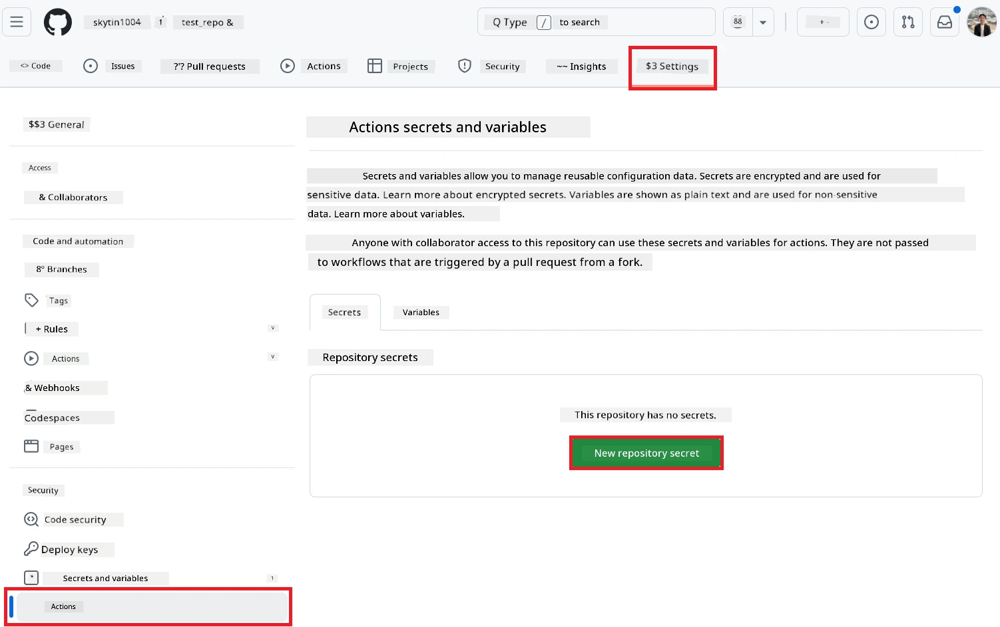
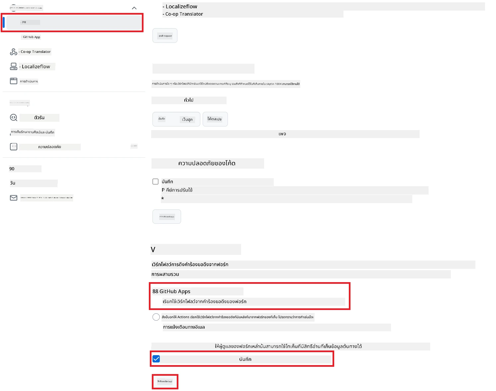

# การใช้งาน Co-op Translator GitHub Action (การตั้งค่าสำหรับสาธารณะ)

**กลุ่มเป้าหมาย:** คู่มือนี้เหมาะสำหรับผู้ใช้ใน repository สาธารณะหรือส่วนตัวส่วนใหญ่ที่สิทธิ์ GitHub Actions มาตรฐานเพียงพอ โดยใช้ `GITHUB_TOKEN` ที่มีมาให้

แปลเอกสารใน repository ของคุณโดยอัตโนมัติอย่างง่ายดายด้วย Co-op Translator GitHub Action คู่มือนี้จะแนะนำขั้นตอนการตั้งค่า action เพื่อสร้าง pull request พร้อมการแปลที่อัปเดตโดยอัตโนมัติทุกครั้งที่ไฟล์ Markdown ต้นทางหรือรูปภาพของคุณมีการเปลี่ยนแปลง

> [!IMPORTANT]
>
> **เลือกคู่มือให้ถูกต้อง:**
>
> คู่มือนี้อธิบาย **การตั้งค่าที่ง่ายกว่าด้วย `GITHUB_TOKEN` มาตรฐาน** ซึ่งเป็นวิธีที่แนะนำสำหรับผู้ใช้ส่วนใหญ่ เพราะไม่ต้องจัดการกับ GitHub App Private Key ที่มีความอ่อนไหว
>

## ข้อกำหนดเบื้องต้น

ก่อนตั้งค่า GitHub Action โปรดเตรียมข้อมูลรับรองของบริการ AI ที่จำเป็นให้พร้อม

**1. จำเป็น: ข้อมูลรับรอง AI Language Model**
คุณต้องมีข้อมูลรับรองสำหรับ Language Model ที่รองรับอย่างน้อยหนึ่งตัว:

- **Azure OpenAI**: ต้องใช้ Endpoint, API Key, ชื่อ Model/Deployment, API Version
- **OpenAI**: ต้องใช้ API Key, (ถ้ามี: Org ID, Base URL, Model ID)
- ดูรายละเอียดที่ [Supported Models and Services](../../../../README.md)

**2. ไม่บังคับ: ข้อมูลรับรอง AI Vision (สำหรับแปลข้อความในรูปภาพ)**

- ต้องใช้เฉพาะเมื่อคุณต้องการแปลข้อความในรูปภาพ
- **Azure AI Vision**: ต้องใช้ Endpoint และ Subscription Key
- หากไม่ระบุ Action จะทำงานใน [Markdown-only mode](../markdown-only-mode.md) โดยอัตโนมัติ

## การตั้งค่าและกำหนดค่า

ทำตามขั้นตอนเหล่านี้เพื่อกำหนดค่า Co-op Translator GitHub Action ใน repository ของคุณโดยใช้ `GITHUB_TOKEN` มาตรฐาน

### ขั้นตอนที่ 1: ทำความเข้าใจการยืนยันตัวตน (ใช้ `GITHUB_TOKEN`)

Workflow นี้ใช้ `GITHUB_TOKEN` ที่ GitHub Actions ให้มาโดยอัตโนมัติ ซึ่ง token นี้จะให้สิทธิ์กับ workflow ในการทำงานกับ repository ของคุณตามการตั้งค่าที่กำหนดใน **ขั้นตอนที่ 3**

### ขั้นตอนที่ 2: กำหนดค่า Repository Secrets

คุณเพียงแค่เพิ่ม **ข้อมูลรับรองบริการ AI** ของคุณเป็น secrets ที่เข้ารหัสใน settings ของ repository

1.  ไปที่ repository เป้าหมายของคุณใน GitHub
2.  ไปที่ **Settings** > **Secrets and variables** > **Actions**
3.  ใต้ **Repository secrets** คลิก **New repository secret** สำหรับแต่ละ secret ของบริการ AI ที่จำเป็นตามรายการด้านล่าง

     *(อ้างอิงภาพ: ตำแหน่งที่เพิ่ม secrets)*

**AI Service Secrets ที่จำเป็น (เพิ่มทุกตัวที่เกี่ยวข้องตามข้อกำหนดเบื้องต้น):**

| Secret Name                         | คำอธิบาย                                 | แหล่งที่มาของค่า                  |
| :---------------------------------- | :---------------------------------------- | :------------------------------- |
| `AZURE_AI_SERVICE_API_KEY`            | คีย์สำหรับ Azure AI Service (Computer Vision)  | Azure AI Foundry ของคุณ               |
| `AZURE_AI_SERVICE_ENDPOINT`         | Endpoint สำหรับ Azure AI Service (Computer Vision) | Azure AI Foundry ของคุณ               |
| `AZURE_OPENAI_API_KEY`              | คีย์สำหรับ Azure OpenAI service              | Azure AI Foundry ของคุณ               |
| `AZURE_OPENAI_ENDPOINT`             | Endpoint สำหรับ Azure OpenAI service         | Azure AI Foundry ของคุณ               |
| `AZURE_OPENAI_MODEL_NAME`           | ชื่อ Model ของ Azure OpenAI ของคุณ              | Azure AI Foundry ของคุณ               |
| `AZURE_OPENAI_CHAT_DEPLOYMENT_NAME` | ชื่อ Deployment ของ Azure OpenAI ของคุณ         | Azure AI Foundry ของคุณ               |
| `AZURE_OPENAI_API_VERSION`          | API Version สำหรับ Azure OpenAI              | Azure AI Foundry ของคุณ               |
| `OPENAI_API_KEY`                    | API Key สำหรับ OpenAI                        | OpenAI Platform ของคุณ              |
| `OPENAI_ORG_ID`                     | OpenAI Organization ID (ไม่บังคับ)         | OpenAI Platform ของคุณ              |
| `OPENAI_CHAT_MODEL_ID`              | รหัส model เฉพาะของ OpenAI (ไม่บังคับ)       | OpenAI Platform ของคุณ              |
| `OPENAI_BASE_URL`                   | OpenAI API Base URL แบบกำหนดเอง (ไม่บังคับ)     | OpenAI Platform ของคุณ              |

### ขั้นตอนที่ 3: กำหนดสิทธิ์ Workflow

GitHub Action ต้องการสิทธิ์ผ่าน `GITHUB_TOKEN` เพื่อ checkout โค้ดและสร้าง pull request

1.  ใน repository ของคุณ ไปที่ **Settings** > **Actions** > **General**
2.  เลื่อนลงไปที่ส่วน **Workflow permissions**
3.  เลือก **Read and write permissions** เพื่อให้ `GITHUB_TOKEN` มีสิทธิ์ `contents: write` และ `pull-requests: write` สำหรับ workflow นี้
4.  ตรวจสอบให้แน่ใจว่าได้ติ๊กถูกที่ **Allow GitHub Actions to create and approve pull requests**
5.  กด **Save**



### ขั้นตอนที่ 4: สร้าง Workflow File

สุดท้าย สร้างไฟล์ YAML ที่กำหนด workflow อัตโนมัติด้วย `GITHUB_TOKEN`

1.  ที่ root ของ repository ให้สร้างโฟลเดอร์ `.github/workflows/` หากยังไม่มี
2.  ใน `.github/workflows/` สร้างไฟล์ชื่อ `co-op-translator.yml`
3.  วางเนื้อหาต่อไปนี้ลงใน `co-op-translator.yml`

```yaml
name: Co-op Translator

on:
  push:
    branches:
      - main

jobs:
  co-op-translator:
    runs-on: ubuntu-latest

    permissions:
      contents: write
      pull-requests: write

    steps:
      - name: Checkout repository
        uses: actions/checkout@v4
        with:
          fetch-depth: 0

      - name: Set up Python
        uses: actions/setup-python@v4
        with:
          python-version: '3.10'

      - name: Install Co-op Translator
        run: |
          python -m pip install --upgrade pip
          pip install co-op-translator

      - name: Run Co-op Translator
        env:
          PYTHONIOENCODING: utf-8
          # === AI Service Credentials ===
          AZURE_AI_SERVICE_API_KEY: ${{ secrets.AZURE_AI_SERVICE_API_KEY }}
          AZURE_AI_SERVICE_ENDPOINT: ${{ secrets.AZURE_AI_SERVICE_ENDPOINT }}
          AZURE_OPENAI_API_KEY: ${{ secrets.AZURE_OPENAI_API_KEY }}
          AZURE_OPENAI_ENDPOINT: ${{ secrets.AZURE_OPENAI_ENDPOINT }}
          AZURE_OPENAI_MODEL_NAME: ${{ secrets.AZURE_OPENAI_MODEL_NAME }}
          AZURE_OPENAI_CHAT_DEPLOYMENT_NAME: ${{ secrets.AZURE_OPENAI_CHAT_DEPLOYMENT_NAME }}
          AZURE_OPENAI_API_VERSION: ${{ secrets.AZURE_OPENAI_API_VERSION }}
          OPENAI_API_KEY: ${{ secrets.OPENAI_API_KEY }}
          OPENAI_ORG_ID: ${{ secrets.OPENAI_ORG_ID }}
          OPENAI_CHAT_MODEL_ID: ${{ secrets.OPENAI_CHAT_MODEL_ID }}
          OPENAI_BASE_URL: ${{ secrets.OPENAI_BASE_URL }}
        run: |
          # =====================================================================
          # IMPORTANT: Set your target languages here (REQUIRED CONFIGURATION)
          # =====================================================================
          # Example: Translate to Spanish, French, German. Add -y to auto-confirm.
          translate -l "es fr de" -y  # <--- MODIFY THIS LINE with your desired languages

      - name: Create Pull Request with translations
        uses: peter-evans/create-pull-request@v5
        with:
          token: ${{ secrets.GITHUB_TOKEN }}
          commit-message: "🌐 Update translations via Co-op Translator"
          title: "🌐 Update translations via Co-op Translator"
          body: |
            This PR updates translations for recent changes to the main branch.

            ### 📋 Changes included
            - Translated contents are available in the `translations/` directory
            - Translated images are available in the `translated_images/` directory

            ---
            🌐 Automatically generated by the [Co-op Translator](https://github.com/Azure/co-op-translator) GitHub Action.
          branch: update-translations
          base: main
          labels: translation, automated-pr
          delete-branch: true
          add-paths: |
            translations/
            translated_images/
```
4.  **ปรับแต่ง Workflow:**
  - **[!IMPORTANT] ภาษาที่ต้องการ:** ในขั้นตอน `Run Co-op Translator` คุณ **ต้องตรวจสอบและแก้ไขรายชื่อรหัสภาษา** ในคำสั่ง `translate -l "..." -y` ให้ตรงกับความต้องการของโปรเจกต์ รายการตัวอย่าง (`ar de es...`) ต้องเปลี่ยนหรือปรับให้เหมาะสม
  - **Trigger (`on:`):** ปัจจุบัน trigger จะทำงานทุกครั้งที่มี push ไปที่ `main` สำหรับ repository ขนาดใหญ่ แนะนำให้เพิ่ม `paths:` filter (ดูตัวอย่างที่คอมเมนต์ไว้ใน YAML) เพื่อให้ workflow ทำงานเฉพาะเมื่อไฟล์ที่เกี่ยวข้อง (เช่น เอกสารต้นทาง) เปลี่ยนแปลง จะช่วยประหยัด runner minutes
  - **รายละเอียด PR:** ปรับแต่ง `commit-message`, `title`, `body`, ชื่อ `branch` และ `labels` ในขั้นตอน `Create Pull Request` ได้ตามต้องการ

## การทำงานของ Workflow

> [!WARNING]  
> **ขีดจำกัดเวลา Runner ที่ GitHub ให้บริการ:**  
> Runner ที่ GitHub ให้บริการ เช่น `ubuntu-latest` **มีขีดจำกัดเวลาในการทำงานสูงสุด 6 ชั่วโมง**  
> สำหรับ repository เอกสารขนาดใหญ่ หากกระบวนการแปลใช้เวลานานเกิน 6 ชั่วโมง workflow จะถูกยกเลิกโดยอัตโนมัติ  
> เพื่อป้องกันปัญหานี้ แนะนำให้:  
> - ใช้ **self-hosted runner** (ไม่มีขีดจำกัดเวลา)  
> - ลดจำนวนภาษาที่แปลต่อรอบ

เมื่อไฟล์ `co-op-translator.yml` ถูก merge เข้าสู่ main branch (หรือ branch ที่ระบุใน trigger `on:`) workflow จะทำงานโดยอัตโนมัติทุกครั้งที่มีการ push ไปยัง branch นั้น (และตรงกับ filter `paths` หากตั้งค่าไว้)

---

**ข้อจำกัดความรับผิดชอบ**:
เอกสารฉบับนี้ได้รับการแปลโดยใช้บริการแปลภาษา AI [Co-op Translator](https://github.com/Azure/co-op-translator) แม้เราจะพยายามให้การแปลมีความถูกต้อง แต่โปรดทราบว่าการแปลโดยอัตโนมัติอาจมีข้อผิดพลาดหรือความไม่ถูกต้อง เอกสารต้นฉบับในภาษาต้นทางควรถือเป็นแหล่งข้อมูลที่เชื่อถือได้ สำหรับข้อมูลสำคัญ แนะนำให้ใช้บริการแปลโดยนักแปลมืออาชีพ ทางเราจะไม่รับผิดชอบต่อความเข้าใจผิดหรือการตีความที่คลาดเคลื่อนซึ่งเกิดจากการใช้การแปลนี้