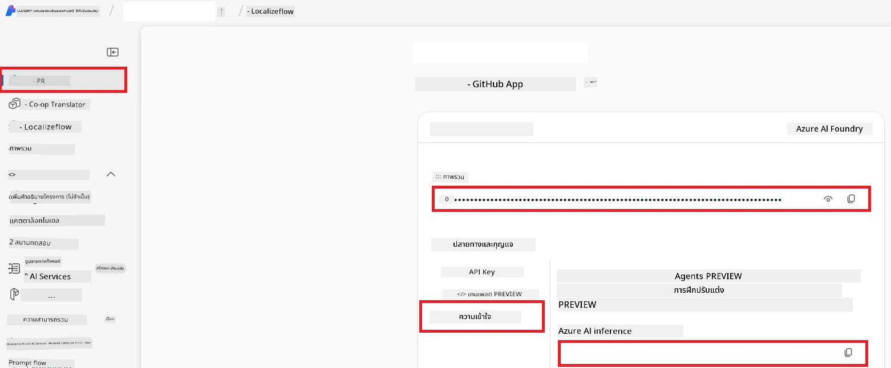

# ตั้งค่า Azure AI สำหรับ Co-op Translator (Azure OpneAI & Azure AI Vision)

คำแนะนำนี้จะแนะนำคุณผ่านขั้นตอนการตั้งค่า Azure OpenAI สำหรับการแปลภาษา และ Azure Computer Vision สำหรับการวิเคราะห์เนื้อหาภาพ (ซึ่งสามารถใช้สำหรับการแปลภาพได้) ภายใน Azure AI Foundry

**สิ่งที่ต้องมี:**
- บัญชี Azure ที่มีการสมัครใช้งานที่ใช้งานอยู่
- สิทธิ์เพียงพอในการสร้างทรัพยากรและการปรับใช้ในการสมัครใช้งาน Azure ของคุณ

## สร้างโครงการ Azure AI

คุณจะเริ่มต้นโดยการสร้างโครงการ Azure AI ซึ่งทำหน้าที่เป็นที่ศูนย์กลางสำหรับการจัดการทรัพยากร AI ของคุณ

1. ไปที่ [https://ai.azure.com](https://ai.azure.com) และลงชื่อเข้าใช้ด้วยบัญชี Azure ของคุณ

1. เลือก **+Create** เพื่อสร้างโครงการใหม่

1. ทำงานดังต่อไปนี้:
   - ป้อน **ชื่อโครงการ** (เช่น `CoopTranslator-Project`)
   - เลือก **ศูนย์ AI** (เช่น `CoopTranslator-Hub`) (สร้างใหม่หากต้องการ)

1. คลิก "**Review and Create**" เพื่อตั้งค่าโครงการของคุณ คุณจะถูกพาไปยังหน้าสรุปภาพรวมของโครงการ

## ตั้งค่า Azure OpenAI สำหรับการแปลภาษา

ภายในโครงการของคุณ คุณจะปรับใช้โมเดล Azure OpenAI เพื่อทำหน้าที่เป็นแบ็กเอนด์สำหรับการแปลข้อความ

### ไปที่โครงการของคุณ

ถ้ายังไม่ได้เข้า ให้เปิดโครงการที่คุณสร้างขึ้นใหม่ (เช่น `CoopTranslator-Project`) ใน Azure AI Foundry

### ปรับใช้โมเดล OpenAI

1. จากเมนูด้านซ้ายของโครงการของคุณ ภายใต้ "My assets" ให้เลือก "**Models + endpoints**"

1. เลือก **+ Deploy model**

1. เลือก **Deploy Base Model**

1. คุณจะเห็นรายการโมเดลที่มีอยู่ กรองหรือค้นหาโมเดล GPT ที่เหมาะสม แนะนำ `gpt-4o`

1. เลือกโมเดลที่คุณต้องการและคลิก **Confirm**

1. เลือก **Deploy**

### การตั้งค่า Azure OpenAI

เมื่อปรับใช้แล้ว คุณสามารถเลือกการปรับใช้จากหน้า "**Models + endpoints**" เพื่อดู **REST endpoint URL**, **Key**, **Deployment name**, **Model name** และ **API version** ของโมเดล ซึ่งจำเป็นสำหรับการรวมโมเดลแปลภาษากับแอปพลิเคชันของคุณ

> [!NOTE]
> คุณสามารถเลือกเวอร์ชัน API จากหน้าการ [เลิกใช้เวอร์ชัน API](https://learn.microsoft.com/azure/ai-services/openai/api-version-deprecation) ตามความต้องการของคุณ โปรดทราบว่า **API version** แตกต่างจาก **Model version** ที่แสดงในหน้า **Models + endpoints** ของ Azure AI Foundry

## ตั้งค่า Azure Computer Vision สำหรับการแปลภาพ

เพื่อเปิดใช้งานการแปลข้อความภายในภาพ คุณต้องหาคีย์ API และ Endpoint ของ Azure AI Service

1. ไปที่โครงการ Azure AI ของคุณ (เช่น `CoopTranslator-Project`) ให้แน่ใจว่าคุณอยู่ในหน้า overview ของโครงการ

### การตั้งค่า Azure AI Service

ค้นหาคีย์ API และ Endpoint จากแท็บ Azure AI Service

1. ไปที่โครงการ Azure AI ของคุณ (เช่น `CoopTranslator-Project`) ให้แน่ใจว่าคุณอยู่ในหน้า overview ของโครงการ

1. ค้นหา **API Key** และ **Endpoint** จากแท็บ Azure AI Service

    

การเชื่อมต่อนี้ทำให้ความสามารถของทรัพยากร Azure AI Services ที่เชื่อมโยง (รวมถึงการวิเคราะห์ภาพ) สามารถใช้งานในโครงการ AI Foundry ของคุณได้ จากนั้นคุณสามารถใช้การเชื่อมต่อนี้ในโน้ตบุ๊กหรือแอปพลิเคชันของคุณเพื่อตรวจจับข้อความจากภาพ ซึ่งสามารถส่งต่อไปยังโมเดล Azure OpenAI สำหรับการแปลต่อไป

## สรุปข้อมูลรับรองของคุณ

ตอนนี้คุณควรมีข้อมูลต่อไปนี้:

**สำหรับ Azure OpenAI (การแปลข้อความ):**
- Azure OpenAI Endpoint
- Azure OpenAI API Key
- ชื่อโมเดล Azure OpenAI (เช่น `gpt-4o`)
- ชื่อ Deployment Azure OpenAI (เช่น `cooptranslator-gpt4o`)
- เวอร์ชัน API Azure OpenAI

**สำหรับ Azure AI Services (การสกัดข้อความจากภาพด้วย Vision):**
- Azure AI Service Endpoint
- Azure AI Service API Key

### ตัวอย่าง: การตั้งค่าสภาพแวดล้อมตัวแปร (ตัวอย่าง)

ต่อมา เมื่อสร้างแอปพลิเคชัน คุณน่าจะตั้งค่าด้วยข้อมูลรับรองที่เก็บรวบรวมไว้ เช่น การตั้งเป็นตัวแปรสภาพแวดล้อมดังนี้

```bash
# ข้อมูลรับรองบริการ Azure AI (จำเป็นสำหรับการแปลภาพ)
AZURE_AI_SERVICE_API_KEY="your_azure_ai_service_api_key" # ตัวอย่างเช่น 21xasd...
AZURE_AI_SERVICE_ENDPOINT="https://your_azure_ai_service_endpoint.cognitiveservices.azure.com/"

# ชุดสำรองข้อมูลทางเลือก: ทำซ้ำตัวแปรโดยเพิ่มคำต่อท้าย _1/_2 (ดัชนีเดียวกันสำหรับตัวแปรทั้งหมดในชุด)
AZURE_AI_SERVICE_API_KEY_1="your_azure_ai_service_api_key_1"
AZURE_AI_SERVICE_ENDPOINT_1="https://your_azure_ai_service_endpoint_1.cognitiveservices.azure.com/"

# ข้อมูลรับรอง Azure OpenAI (จำเป็นสำหรับการแปลข้อความ)
AZURE_OPENAI_API_KEY="your_azure_openai_api_key" # ตัวอย่างเช่น 21xasd...
AZURE_OPENAI_ENDPOINT="https://your_azure_openai_endpoint.openai.azure.com/"
AZURE_OPENAI_MODEL_NAME="your_model_name" # ตัวอย่างเช่น gpt-4o
AZURE_OPENAI_CHAT_DEPLOYMENT_NAME="your_deployment_name" # ตัวอย่างเช่น cooptranslator-gpt4o
AZURE_OPENAI_API_VERSION="your_api_version" # ตัวอย่างเช่น 2024-12-01-preview

# ชุดสำรองข้อมูลทางเลือก: ทำซ้ำชุด AZURE_OPENAI_* ทั้งหมดโดยเพิ่มคำต่อท้าย _1/_2 (ดัชนีเดียวกันสำหรับตัวแปรทั้งหมด)
```

---

### การอ่านเพิ่มเติม

- [วิธีสร้างโครงการใน Azure AI Foundry](https://learn.microsoft.com/azure/ai-foundry/how-to/create-projects?tabs=ai-studio)
- [วิธีสร้างทรัพยากร Azure AI](https://learn.microsoft.com/azure/ai-foundry/how-to/create-azure-ai-resource?tabs=portal)
- [วิธีปรับใช้โมเดล OpenAI ใน Azure AI Foundry](https://learn.microsoft.com/en-us/azure/ai-foundry/how-to/deploy-models-openai)

---

<!-- CO-OP TRANSLATOR DISCLAIMER START -->
**ข้อจำกัดความรับผิดชอบ**:  
เอกสารนี้ได้ถูกแปลโดยใช้บริการการแปลด้วย AI [Co-op Translator](https://github.com/Azure/co-op-translator) แม้เราจะพยายามให้ความถูกต้องสูงสุด แต่โปรดทราบว่าการแปลอัตโนมัติอาจมีข้อผิดพลาดหรือตำหนิได้ เอกสารต้นฉบับในภาษาดั้งเดิมควรถือว่าเป็นแหล่งข้อมูลที่เชื่อถือได้ สำหรับข้อมูลที่สำคัญ ควรใช้บริการแปลโดยมนุษย์ที่มีความเชี่ยวชาญ เราไม่รับผิดชอบต่อความเข้าใจผิดหรือการตีความผิดที่เกิดขึ้นจากการใช้การแปลนี้
<!-- CO-OP TRANSLATOR DISCLAIMER END -->