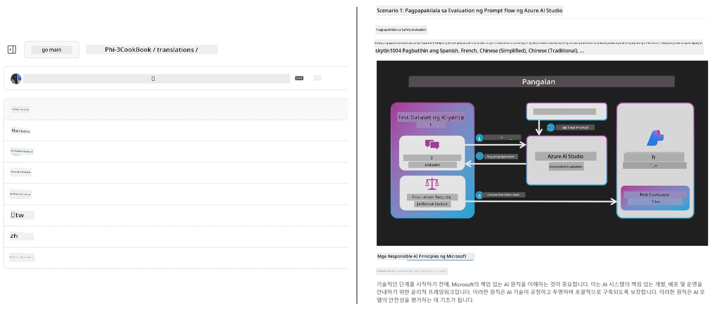

# Co-op Translator

_Madaling i-automate at panatilihin ang mga pagsasalin para sa iyong edukasyonal na nilalaman sa GitHub sa maraming wika habang umuunlad ang iyong proyekto._


[](https://pypi.org/project/co-op-translator/)
[](https://github.com/azure/co-op-translator/blob/main/LICENSE)
[](https://pepy.tech/project/co-op-translator)
[](https://pepy.tech/project/co-op-translator)
[](https://github.com/azure/co-op-translator/pkgs/container/co-op-translator)
[](https://github.com/psf/black)

[](https://GitHub.com/azure/co-op-translator/graphs/contributors/)
[](https://GitHub.com/azure/co-op-translator/issues/)
[](https://GitHub.com/azure/co-op-translator/pulls/)
[](http://makeapullrequest.com)

### 🌐 Suporta sa Maraming Wika

#### Sinusuportahan ng [Co-op Translator](https://github.com/Azure/Co-op-Translator)

<!-- CO-OP TRANSLATOR LANGUAGES TABLE START -->
[Arabic](../ar/README.md) | [Bengali](../bn/README.md) | [Bulgarian](../bg/README.md) | [Burmese (Myanmar)](../my/README.md) | [Chinese (Simplified)](../zh-CN/README.md) | [Chinese (Traditional, Hong Kong)](../zh-HK/README.md) | [Chinese (Traditional, Macau)](../zh-MO/README.md) | [Chinese (Traditional, Taiwan)](../zh-TW/README.md) | [Croatian](../hr/README.md) | [Czech](../cs/README.md) | [Danish](../da/README.md) | [Dutch](../nl/README.md) | [Estonian](../et/README.md) | [Finnish](../fi/README.md) | [French](../fr/README.md) | [German](../de/README.md) | [Greek](../el/README.md) | [Hebrew](../he/README.md) | [Hindi](../hi/README.md) | [Hungarian](../hu/README.md) | [Indonesian](../id/README.md) | [Italian](../it/README.md) | [Japanese](../ja/README.md) | [Kannada](../kn/README.md) | [Khmer](../km/README.md) | [Korean](../ko/README.md) | [Lithuanian](../lt/README.md) | [Malay](../ms/README.md) | [Malayalam](../ml/README.md) | [Marathi](../mr/README.md) | [Nepali](../ne/README.md) | [Nigerian Pidgin](../pcm/README.md) | [Norwegian](../no/README.md) | [Persian (Farsi)](../fa/README.md) | [Polish](../pl/README.md) | [Portuguese (Brazil)](../pt-BR/README.md) | [Portuguese (Portugal)](../pt-PT/README.md) | [Punjabi (Gurmukhi)](../pa/README.md) | [Romanian](../ro/README.md) | [Russian](../ru/README.md) | [Serbian (Cyrillic)](../sr/README.md) | [Slovak](../sk/README.md) | [Slovenian](../sl/README.md) | [Spanish](../es/README.md) | [Swahili](../sw/README.md) | [Swedish](../sv/README.md) | [Tagalog (Filipino)](./README.md) | [Tamil](../ta/README.md) | [Telugu](../te/README.md) | [Thai](../th/README.md) | [Turkish](../tr/README.md) | [Ukrainian](../uk/README.md) | [Urdu](../ur/README.md) | [Vietnamese](../vi/README.md)

> **Mas gusto mo bang Mag-clone nang Lokal?**
>
> Kasama sa repositoryong ito ang higit sa 50 wika ng pagsasalin na labis na nagpapalaki ng laki ng pag-download. Para mag-clone nang walang mga pagsasalin, gamitin ang sparse checkout:
>
> **Bash / macOS / Linux:**
> ```bash
> git clone --filter=blob:none --sparse https://github.com/skytin1004/co-op-translator.git
> cd co-op-translator
> git sparse-checkout set --no-cone '/*' '!translations' '!translated_images'
> ```
>
> **CMD (Windows):**
> ```cmd
> git clone --filter=blob:none --sparse https://github.com/skytin1004/co-op-translator.git
> cd co-op-translator
> git sparse-checkout set --no-cone "/*" "!translations" "!translated_images"
> ```
>
> Binibigyan ka nito ng lahat ng kailangan mo para matapos ang kurso nang mas mabilis ang pag-download.
<!-- CO-OP TRANSLATOR LANGUAGES TABLE END -->

[](https://GitHub.com/azure/co-op-translator/watchers/)
[](https://GitHub.com/azure/co-op-translator/network/)
[](https://GitHub.com/azure/co-op-translator/stargazers/)

[](https://discord.gg/nTYy5BXMWG)

[](https://codespaces.new/azure/co-op-translator)

## Pangkalahatang-ideya

**Co-op Translator** ay tumutulong sa iyong i-localize ang iyong edukasyonal na nilalaman sa GitHub sa maraming wika nang walang kahirap-hirap.
Kapag ina-update mo ang iyong mga Markdown file, mga larawan, o mga notebook, nananatiling awtomatikong naka-synchronize ang mga pagsasalin, tinitiyak na ang iyong nilalaman ay nananatiling tama at napapanahon para sa mga mag-aaral sa buong mundo.

Halimbawa kung paano nakaayos ang isinalin na nilalaman:



## Paano pinamamahalaan ang estado ng pagsasalin

Pinamamahalaan ng Co-op Translator ang isinalin na nilalaman bilang **versioned software artifacts**,  
hindi bilang mga static na file.

Sinusubaybayan ng tool ang estado ng isinaling Markdown, mga larawan, at mga notebook
gamit ang **language-scoped metadata**.

Pinapayagan ng disenyo na ito ang Co-op Translator na:

- Maaasahang matukoy ang mga lipas na pagsasalin
- Tanggapin ang Markdown, mga larawan, at mga notebook nang pare-pareho
- Ligtas na mag-scale sa malaki, mabilis na umuunlad, multi-wika na mga repositoryo

Sa pamamagitan ng pagmomodelo ng mga pagsasalin bilang mga pinamamahalaang artifact,
ang mga workflow ng pagsasalin ay naaayon nang natural sa makabagong
praktis ng pamamahala ng dependencies at artifact ng software.

→ [Paano pinamamahalaan ang estado ng pagsasalin](https://techcommunity.microsoft.com/blog/azuredevcommunityblog/rethinking-documentation-translation-treating-translations-as-versioned-software/4491755)


## Mabilis na pagsisimula

```bash
# Gumawa at i-activate ang isang virtual na kapaligiran (inirerekomenda)
python -m venv .venv
# Windows
.venv\Scripts\activate
# macOS/Linux
source .venv/bin/activate
# I-install ang package
pip install co-op-translator
# Isalin
translate -l "ko ja fr" -md
```

Docker:

```bash
# Kunin ang pampublikong imahe mula sa GHCR
docker pull ghcr.io/azure/co-op-translator:latest
# Patakbuhin na naka-mount ang kasalukuyang folder at ibinigay ang .env (Bash/Zsh)
docker run --rm -it --env-file .env -v "${PWD}:/work" ghcr.io/azure/co-op-translator:latest -l "ko ja fr" -md
```

## Minimal na setup

1. Siguraduhing mayroon kang suportadong bersyon ng Python (kasalukuyang 3.10-3.12). Sa poetry (pyproject.toml) ito ay awtomatikong hinahandle.
2. Gumawa ng `.env` file gamit ang template: [.env.template](../../.env.template)
3. I-configure ang isang LLM provider (Azure OpenAI o OpenAI)
4. (Opsyonal) Para sa pagsasalin ng larawan (`-img`), i-configure ang Azure AI Vision
5. (Opsyonal) Maaari kang mag-configure ng maraming credential set sa pamamagitan ng pag-duplicate ng mga variable na may mga suffix gaya ng `_1`, `_2`, atbp. Ang lahat ng mga variable sa isang set ay dapat may parehong suffix.
6. (Inirerekomenda) Linisin ang anumang mga naunang pagsasalin upang maiwasan ang mga salungatan (halimbawa, `translations/`)
7. (Inirerekomenda) Magdagdag ng seksyon ng pagsasalin sa iyong README gamit ang [README languages template](./getting_started/README_languages_template.md)
8. Tingnan: [Set up Azure AI](./getting_started/set-up-azure-ai.md)

## Paggamit

Isalin ang lahat ng suportadong uri:

```bash
translate -l "ko ja"
```

Markdown lang:

```bash
translate -l "de" -md
```

Markdown + mga larawan:

```bash
translate -l "pt" -md -img
```

Notebook lang:

```bash
translate -l "zh" -nb
```

Mas maraming flags: [Command reference](./getting_started/command-reference.md)

## Mga Tampok

- Awtomatikong pagsasalin para sa Markdown, mga notebook, at mga larawan
- Pinananatiling naka-synchronize ang mga pagsasalin sa mga pagbabago sa pinagmulan
- Gumagana lokal (CLI) o sa CI (GitHub Actions)
- Ginagamit ang Azure OpenAI o OpenAI; opsyonal ang Azure AI Vision para sa mga larawan
- Pinapanatili ang format at istruktura ng Markdown

## Dokumentasyon

- [Gabay sa command-line](./getting_started/command-line-guide/command-line-guide.md)
- [Gabay sa GitHub Actions (Public repositories at standard secrets)](./getting_started/github-actions-guide/github-actions-guide-public.md)
- [Gabay sa GitHub Actions (Microsoft organization repositories at org-level setups)](./getting_started/github-actions-guide/github-actions-guide-org.md)
- [README languages template](./getting_started/README_languages_template.md)
- [Sinusuportahang mga wika](./getting_started/supported-languages.md)
- [Pagtutulungan](./CONTRIBUTING.md)
- [Pag-aayos ng problema](./getting_started/troubleshooting.md)

### Gabay para sa Microsoft
> [!NOTE]
> Para sa mga tagapangasiwa ng Microsoft “For Beginners” na mga repositoryo lamang.

- [Pag-update ng listahan ng “ibang kurso” (para sa MS Beginners repositories lamang)](./getting_started/update-other-courses.md)

## Suportahan kami at paunlarin ang pandaigdigang pagkatuto

Sumali sa amin sa pagbabagong-buhay kung paano ibinabahagi ang edukasyonal na nilalaman sa buong mundo! Bigyan ang [Co-op Translator](https://github.com/azure/co-op-translator) ng ⭐ sa GitHub at suportahan ang aming misyon na wasakin ang mga hadlang sa wika sa pagkatuto at teknolohiya. Ang iyong interes at kontribusyon ay may malaking epekto! Lagi naming tinatanggap ang mga kontribusyon sa code at mga mungkahi sa tampok.

### Tuklasin ang mga edukasyonal na nilalaman ng Microsoft sa iyong wika

- [LangChain4j-for-Beginners](https://github.com/microsoft/LangChain4j-for-Beginners)
- [AZD for Beginners](https://github.com/microsoft/AZD-for-beginners)
- [Edge AI for Beginners](https://github.com/microsoft/edgeai-for-beginners)
- [Model Context Protocol (MCP) For Beginners](https://github.com/microsoft/mcp-for-beginners)
- [AI Agents for Beginners](https://github.com/microsoft/ai-agents-for-beginners)
- [Generative AI for Beginners using .NET](https://github.com/microsoft/Generative-AI-for-beginners-dotnet)
- [Generative AI for Beginners](https://github.com/microsoft/generative-ai-for-beginners)
- [Generative AI for Beginners using Java](https://github.com/microsoft/generative-ai-for-beginners-java)
- [ML for Beginners](https://aka.ms/ml-beginners)
- [Data Science for Beginners](https://aka.ms/datascience-beginners)
- [AI for Beginners](https://aka.ms/ai-beginners)
- [Cybersecurity for Beginners](https://github.com/microsoft/Security-101)
- [Web Dev for Beginners](https://aka.ms/webdev-beginners)
- [IoT for Beginners](https://aka.ms/iot-beginners)
- [PhiCookBook](https://github.com/microsoft/PhiCookBook)

## Mga Presentasyon sa Video

👉 I-click ang larawan sa ibaba upang panoorin sa YouTube.

- **Open at Microsoft**: Isang maikling 18-minutong pagpapakilala at mabilis na gabay kung paano gamitin ang Co-op Translator.

  [](https://www.youtube.com/watch?v=jX_swfH_KNU)

## Pagtutulungan

Tumatanggap ang proyektong ito ng mga kontribusyon at mungkahi. Interesado ka bang makatulong sa Azure Co-op Translator? Mangyaring tingnan ang aming [CONTRIBUTING.md](./CONTRIBUTING.md) para sa mga patnubay kung paano mo matutulungan gawing mas accessible ang Co-op Translator.

## Mga Kontribyutor
[](https://github.com/Azure/co-op-translator/graphs/contributors)

## Code of Conduct

Inamponan ng proyektong ito ang [Microsoft Open Source Code of Conduct](https://opensource.microsoft.com/codeofconduct/).
Para sa higit pang impormasyon tingnan ang [Code of Conduct FAQ](https://opensource.microsoft.com/codeofconduct/faq/) o
makipag-ugnayan sa [opencode@microsoft.com](mailto:opencode@microsoft.com) para sa anumang karagdagang mga tanong o komento.

## Responsible AI

Nakatuon ang Microsoft sa pagtulong sa aming mga customer na gamitin nang responsable ang aming mga produkto ng AI, pagbabahagi ng aming mga natutunan, at pagbuo ng mga partnership na nakabatay sa tiwala sa pamamagitan ng mga kasangkapang tulad ng Transparency Notes at Impact Assessments. Marami sa mga mapagkukunang ito ay matatagpuan sa [https://aka.ms/RAI](https://aka.ms/RAI).
Ang pamamaraan ng Microsoft sa responsible AI ay nakaugat sa aming mga prinsipyo ng AI na katarungan, pagiging maaasahan at kaligtasan, privacy at seguridad, pagiging inklusibo, transparency, at pananagutan.

Ang malakihang mga modelo ng natural language, imahe, at pagsasalita - gaya ng mga ginamit sa halimbawang ito - ay maaaring kumilos sa mga paraang hindi patas, hindi maaasahan, o nakakasakit, na maaaring magdulot ng pinsala. Mangyaring kumonsulta sa [Azure OpenAI service Transparency note](https://learn.microsoft.com/legal/cognitive-services/openai/transparency-note?tabs=text) upang malaman ang tungkol sa mga panganib at limitasyon.

Ang inirerekomendang pamamaraan upang mabawasan ang mga panganib na ito ay ang pagsasama ng isang safety system sa iyong arkitektura na maaaring makatuklas at makapigil sa mapanganib na pag-uugali. Nagbibigay ang [Azure AI Content Safety](https://learn.microsoft.com/azure/ai-services/content-safety/overview) ng isang independyenteng layer ng proteksyon, na kaya nitong tuklasin ang mapanganib na nilalaman na nilikha ng gumagamit at ng AI sa mga aplikasyon at serbisyo. Kasama sa Azure AI Content Safety ang mga text at image API na nagpapahintulot sa iyo na matukoy ang materyal na mapanganib. Mayroon din kaming interactive Content Safety Studio na nagpapahintulot sa iyo na tingnan, tuklasin, at subukan ang sample code para sa pagtuklas ng mapanganib na nilalaman sa iba't ibang modality. Ang sumusunod na [quickstart documentation](https://learn.microsoft.com/azure/ai-services/content-safety/quickstart-text?tabs=visual-studio%2Clinux&pivots=programming-language-rest) ay gagabay sa iyo sa paggawa ng mga kahilingan sa serbisyo.

Isa pang aspeto na dapat isaalang-alang ay ang pangkalahatang pagganap ng aplikasyon. Sa mga multi-modal at multi-models na aplikasyon, itinuturing namin ang pagganap bilang ang sistema ay gumaganap ayon sa iyong at ng iyong mga gumagamit na inaasahan, kabilang ang hindi paglikha ng mapanganib na output. Mahalagang tasahin ang pagganap ng iyong pangkalahatang aplikasyon gamit ang [generation quality and risk and safety metrics](https://learn.microsoft.com/azure/ai-studio/concepts/evaluation-metrics-built-in).

Maaari mong suriin ang iyong AI application sa iyong development environment gamit ang [prompt flow SDK](https://microsoft.github.io/promptflow/index.html). Gamit ang isang test dataset o isang target, ang mga generative AI na henerasyon ng iyong aplikasyon ay sinusukat ng quantitative gamit ang mga built-in evaluator o custom evaluator na iyong pinili. Upang makapagsimula gamit ang prompt flow sdk upang suriin ang iyong sistema, maaari mong sundan ang [quickstart guide](https://learn.microsoft.com/azure/ai-studio/how-to/develop/flow-evaluate-sdk). Kapag naisagawa mo ang isang evaluation run, maaari mong [i-visualize ang mga resulta sa Azure AI Studio](https://learn.microsoft.com/azure/ai-studio/how-to/evaluate-flow-results).

## Trademarks

Ang proyektong ito ay maaaring maglaman ng mga trademark o logo para sa mga proyekto, produkto, o serbisyo. Ang awtorisadong paggamit ng mga trademark o logo ng Microsoft ay napapailalim at kailangang sumunod sa
[Microsoft's Trademark & Brand Guidelines](https://www.microsoft.com/en-us/legal/intellectualproperty/trademarks/usage/general).
Ang paggamit ng mga trademark o logo ng Microsoft sa mga binagong bersyon ng proyektong ito ay hindi dapat magdulot ng kalituhan o magpahiwatig ng pag-sponsor ng Microsoft.
Anumang paggamit ng mga trademark o logo ng third-party ay napapailalim sa mga patakaran ng mga third-party na iyon.

## Getting Help

Kung ikaw ay natigil o may mga tanong tungkol sa paggawa ng mga AI app, sumali sa:

[](https://discord.gg/nTYy5BXMWG)

Kung may feedback sa produkto o mga error habang gumagawa, bisitahin ang:

[](https://aka.ms/foundry/forum)

---

<!-- CO-OP TRANSLATOR DISCLAIMER START -->
**Pagsisiwalat**:  
Ang dokumentong ito ay isinalin gamit ang serbisyong AI na pagsasalin na [Co-op Translator](https://github.com/Azure/co-op-translator). Bagaman sinisikap naming maging tumpak, pakatandaan na ang mga awtomatikong pagsasalin ay maaaring maglaman ng mga pagkakamali o kamalian. Ang orihinal na dokumento sa kaniyang orihinal na wika ang dapat ituring na pangunahing pinagmulan. Para sa mahahalagang impormasyon, inirerekomenda ang propesyonal na pagsasalin ng tao. Hindi kami mananagot sa anumang hindi pagkakaunawaan o maling interpretasyon mula sa paggamit ng pagsasaling ito.
<!-- CO-OP TRANSLATOR DISCLAIMER END -->