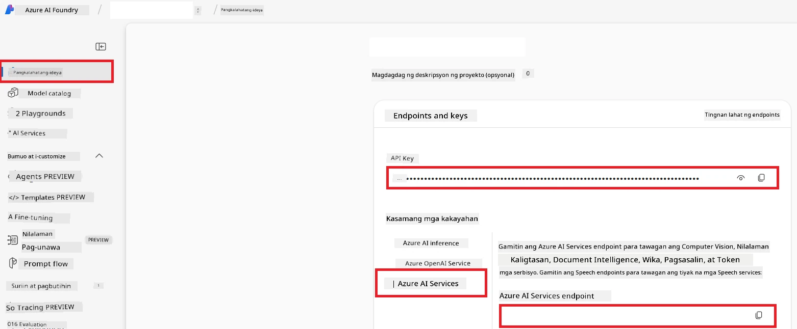

# Isaayos ang Azure AI para sa Co-op Translator (Azure OpneAI & Azure AI Vision)

Ang gabay na ito ay magtuturo sa iyo kung paano isaayos ang Azure OpenAI para sa pagsasalin ng wika at Azure Computer Vision para sa pagsusuri ng nilalaman ng larawan (na maaari ding gamitin para sa pagsasalin ng batay sa larawan) sa loob ng Azure AI Foundry.

**Mga Kinakailangan:**
- Isang Azure account na may aktibong subscription.
- Sapat na mga permiso para lumikha ng mga resources at deployments sa iyong Azure subscription.

## Gumawa ng Azure AI Project

Magsisimula ka sa paggawa ng isang Azure AI Project, na nagsisilbing sentrong lugar para pamahalaan ang iyong mga AI resources.

1. Pumunta sa [https://ai.azure.com](https://ai.azure.com) at mag-sign in gamit ang iyong Azure account.

1. Piliin ang **+Create** para gumawa ng bagong proyekto.

1. Gawin ang mga sumusunod na gawain:
   - Ilagay ang **Project name** (halimbawa, `CoopTranslator-Project`).
   - Piliin ang **AI hub**  (halimbawa, `CoopTranslator-Hub`) (Gumawa ng bago kung kinakailangan).

1. I-click ang "**Review and Create**" para isaayos ang iyong proyekto. Dadalhin ka sa overview page ng iyong proyekto.

## Isaayos ang Azure OpenAI para sa Pagsasalin ng Wika

Sa loob ng iyong proyekto, magde-deploy ka ng Azure OpenAI model na magsisilbing backend para sa pagsasalin ng teksto.

### Pumunta sa Iyong Proyekto

Kung hindi ka pa naroroon, buksan ang bagong ginawa mong proyekto (halimbawa, `CoopTranslator-Project`) sa Azure AI Foundry.

### Mag-deploy ng OpenAI Model

1. Mula sa kaliwang menu ng iyong proyekto, sa ilalim ng "My assets", piliin ang "**Models + endpoints**".

1. Piliin ang **+ Deploy model**.

1. Piliin ang **Deploy Base Model**.

1. Makikita mo ang listahan ng mga available na modelo. I-filter o hanapin ang angkop na GPT model. Inirerekomenda namin ang `gpt-4o`.

1. Piliin ang modelong nais mo at i-click ang **Confirm**.

1. Piliin ang **Deploy**.

### Azure OpenAI configuration

Kapag na-deploy na, maaari mong piliin ang deployment mula sa "**Models + endpoints**" page upang makita ang **REST endpoint URL**, **Key**, **Deployment name**, **Model name**, at **API version** nito. Kailangan ang mga ito upang maisama ang translation model sa iyong aplikasyon.

> [!NOTE]
> Maaari kang pumili ng API versions mula sa [API version deprecation](https://learn.microsoft.com/azure/ai-services/openai/api-version-deprecation) na pahina ayon sa iyong pangangailangan. Tandaan na ang **API version** ay iba sa **Model version** na ipinapakita sa **Models + endpoints** page sa Azure AI Foundry.

## Isaayos ang Azure Computer Vision para sa Pagsasalin ng Larawan

Para ma-enable ang pagsasalin ng teksto sa loob ng mga larawan, kailangan mong hanapin ang Azure AI Service API Key at Endpoint.

1. Pumunta sa iyong Azure AI Project (halimbawa, `CoopTranslator-Project`). Siguraduhing nasa project overview page ka.

### Azure AI Service configuration

Hanapin ang API Key at Endpoint mula sa Azure AI Service.

1. Pumunta sa iyong Azure AI Project (halimbawa, `CoopTranslator-Project`). Siguraduhing nasa project overview page ka.

1. Hanapin ang **API Key** at **Endpoint** mula sa Azure AI Service tab.

    

Ginagawa ng koneksyong ito na magamit ang mga kakayahan ng nakalink na Azure AI Services resource (kasama ang pagsusuri ng larawan) sa iyong AI Foundry project. Maaari mo nang gamitin ang koneksyong ito sa iyong mga notebook o aplikasyon para mag-extract ng teksto mula sa mga larawan, na maaari namang ipadala sa Azure OpenAI model para sa pagsasalin.

## Pagtipunin ang Iyong Mga Kredensyal

Sa puntong ito, dapat ay nakolekta mo na ang mga sumusunod:

**Para sa Azure OpenAI (Pagsasalin ng Teksto):**
- Azure OpenAI Endpoint
- Azure OpenAI API Key
- Azure OpenAI Model Name (halimbawa, `gpt-4o`)
- Azure OpenAI Deployment Name (halimbawa, `cooptranslator-gpt4o`)
- Azure OpenAI API Version

**Para sa Azure AI Services (Pag-extract ng Teksto sa Larawan gamit ang Vision):**
- Azure AI Service Endpoint
- Azure AI Service API Key

### Halimbawa: Konfigurasyon ng Environment Variable (Preview)

Sa susunod, kapag binubuo mo ang iyong aplikasyon, malamang ay iko-configure mo ito gamit ang mga nakolektang kredensyal na ito. Halimbawa, maaari mo silang itakda bilang environment variables tulad nito:

```bash
# Mga Kredensyal ng Azure AI Service (Kinakailangan para sa pagsasalin ng imahe)
AZURE_AI_SERVICE_API_KEY="your_azure_ai_service_api_key" # hal., 21xasd...
AZURE_AI_SERVICE_ENDPOINT="https://your_azure_ai_service_endpoint.cognitiveservices.azure.com/"

# Opsyonal na mga fallback na set: kopyahin ang mga variable na may suffix na _1/_2 (parehong index para sa lahat ng variable sa set)
AZURE_AI_SERVICE_API_KEY_1="your_azure_ai_service_api_key_1"
AZURE_AI_SERVICE_ENDPOINT_1="https://your_azure_ai_service_endpoint_1.cognitiveservices.azure.com/"

# Mga Kredensyal ng Azure OpenAI (Kinakailangan para sa pagsasalin ng teksto)
AZURE_OPENAI_API_KEY="your_azure_openai_api_key" # hal., 21xasd...
AZURE_OPENAI_ENDPOINT="https://your_azure_openai_endpoint.openai.azure.com/"
AZURE_OPENAI_MODEL_NAME="your_model_name" # hal., gpt-4o
AZURE_OPENAI_CHAT_DEPLOYMENT_NAME="your_deployment_name" # hal., cooptranslator-gpt4o
AZURE_OPENAI_API_VERSION="your_api_version" # hal., 2024-12-01-preview

# Opsyonal na mga fallback na set: kopyahin ang buong AZURE_OPENAI_* na set na may suffix na _1/_2 (parehong index para sa lahat ng variable)
```

---

### Karagdagang Pagbasa

- [Paano Gumawa ng proyekto sa Azure AI Foundry](https://learn.microsoft.com/azure/ai-foundry/how-to/create-projects?tabs=ai-studio)
- [Paano Gumawa ng Azure AI resources](https://learn.microsoft.com/azure/ai-foundry/how-to/create-azure-ai-resource?tabs=portal)
- [Paano Mag-deploy ng OpenAI models sa Azure AI Foundry](https://learn.microsoft.com/en-us/azure/ai-foundry/how-to/deploy-models-openai)

---

<!-- CO-OP TRANSLATOR DISCLAIMER START -->
**Paalala**:  
Ang dokumentong ito ay isinalin gamit ang AI translation service na [Co-op Translator](https://github.com/Azure/co-op-translator). Bagamat aming pinagsisikapang maging tama ang pagsasalin, pakatandaan na ang mga awtomatikong pagsasalin ay maaaring maglaman ng mga pagkakamali o di pagkakatugma. Ang orihinal na dokumento sa kanyang sariling wika ang dapat ituring na pangunahing sanggunian. Para sa mahahalagang impormasyon, inirerekomenda ang propesyonal na pagsasalin ng tao. Hindi kami mananagot sa anumang hindi pagkakaunawaan o maling interpretasyon na maaaring magmula sa paggamit ng pagsasaling ito.
<!-- CO-OP TRANSLATOR DISCLAIMER END -->