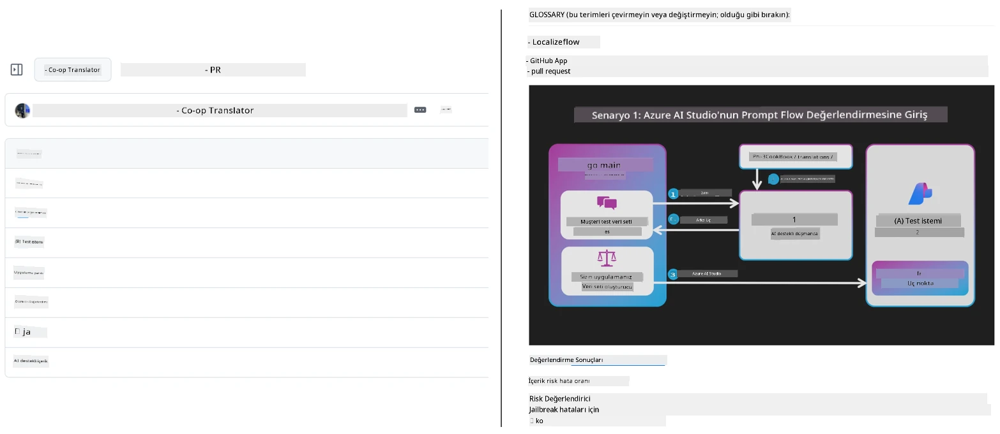
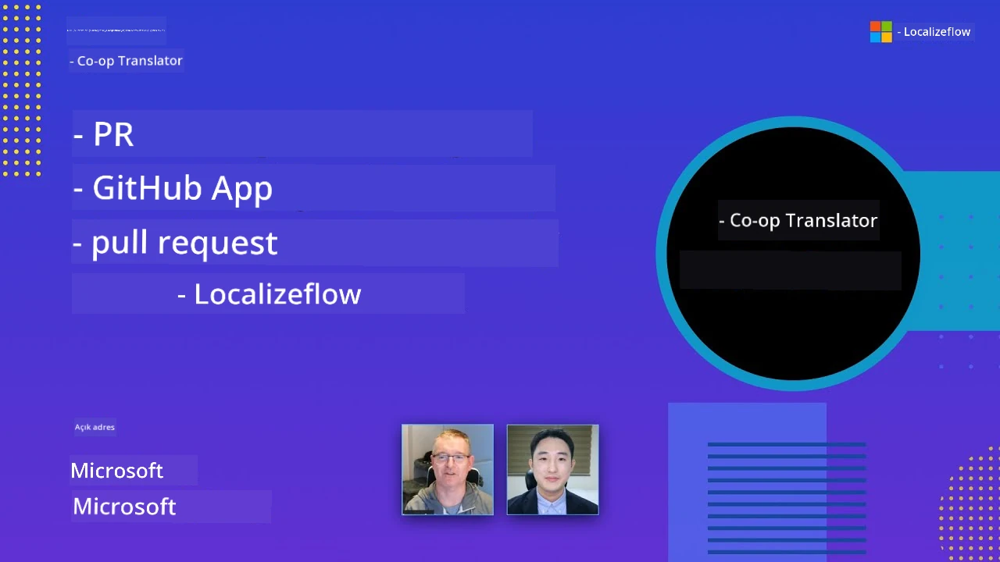

# Co-op Translator

_Projeniz geliştikçe eğitim amaçlı GitHub içeriğinizin birden fazla dilde çevirilerini kolayca otomatikleştirin ve bakımını yapın._


[](https://pypi.org/project/co-op-translator/)
[](https://github.com/azure/co-op-translator/blob/main/LICENSE)
[](https://pepy.tech/project/co-op-translator)
[](https://pepy.tech/project/co-op-translator)
[](https://github.com/azure/co-op-translator/pkgs/container/co-op-translator)
[](https://github.com/psf/black)

[](https://GitHub.com/azure/co-op-translator/graphs/contributors/)
[](https://GitHub.com/azure/co-op-translator/issues/)
[](https://GitHub.com/azure/co-op-translator/pulls/)
[](http://makeapullrequest.com)

### 🌐 Çok Dilli Destek

#### [Co-op Translator](https://github.com/Azure/Co-op-Translator) tarafından desteklenmektedir

<!-- CO-OP TRANSLATOR LANGUAGES TABLE START -->
[Arapça](../ar/README.md) | [Bengalce](../bn/README.md) | [Bulgarca](../bg/README.md) | [Burma Dili (Myanmar)](../my/README.md) | [Çince (Basitleştirilmiş)](../zh-CN/README.md) | [Çince (Geleneksel, Hong Kong)](../zh-HK/README.md) | [Çince (Geleneksel, Makao)](../zh-MO/README.md) | [Çince (Geleneksel, Tayvan)](../zh-TW/README.md) | [Hırvatça](../hr/README.md) | [Çekçe](../cs/README.md) | [Danca](../da/README.md) | [Felemenkçe](../nl/README.md) | [Estonca](../et/README.md) | [Fince](../fi/README.md) | [Fransızca](../fr/README.md) | [Almanca](../de/README.md) | [Yunanca](../el/README.md) | [İbranice](../he/README.md) | [Hintçe](../hi/README.md) | [Macarca](../hu/README.md) | [Endonezce](../id/README.md) | [İtalyanca](../it/README.md) | [Japonca](../ja/README.md) | [Kannada](../kn/README.md) | [Kmerce](../km/README.md) | [Korece](../ko/README.md) | [Litvanca](../lt/README.md) | [Malayca](../ms/README.md) | [Malayalam](../ml/README.md) | [Marathi](../mr/README.md) | [Nepalce](../ne/README.md) | [Nijerya Pidgin Dili](../pcm/README.md) | [Norveççe](../no/README.md) | [Farsça (Farsi)](../fa/README.md) | [Lehçe](../pl/README.md) | [Portekizce (Brezilya)](../pt-BR/README.md) | [Portekizce (Portekiz)](../pt-PT/README.md) | [Pencapça (Gurmukhi)](../pa/README.md) | [Rumence](../ro/README.md) | [Rusça](../ru/README.md) | [Sırpça (Kiril)](../sr/README.md) | [Slovakça](../sk/README.md) | [Slovence](../sl/README.md) | [İspanyolca](../es/README.md) | [Svahili](../sw/README.md) | [İsveççe](../sv/README.md) | [Tagalogca (Filipince)](../tl/README.md) | [Tamilce](../ta/README.md) | [Telugu](../te/README.md) | [Tayca](../th/README.md) | [Türkçe](./README.md) | [Ukraynaca](../uk/README.md) | [Urduca](../ur/README.md) | [Vietnamca](../vi/README.md)

> **Yerel Olarak Klonlamayı mı Tercih Edersiniz?**
>
> Bu depo, indirilen boyutu önemli ölçüde artıran 50’den fazla dil çevirisini içerir. Çeviriler olmadan klonlamak için seyrek checkout kullanın:
>
> **Bash / macOS / Linux:**
> ```bash
> git clone --filter=blob:none --sparse https://github.com/Azure/co-op-translator.git
> cd co-op-translator
> git sparse-checkout set --no-cone '/*' '!translations' '!translated_images'
> ```
>
> **CMD (Windows):**
> ```cmd
> git clone --filter=blob:none --sparse https://github.com/Azure/co-op-translator.git
> cd co-op-translator
> git sparse-checkout set --no-cone "/*" "!translations" "!translated_images"
> ```
>
> Bu, kursu tamamlamak için ihtiyaç duyduğunuz her şeyi çok daha hızlı indirmenizi sağlar.
<!-- CO-OP TRANSLATOR LANGUAGES TABLE END -->

[](https://GitHub.com/azure/co-op-translator/watchers/)
[](https://GitHub.com/azure/co-op-translator/network/)
[](https://GitHub.com/azure/co-op-translator/stargazers/)

[](https://discord.gg/nTYy5BXMWG)

[](https://codespaces.new/azure/co-op-translator)

## Genel Bakış

**Co-op Translator**, eğitim amaçlı GitHub içeriğinizi birden fazla dile zahmetsizce yerelleştirmenize yardımcı olur.  
Markdown dosyalarınızı, görsellerinizi veya not defterlerinizi güncellediğinizde, çeviriler otomatik olarak senkronize kalır ve içeriğinizin dünya çapındaki öğrenenler için doğru ve güncel kalmasını sağlar.

Çevrilmiş içeriğin nasıl organize edildiğine dair örnek:



## Çeviri durumu nasıl yönetilir

Co-op Translator, çevrilmiş içeriği **versiyonlanmış yazılım öğeleri** olarak yönetir,  
statik dosyalar olarak değil.

Araç, çevirisi yapılmış Markdown, görseller ve not defterlerinin durumunu  
**dile özgü meta veriler** kullanarak takip eder.

Bu tasarım Co-op Translator'a şunları sağlar:

- Güncel olmayan çevirileri güvenilir şekilde tespit etme  
- Markdown, görseller ve not defterlerini tutarlı biçimde ele alma  
- Büyük, hızlı hareket eden çok dilli depolarda güvenli ölçeklenebilirlik

Çevirileri yönetilen öğeler olarak modelleyerek,  
çeviri iş akışları doğrudan modern yazılım  
bağımlılık ve öğe yönetimi uygulamalarıyla uyum sağlar.

→ [Çeviri durumu nasıl yönetilir](https://techcommunity.microsoft.com/blog/azuredevcommunityblog/rethinking-documentation-translation-treating-translations-as-versioned-software/4491755)


## Hızlı başlangıç

```bash
# Sanal bir ortam oluşturun ve etkinleştirin (önerilir)
python -m venv .venv
# Windows
.venv\Scripts\activate
# macOS/Linux
source .venv/bin/activate
# Paketi yükleyin
pip install co-op-translator
# Çevir
translate -l "ko ja fr" -md
```

Docker:

```bash
# Genel imajı GHCR'den çek
docker pull ghcr.io/azure/co-op-translator:latest
# Mevcut klasör bağlanmış ve .env sağlanmış şekilde çalıştır (Bash/Zsh)
docker run --rm -it --env-file .env -v "${PWD}:/work" ghcr.io/azure/co-op-translator:latest -l "ko ja fr" -md
```

## Minimum kurulum

1. Desteklenen bir Python sürümüne sahip olduğunuzdan emin olun (şu anda 3.10-3.12). poetry (pyproject.toml) bunu otomatik olarak yönetir.  
2. Şablonu kullanarak bir `.env` dosyası oluşturun: [.env.template](../../.env.template)  
3. Bir LLM sağlayıcısı yapılandırın (Azure OpenAI veya OpenAI)  
4. (İsteğe bağlı) Görsel çevirisi için (`-img`), Azure AI Vision yapılandırın  
5. (İsteğe bağlı) `_1`, `_2` gibi son eklerle değişkenleri çoğaltarak birden fazla kimlik bilgisi seti yapılandırabilirsiniz. Bir setteki tüm değişkenler aynı son eki paylaşmalıdır.  
6. (Önerilen) Önceki çevirileri çakışmaları önlemek için temizleyin (örneğin, `translations/`)  
7. (Önerilen) README dosyanıza [README diller şablonunu](./getting_started/README_languages_template.md) kullanarak bir çeviri bölümü ekleyin  
8. Bkz: [Azure AI kurulum rehberi](./getting_started/set-up-azure-ai.md)

## Kullanım

Desteklenen tüm türleri çevir:

```bash
translate -l "ko ja"
```

Yalnızca Markdown:

```bash
translate -l "de" -md
```

Markdown + görseller:

```bash
translate -l "pt" -md -img
```

Yalnızca not defterleri:

```bash
translate -l "zh" -nb
```

Daha fazla bayrak: [Komut referansı](./getting_started/command-reference.md)

## Özellikler

- Markdown, not defterleri ve görseller için otomatik çeviri  
- Çevirileri kaynak değişikliklerle senkron tutar  
- Lokal (CLI) veya CI (GitHub Actions) içinde çalışır  
- Azure OpenAI veya OpenAI kullanır; görseller için opsiyonel Azure AI Vision  
- Markdown biçimlendirmesi ve yapısını korur  

## Dokümanlar

- [Komut satırı rehberi](./getting_started/command-line-guide/command-line-guide.md)  
- [GitHub Actions rehberi (Açık depolar ve standart gizli anahtarlar)](./getting_started/github-actions-guide/github-actions-guide-public.md)  
- [GitHub Actions rehberi (Microsoft organizasyon depoları ve org düzeyinde kurulumlar)](./getting_started/github-actions-guide/github-actions-guide-org.md)  
- [README dilleri şablonu](./getting_started/README_languages_template.md)  
- [Desteklenen diller](./getting_started/supported-languages.md)  
- [Katkıda bulunma](./CONTRIBUTING.md)  
- [Sorun giderme](./getting_started/troubleshooting.md)  

### Microsoft’a özgü rehber  
> [!NOTE]  
> Sadece Microsoft “Yeni Başlayanlar” depolarının bakımcıları için.

- [“Diğer kurslar” listesini güncelleme (sadece MS Yeni Başlayanlar depoları)](./getting_started/update-other-courses.md)

## Bizi destekleyin ve küresel öğrenmeyi teşvik edin

Eğitim içeriğinin dünya çapında paylaşılma şeklini devrim niteliğinde değiştirmemize katılın! [Co-op Translator](https://github.com/azure/co-op-translator) projesine GitHub’da ⭐ verin ve öğrenme ile teknoloji alanında dil engellerini kaldırma misyonumuzu destekleyin. İlginiz ve katkılarınız büyük fark yaratır! Kod katkıları ve özellik önerileri her zaman beklenmektedir.

### Microsoft eğitim içeriğini kendi dilinizde keşfedin

- [LangChain4j-for-Beginners](https://github.com/microsoft/LangChain4j-for-Beginners)  
- [AZD for Beginners](https://github.com/microsoft/AZD-for-beginners)  
- [Edge AI for Beginners](https://github.com/microsoft/edgeai-for-beginners)  
- [Model Context Protocol (MCP) For Beginners](https://github.com/microsoft/mcp-for-beginners)  
- [AI Agents for Beginners](https://github.com/microsoft/ai-agents-for-beginners)  
- [.NET ile Yeni Başlayanlar için Üretici AI](https://github.com/microsoft/Generative-AI-for-beginners-dotnet)  
- [Generative AI for Beginners](https://github.com/microsoft/generative-ai-for-beginners)  
- [Java ile Yeni Başlayanlar için Üretici AI](https://github.com/microsoft/generative-ai-for-beginners-java)  
- [ML for Beginners](https://aka.ms/ml-beginners)  
- [Data Science for Beginners](https://aka.ms/datascience-beginners)  
- [AI for Beginners](https://aka.ms/ai-beginners)  
- [Cybersecurity for Beginners](https://github.com/microsoft/Security-101)  
- [Web Geliştirme Yeni Başlayanlar için](https://aka.ms/webdev-beginners)  
- [IoT for Beginners](https://aka.ms/iot-beginners)  
- [PhiCookBook](https://github.com/microsoft/PhiCookBook)  

## Video sunumları

👉 YouTube’da izlemek için aşağıdaki görsele tıklayın.

- **Microsoft’ta Açık**: Co-op Translator’ın nasıl kullanılacağına dair kısa 18 dakikalık tanıtım ve hızlı kılavuz.

  [](https://www.youtube.com/watch?v=jX_swfH_KNU)

## Katkıda Bulunanlar

Bu proje katkı ve önerilere açıktır. Azure Co-op Translator’a katkıda bulunmak ister misiniz? Lütfen Co-op Translator’ı daha erişilebilir hale getirmek için nasıl yardımcı olabileceğinize dair rehberimizi okuyun: [CONTRIBUTING.md](./CONTRIBUTING.md)  

## Katkıda Bulunanlar
[](https://github.com/Azure/co-op-translator/graphs/contributors)

## Davranış Kuralları

Bu proje [Microsoft Açık Kaynak Davranış Kuralları](https://opensource.microsoft.com/codeofconduct/) kabul etmiştir.  
Daha fazla bilgi için [Davranış Kuralları SSS](https://opensource.microsoft.com/codeofconduct/faq/) sayfasına bakabilir veya herhangi bir ek soru ya da yorum için [opencode@microsoft.com](mailto:opencode@microsoft.com) adresiyle iletişime geçebilirsiniz.

## Sorumlu AI

Microsoft, müşterilerimizin AI ürünlerimizi sorumlu bir şekilde kullanmalarına yardımcı olmaya, öğrenimlerimizi paylaşmaya ve Transparency Notes ve Impact Assessments gibi araçlarla güvene dayalı ortaklıklar kurmaya kendini adamıştır. Bu kaynakların birçoğuna [https://aka.ms/RAI](https://aka.ms/RAI) adresinden ulaşabilirsiniz.  
Microsoft'un sorumlu AI yaklaşımı, adalet, güvenilirlik ve güvenlik, gizlilik ve güvenlik, kapsayıcılık, şeffaflık ve hesap verebilirlik AI prensiplerine dayanmaktadır.

Bu örnekte kullanılanlar gibi büyük ölçekli doğal dil, görüntü ve konuşma modelleri, potansiyel olarak haksız, güvenilmez veya saldırgan şekilde davranabilir ve bu da zararlara yol açabilir. Riskler ve sınırlamalar hakkında bilgi edinmek için lütfen [Azure OpenAI hizmeti Şeffaflık notunu](https://learn.microsoft.com/legal/cognitive-services/openai/transparency-note?tabs=text) inceleyin.

Bu riskleri azaltmak için önerilen yaklaşım, mimarinizde zararlı davranışı tespit edip engelleyebilen bir güvenlik sistemi bulundurmaktır. [Azure AI Content Safety](https://learn.microsoft.com/azure/ai-services/content-safety/overview), uygulamalarda ve hizmetlerde zararlı kullanıcı tarafından oluşturulan ve AI tarafından üretilen içeriği tespit edebilen bağımsız bir koruma katmanı sağlar. Azure AI Content Safety, zararlı materyali tespit etmenizi sağlayan metin ve görüntü API'lerini içerir. Ayrıca zarar verici içeriği farklı modlarda algılamaya yönelik örnek kodları görüntüleyip deneyebileceğiniz etkileşimli bir Content Safety Studio bulunmaktadır. Aşağıdaki [başlangıç belgeleri](https://learn.microsoft.com/azure/ai-services/content-safety/quickstart-text?tabs=visual-studio%2Clinux&pivots=programming-language-rest) size servise nasıl istek yapılacağını gösterir.

Dikkate alınması gereken bir diğer husus genel uygulama performansıdır. Çok modlu ve çok modeller içeren uygulamalarda performans, sistemin siz ve kullanıcılarınızın beklentileri doğrultusunda çalışması anlamına gelir; buna zararlı çıktı üretmemek de dahildir. Genel uygulamanızın performansını [üretim kalitesi ile risk ve güvenlik metriklerini](https://learn.microsoft.com/azure/ai-studio/concepts/evaluation-metrics-built-in) kullanarak değerlendirmeniz önemlidir.

AI uygulamanızı geliştirme ortamınızda [prompt flow SDK](https://microsoft.github.io/promptflow/index.html) ile değerlendirebilirsiniz. Test veri kümesi veya hedef verildiğinde, üretken AI uygulamanızın çıktılarını yerleşik ya da size özel değerlendiricilerle nicel olarak ölçer. Sisteminizin değerlendirmeye alınması için prompt flow sdk ile başlamak isterseniz, [hızlı başlangıç kılavuzunu](https://learn.microsoft.com/azure/ai-studio/how-to/develop/flow-evaluate-sdk) takip edebilirsiniz. Değerlendirme çalışması tamamlandıktan sonra, [sonuçları Azure AI Studio'da görselleştirebilirsiniz](https://learn.microsoft.com/azure/ai-studio/how-to/evaluate-flow-results).

## Ticari Markalar

Bu proje, projeler, ürünler veya hizmetler için ticari markalar veya logolar içerebilir. Microsoft ticari markaları veya logolarının yetkili kullanımı, [Microsoft'un Ticari Marka ve Marka Yönergeleri](https://www.microsoft.com/en-us/legal/intellectualproperty/trademarks/usage/general) uyarınca yapılmalıdır.  
Microsoft ticari markalarının veya logolarının üzerinde değişiklik yapılmış versiyonlarda kullanımı, karışıklığa yol açmamalı veya Microsoft sponsorluğunu ima etmemelidir.  
Üçüncü taraf ticari markaları veya logolarının kullanımı ise ilgili üçüncü taraf politikalarına tabidir.

## Yardım Alma

AI uygulamaları geliştirmekle ilgili takılırsanız veya sorunuz olursa, katılın:

[](https://discord.gg/nTYy5BXMWG)

Ürün geri bildirimi veya hata bildirimi için:

[](https://aka.ms/foundry/forum)

---

<!-- CO-OP TRANSLATOR DISCLAIMER START -->
**Feragatname**:  
Bu belge, AI çeviri hizmeti [Co-op Translator](https://github.com/Azure/co-op-translator) kullanılarak çevrilmiştir. Doğruluk için çaba göstermemize rağmen, otomatik çevirilerin hatalar veya yanlışlıklar içerebileceğini lütfen unutmayınız. Orijinal belge, kendi dilinde yetkili kaynak olarak kabul edilmelidir. Kritik bilgiler için profesyonel insan çevirisi önerilir. Bu çevirinin kullanımı sonucunda ortaya çıkabilecek herhangi bir yanlış anlama veya yanlış yorumdan sorumlu değiliz.
<!-- CO-OP TRANSLATOR DISCLAIMER END -->