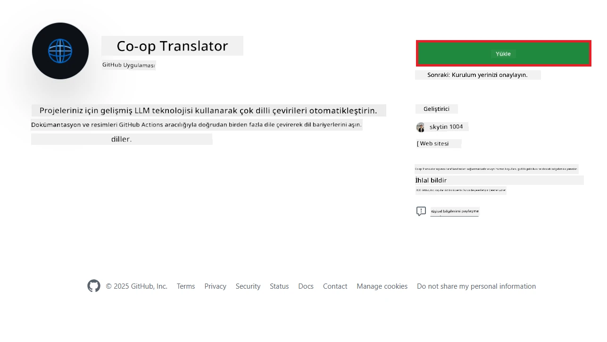
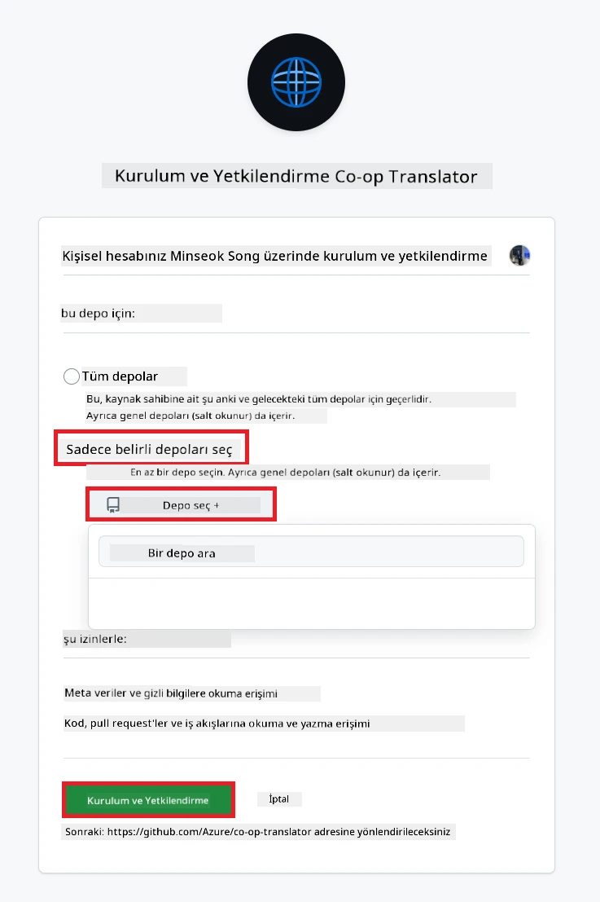
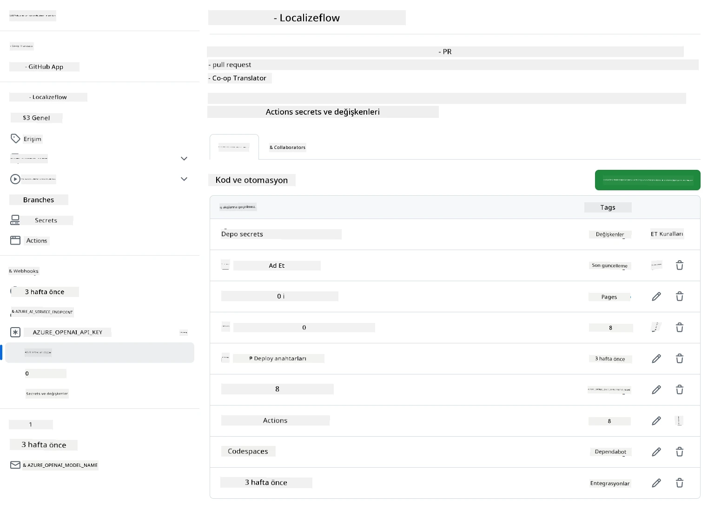

# Co-op Translator GitHub Action Kullanımı (Organizasyon Rehberi)

**Hedef Kitle:** Bu rehber, **Microsoft iç kullanıcıları** veya **önceden oluşturulmuş Co-op Translator GitHub Uygulamasına gerekli kimlik bilgilerine erişimi olan ekipler** ya da kendi özel GitHub Uygulamasını oluşturabilenler içindir.

Depo dokümantasyonunuzun çevirisini Co-op Translator GitHub Action ile zahmetsizce otomatikleştirin. Bu rehber, kaynak Markdown dosyalarınızda veya görsellerinizde değişiklik olduğunda otomatik olarak güncellenmiş çevirilerle pull request oluşturacak şekilde action'ı kurmanızı adım adım anlatır.

> [!IMPORTANT]
>
> **Doğru Rehberi Seçmek:**
>
> Bu rehber, **GitHub App ID ve Private Key** kullanarak kurulumu anlatır. Genellikle bu "Organizasyon Rehberi" yöntemine ihtiyacınız olur, eğer: **`GITHUB_TOKEN` İzinleri Kısıtlıysa:** Organizasyonunuz veya deponuz, standart `GITHUB_TOKEN`'a verilen varsayılan izinleri kısıtlıyorsa. Özellikle, `GITHUB_TOKEN` gerekli `write` izinlerine (ör. `contents: write` veya `pull-requests: write`) sahip değilse, [Genel Kurulum Rehberi](./github-actions-guide-public.md)'ndeki iş akışı yetersiz izinler nedeniyle başarısız olur. Özel olarak izin verilmiş bir GitHub Uygulaması kullanmak bu kısıtlamayı aşar.
>
> **Yukarıdaki durum size uymuyorsa:**
>
> Eğer standart `GITHUB_TOKEN` deponuzda yeterli izne sahipse (yani organizasyonel kısıtlamalar tarafından engellenmiyorsanız), lütfen **[GITHUB_TOKEN ile Genel Kurulum Rehberi](./github-actions-guide-public.md)**'ni kullanın. Genel rehberde App ID veya Private Key almanıza gerek yoktur, sadece standart `GITHUB_TOKEN` ve depo izinlerine dayanır.

## Ön Koşullar

GitHub Action'ı yapılandırmadan önce gerekli AI servis kimlik bilgilerine sahip olduğunuzdan emin olun.

**1. Zorunlu: AI Dil Modeli Kimlik Bilgileri**
En az bir desteklenen Dil Modeli için kimlik bilgilerine ihtiyacınız var:

- **Azure OpenAI**: Endpoint, API Key, Model/Deployment Adları, API Versiyonu gerektirir.
- **OpenAI**: API Key gerektirir, (Opsiyonel: Org ID, Base URL, Model ID).
- Detaylar için [Desteklenen Modeller ve Servisler](../../../../README.md) bölümüne bakın.
- Kurulum Rehberi: [Azure OpenAI Kurulumu](../set-up-resources/set-up-azure-openai.md).

**2. Opsiyonel: Bilgisayarla Görü (Computer Vision) Kimlik Bilgileri (Görsel Çevirisi için)**

- Sadece görsellerdeki metni çevirmek istiyorsanız gereklidir.
- **Azure Computer Vision**: Endpoint ve Abonelik Anahtarı gerektirir.
- Sağlanmazsa, action [Sadece Markdown modu](../markdown-only-mode.md)'nda çalışır.
- Kurulum Rehberi: [Azure Computer Vision Kurulumu](../set-up-resources/set-up-azure-computer-vision.md).

## Kurulum ve Yapılandırma

Co-op Translator GitHub Action'ı deponuzda yapılandırmak için aşağıdaki adımları izleyin:

### Adım 1: GitHub App Kimlik Doğrulamasını Kurun ve Yapılandırın

İş akışı, deponuzda güvenli bir şekilde işlem yapmak (ör. pull request oluşturmak) için GitHub App kimlik doğrulamasını kullanır. Bir seçenek seçin:

#### **Seçenek A: Hazır Co-op Translator GitHub Uygulamasını Kurun (Microsoft İç Kullanım için)**

1. [Co-op Translator GitHub App](https://github.com/apps/co-op-translator) sayfasına gidin.

1. **Install** seçeneğine tıklayın ve hedef deponuzun bulunduğu hesabı veya organizasyonu seçin.

    

1. **Only select repositories** seçeneğini işaretleyin ve hedef deponuzu seçin (ör. `PhiCookBook`). **Install**'a tıklayın. Kimlik doğrulamanız istenebilir.

    

1. **Uygulama Kimlik Bilgilerini Alın (İç Süreç Gerekli):** İş akışının uygulama olarak kimlik doğrulaması yapabilmesi için Co-op Translator ekibi tarafından sağlanan iki bilgiye ihtiyacınız var:
   - **App ID:** Co-op Translator uygulamasının benzersiz kimliği. App ID: `1164076`.
   - **Private Key:** Bakımcıdan aldığınız `.pem` private key dosyasının **tüm içeriğini** edinmelisiniz. **Bu anahtarı bir şifre gibi saklayın ve güvenli tutun.**

1. Adım 2'ye geçin.

#### **Seçenek B: Kendi Özel GitHub Uygulamanızı Kullanın**

- İsterseniz kendi GitHub Uygulamanızı oluşturup yapılandırabilirsiniz. İçeriklere ve Pull request'lere Okuma & yazma erişimi olduğundan emin olun. App ID ve oluşturulan Private Key gereklidir.

### Adım 2: Depo Sırlarını (Secrets) Yapılandırın

GitHub App kimlik bilgilerini ve AI servis kimlik bilgilerinizi deponuzun ayarlarında şifreli secret olarak eklemeniz gerekir.

1. Hedef GitHub deponuza gidin (ör. `PhiCookBook`).

1. **Settings** > **Secrets and variables** > **Actions** yolunu izleyin.

1. **Repository secrets** altında, aşağıda listelenen her bir secret için **New repository secret**'a tıklayın.

   

**Gerekli Sırlar (GitHub App Kimlik Doğrulaması için):**

| Secret Adı           | Açıklama                                         | Değer Kaynağı                                   |
| :------------------- | :----------------------------------------------- | :----------------------------------------------- |
| `GH_APP_ID`          | GitHub App'in App ID'si (Adım 1'den).            | GitHub App Ayarları                             |
| `GH_APP_PRIVATE_KEY` | İndirilen `.pem` dosyasının **tüm içeriği**.     | `.pem` dosyası (Adım 1'den)                     |

**AI Servis Sırları (Ön Koşullarınıza göre GEREKLİ OLANLARIN HEPSİNİ ekleyin):**

| Secret Adı                          | Açıklama                                 | Değer Kaynağı                  |
| :---------------------------------- | :--------------------------------------- | :----------------------------- |
| `AZURE_AI_SERVICE_API_KEY`            | Azure AI Servisi için anahtar (Computer Vision) | Azure AI Foundry               |
| `AZURE_AI_SERVICE_ENDPOINT`         | Azure AI Servisi için endpoint (Computer Vision) | Azure AI Foundry               |
| `AZURE_OPENAI_API_KEY`              | Azure OpenAI servisi için anahtar        | Azure AI Foundry               |
| `AZURE_OPENAI_ENDPOINT`             | Azure OpenAI servisi için endpoint       | Azure AI Foundry               |
| `AZURE_OPENAI_MODEL_NAME`           | Azure OpenAI Model Adınız                | Azure AI Foundry               |
| `AZURE_OPENAI_CHAT_DEPLOYMENT_NAME` | Azure OpenAI Dağıtım Adınız              | Azure AI Foundry               |
| `AZURE_OPENAI_API_VERSION`          | Azure OpenAI için API Versiyonu          | Azure AI Foundry               |
| `OPENAI_API_KEY`                    | OpenAI için API Anahtarı                 | OpenAI Platformu               |
| `OPENAI_ORG_ID`                     | OpenAI Organizasyon Kimliği              | OpenAI Platformu               |
| `OPENAI_CHAT_MODEL_ID`              | Belirli OpenAI model kimliği             | OpenAI Platformu               |
| `OPENAI_BASE_URL`                   | Özel OpenAI API Base URL                 | OpenAI Platformu               |



### Adım 3: Workflow Dosyasını Oluşturun

Son olarak, otomatik iş akışını tanımlayan YAML dosyasını oluşturun.

1. Deponuzun kök dizininde `.github/workflows/` klasörünü oluşturun (yoksa).

1. `.github/workflows/` içinde `co-op-translator.yml` adında bir dosya oluşturun.

1. Aşağıdaki içeriği co-op-translator.yml dosyasına yapıştırın.

```
name: Co-op Translator

on:
  push:
    branches:
      - main

jobs:
  co-op-translator:
    runs-on: ubuntu-latest

    permissions:
      contents: write
      pull-requests: write

    steps:
      - name: Checkout repository
        uses: actions/checkout@v4
        with:
          fetch-depth: 0

      - name: Set up Python
        uses: actions/setup-python@v4
        with:
          python-version: '3.10'

      - name: Install Co-op Translator
        run: |
          python -m pip install --upgrade pip
          pip install co-op-translator

      - name: Run Co-op Translator
        env:
          PYTHONIOENCODING: utf-8
          # Azure AI Service Credentials
          AZURE_AI_SERVICE_API_KEY: ${{ secrets.AZURE_AI_SERVICE_API_KEY }}
          AZURE_AI_SERVICE_ENDPOINT: ${{ secrets.AZURE_AI_SERVICE_ENDPOINT }}

          # Azure OpenAI Credentials
          AZURE_OPENAI_API_KEY: ${{ secrets.AZURE_OPENAI_API_KEY }}
          AZURE_OPENAI_ENDPOINT: ${{ secrets.AZURE_OPENAI_ENDPOINT }}
          AZURE_OPENAI_MODEL_NAME: ${{ secrets.AZURE_OPENAI_MODEL_NAME }}
          AZURE_OPENAI_CHAT_DEPLOYMENT_NAME: ${{ secrets.AZURE_OPENAI_CHAT_DEPLOYMENT_NAME }}
          AZURE_OPENAI_API_VERSION: ${{ secrets.AZURE_OPENAI_API_VERSION }}

          # OpenAI Credentials
          OPENAI_API_KEY: ${{ secrets.OPENAI_API_KEY }}
          OPENAI_ORG_ID: ${{ secrets.OPENAI_ORG_ID }}
          OPENAI_CHAT_MODEL_ID: ${{ secrets.OPENAI_CHAT_MODEL_ID }}
          OPENAI_BASE_URL: ${{ secrets.OPENAI_BASE_URL }}
        run: |
          # =====================================================================
          # IMPORTANT: Set your target languages here (REQUIRED CONFIGURATION)
          # =====================================================================
          # Example: Translate to Spanish, French, German. Add -y to auto-confirm.
          translate -l "es fr de" -y  # <--- MODIFY THIS LINE with your desired languages

      - name: Authenticate GitHub App
        id: generate_token
        uses: tibdex/github-app-token@v1
        with:
          app_id: ${{ secrets.GH_APP_ID }}
          private_key: ${{ secrets.GH_APP_PRIVATE_KEY }}

      - name: Create Pull Request with translations
        uses: peter-evans/create-pull-request@v5
        with:
          token: ${{ steps.generate_token.outputs.token }}
          commit-message: "🌐 Update translations via Co-op Translator"
          title: "🌐 Update translations via Co-op Translator"
          body: |
            This PR updates translations for recent changes to the main branch.

            ### 📋 Changes included
            - Translated contents are available in the `translations/` directory
            - Translated images are available in the `translated_images/` directory

            ---
            🌐 Automatically generated by the [Co-op Translator](https://github.com/Azure/co-op-translator) GitHub Action.
          branch: update-translations
          base: main
          labels: translation, automated-pr
          delete-branch: true
          add-paths: |
            translations/
            translated_images/

```

4.  **İş Akışını Özelleştirin:**
   - **[!IMPORTANT] Hedef Diller:** `Run Co-op Translator` adımında, `translate -l "..." -y` komutundaki dil kodları listesini **projenizin gereksinimlerine göre gözden geçirip değiştirmeniz GEREKİR**. Örnek listeyi (`ar de es...`) kendi listenizle değiştirin veya düzenleyin.
   - **Tetikleyici (`on:`):** Mevcut tetikleyici her `main` dalına push'ta çalışır. Büyük depolarda, iş akışını yalnızca ilgili dosyalar (ör. kaynak dokümantasyon) değiştiğinde çalıştırmak için bir `paths:` filtresi eklemeyi düşünün (YAML'deki yorumlu örneğe bakın), böylece runner dakikalarından tasarruf edersiniz.
   - **PR Detayları:** Gerekirse `Create Pull Request` adımındaki `commit-message`, `title`, `body`, `branch` adı ve `labels`'ı özelleştirin.

## Kimlik Bilgisi Yönetimi ve Yenileme

- **Güvenlik:** Hassas kimlik bilgilerini (API anahtarları, private key'ler) her zaman GitHub Actions secret'ı olarak saklayın. Bunları workflow dosyanızda veya depo kodunda asla açık etmeyin.
- **[!IMPORTANT] Anahtar Yenileme (Microsoft İç Kullanıcılar):** Microsoft içinde kullanılan Azure OpenAI anahtarının zorunlu yenileme politikası olabilir (ör. her 5 ayda bir). İlgili GitHub secret'larını (`AZURE_OPENAI_...` anahtarları) **süresi dolmadan önce** güncellediğinizden emin olun, aksi halde iş akışı başarısız olur.

## İş Akışını Çalıştırma

> [!WARNING]  
> **GitHub Barındırılan Runner Zaman Sınırı:**  
> `ubuntu-latest` gibi GitHub barındırılan runner'lar için **maksimum çalışma süresi 6 saattir**.  
> Büyük dokümantasyon depolarında, çeviri işlemi 6 saati aşarsa iş akışı otomatik olarak sonlandırılır.  
> Bunu önlemek için:  
> - **Kendi runner'ınızı** kullanın (süre sınırı yoktur)  
> - Her çalıştırmada hedef dil sayısını azaltın

`co-op-translator.yml` dosyası ana dalınıza (veya `on:` tetikleyicisinde belirtilen dala) eklendikten sonra, bu dala yapılan her değişiklikte (ve varsa `paths` filtresiyle eşleşiyorsa) iş akışı otomatik olarak çalışacaktır.

Çeviriler oluşturulursa veya güncellenirse, action otomatik olarak değişiklikleri içeren bir Pull Request açar ve incelemeniz ve birleştirmeniz için hazır hale getirir.

---

**Feragatname**:
Bu belge, AI çeviri hizmeti [Co-op Translator](https://github.com/Azure/co-op-translator) kullanılarak çevrilmiştir. Doğruluk için çaba göstersek de, otomatik çevirilerde hata veya yanlışlıklar olabileceğini lütfen unutmayın. Belgenin orijinal dili, yetkili kaynak olarak kabul edilmelidir. Kritik bilgiler için profesyonel insan çevirisi önerilir. Bu çevirinin kullanımından doğabilecek herhangi bir yanlış anlama veya yanlış yorumdan sorumlu değiliz.