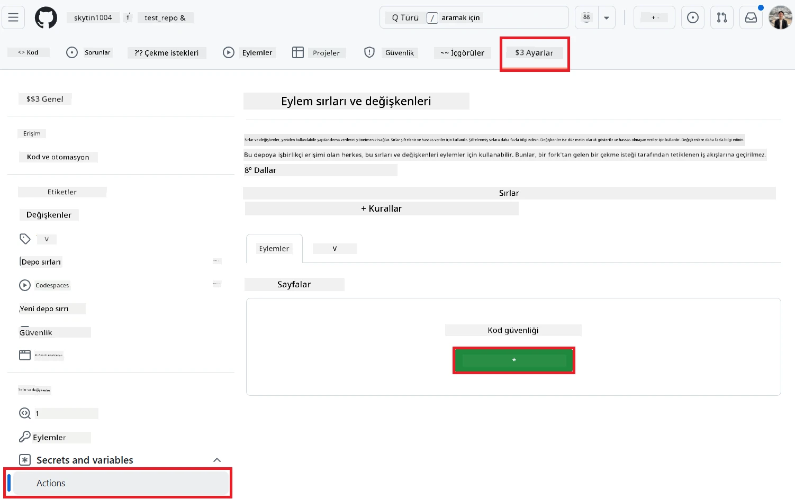
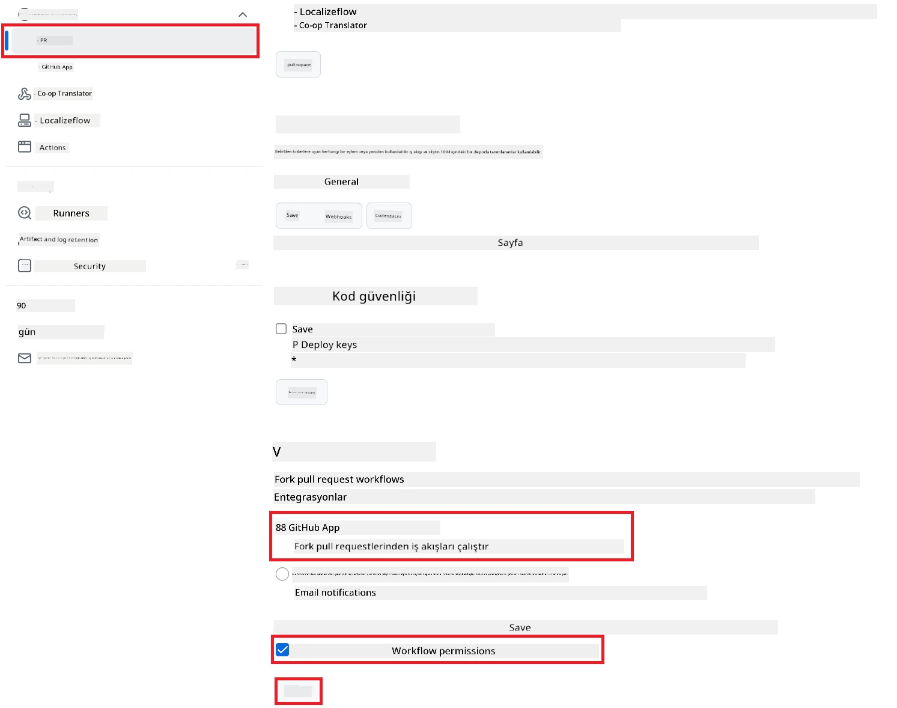

# Co-op Translator GitHub Action'ı Kullanma (Genel Kurulum)

**Hedef Kitle:** Bu rehber, standart GitHub Actions izinlerinin yeterli olduğu çoğu genel veya özel depoda kullanılmak üzere hazırlanmıştır. Dahili `GITHUB_TOKEN` kullanılır.

Depo dokümantasyonunuzu otomatik olarak çevirmek için Co-op Translator GitHub Action'ı kolayca kurabilirsiniz. Bu rehber, kaynak Markdown dosyalarınız veya görselleriniz değiştiğinde otomatik olarak güncellenmiş çevirilerle pull request oluşturan action'ın kurulumunu adım adım anlatır.

> [!IMPORTANT]
>
> **Doğru Rehberi Seçmek:**
>
> Bu rehber, **standart `GITHUB_TOKEN` ile yapılan daha basit kurulumu** anlatır. Hassas GitHub App Private Key'leriyle uğraşmak gerekmediği için çoğu kullanıcı için önerilen yöntem budur.
>

## Ön Gereksinimler

GitHub Action'ı yapılandırmadan önce gerekli yapay zeka servis kimlik bilgilerine sahip olduğunuzdan emin olun.

**1. Zorunlu: Yapay Zeka Dil Modeli Kimlik Bilgileri**
Desteklenen dil modellerinden en az biri için kimlik bilgilerine ihtiyacınız var:

- **Azure OpenAI**: Endpoint, API Key, Model/Deployment Adları, API Versiyonu gerektirir.
- **OpenAI**: API Key gereklidir, (İsteğe bağlı: Org ID, Base URL, Model ID).
- Detaylar için [Desteklenen Modeller ve Servisler](../../../../README.md) bölümüne bakabilirsiniz.

**2. İsteğe Bağlı: Yapay Zeka Görsel Kimlik Bilgileri (Görsel Çevirisi için)**

- Sadece görsellerdeki metni çevirmek istiyorsanız gereklidir.
- **Azure AI Vision**: Endpoint ve Subscription Key gerektirir.
- Sağlanmazsa, action [Sadece Markdown modu](../markdown-only-mode.md) ile çalışır.

## Kurulum ve Yapılandırma

Standart `GITHUB_TOKEN` kullanarak Co-op Translator GitHub Action'ı deponuzda yapılandırmak için aşağıdaki adımları izleyin.

### 1. Adım: Kimlik Doğrulamayı Anlayın (`GITHUB_TOKEN` Kullanımı)

Bu iş akışı, GitHub Actions tarafından sağlanan dahili `GITHUB_TOKEN` kullanır. Bu token, **3. Adımda** yapılandırılan ayarlara göre workflow'un deponuzla etkileşime geçmesi için otomatik olarak izin verir.

### 2. Adım: Depo Gizli Anahtarlarını Yapılandırın

Sadece **yapay zeka servis kimlik bilgilerinizi** depo ayarlarında şifreli gizli anahtarlar olarak eklemeniz gerekir.

1.  Hedef GitHub deponuza gidin.
2.  **Settings** > **Secrets and variables** > **Actions** yolunu izleyin.
3.  **Repository secrets** altında, aşağıda listelenen her bir gerekli yapay zeka servisi için **New repository secret** butonuna tıklayın.

     *(Görsel Açıklaması: Gizli anahtarların nereden ekleneceğini gösterir)*

**Gerekli Yapay Zeka Servis Gizli Anahtarları (Ön Gereksinimlerinize göre UYGUN OLANLARIN HEPSİNİ ekleyin):**

| Gizli Anahtar Adı                         | Açıklama                               | Değer Kaynağı                     |
| :---------------------------------------- | :------------------------------------- | :--------------------------------- |
| `AZURE_AI_SERVICE_API_KEY`                | Azure AI Servisi için anahtar (Computer Vision)  | Azure AI Foundry'niz               |
| `AZURE_AI_SERVICE_ENDPOINT`               | Azure AI Servisi için endpoint (Computer Vision) | Azure AI Foundry'niz               |
| `AZURE_OPENAI_API_KEY`                    | Azure OpenAI servisi için anahtar              | Azure AI Foundry'niz               |
| `AZURE_OPENAI_ENDPOINT`                   | Azure OpenAI servisi için endpoint             | Azure AI Foundry'niz               |
| `AZURE_OPENAI_MODEL_NAME`                 | Azure OpenAI Model Adınız                      | Azure AI Foundry'niz               |
| `AZURE_OPENAI_CHAT_DEPLOYMENT_NAME`       | Azure OpenAI Deployment Adınız                 | Azure AI Foundry'niz               |
| `AZURE_OPENAI_API_VERSION`                | Azure OpenAI için API Versiyonu                | Azure AI Foundry'niz               |
| `OPENAI_API_KEY`                          | OpenAI için API Anahtarı                       | OpenAI Platformunuz                |
| `OPENAI_ORG_ID`                           | OpenAI Organizasyon ID (İsteğe bağlı)          | OpenAI Platformunuz                |
| `OPENAI_CHAT_MODEL_ID`                    | Belirli OpenAI model ID (İsteğe bağlı)         | OpenAI Platformunuz                |
| `OPENAI_BASE_URL`                         | Özel OpenAI API Base URL (İsteğe bağlı)        | OpenAI Platformunuz                |

### 3. Adım: Workflow İzinlerini Yapılandırın

GitHub Action'ın kodu çekebilmesi ve pull request oluşturabilmesi için `GITHUB_TOKEN` ile izin verilmesi gerekir.

1.  Deponuzda **Settings** > **Actions** > **General** yolunu izleyin.
2.  **Workflow permissions** bölümüne kadar aşağı kaydırın.
3.  **Read and write permissions** seçeneğini işaretleyin. Bu, workflow için gerekli olan `contents: write` ve `pull-requests: write` izinlerini verir.
4.  **Allow GitHub Actions to create and approve pull requests** kutusunun **işaretli** olduğundan emin olun.
5.  **Save** seçeneğine tıklayın.



### 4. Adım: Workflow Dosyasını Oluşturun

Son olarak, `GITHUB_TOKEN` kullanarak otomatik workflow'u tanımlayan YAML dosyasını oluşturun.

1.  Depo kök dizininde `.github/workflows/` klasörünü oluşturun (yoksa).
2.  `.github/workflows/` içinde `co-op-translator.yml` adında bir dosya oluşturun.
3.  Aşağıdaki içeriği `co-op-translator.yml` dosyasına yapıştırın.

```yaml
name: Co-op Translator

on:
  push:
    branches:
      - main

jobs:
  co-op-translator:
    runs-on: ubuntu-latest

    permissions:
      contents: write
      pull-requests: write

    steps:
      - name: Checkout repository
        uses: actions/checkout@v4
        with:
          fetch-depth: 0

      - name: Set up Python
        uses: actions/setup-python@v4
        with:
          python-version: '3.10'

      - name: Install Co-op Translator
        run: |
          python -m pip install --upgrade pip
          pip install co-op-translator

      - name: Run Co-op Translator
        env:
          PYTHONIOENCODING: utf-8
          # === AI Service Credentials ===
          AZURE_AI_SERVICE_API_KEY: ${{ secrets.AZURE_AI_SERVICE_API_KEY }}
          AZURE_AI_SERVICE_ENDPOINT: ${{ secrets.AZURE_AI_SERVICE_ENDPOINT }}
          AZURE_OPENAI_API_KEY: ${{ secrets.AZURE_OPENAI_API_KEY }}
          AZURE_OPENAI_ENDPOINT: ${{ secrets.AZURE_OPENAI_ENDPOINT }}
          AZURE_OPENAI_MODEL_NAME: ${{ secrets.AZURE_OPENAI_MODEL_NAME }}
          AZURE_OPENAI_CHAT_DEPLOYMENT_NAME: ${{ secrets.AZURE_OPENAI_CHAT_DEPLOYMENT_NAME }}
          AZURE_OPENAI_API_VERSION: ${{ secrets.AZURE_OPENAI_API_VERSION }}
          OPENAI_API_KEY: ${{ secrets.OPENAI_API_KEY }}
          OPENAI_ORG_ID: ${{ secrets.OPENAI_ORG_ID }}
          OPENAI_CHAT_MODEL_ID: ${{ secrets.OPENAI_CHAT_MODEL_ID }}
          OPENAI_BASE_URL: ${{ secrets.OPENAI_BASE_URL }}
        run: |
          # =====================================================================
          # IMPORTANT: Set your target languages here (REQUIRED CONFIGURATION)
          # =====================================================================
          # Example: Translate to Spanish, French, German. Add -y to auto-confirm.
          translate -l "es fr de" -y  # <--- MODIFY THIS LINE with your desired languages

      - name: Create Pull Request with translations
        uses: peter-evans/create-pull-request@v5
        with:
          token: ${{ secrets.GITHUB_TOKEN }}
          commit-message: "🌐 Update translations via Co-op Translator"
          title: "🌐 Update translations via Co-op Translator"
          body: |
            This PR updates translations for recent changes to the main branch.

            ### 📋 Changes included
            - Translated contents are available in the `translations/` directory
            - Translated images are available in the `translated_images/` directory

            ---
            🌐 Automatically generated by the [Co-op Translator](https://github.com/Azure/co-op-translator) GitHub Action.
          branch: update-translations
          base: main
          labels: translation, automated-pr
          delete-branch: true
          add-paths: |
            translations/
            translated_images/
```
4.  **Workflow'u Özelleştirin:**
  - **[!IMPORTANT] Hedef Diller:** `Run Co-op Translator` adımında, `translate -l "..." -y` komutundaki dil kodları listesini **projenizin gereksinimlerine göre gözden geçirip düzenlemeniz gerekir**. Örnek listedeki (`ar de es...`) dilleri değiştirmeniz veya ayarlamanız gerekir.
  - **Tetikleyici (`on:`):** Mevcut tetikleyici her `main` dalına yapılan push'ta çalışır. Büyük depolarda, workflow'un sadece ilgili dosyalar (örneğin kaynak dokümantasyon) değiştiğinde çalışması için bir `paths:` filtresi eklemeyi düşünebilirsiniz (YAML'deki yorumlu örneğe bakın), böylece runner dakikalarından tasarruf edersiniz.
  - **PR Detayları:** Gerekirse `Create Pull Request` adımındaki `commit-message`, `title`, `body`, `branch` adı ve `labels` alanlarını özelleştirin.

## Workflow'u Çalıştırmak

> [!WARNING]  
> **GitHub-hosted Runner Zaman Sınırı:**  
> `ubuntu-latest` gibi GitHub tarafından barındırılan runner'lar için **maksimum çalışma süresi 6 saattir**.  
> Büyük dokümantasyon depolarında, çeviri işlemi 6 saati aşarsa workflow otomatik olarak sonlandırılır.  
> Bunu önlemek için:  
> - **Kendi runner'ınızı** kullanabilirsiniz (süre sınırı yok)  
> - Her çalıştırmada hedef dil sayısını azaltabilirsiniz

`co-op-translator.yml` dosyası ana dalınıza (veya `on:` tetikleyicisinde belirtilen dala) eklendikten sonra, bu dala yapılan değişikliklerde (ve varsa `paths` filtresiyle eşleşen dosyalarda) workflow otomatik olarak çalışacaktır.

---

**Feragatname**:
Bu belge, AI çeviri hizmeti [Co-op Translator](https://github.com/Azure/co-op-translator) kullanılarak çevrilmiştir. Doğruluk için çaba göstersek de, otomatik çevirilerde hata veya yanlışlıklar olabileceğini lütfen unutmayın. Belgenin orijinal dili, yetkili kaynak olarak kabul edilmelidir. Kritik bilgiler için profesyonel insan çevirisi önerilir. Bu çevirinin kullanımından doğabilecek herhangi bir yanlış anlama veya yanlış yorumlamadan sorumlu değiliz.