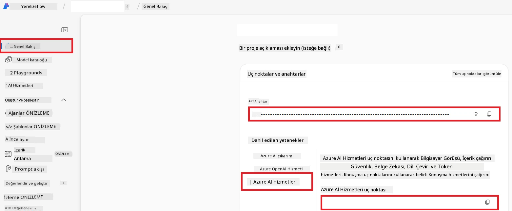

# Co-op Translator için Azure AI Kurulumu (Azure OpenAI & Azure AI Vision)

Bu kılavuz, Azure AI Foundry içinde dil çevirisi için Azure OpenAI'yi ve görüntü tabanlı çeviri için kullanılabilecek Azure Bilgisayarlı Görü için görüntü içerik analizini kurmanıza yardımcı olur.

**Önkoşullar:**
- Aktif aboneliği olan bir Azure hesabı.
- Azure aboneliğinizde kaynaklar ve dağıtımlar oluşturmak için yeterli izinler.

## Azure AI Projesi Oluşturma

AI kaynaklarınızı yönetmek için merkezi bir yer olarak işlev gören Azure AI Projesi oluşturarak başlayacaksınız.

1. [https://ai.azure.com](https://ai.azure.com) adresine gidin ve Azure hesabınızla giriş yapın.

1. Yeni bir proje oluşturmak için **+Create** seçeneğini tıklayın.

1. Aşağıdaki görevleri yapın:
   - Bir **Proje adı** girin (örneğin, `CoopTranslator-Project`).
   - **AI hub** seçin (örneğin, `CoopTranslator-Hub`) (Gerekirse yenisini oluşturun).

1. Projenizi kurmak için "**Review and Create**" tıklayın. Projenizin genel bakış sayfasına yönlendirileceksiniz.

## Dil Çevirisi için Azure OpenAI Kurulumu

Projeniz içinde, metin çevirisi arka ucu olarak hizmet verecek bir Azure OpenAI modeli dağıtacaksınız.

### Projenize Gidin

Henüz yapmadıysanız, yeni oluşturduğunuz projeyi (örneğin `CoopTranslator-Project`) Azure AI Foundry içinde açın.

### Bir OpenAI Modeli Dağıtın

1. Projenizin sol menüsünde, "My assets" altında "**Models + endpoints**" seçeneğini seçin.

1. **+ Deploy model** seçeneğini seçin.

1. **Deploy Base Model** seçeneğini seçin.

1. Kullanılabilir modellerin listesi gösterilecektir. Uygun bir GPT modeli filtreleyin veya arayın. `gpt-4o` modelini öneriyoruz.

1. İstediğiniz modeli seçin ve **Confirm** tıklayın.

1. **Deploy** seçeneğini seçin.

### Azure OpenAI yapılandırması

Dağıtıldıktan sonra, "**Models + endpoints**" sayfasından dağıtımınızı seçerek **REST endpoint URL'si**, **Anahtar**, **Dağıtım adı**, **Model adı** ve **API sürümü** gibi bilgileri görebilirsiniz. Bunlar çeviri modelini uygulamanıza entegre etmek için gereklidir.

> [!NOTE]
> Gereksinimlerinize bağlı olarak API sürümlerini [API version deprecation](https://learn.microsoft.com/azure/ai-services/openai/api-version-deprecation) sayfasından seçebilirsiniz. **API sürümü**'nün Azure AI Foundry'deki "**Models + endpoints**" sayfasında gösterilen **Model sürümü**nden farklı olduğunu unutmayın.

## Görüntü Çevirisi için Azure Bilgisayarlı Görü Kurulumu

Görüntülerdeki metnin çevirisini etkinleştirmek için Azure AI Hizmeti API Anahtarı ve Uç Noktası'nı bulmanız gerekir.

1. Azure AI Projenize (örneğin `CoopTranslator-Project`) gidin. Proje genel bakış sayfasında olduğunuzdan emin olun.

### Azure AI Hizmeti yapılandırması

Azure AI Hizmeti sekmesinden API Anahtarı ve Uç Noktayı bulun.

1. Azure AI Projenize (örneğin `CoopTranslator-Project`) gidin. Proje genel bakış sayfasında olduğunuzdan emin olun.

1. Azure AI Hizmeti sekmesinden **API Key** ve **Endpoint** bulun.

    

Bu bağlantı, ilişkilendirilen Azure AI Hizmetleri kaynağının özelliklerini (görüntü analizi dahil) AI Foundry projenizde kullanılabilir hale getirir. Ardından, not defterlerinizde veya uygulamalarınızda bu bağlantıyı kullanarak görüntülerden metin çıkarabilir ve bu metni sonrasında Azure OpenAI modeline çeviri için gönderebilirsiniz.

## Kimlik Bilgilerinizi Konsolide Etme

Şimdiye kadar aşağıdakileri toplamanız gerekir:

**Azure OpenAI için (Metin Çevirisi):**
- Azure OpenAI Uç Noktası
- Azure OpenAI API Anahtarı
- Azure OpenAI Model Adı (örneğin, `gpt-4o`)
- Azure OpenAI Dağıtım Adı (örneğin, `cooptranslator-gpt4o`)
- Azure OpenAI API Sürümü

**Azure AI Hizmetleri için (Vision ile Görüntü Metni Çıkarımı):**
- Azure AI Hizmeti Uç Noktası
- Azure AI Hizmeti API Anahtarı

### Örnek: Ortam Değişkeni Yapılandırması (Önizleme)

Daha sonra uygulamanızı oluştururken, muhtemelen topladığınız bu kimlik bilgilerini kullanarak yapılandıracaksınız. Örneğin, aşağıdaki gibi ortam değişkenleri ayarlayabilirsiniz:

```bash
# Azure AI Hizmet Kimlik Bilgileri (Görüntü çevirisi için gereklidir)
AZURE_AI_SERVICE_API_KEY="your_azure_ai_service_api_key" # Örneğin, 21xasd...
AZURE_AI_SERVICE_ENDPOINT="https://your_azure_ai_service_endpoint.cognitiveservices.azure.com/"

# İsteğe bağlı yedek setler: "_1/_2" son ekiyle çift değişkenler (tüm değişkenler için aynı indeksle)
AZURE_AI_SERVICE_API_KEY_1="your_azure_ai_service_api_key_1"
AZURE_AI_SERVICE_ENDPOINT_1="https://your_azure_ai_service_endpoint_1.cognitiveservices.azure.com/"

# Azure OpenAI Kimlik Bilgileri (Metin çevirisi için gereklidir)
AZURE_OPENAI_API_KEY="your_azure_openai_api_key" # Örneğin, 21xasd...
AZURE_OPENAI_ENDPOINT="https://your_azure_openai_endpoint.openai.azure.com/"
AZURE_OPENAI_MODEL_NAME="your_model_name" # Örneğin, gpt-4o
AZURE_OPENAI_CHAT_DEPLOYMENT_NAME="your_deployment_name" # Örneğin, cooptranslator-gpt4o
AZURE_OPENAI_API_VERSION="your_api_version" # Örneğin, 2024-12-01-preview

# İsteğe bağlı yedek setler: AZURE_OPENAI_* setinin tamamını "_1/_2" son ekiyle çoğaltın (tüm değişkenler için aynı indeks)
```

---

### Daha Fazla Okuma

- [Azure AI Foundry'de proje oluşturma](https://learn.microsoft.com/azure/ai-foundry/how-to/create-projects?tabs=ai-studio)
- [Azure AI kaynakları oluşturma](https://learn.microsoft.com/azure/ai-foundry/how-to/create-azure-ai-resource?tabs=portal)
- [Azure AI Foundry'de OpenAI modellerini dağıtma](https://learn.microsoft.com/en-us/azure/ai-foundry/how-to/deploy-models-openai)

---

<!-- CO-OP TRANSLATOR DISCLAIMER START -->
**Feragat**:  
Bu belge, AI çeviri servisi [Co-op Translator](https://github.com/Azure/co-op-translator) kullanılarak çevrilmiştir. Doğruluk için çaba göstersek de, otomatik çevirilerin hata veya yanlışlık içerebileceğini lütfen unutmayın. Orijinal belge, kendi dilinde yetkili kaynak olarak kabul edilmelidir. Önemli bilgiler için profesyonel insan çevirisi önerilir. Bu çevirinin kullanımından doğabilecek herhangi bir yanlış anlama veya yanlış yorumdan sorumlu değiliz.
<!-- CO-OP TRANSLATOR DISCLAIMER END -->