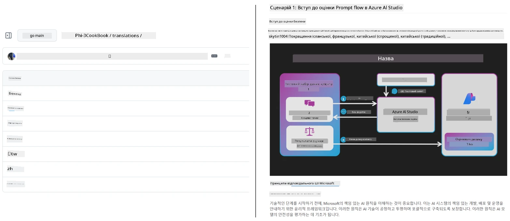

# Co-op Translator

_Легко автоматизуйте та підтримуйте переклади вашого навчального контенту на GitHub кількома мовами в міру розвитку вашого проєкту._


[](https://pypi.org/project/co-op-translator/)
[](https://github.com/azure/co-op-translator/blob/main/LICENSE)
[](https://pepy.tech/project/co-op-translator)
[](https://pepy.tech/project/co-op-translator)
[](https://github.com/azure/co-op-translator/pkgs/container/co-op-translator)
[](https://github.com/psf/black)

[](https://GitHub.com/azure/co-op-translator/graphs/contributors/)
[](https://GitHub.com/azure/co-op-translator/issues/)
[](https://GitHub.com/azure/co-op-translator/pulls/)
[](http://makeapullrequest.com)

### 🌐 Підтримка багатомовності

#### Підтримується [Co-op Translator](https://github.com/Azure/Co-op-Translator)

<!-- CO-OP TRANSLATOR LANGUAGES TABLE START -->
[Арабська](../ar/README.md) | [Бенгальська](../bn/README.md) | [Болгарська](../bg/README.md) | [Бирманська (М’янма)](../my/README.md) | [Китайська (спрощена)](../zh-CN/README.md) | [Китайська (традиційна, Гонконг)](../zh-HK/README.md) | [Китайська (традиційна, Макао)](../zh-MO/README.md) | [Китайська (традиційна, Тайвань)](../zh-TW/README.md) | [Хорватська](../hr/README.md) | [Чеська](../cs/README.md) | [Датська](../da/README.md) | [Голландська](../nl/README.md) | [Естонська](../et/README.md) | [Фінська](../fi/README.md) | [Французька](../fr/README.md) | [Німецька](../de/README.md) | [Грецька](../el/README.md) | [Іврит](../he/README.md) | [Гінді](../hi/README.md) | [Угорська](../hu/README.md) | [Індонезійська](../id/README.md) | [Італійська](../it/README.md) | [Японська](../ja/README.md) | [Каннада](../kn/README.md) | [Кхмер](../km/README.md) | [Корейська](../ko/README.md) | [Литовська](../lt/README.md) | [Малайська](../ms/README.md) | [Малаялам](../ml/README.md) | [Маратхі](../mr/README.md) | [Непальська](../ne/README.md) | [Нігерійський пиджин](../pcm/README.md) | [Норвезька](../no/README.md) | [Перська (Фарсі)](../fa/README.md) | [Польська](../pl/README.md) | [Португальська (Бразилія)](../pt-BR/README.md) | [Португальська (Португалія)](../pt-PT/README.md) | [Панджабі (Гурмухі)](../pa/README.md) | [Румунська](../ro/README.md) | [Російська](../ru/README.md) | [Сербська (кирилиця)](../sr/README.md) | [Словацька](../sk/README.md) | [Словенська](../sl/README.md) | [Іспанська](../es/README.md) | [Свахілі](../sw/README.md) | [Шведська](../sv/README.md) | [Тагальська (Філіппінська)](../tl/README.md) | [Тамільська](../ta/README.md) | [Телугу](../te/README.md) | [Тайська](../th/README.md) | [Турецька](../tr/README.md) | [Українська](./README.md) | [Урду](../ur/README.md) | [В’єтнамська](../vi/README.md)

> **Віддаєте перевагу клонувати локально?**
>
> Цей репозиторій містить переклади понад 50 мов, що значно збільшує розмір завантаження. Щоб клонувати без перекладів, використайте sparse checkout:
>
> **Bash / macOS / Linux:**
> ```bash
> git clone --filter=blob:none --sparse https://github.com/Azure/co-op-translator.git
> cd co-op-translator
> git sparse-checkout set --no-cone '/*' '!translations' '!translated_images'
> ```
>
> **CMD (Windows):**
> ```cmd
> git clone --filter=blob:none --sparse https://github.com/Azure/co-op-translator.git
> cd co-op-translator
> git sparse-checkout set --no-cone "/*" "!translations" "!translated_images"
> ```
>
> Це надасть усе необхідне для проходження курсу з набагато швидшим завантаженням.
<!-- CO-OP TRANSLATOR LANGUAGES TABLE END -->

[](https://GitHub.com/azure/co-op-translator/watchers/)
[](https://GitHub.com/azure/co-op-translator/network/)
[](https://GitHub.com/azure/co-op-translator/stargazers/)

[](https://discord.gg/nTYy5BXMWG)

[](https://codespaces.new/azure/co-op-translator)

## Огляд

**Co-op Translator** допомагає легко локалізувати ваш навчальний контент на GitHub кількома мовами.
Коли ви оновлюєте свої Markdown-файли, зображення або ноутбуки, переклади автоматично синхронізуються, забезпечуючи актуальність та точність контенту для учнів у всьому світі.

Приклад організації перекладеного контенту:



## Як керується стан перекладу

Co-op Translator керує перекладеним контентом як **версіонованими артефактами програмного забезпечення**,  
а не як статичними файлами.

Інструмент відстежує стан перекладених Markdown, зображень і ноутбуків
за допомогою **метаданих, обмежених мовою**.

Цей підхід дозволяє Co-op Translator:

- Надійно виявляти застарілі переклади
- Однаково обробляти Markdown, зображення та ноутбуки
- Безпечно масштабуватися у великих, швидкорухомих багатомовних репозиторіях

Моделюючи переклади як керовані артефакти,
робочі процеси перекладу природньо узгоджуються з сучасними
практиками управління залежностями та артефактами у програмному забезпеченні.

→ [Як керується стан перекладу](https://techcommunity.microsoft.com/blog/azuredevcommunityblog/rethinking-documentation-translation-treating-translations-as-versioned-software/4491755)


## Швидкий старт

```bash
# Створіть та активуйте віртуальне середовище (рекомендовано)
python -m venv .venv
# Windows
.venv\Scripts\activate
# macOS/Linux
source .venv/bin/activate
# Встановіть пакет
pip install co-op-translator
# Перекласти
translate -l "ko ja fr" -md
```

Docker:

```bash
# Завантажити публічний образ з GHCR
docker pull ghcr.io/azure/co-op-translator:latest
# Запустити з підмонтованою поточною папкою та наданим .env (Bash/Zsh)
docker run --rm -it --env-file .env -v "${PWD}:/work" ghcr.io/azure/co-op-translator:latest -l "ko ja fr" -md
```

## Мінімальні налаштування

1. Переконайтесь, що у вас підтримується версія Python (зараз 3.10-3.12). У poetry (pyproject.toml) це обробляється автоматично.
2. Створіть файл `.env` за шаблоном: [.env.template](../../.env.template)
3. Налаштуйте одного провайдера LLM (Azure OpenAI або OpenAI)
4. (Опційно) Для перекладу зображень (`-img`) налаштуйте Azure AI Vision
5. (Опційно) Ви можете налаштувати кілька наборів облікових даних, дублюючи змінні з суфіксами `_1`, `_2` і т.д. Всі змінні в наборі мають мати той самий суфікс.
6. (Рекомендовано) Очистьте попередні переклади, щоб уникнути конфліктів (наприклад, `translations/`)
7. (Рекомендовано) Додайте секцію перекладів у ваш README, використовуючи [шаблон мов README](./getting_started/README_languages_template.md)
8. Див. також: [Налаштування Azure AI](./getting_started/set-up-azure-ai.md)

## Використання

Переклад усіх підтримуваних типів:

```bash
translate -l "ko ja"
```

Тільки Markdown:

```bash
translate -l "de" -md
```

Markdown + зображення:

```bash
translate -l "pt" -md -img
```

Тільки ноутбуки:

```bash
translate -l "zh" -nb
```

Більше прапорців: [Довідка по командах](./getting_started/command-reference.md)

## Особливості

- Автоматичний переклад Markdown, ноутбуків і зображень
- Підтримка синхронності перекладів із джерельними змінами
- Працює локально (CLI) або в CI (GitHub Actions)
- Використовує Azure OpenAI або OpenAI; опційно Azure AI Vision для зображень
- Зберігає форматування та структуру Markdown

## Документація

- [Інструкція для командного рядка](./getting_started/command-line-guide/command-line-guide.md)
- [Інструкція GitHub Actions (публічні репозиторії та стандартні секрети)](./getting_started/github-actions-guide/github-actions-guide-public.md)
- [Інструкція GitHub Actions (репозиторії Microsoft організації та організаційні налаштування)](./getting_started/github-actions-guide/github-actions-guide-org.md)
- [Шаблон мов для README](./getting_started/README_languages_template.md)
- [Підтримувані мови](./getting_started/supported-languages.md)
- [Як долучитися до розробки](./CONTRIBUTING.md)
- [Усунення неполадок](./getting_started/troubleshooting.md)

### Вказівки спеціально для Microsoft
> [!NOTE]
> Лише для підтримувачів репозиторіїв Microsoft “Для початківців”.

- [Оновлення списку “інших курсів” (тільки для репозиторіїв MS Beginners)](./getting_started/update-other-courses.md)

## Підтримайте нас та сприяйте глобальному навчанню

Приєднуйтеся до революції у тому, як навчальний контент поширюється у світі! Поставте ⭐ [Co-op Translator](https://github.com/azure/co-op-translator) на GitHub і підтримайте нашу місію подолання мовних бар’єрів у навчанні та технологіях. Ваша зацікавленість і внесок мають велике значення! Запрошуємо до внесення коду та пропозицій нових функцій.

### Досліджуйте навчальний контент Microsoft вашою мовою

- [LangChain4j-for-Beginners](https://github.com/microsoft/LangChain4j-for-Beginners)
- [AZD для початківців](https://github.com/microsoft/AZD-for-beginners)
- [Edge AI для початківців](https://github.com/microsoft/edgeai-for-beginners)
- [Model Context Protocol (MCP) для початківців](https://github.com/microsoft/mcp-for-beginners)
- [AI Agents для початківців](https://github.com/microsoft/ai-agents-for-beginners)
- [Генеративний AI для початківців на .NET](https://github.com/microsoft/Generative-AI-for-beginners-dotnet)
- [Генеративний AI для початківців](https://github.com/microsoft/generative-ai-for-beginners)
- [Генеративний AI для початківців на Java](https://github.com/microsoft/generative-ai-for-beginners-java)
- [ML для початківців](https://aka.ms/ml-beginners)
- [Data Science для початківців](https://aka.ms/datascience-beginners)
- [AI для початківців](https://aka.ms/ai-beginners)
- [Кібербезпека для початківців](https://github.com/microsoft/Security-101)
- [Веб-розробка для початківців](https://aka.ms/webdev-beginners)
- [IoT для початківців](https://aka.ms/iot-beginners)
- [PhiCookBook](https://github.com/microsoft/PhiCookBook)

## Відео презентації

👉 Натисніть на зображення нижче, щоб подивитися на YouTube.

- **Open at Microsoft**: Короткий 18-хвилинний вступ та швидка інструкція з використання Co-op Translator.

  [](https://www.youtube.com/watch?v=jX_swfH_KNU)

## Внесок у проєкт

Цей проєкт вітає внесок та пропозиції. Бажаєте долучитися до розробки Azure Co-op Translator? Будь ласка, ознайомтеся з нашим [CONTRIBUTING.md](./CONTRIBUTING.md) для інструкцій, як допомогти зробити Co-op Translator більш доступним.

## Учасники проекту
[](https://github.com/Azure/co-op-translator/graphs/contributors)

## Кодекс поведінки

Цей проєкт прийняв [Кодекс поведінки Microsoft з відкритим вихідним кодом](https://opensource.microsoft.com/codeofconduct/).
Для отримання додаткової інформації див. [FAQ з Кодексу поведінки](https://opensource.microsoft.com/codeofconduct/faq/) або
звертайтеся на [opencode@microsoft.com](mailto:opencode@microsoft.com) з будь-якими додатковими питаннями чи коментарями.

## Відповідальний Штучний Інтелект

Microsoft прагне допомогти нашим клієнтам відповідально використовувати наші AI продукти, ділитися своїм досвідом та будувати партнерські відносини на основі довіри за допомогою таких інструментів, як Transparency Notes та Impact Assessments. Багато з цих ресурсів можна знайти за адресою [https://aka.ms/RAI](https://aka.ms/RAI).
Підхід Microsoft до відповідального AI ґрунтується на наших принципах AI: справедливість, надійність і безпека, конфіденційність і захист, інклюзивність, прозорість та підзвітність.

Великі моделі природної мови, зображень і мовлення — такі, як ті, що використовуються в цьому прикладі — можуть потенційно поводитися несправедливо, ненадійно або образливо, що може призвести до шкоди. Будь ласка, ознайомтеся з [Transparency note служби Azure OpenAI](https://learn.microsoft.com/legal/cognitive-services/openai/transparency-note?tabs=text), щоб дізнатися про ризики та обмеження.

Рекомендований підхід до зменшення цих ризиків полягає у включенні системи безпеки у вашу архітектуру, яка може виявляти та запобігати шкідливій поведінці. [Azure AI Content Safety](https://learn.microsoft.com/azure/ai-services/content-safety/overview) забезпечує незалежний рівень захисту, здатний виявляти шкідливий контент, створений користувачами та AI, у додатках і службах. Azure AI Content Safety включає API для тексту та зображень, які дозволяють виявляти шкідливі матеріали. Ми також маємо інтерактивну Content Safety Studio, яка дозволяє переглядати, досліджувати та випробовувати приклади коду для виявлення шкідливого контенту в різних режимах. Наступна [документація швидкого запуску](https://learn.microsoft.com/azure/ai-services/content-safety/quickstart-text?tabs=visual-studio%2Clinux&pivots=programming-language-rest) проводить вас через процес надсилання запитів до служби.

Іншим аспектом є загальна продуктивність додатка. Для багатомодальних і багатомодельних додатків продуктивність означає, що система працює так, як ви і ваші користувачі очікують, включно з тим, що не генерує шкідливі результати. Важливо оцінити продуктивність вашого додатка загалом за допомогою [метрик якості генерації та ризику і безпеки](https://learn.microsoft.com/azure/ai-studio/concepts/evaluation-metrics-built-in).

Ви можете оцінювати свій AI-додаток у середовищі розробки за допомогою [prompt flow SDK](https://microsoft.github.io/promptflow/index.html). Маючи тестовий набір даних або ціль, генерації вашого генеративного AI-додатка кількісно вимірюються вбудованими оцінювачами або користувацькими оцінювачами на ваш вибір. Щоб почати з prompt flow sdk для оцінювання вашої системи, ви можете слідувати [керівництву швидкого запуску](https://learn.microsoft.com/azure/ai-studio/how-to/develop/flow-evaluate-sdk). Після виконання запуску оцінювання ви можете [візуалізувати результати в Azure AI Studio](https://learn.microsoft.com/azure/ai-studio/how-to/evaluate-flow-results).

## Торгові марки

Цей проєкт може містити торгові марки або логотипи проєктів, продуктів чи сервісів. Авторизоване використання торгових марок або логотипів Microsoft підпорядковується і має відповідати
[Правилам використання торгових марок і брендів Microsoft](https://www.microsoft.com/en-us/legal/intellectualproperty/trademarks/usage/general).
Використання торгових марок або логотипів Microsoft у змінених версіях цього проєкту не повинно викликати плутанину або створювати враження спонсорства Microsoft.
Використання торгових марок або логотипів третіх сторін підпорядковується політикам тих третіх сторін.

## Отримання допомоги

Якщо ви зіткнулись із труднощами або у вас є питання щодо створення AI-додатків, приєднуйтеся до:

[](https://discord.gg/nTYy5BXMWG)

Якщо у вас є відгуки про продукт або помилки під час розробки, відвідайте:

[](https://aka.ms/foundry/forum)

---

<!-- CO-OP TRANSLATOR DISCLAIMER START -->
**Відмова від відповідальності**:  
Цей документ було перекладено за допомогою сервісу автоматичного перекладу [Co-op Translator](https://github.com/Azure/co-op-translator). Хоча ми прагнемо до точності, зверніть увагу, що автоматичні переклади можуть містити помилки або неточності. Оригінальний документ рідною мовою слід вважати авторитетним джерелом. Для критично важливої інформації рекомендується звертатися до професійного людського перекладу. Ми не несемо відповідальності за будь-які непорозуміння чи неправильні тлумачення, що виникли внаслідок використання цього перекладу.
<!-- CO-OP TRANSLATOR DISCLAIMER END -->