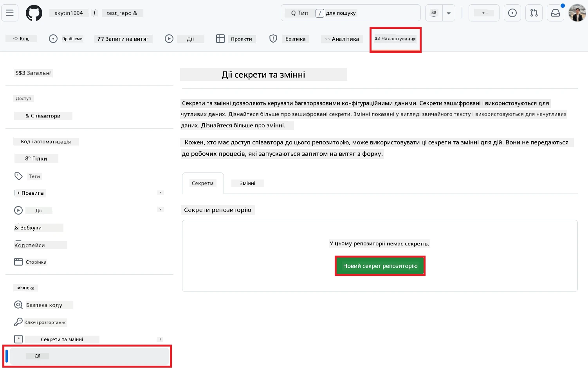
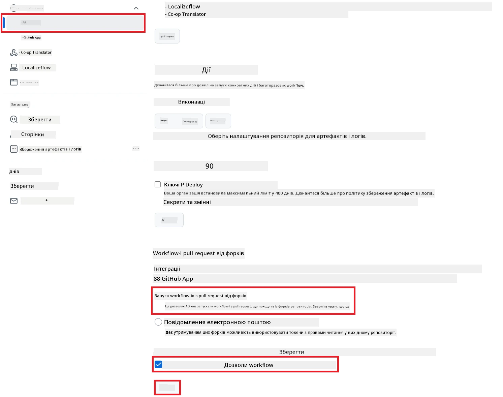

# Використання Co-op Translator GitHub Action (Публічне налаштування)

**Цільова аудиторія:** Цей посібник призначений для користувачів у більшості публічних або приватних репозиторіїв, де стандартних дозволів GitHub Actions достатньо. Використовується вбудований `GITHUB_TOKEN`.

Автоматизуйте переклад документації вашого репозиторію за допомогою Co-op Translator GitHub Action. Цей посібник допоможе налаштувати дію так, щоб вона автоматично створювала pull request із оновленими перекладами щоразу, коли змінюються ваші вихідні Markdown-файли або зображення.

> [!IMPORTANT]
>
> **Вибір правильного посібника:**
>
> У цьому посібнику описано **просте налаштування зі стандартним `GITHUB_TOKEN`**. Це рекомендований спосіб для більшості користувачів, оскільки не потрібно керувати конфіденційними приватними ключами GitHub App.
>

## Необхідні умови

Перед налаштуванням GitHub Action переконайтеся, що у вас є необхідні облікові дані AI-сервісу.

**1. Обов’язково: Облікові дані AI Language Model**
Вам потрібні облікові дані для принаймні однієї з підтримуваних мовних моделей:

- **Azure OpenAI**: Потрібен Endpoint, API Key, назви моделей/деплойментів, версія API.
- **OpenAI**: Потрібен API Key, (Опціонально: Org ID, Base URL, Model ID).
- Див. [Підтримувані моделі та сервіси](../../../../README.md) для деталей.

**2. Опціонально: Облікові дані AI Vision (для перекладу зображень)**

- Потрібно лише, якщо необхідно перекладати текст на зображеннях.
- **Azure AI Vision**: Потрібен Endpoint і Subscription Key.
- Якщо не вказано, дія працюватиме в [режимі лише Markdown](../markdown-only-mode.md).

## Налаштування та конфігурація

Виконайте ці кроки, щоб налаштувати Co-op Translator GitHub Action у вашому репозиторії зі стандартним `GITHUB_TOKEN`.

### Крок 1: Зрозумійте автентифікацію (Використання `GITHUB_TOKEN`)

Цей workflow використовує вбудований `GITHUB_TOKEN`, який надає GitHub Actions. Цей токен автоматично надає дозволи workflow для взаємодії з вашим репозиторієм згідно з налаштуваннями, які ви встановите у **Кроці 3**.

### Крок 2: Додайте секрети репозиторію

Вам потрібно лише додати **облікові дані AI-сервісу** як зашифровані секрети у налаштуваннях репозиторію.

1.  Перейдіть до потрібного репозиторію на GitHub.
2.  Відкрийте **Settings** > **Secrets and variables** > **Actions**.
3.  У розділі **Repository secrets** натисніть **New repository secret** для кожного потрібного секрету AI-сервісу зі списку нижче.

     *(Зображення: показує, де додавати секрети)*

**Обов’язкові секрети AI-сервісу (Додайте ВСІ, які відповідають вашим умовам):**

| Назва секрету                         | Опис                               | Джерело значення                     |
| :---------------------------------- | :---------------------------------------- | :------------------------------- |
| `AZURE_AI_SERVICE_API_KEY`            | Ключ для Azure AI Service (Computer Vision)  | Ваш Azure AI Foundry               |
| `AZURE_AI_SERVICE_ENDPOINT`         | Endpoint для Azure AI Service (Computer Vision) | Ваш Azure AI Foundry               |
| `AZURE_OPENAI_API_KEY`              | Ключ для Azure OpenAI service              | Ваш Azure AI Foundry               |
| `AZURE_OPENAI_ENDPOINT`             | Endpoint для Azure OpenAI service         | Ваш Azure AI Foundry               |
| `AZURE_OPENAI_MODEL_NAME`           | Назва вашої моделі Azure OpenAI              | Ваш Azure AI Foundry               |
| `AZURE_OPENAI_CHAT_DEPLOYMENT_NAME` | Назва деплойменту Azure OpenAI         | Ваш Azure AI Foundry               |
| `AZURE_OPENAI_API_VERSION`          | Версія API для Azure OpenAI              | Ваш Azure AI Foundry               |
| `OPENAI_API_KEY`                    | API Key для OpenAI                        | Ваша платформа OpenAI              |
| `OPENAI_ORG_ID`                     | OpenAI Organization ID (Опціонально)         | Ваша платформа OpenAI              |
| `OPENAI_CHAT_MODEL_ID`              | ID конкретної моделі OpenAI (Опціонально)       | Ваша платформа OpenAI              |
| `OPENAI_BASE_URL`                   | Кастомний базовий URL OpenAI API (Опціонально)     | Ваша платформа OpenAI              |

### Крок 3: Налаштуйте дозволи workflow

GitHub Action потребує дозволів через `GITHUB_TOKEN` для отримання коду та створення pull request.

1.  У вашому репозиторії відкрийте **Settings** > **Actions** > **General**.
2.  Прокрутіть до розділу **Workflow permissions**.
3.  Виберіть **Read and write permissions**. Це надає `GITHUB_TOKEN` необхідні дозволи `contents: write` та `pull-requests: write` для цього workflow.
4.  Переконайтеся, що прапорець **Allow GitHub Actions to create and approve pull requests** **встановлений**.
5.  Натисніть **Save**.



### Крок 4: Створіть файл workflow

Останній крок — створити YAML-файл, який визначає автоматизований workflow з використанням `GITHUB_TOKEN`.

1.  У кореневій директорії репозиторію створіть папку `.github/workflows/`, якщо її ще немає.
2.  Всередині `.github/workflows/` створіть файл з назвою `co-op-translator.yml`.
3.  Вставте наступний вміст у `co-op-translator.yml`.

```yaml
name: Co-op Translator

on:
  push:
    branches:
      - main

jobs:
  co-op-translator:
    runs-on: ubuntu-latest

    permissions:
      contents: write
      pull-requests: write

    steps:
      - name: Checkout repository
        uses: actions/checkout@v4
        with:
          fetch-depth: 0

      - name: Set up Python
        uses: actions/setup-python@v4
        with:
          python-version: '3.10'

      - name: Install Co-op Translator
        run: |
          python -m pip install --upgrade pip
          pip install co-op-translator

      - name: Run Co-op Translator
        env:
          PYTHONIOENCODING: utf-8
          # === AI Service Credentials ===
          AZURE_AI_SERVICE_API_KEY: ${{ secrets.AZURE_AI_SERVICE_API_KEY }}
          AZURE_AI_SERVICE_ENDPOINT: ${{ secrets.AZURE_AI_SERVICE_ENDPOINT }}
          AZURE_OPENAI_API_KEY: ${{ secrets.AZURE_OPENAI_API_KEY }}
          AZURE_OPENAI_ENDPOINT: ${{ secrets.AZURE_OPENAI_ENDPOINT }}
          AZURE_OPENAI_MODEL_NAME: ${{ secrets.AZURE_OPENAI_MODEL_NAME }}
          AZURE_OPENAI_CHAT_DEPLOYMENT_NAME: ${{ secrets.AZURE_OPENAI_CHAT_DEPLOYMENT_NAME }}
          AZURE_OPENAI_API_VERSION: ${{ secrets.AZURE_OPENAI_API_VERSION }}
          OPENAI_API_KEY: ${{ secrets.OPENAI_API_KEY }}
          OPENAI_ORG_ID: ${{ secrets.OPENAI_ORG_ID }}
          OPENAI_CHAT_MODEL_ID: ${{ secrets.OPENAI_CHAT_MODEL_ID }}
          OPENAI_BASE_URL: ${{ secrets.OPENAI_BASE_URL }}
        run: |
          # =====================================================================
          # IMPORTANT: Set your target languages here (REQUIRED CONFIGURATION)
          # =====================================================================
          # Example: Translate to Spanish, French, German. Add -y to auto-confirm.
          translate -l "es fr de" -y  # <--- MODIFY THIS LINE with your desired languages

      - name: Create Pull Request with translations
        uses: peter-evans/create-pull-request@v5
        with:
          token: ${{ secrets.GITHUB_TOKEN }}
          commit-message: "🌐 Update translations via Co-op Translator"
          title: "🌐 Update translations via Co-op Translator"
          body: |
            This PR updates translations for recent changes to the main branch.

            ### 📋 Changes included
            - Translated contents are available in the `translations/` directory
            - Translated images are available in the `translated_images/` directory

            ---
            🌐 Automatically generated by the [Co-op Translator](https://github.com/Azure/co-op-translator) GitHub Action.
          branch: update-translations
          base: main
          labels: translation, automated-pr
          delete-branch: true
          add-paths: |
            translations/
            translated_images/
```
4.  **Налаштуйте workflow:**
  - **[!IMPORTANT] Цільові мови:** У кроці `Run Co-op Translator` **ОБОВ’ЯЗКОВО перегляньте та змініть список мовних кодів** у команді `translate -l "..." -y` відповідно до потреб вашого проєкту. Прикладовий список (`ar de es...`) потрібно замінити або скоригувати.
  - **Тригер (`on:`):** Поточний тригер спрацьовує на кожен push у `main`. Для великих репозиторіїв рекомендується додати фільтр `paths:` (див. закоментований приклад у YAML), щоб workflow запускався лише при зміні релевантних файлів (наприклад, вихідної документації), що дозволяє економити час роботи runner.
  - **Деталі PR:** За потреби налаштуйте `commit-message`, `title`, `body`, назву `branch` та `labels` у кроці `Create Pull Request`.

## Запуск workflow

> [!WARNING]  
> **Обмеження часу для GitHub-hosted Runner:**  
> GitHub-hosted runner, такі як `ubuntu-latest`, мають **максимальний ліміт виконання 6 годин**.  
> Для великих репозиторіїв документації, якщо процес перекладу перевищить 6 годин, workflow буде автоматично завершено.  
> Щоб уникнути цього, розгляньте:  
> - Використання **self-hosted runner** (без обмеження часу)  
> - Зменшення кількості цільових мов за один запуск

Після того, як файл `co-op-translator.yml` буде додано у вашу основну гілку (або гілку, вказану у тригері `on:`), workflow автоматично запускатиметься при кожному пуші у цю гілку (і відповідно до фільтру `paths`, якщо він налаштований).

---

**Застереження**:
Цей документ було перекладено за допомогою сервісу автоматичного перекладу [Co-op Translator](https://github.com/Azure/co-op-translator). Хоча ми прагнемо до точності, звертаємо вашу увагу, що автоматичний переклад може містити помилки або неточності. Оригінальний документ рідною мовою слід вважати авторитетним джерелом. Для отримання критично важливої інформації рекомендується професійний людський переклад. Ми не несемо відповідальності за будь-які непорозуміння або неправильне тлумачення, що виникли внаслідок використання цього перекладу.