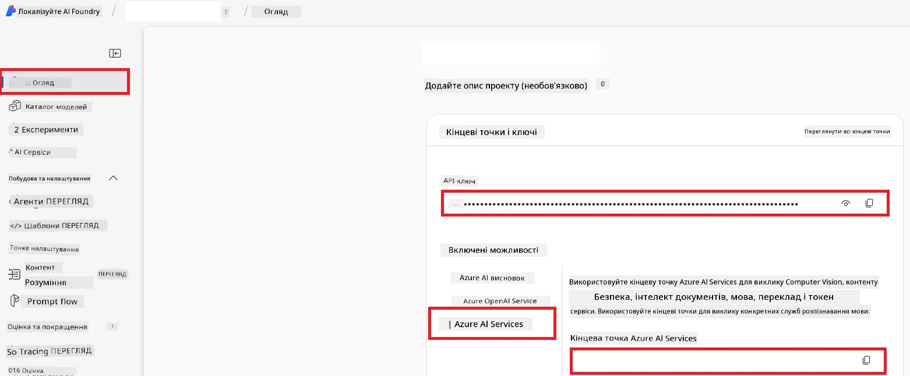

# Налаштування Azure AI для Co-op Translator (Azure OpneAI & Azure AI Vision)

Цей посібник проведе вас через налаштування Azure OpenAI для перекладу мов і Azure Computer Vision для аналізу вмісту зображень (який потім можна використовувати для перекладу на основі зображень) у межах Azure AI Foundry.

**Вимоги:**
- Обліковий запис Azure з активною підпискою.
- Достатні дозволи для створення ресурсів і розгортання у вашій підписці Azure.

## Створення проєкту Azure AI

Ви почнете зі створення проєкту Azure AI, який слугуватиме центральним місцем для керування вашими AI-ресурсами.

1. Перейдіть на [https://ai.azure.com](https://ai.azure.com) і увійдіть зі своїм обліковим записом Azure.

1. Виберіть **+Create**, щоб створити новий проєкт.

1. Виконайте наступні завдання:
   - Введіть **Назву проєкту** (наприклад, `CoopTranslator-Project`).
   - Виберіть **AI hub** (наприклад, `CoopTranslator-Hub`) (створіть новий, якщо потрібно).

1. Натисніть "**Review and Create**", щоб налаштувати свій проєкт. Вас буде перенаправлено на сторінку огляду проєкту.

## Налаштування Azure OpenAI для перекладу мов

У межах вашого проєкту ви розгорнете модель Azure OpenAI, яка слугуватиме бекендом для перекладу тексту.

### Перехід до вашого проєкту

Якщо ви ще не там, відкрийте щойно створений проєкт (наприклад, `CoopTranslator-Project`) у Azure AI Foundry.

### Розгортання моделі OpenAI

1. У лівому меню вашого проєкту, у розділі «My assets», оберіть "**Models + endpoints**".

1. Оберіть **+ Deploy model**.

1. Виберіть **Deploy Base Model**.

1. Вам буде представлено список доступних моделей. Відфільтруйте або знайдіть підходящу модель GPT. Рекомендуємо `gpt-4o`.

1. Виберіть потрібну модель і натисніть **Confirm**.

1. Оберіть **Deploy**.

### Конфігурація Azure OpenAI

Після розгортання ви можете обрати розгортання зі сторінки "**Models + endpoints**", щоб знайти його **REST endpoint URL**, **Key**, **Deployment name**, **Model name** і **API version**. Вони знадобляться для інтеграції моделі перекладу у ваш додаток.

> [!NOTE]
> Ви можете обрати версії API на сторінці [API version deprecation](https://learn.microsoft.com/azure/ai-services/openai/api-version-deprecation) згідно з вашими вимогами. Зверніть увагу, що **API version** відрізняється від **Model version**, який показано на сторінці **Models + endpoints** у Azure AI Foundry.

## Налаштування Azure Computer Vision для перекладу зображень

Щоб увімкнути переклад тексту зі зображень, потрібно знайти API Key і Endpoint служби Azure AI.

1. Перейдіть до свого Azure AI Проєкту (наприклад, `CoopTranslator-Project`). Переконайтеся, що ви на сторінці огляду проєкту.

### Конфігурація Azure AI Service

Знайдіть API Key і Endpoint у службі Azure AI.

1. Перейдіть до свого Azure AI Проєкту (наприклад, `CoopTranslator-Project`). Переконайтеся, що ви на сторінці огляду проєкту.

1. Знайдіть **API Key** і **Endpoint** у вкладці Azure AI Service.

    

Це підключення робить можливості пов’язаного ресурсу Azure AI Services (включно з аналізом зображень) доступними вашому проєкту AI Foundry. Потім ви можете використовувати це підключення у своїх блокнотах або додатках, щоб витягувати текст із зображень, який можна надалі надсилати моделі Azure OpenAI для перекладу.

## Консолідація ваших облікових даних

На цей момент ви маєте зібрати наступне:

**Для Azure OpenAI (Переклад тексту):**
- Endpoint Azure OpenAI
- API Key Azure OpenAI
- Назва моделі Azure OpenAI (наприклад, `gpt-4o`)
- Назва розгортання Azure OpenAI (наприклад, `cooptranslator-gpt4o`)
- Версія API Azure OpenAI

**Для Azure AI Services (Витяг тексту із зображень через Vision):**
- Endpoint служби Azure AI
- API Key служби Azure AI

### Приклад: Конфігурація змінних середовища (Огляд)

Пізніше, створюючи свій додаток, ви, ймовірно, налаштуєте його, використовуючи зібрані облікові дані. Наприклад, ви можете встановити їх як змінні середовища ось так:

```bash
# Облікові дані служби Azure AI (необхідні для перекладу зображень)
AZURE_AI_SERVICE_API_KEY="your_azure_ai_service_api_key" # Наприклад, 21xasd...
AZURE_AI_SERVICE_ENDPOINT="https://your_azure_ai_service_endpoint.cognitiveservices.azure.com/"

# Додаткові набори резервних значень: дублюйте змінні з суфіксом _1/_2 (той самий індекс для всіх змінних у наборі)
AZURE_AI_SERVICE_API_KEY_1="your_azure_ai_service_api_key_1"
AZURE_AI_SERVICE_ENDPOINT_1="https://your_azure_ai_service_endpoint_1.cognitiveservices.azure.com/"

# Облікові дані Azure OpenAI (необхідні для перекладу тексту)
AZURE_OPENAI_API_KEY="your_azure_openai_api_key" # Наприклад, 21xasd...
AZURE_OPENAI_ENDPOINT="https://your_azure_openai_endpoint.openai.azure.com/"
AZURE_OPENAI_MODEL_NAME="your_model_name" # Наприклад, gpt-4o
AZURE_OPENAI_CHAT_DEPLOYMENT_NAME="your_deployment_name" # Наприклад, cooptranslator-gpt4o
AZURE_OPENAI_API_VERSION="your_api_version" # Наприклад, 2024-12-01-preview

# Додаткові набори резервних значень: дублюйте повний набір AZURE_OPENAI_* з суфіксом _1/_2 (той самий індекс для всіх змінних)
```

---

### Подальше читання

- [Як створити проєкт у Azure AI Foundry](https://learn.microsoft.com/azure/ai-foundry/how-to/create-projects?tabs=ai-studio)
- [Як створити ресурси Azure AI](https://learn.microsoft.com/azure/ai-foundry/how-to/create-azure-ai-resource?tabs=portal)
- [Як розгорнути моделі OpenAI у Azure AI Foundry](https://learn.microsoft.com/en-us/azure/ai-foundry/how-to/deploy-models-openai)

---

<!-- CO-OP TRANSLATOR DISCLAIMER START -->
**Відмова від відповідальності**:  
Цей документ було перекладено за допомогою сервісу автоматичного перекладу [Co-op Translator](https://github.com/Azure/co-op-translator). Хоч ми й докладаємо зусиль для забезпечення точності, будь ласка, враховуйте, що автоматичні переклади можуть містити помилки або неточності. Оригінальний документ рідною мовою має вважатися авторитетним джерелом. Для критично важливої інформації рекомендується професійний переклад людиною. Ми не несемо відповідальності за будь-які непорозуміння чи неправильні тлумачення, що виникли внаслідок використання цього перекладу.
<!-- CO-OP TRANSLATOR DISCLAIMER END -->