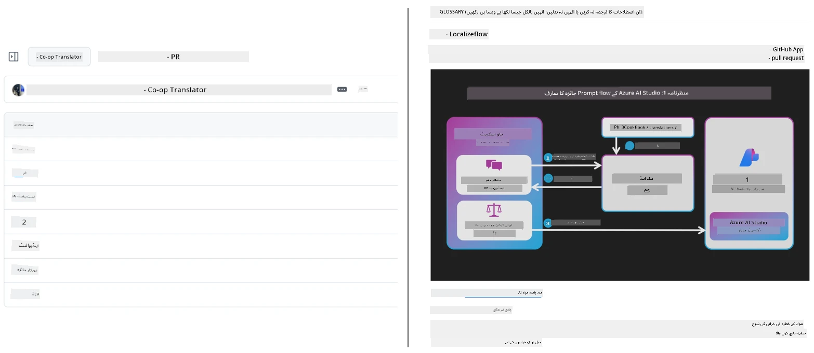
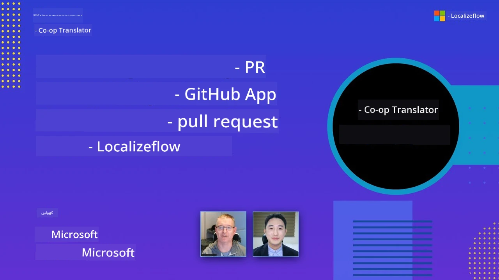

# Co-op Translator

_اپنی تعلیمی GitHub مواد کے لیے باآسانی ترجمے خودکار اور متعدد زبانوں میں برقرار رکھیں جب آپ کا پروجیکٹ ترقی کرے۔_


[](https://pypi.org/project/co-op-translator/)
[](https://github.com/azure/co-op-translator/blob/main/LICENSE)
[](https://pepy.tech/project/co-op-translator)
[](https://pepy.tech/project/co-op-translator)
[](https://github.com/azure/co-op-translator/pkgs/container/co-op-translator)
[](https://github.com/psf/black)

[](https://GitHub.com/azure/co-op-translator/graphs/contributors/)
[](https://GitHub.com/azure/co-op-translator/issues/)
[](https://GitHub.com/azure/co-op-translator/pulls/)
[](http://makeapullrequest.com)

### 🌐 کثیراللسانی معاونت

#### کی جانب سے سپورٹ شدہ [Co-op Translator](https://github.com/Azure/Co-op-Translator)

<!-- CO-OP TRANSLATOR LANGUAGES TABLE START -->
[Arabic](../ar/README.md) | [Bengali](../bn/README.md) | [Bulgarian](../bg/README.md) | [Burmese (Myanmar)](../my/README.md) | [Chinese (Simplified)](../zh-CN/README.md) | [Chinese (Traditional, Hong Kong)](../zh-HK/README.md) | [Chinese (Traditional, Macau)](../zh-MO/README.md) | [Chinese (Traditional, Taiwan)](../zh-TW/README.md) | [Croatian](../hr/README.md) | [Czech](../cs/README.md) | [Danish](../da/README.md) | [Dutch](../nl/README.md) | [Estonian](../et/README.md) | [Finnish](../fi/README.md) | [French](../fr/README.md) | [German](../de/README.md) | [Greek](../el/README.md) | [Hebrew](../he/README.md) | [Hindi](../hi/README.md) | [Hungarian](../hu/README.md) | [Indonesian](../id/README.md) | [Italian](../it/README.md) | [Japanese](../ja/README.md) | [Kannada](../kn/README.md) | [Khmer](../km/README.md) | [Korean](../ko/README.md) | [Lithuanian](../lt/README.md) | [Malay](../ms/README.md) | [Malayalam](../ml/README.md) | [Marathi](../mr/README.md) | [Nepali](../ne/README.md) | [Nigerian Pidgin](../pcm/README.md) | [Norwegian](../no/README.md) | [Persian (Farsi)](../fa/README.md) | [Polish](../pl/README.md) | [Portuguese (Brazil)](../pt-BR/README.md) | [Portuguese (Portugal)](../pt-PT/README.md) | [Punjabi (Gurmukhi)](../pa/README.md) | [Romanian](../ro/README.md) | [Russian](../ru/README.md) | [Serbian (Cyrillic)](../sr/README.md) | [Slovak](../sk/README.md) | [Slovenian](../sl/README.md) | [Spanish](../es/README.md) | [Swahili](../sw/README.md) | [Swedish](../sv/README.md) | [Tagalog (Filipino)](../tl/README.md) | [Tamil](../ta/README.md) | [Telugu](../te/README.md) | [Thai](../th/README.md) | [Turkish](../tr/README.md) | [Ukrainian](../uk/README.md) | [Urdu](./README.md) | [Vietnamese](../vi/README.md)

> **کیا آپ مقامی طور پر کلون کرنا پسند کریں گے؟**
>
> اس ریپوزیٹری میں 50+ زبان کے تراجم شامل ہیں جو ڈاؤن لوڈ سائز کو نمایاں طور پر بڑھاتے ہیں۔ بغیر تراجم کے کلون کرنے کے لیے، sparse checkout استعمال کریں:
>
> **Bash / macOS / Linux:**
> ```bash
> git clone --filter=blob:none --sparse https://github.com/Azure/co-op-translator.git
> cd co-op-translator
> git sparse-checkout set --no-cone '/*' '!translations' '!translated_images'
> ```
>
> **CMD (Windows):**
> ```cmd
> git clone --filter=blob:none --sparse https://github.com/Azure/co-op-translator.git
> cd co-op-translator
> git sparse-checkout set --no-cone "/*" "!translations" "!translated_images"
> ```
>
> یہ آپ کو وہ سب کچھ دیتا ہے جو آپ کو کورس مکمل کرنے کے لیے چاہیے، بہت تیز تر ڈاؤن لوڈ کے ساتھ۔
<!-- CO-OP TRANSLATOR LANGUAGES TABLE END -->

[](https://GitHub.com/azure/co-op-translator/watchers/)
[](https://GitHub.com/azure/co-op-translator/network/)
[](https://GitHub.com/azure/co-op-translator/stargazers/)

[](https://discord.gg/nTYy5BXMWG)

[](https://codespaces.new/azure/co-op-translator)

## جائزہ

**Co-op Translator** آپ کے تعلیمی GitHub مواد کو باآسانی متعدد زبانوں میں لوکلائز کرنے میں مدد دیتا ہے۔  
جب آپ اپنی Markdown فائلز، تصاویر، یا نوٹ بکس کو اپ ڈیٹ کرتے ہیں، تراجم خودکار طور پر ہم آہنگ رہتے ہیں، اس بات کو یقینی بناتے ہوئے کہ آپ کا مواد دنیا بھر کے سیکھنے والوں کے لیے درست اور تازہ ترین رہے۔

ترجمہ شدہ مواد کی تنظیم کی مثال:



## ترجمے کی حالت کا انتظام کیسے ہوتا ہے

Co-op Translator ترجمہ شدہ مواد کو **ورژن شدہ سافٹ ویئر آرٹیفیکٹس** کے طور پر سنبھالتا ہے،  
نہ کہ جامد فائلوں کے طور پر۔

یہ ٹول ترجمہ شدہ Markdown، تصاویر، اور نوٹ بکس کی حالت کو  
**زبانی دائرہ کے میٹاڈیٹا** کے ذریعے ٹریک کرتا ہے۔

یہ ڈیزائن Co-op Translator کو قابل بناتا ہے کہ:

- پرانے ترجموں کی قابل اعتماد نشاندہی کرے  
- Markdown، تصاویر، اور نوٹ بکس کا یکساں سلوک کرے  
- بڑے، تیز رفتاری سے بڑھنے والے، کثیراللسانی ریپوزیٹریز پر محفوظ پیمانے پر کام کرے  

ترجموں کو مینیج کردہ آرٹیفیکٹس کے طور پر ماڈل کر کے،  
ترجمے کے ورک فلو جدید  
سافٹ ویئر انحصار اور آرٹیفیکٹ مینجمنٹ طریقوں کے ساتھ قدرتی طور پر ہم آہنگ ہوتے ہیں۔

→ [ترجمے کی حالت کا انتظام کیسے ہوتا ہے](https://techcommunity.microsoft.com/blog/azuredevcommunityblog/rethinking-documentation-translation-treating-translations-as-versioned-software/4491755)


## فوری آغاز

```bash
# ایک ورچوئل ماحول بنائیں اور چالو کریں (تجویز کردہ)
python -m venv .venv
# ونڈوز
.venv\Scripts\activate
# میک او ایس / لینکس
source .venv/bin/activate
# پیکیج انسٹال کریں
pip install co-op-translator
# ترجمہ کریں
translate -l "ko ja fr" -md
```

ڈوکر:

```bash
# GHCR سے عوامی تصویر کھینچیں
docker pull ghcr.io/azure/co-op-translator:latest
# موجودہ فولڈر کو ماؤنٹ کر کے اور .env فراہم کر کے چلائیں (Bash/Zsh)
docker run --rm -it --env-file .env -v "${PWD}:/work" ghcr.io/azure/co-op-translator:latest -l "ko ja fr" -md
```

## کم از کم ترتیب

1. اس بات کا یقین کریں کہ آپ کے پاس سپورٹ شدہ Python ورژن ہے (فی الحال 3.10-3.12). poetry (pyproject.toml) میں یہ خودکار طور پر سنبھالا جاتا ہے۔  
2. ایک `.env` فائل بنائیں ٹیمپلیٹ کی مدد سے: [.env.template](../../.env.template)  
3. ایک LLM فراہم کنندہ کو ترتیب دیں (Azure OpenAI یا OpenAI)  
4. (اختیاری) تصویر کے ترجمے کے لیے (`-img`)، Azure AI Vision کو ترتیب دیں  
5. (اختیاری) آپ مختلف کریڈینشل سیٹ ترتیب دے سکتے ہیں متغیرات کو `_1`, `_2`، وغیرہ جیسے سُفکس دے کر۔ ایک سیٹ کے تمام متغیرات کو ایک ہی سُفکس شیئر کرنا لازمی ہے۔  
6. (سفارش کردہ) پچھلے تراجم کو صاف کریں تاکہ تنازعات نہ ہوں (مثلاً `translations/`)  
7. (سفارش کردہ) اپنے README میں ترجمے کا حصہ شامل کریں [README languages template](./getting_started/README_languages_template.md) کی مدد سے  
8. دیکھیں: [Azure AI کو ترتیب دینا](./getting_started/set-up-azure-ai.md)

## استعمال

تمام سپورٹ شدہ اقسام کا ترجمہ کریں:

```bash
translate -l "ko ja"
```

صرف Markdown:

```bash
translate -l "de" -md
```

Markdown + تصاویر:

```bash
translate -l "pt" -md -img
```

صرف نوٹ بکس:

```bash
translate -l "zh" -nb
```

مزید پرچم: [کمانڈ ریفرنس](./getting_started/command-reference.md)

## خصوصیات

- Markdown، نوٹ بکس، اور تصاویر کے لیے خودکار ترجمہ  
- ذرائع میں تبدیلیوں کے ساتھ تراجم کو ہم آہنگ رکھتا ہے  
- مقامی (CLI) یا CI (GitHub Actions) میں کام کرتا ہے  
- Azure OpenAI یا OpenAI استعمال کرتا ہے؛ اختیاری طور پر تصاویر کے لیے Azure AI Vision  
- Markdown کی فارمیٹنگ اور ساخت کو محفوظ رکھتا ہے  

## دستاویزات

- [کمانڈ لائن گائیڈ](./getting_started/command-line-guide/command-line-guide.md)  
- [GitHub Actions گائیڈ (Public repositories & standard secrets)](./getting_started/github-actions-guide/github-actions-guide-public.md)  
- [GitHub Actions گائیڈ (Microsoft organization repositories & org-level setups)](./getting_started/github-actions-guide/github-actions-guide-org.md)  
- [README languages template](./getting_started/README_languages_template.md)  
- [مقبول زبانیں](./getting_started/supported-languages.md)  
- [حصہ ڈالنا](./CONTRIBUTING.md)  
- [مسائل حل کرنا](./getting_started/troubleshooting.md)  

### مائیکروسافٹ مخصوص گائیڈ
> [!NOTE]
> صرف Microsoft "For Beginners" ریپوزیٹریز کے منتظمین کے لیے۔

- [“other courses” کی فہرست کو اپ ڈیٹ کرنا (صرف MS Beginners ریپوزیٹریز کے لیے)](./getting_started/update-other-courses.md)

## ہماری حمایت کریں اور عالمی تعلیم کو فروغ دیں

آئیں تعلیم کے مواد کے عالمی اشتراک کے طریقے میں انقلاب لائیں! [Co-op Translator](https://github.com/azure/co-op-translator) کو GitHub پر ⭐ دیں اور ہماری مشن کی حمایت کریں کہ تعلیم اور ٹیکنالوجی میں زبانوں کی رکاوٹوں کو دور کریں۔ آپ کی دلچسپی اور تعاون ایک اہم اثر ڈالتے ہیں! کوڈ میں حصہ ڈالنا اور فیچر تجاویز ہمیشہ خوش آئند ہیں۔

### اپنی زبان میں Microsoft تعلیمی مواد دریافت کریں

- [LangChain4j-for-Beginners](https://github.com/microsoft/LangChain4j-for-Beginners)  
- [AZD for Beginners](https://github.com/microsoft/AZD-for-beginners)  
- [Edge AI for Beginners](https://github.com/microsoft/edgeai-for-beginners)  
- [Model Context Protocol (MCP) For Beginners](https://github.com/microsoft/mcp-for-beginners)  
- [AI Agents for Beginners](https://github.com/microsoft/ai-agents-for-beginners)  
- [Generative AI for Beginners using .NET](https://github.com/microsoft/Generative-AI-for-beginners-dotnet)  
- [Generative AI for Beginners](https://github.com/microsoft/generative-ai-for-beginners)  
- [Generative AI for Beginners using Java](https://github.com/microsoft/generative-ai-for-beginners-java)  
- [ML for Beginners](https://aka.ms/ml-beginners)  
- [Data Science for Beginners](https://aka.ms/datascience-beginners)  
- [AI for Beginners](https://aka.ms/ai-beginners)  
- [Cybersecurity for Beginners](https://github.com/microsoft/Security-101)  
- [Web Dev for Beginners](https://aka.ms/webdev-beginners)  
- [IoT for Beginners](https://aka.ms/iot-beginners)  
- [PhiCookBook](https://github.com/microsoft/PhiCookBook)

## ویڈیو پیشکشیں

👉 نیچے تصویر پر کلک کریں تاکہ YouTube پر دیکھیں۔

- **Open at Microsoft**: Co-op Translator استعمال کرنے کا مختصر 18 منٹ تعارف اور فوری گائیڈ۔

  [](https://www.youtube.com/watch?v=jX_swfH_KNU)

## حصہ ڈالنا

یہ پروجیکٹ تعاون اور تجاویز کا خیرمقدم کرتا ہے۔ Azure Co-op Translator میں حصہ ڈالنا چاہتے ہیں؟ براہ کرم ہمارے [CONTRIBUTING.md](./CONTRIBUTING.md) دیکھیں تاکہ جانیے کہ آپ Co-op Translator کو مزید قابل رسائی بنانے میں کیسے مدد کر سکتے ہیں۔

## شراکت داران
[](https://github.com/Azure/co-op-translator/graphs/contributors)

## کوڈ آف کنڈکٹ

اس پروجیکٹ نے [Microsoft Open Source Code of Conduct](https://opensource.microsoft.com/codeofconduct/) کو اپنایا ہے۔  
مزید معلومات کے لیے [Code of Conduct FAQ](https://opensource.microsoft.com/codeofconduct/faq/) دیکھیں یا  
کسی بھی اضافی سوالات یا تبصروں کے لیے [opencode@microsoft.com](mailto:opencode@microsoft.com) سے رابطہ کریں۔

## ذمہ دار AI

مائیکروسافٹ ہمارے صارفین کی مدد کرنے کے لیے پرعزم ہے کہ وہ ہمارے AI مصنوعات کو ذمہ داری سے استعمال کریں، اپنے تجربات شیئر کریں، اور Transparency Notes اور Impact Assessments جیسے ٹولز کے ذریعے اعتماد پر مبنی شراکت داری قائم کریں۔ ان میں سے کئی وسائل [https://aka.ms/RAI](https://aka.ms/RAI) پر دستیاب ہیں۔  
مائیکروسافٹ کا ذمہ دار AI کا طریقہ کار ہمارے AI کے اصولوں پر مبنی ہے جن میں منصفانہ رویہ، قابل اعتماد اور محفوظ، پرائیویسی اور سیکیورٹی، شمولیت، شفافیت، اور ذمہ داری شامل ہیں۔

بڑے پیمانے پر قدرتی زبان، تصویر اور تقریر کے ماڈلز — جیسا کہ اس نمونے میں استعمال ہوئے ہیں — ممکنہ طور پر ایسے رویے دکھا سکتے ہیں جو منصفانہ، قابل اعتماد یا جارحانہ نہیں ہوتے، جو نقصان دہ ثابت ہو سکتے ہیں۔ خطرات اور حدود کے بارے میں آگاہی کے لیے براہ کرم [Azure OpenAI service Transparency note](https://learn.microsoft.com/legal/cognitive-services/openai/transparency-note?tabs=text) سے رجوع کریں۔

ان خطرات کو کم کرنے کے لیے تجویز کردہ طریقہ یہ ہے کہ آپ کی معمار میں ایک حفاظتی نظام شامل ہو جو نقصان دہ رویے کا پتہ لگا سکے اور روک سکے۔ [Azure AI Content Safety](https://learn.microsoft.com/azure/ai-services/content-safety/overview) ایک آزاد حفاظتی پرت فراہم کرتا ہے، جو ایپلیکیشنز اور خدمات میں نقصان دہ صارف اور AI کی تخلیق کردہ مواد کا پتہ لگا سکتا ہے۔ Azure AI Content Safety میں متن اور تصویر کے API شامل ہیں جو آپ کو نقصان دہ مواد کی شناخت کی اجازت دیتے ہیں۔ ہمارے پاس ایک انٹرایکٹو Content Safety Studio بھی ہے جو آپ کو نقصان دہ مواد کو مختلف طریقوں سے تلاش، دیکھنے اور نمونہ کوڈ آزمانے کی سہولت دیتا ہے۔ درج ذیل [quickstart documentation](https://learn.microsoft.com/azure/ai-services/content-safety/quickstart-text?tabs=visual-studio%2Clinux&pivots=programming-language-rest) آپ کو سروس کے لیے درخواستیں بنانے میں رہنمائی کرتی ہے۔

ایک اور پہلو جو مدنظر رکھنا چاہیے وہ مجموعی ایپلیکیشن کی کارکردگی ہے۔ ملٹی ماڈل اور ملٹی موڈل ایپلیکیشنز کے ساتھ، ہم کارکردگی کو اس طور پر سمجھتے ہیں کہ نظام آپ اور آپ کے صارفین کی توقعات کے مطابق کام کرے، بشمول نقصان دہ نتائج پیدا نہ کرنا۔ اپنی مجموعی ایپلیکیشن کی کارکردگی کا اندازہ [generation quality and risk and safety metrics](https://learn.microsoft.com/azure/ai-studio/concepts/evaluation-metrics-built-in) استعمال کرتے ہوئے لگانا اہم ہے۔

آپ اپنے AI ایپلیکیشن کا اندازہ اپنے ترقیاتی ماحول میں [prompt flow SDK](https://microsoft.github.io/promptflow/index.html) استعمال کرکے لگا سکتے ہیں۔ چاہے آپ کے پاس ٹیسٹ ڈیٹاسیٹ ہو یا ہدف، آپ کی جنریٹیو AI ایپلیکیشن کی نسلیں بلٹ اِن تشخیصی نظام یا اپنی مرضی کے تشخیصی نظام کے ذریعے مقداری طور پر ناپی جاتی ہیں۔ اپنے نظام کا اندازہ لگانے کے لیے prompt flow SDK کے ساتھ شروع کرنے کے لیے، آپ [quickstart guide](https://learn.microsoft.com/azure/ai-studio/how-to/develop/flow-evaluate-sdk) پر عمل کر سکتے ہیں۔ جب آپ ایک اندازہ چلائیں، تو آپ [نتائج کو Azure AI Studio میں دیکھ سکتے ہیں](https://learn.microsoft.com/azure/ai-studio/how-to/evaluate-flow-results)۔

## ٹریڈ مارکس

یہ پروجیکٹ ممکن ہے کہ پروجیکٹس، مصنوعات، یا خدمات کے لیے ٹریڈ مارکس یا لوگو رکھتا ہو۔ مائیکروسافٹ کے ٹریڈ مارکس یا لوگوز کا مجاز استعمال [Microsoft's Trademark & Brand Guidelines](https://www.microsoft.com/en-us/legal/intellectualproperty/trademarks/usage/general) کے تابع ہے اور اس کی پیروی ضروری ہے۔  
اس پروجیکٹ کے ترمیم شدہ ورژنز میں مائیکروسافٹ کے ٹریڈ مارکس یا لوگوز کے استعمال سے الجھن یا مائیکروسافٹ کی سرپرستی کا تاثر نہیں ہونا چاہیے۔ کسی بھی تیسری پارٹی کے ٹریڈ مارکس یا لوگوز کے استعمال سے ان تیسرے فریق کی پالیسیوں کا تعلق ہوگا۔

## مدد حاصل کرنا

اگر آپ پھنس جائیں یا AI ایپس بنانے کے بارے میں کوئی سوال ہو، تو شامل ہوں:

[](https://discord.gg/nTYy5BXMWG)

اگر آپ کے پاس مصنوعات فیڈبیک یا تعمیر کے دوران ایرر ہوں تو وزٹ کریں:

[](https://aka.ms/foundry/forum)

---

<!-- CO-OP TRANSLATOR DISCLAIMER START -->
**تنبیہ**:  
اس دستاویز کا ترجمہ AI ترجمہ سروس [Co-op Translator](https://github.com/Azure/co-op-translator) کے ذریعے کیا گیا ہے۔ اگرچہ ہم درستگی کے لیے کوشاں ہیں، براہِ کرم اس بات کا خیال رکھیں کہ خودکار تراجم میں غلطیاں یا خامیاں ہو سکتی ہیں۔ اصل دستاویز اپنی مادری زبان میں ہی معتبر ماخذ سمجھی جائے۔ اہم معلومات کے لیے پیشہ ورانہ انسانی ترجمہ کی سفارش کی جاتی ہے۔ ہم اس ترجمے کے استعمال سے پیدا ہونے والی کسی بھی غلط فہمی یا غلط تشریحات کے ذمہ دار نہیں ہیں۔
<!-- CO-OP TRANSLATOR DISCLAIMER END -->