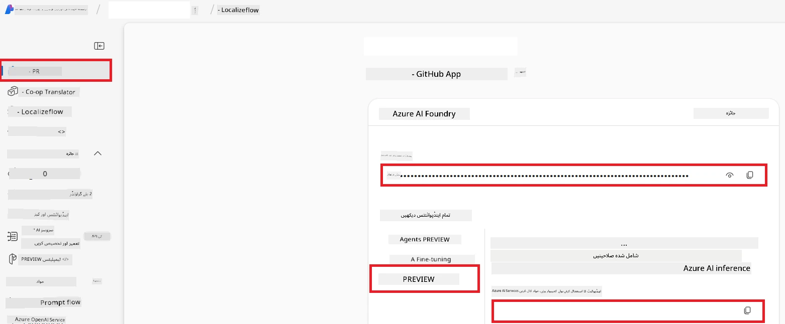

# Azure AI کے لیے Co-op Translator سیٹ اپ کریں (Azure OpneAI اور Azure AI Vision)

یہ گائیڈ آپ کو Azure AI Foundry میں زبان کے ترجمے کے لیے Azure OpenAI اور تصویر کے مواد کے تجزیہ کے لیے Azure Computer Vision (جسے بعد میں تصویر کی بنیاد پر ترجمے کے لیے استعمال کیا جا سکتا ہے) سیٹ اپ کرنے کے عمل سے گزرتی ہے۔

**ضروریات:**
- Azure اکاؤنٹ جس کے ساتھ ایک فعال سبسکرپشن ہو۔
- آپ کی Azure سبسکرپشن میں وسائل اور تعیناتیوں کو بنانے کے لیے مناسب اجازتیں۔

## Azure AI پروجیکٹ بنائیں

آپ Azure AI پروجیکٹ بنانے سے شروع کریں گے، جو آپ کے AI وسائل کے انتظام کے لیے ایک مرکزی جگہ کے طور پر کام کرتا ہے۔

1. [https://ai.azure.com](https://ai.azure.com) پر جائیں اور اپنے Azure اکاؤنٹ سے سائن ان کریں۔

1. نیا پروجیکٹ بنانے کے لیے **+Create** منتخب کریں۔

1. درج ذیل کام کریں:
   - ایک **پروجیکٹ نام** درج کریں (مثلاً `CoopTranslator-Project`)۔
   - **AI hub** منتخب کریں (مثلاً `CoopTranslator-Hub`) (اگر ضرورت ہو تو نیا بنائیں)۔

1. اپنے پروجیکٹ کو سیٹ اپ کرنے کے لیے "**Review and Create**" پر کلک کریں۔ آپ کو آپ کے پروجیکٹ کے اوورویو صفحے پر لے جایا جائے گا۔

## زبان کے ترجمے کے لیے Azure OpenAI سیٹ اپ کریں

اپنے پروجیکٹ کے اندر، آپ متن کے ترجمے کے بیک اینڈ کے طور پر کام کرنے کے لیے Azure OpenAI ماڈل تعینات کریں گے۔

### اپنے پروجیکٹ پر جائیں

اگر پہلے سے نہیں ہیں تو اپنے نئے بنائے گئے پروجیکٹ (مثلاً `CoopTranslator-Project`) کو Azure AI Foundry میں کھولیں۔

### OpenAI ماڈل تعینات کریں

1. اپنے پروجیکٹ کے بائیں مینو سے، "My assets" کے تحت "**Models + endpoints**" منتخب کریں۔

1. **+ Deploy model** منتخب کریں۔

1. **Deploy Base Model** منتخب کریں۔

1. آپ کو دستیاب ماڈلز کی فہرست دکھائی جائے گی۔ مناسب GPT ماڈل تلاش یا فلٹر کریں۔ ہم `gpt-4o` کی سفارش کرتے ہیں۔

1. مطلوبہ ماڈل منتخب کریں اور **Confirm** پر کلک کریں۔

1. **Deploy** منتخب کریں۔

### Azure OpenAI کی ترتیب

تعیناتی کے بعد، آپ "Models + endpoints" صفحے سے متعلق تعیناتی کا انتخاب کر کے اس کا **REST endpoint URL**، **Key**، **Deployment name**، **Model name** اور **API version** معلوم کر سکتے ہیں۔ یہ آپ کی ایپلیکیشن میں ترجمے کے ماڈل کو شامل کرنے کے لیے ضروری ہوں گے۔

> [!NOTE]
> آپ اپنی ضروریات کے مطابق [API version deprecation](https://learn.microsoft.com/azure/ai-services/openai/api-version-deprecation) صفحہ سے API ورژنز منتخب کر سکتے ہیں۔ یاد رکھیں کہ **API version** مختلف ہوتا ہے **Model version** سے جو Azure AI Foundry کے "Models + endpoints" صفحے پر دکھایا جاتا ہے۔

## تصویر کے ترجمے کے لیے Azure Computer Vision سیٹ اپ کریں

تصاویر میں موجود متن کے ترجمے کو فعال کرنے کے لیے، آپ کو Azure AI Service کا API Key اور Endpoint معلوم کرنا ہوں گے۔

1. اپنے Azure AI پروجیکٹ (مثلاً `CoopTranslator-Project`) پر جائیں۔ یقینی بنائیں کہ آپ پروجیکٹ کے اوورویو صفحے پر ہیں۔

### Azure AI Service کی ترتیب

Azure AI Service سے API Key اور Endpoint تلاش کریں۔

1. اپنے Azure AI پروجیکٹ (مثلاً `CoopTranslator-Project`) پر جائیں۔ یقینی بنائیں کہ آپ پروجیکٹ کے اوورویو صفحے پر ہیں۔

1. Azure AI Service ٹیب سے **API Key** اور **Endpoint** تلاش کریں۔

    

یہ کنکشن مربوط Azure AI Services resource (جس میں تصویر کا تجزیہ شامل ہے) کی صلاحیتوں کو آپ کے AI Foundry پروجیکٹ کے لیے دستیاب بناتا ہے۔ آپ اس کنکشن کو اپنے نوٹ بکس یا ایپلیکیشنز میں استعمال کر کے تصویروں سے متن نکال سکتے ہیں، جسے بعد میں ترجمے کے لیے Azure OpenAI ماڈل کو بھیجا جا سکتا ہے۔

## آپ کی اسناد کو یکجا کرنا

اب تک، آپ کو مندرجہ ذیل چیزیں جمع کرنی چاہئیں:

**Azure OpenAI (متن کے ترجمے کے لیے):**
- Azure OpenAI Endpoint
- Azure OpenAI API Key
- Azure OpenAI ماڈل نام (مثلاً `gpt-4o`)
- Azure OpenAI Deployment نام (مثلاً `cooptranslator-gpt4o`)
- Azure OpenAI API ورژن

**Azure AI Services (ویژن کے ذریعے تصویر سے متن نکالنے کے لیے):**
- Azure AI Service Endpoint
- Azure AI Service API Key

### مثال: ماحول متغیر کی ترتیب (پریویو)

بعد میں، جب آپ اپنی ایپلیکیشن تیار کریں گے، تو غالباً آپ انہیں جمع شدہ اسناد کے ساتھ ماحول کے متغیرات کے طور پر ترتیب دیں گے، جیسا کہ ذیل میں دکھایا گیا ہے:

```bash
# ازور اے آئی سروس کی اسناد (تصویری ترجمے کے لیے ضروری)
AZURE_AI_SERVICE_API_KEY="your_azure_ai_service_api_key" # مثلاً، 21xasd...
AZURE_AI_SERVICE_ENDPOINT="https://your_azure_ai_service_endpoint.cognitiveservices.azure.com/"

# اختیاری متبادل سیٹ: ڈپلیکیٹ ویری ایبلز جن کے آخر میں _1/_2 لگا ہو (سیٹ کے تمام ویری ایبلز کے لیے ایک ہی انڈیکس)
AZURE_AI_SERVICE_API_KEY_1="your_azure_ai_service_api_key_1"
AZURE_AI_SERVICE_ENDPOINT_1="https://your_azure_ai_service_endpoint_1.cognitiveservices.azure.com/"

# ازور اوپن اے آئی اسناد (متنی ترجمے کے لیے ضروری)
AZURE_OPENAI_API_KEY="your_azure_openai_api_key" # مثلاً، 21xasd...
AZURE_OPENAI_ENDPOINT="https://your_azure_openai_endpoint.openai.azure.com/"
AZURE_OPENAI_MODEL_NAME="your_model_name" # مثلاً، gpt-4o
AZURE_OPENAI_CHAT_DEPLOYMENT_NAME="your_deployment_name" # مثلاً، cooptranslator-gpt4o
AZURE_OPENAI_API_VERSION="your_api_version" # مثلاً، 2024-12-01-preview

# اختیاری متبادل سیٹ: مکمل AZURE_OPENAI_* سیٹ کی ڈپلیکیٹ کریں جس کے آخر میں _1/_2 لگا ہو (تمام ویری ایبلز کے لیے ایک ہی انڈیکس)
```

---

### مزید مطالعہ

- [Azure AI Foundry میں پروجیکٹ کیسے بنائیں](https://learn.microsoft.com/azure/ai-foundry/how-to/create-projects?tabs=ai-studio)
- [Azure AI وسائل کیسے بنائیں](https://learn.microsoft.com/azure/ai-foundry/how-to/create-azure-ai-resource?tabs=portal)
- [Azure AI Foundry میں OpenAI ماڈلز کو کیسے تعینات کریں](https://learn.microsoft.com/en-us/azure/ai-foundry/how-to/deploy-models-openai)

---

<!-- CO-OP TRANSLATOR DISCLAIMER START -->
**ذمہ داری سے آزاد**:  
یہ دستاویز AI ترجمہ سروس [Co-op Translator](https://github.com/Azure/co-op-translator) کے ذریعے ترجمہ کی گئی ہے۔ اگرچہ ہم درستگی کی کوشش کرتے ہیں، براہ کرم آگاہ رہیں کہ خودکار تراجم میں غلطیاں یا بے قاعدگیاں ہو سکتی ہیں۔ اصل دستاویز اپنی مادری زبان میں معتبر ذریعہ سمجھی جانی چاہیے۔ اہم معلومات کے لیے پیشہ ور انسانی ترجمہ کی تجویز دی جاتی ہے۔ ہم اس ترجمے کے استعمال سے ہونے والی کسی بھی غلط فہمی یا غلط تشریح کے ذمہ دار نہیں ہیں۔
<!-- CO-OP TRANSLATOR DISCLAIMER END -->