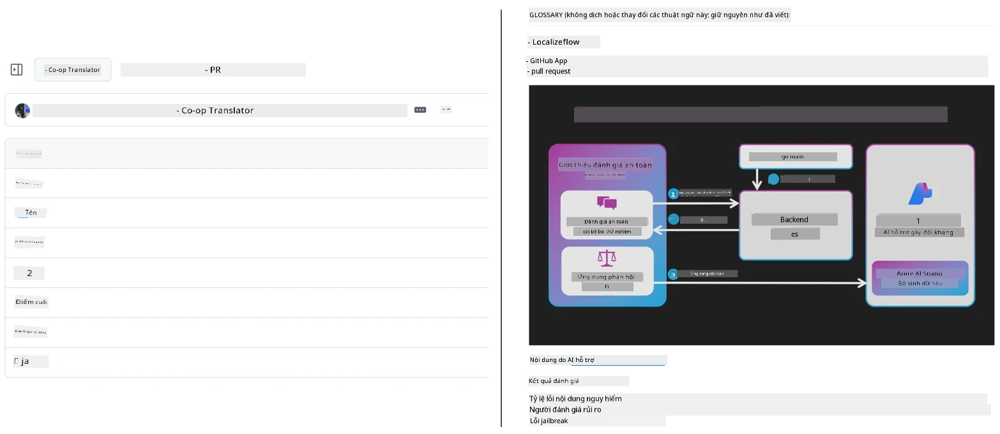
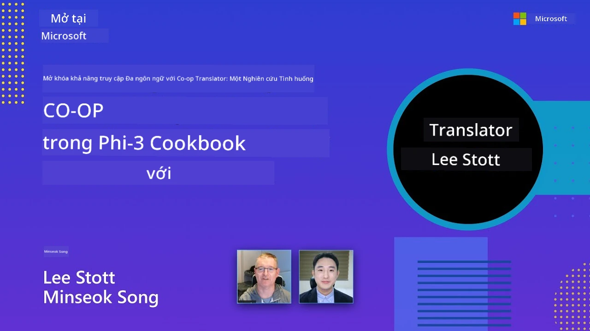

# Co-op Translator

_Tự động hóa và duy trì bản dịch cho nội dung giáo dục GitHub của bạn dễ dàng trên nhiều ngôn ngữ khi dự án của bạn phát triển._


[](https://pypi.org/project/co-op-translator/)
[](https://github.com/azure/co-op-translator/blob/main/LICENSE)
[](https://pepy.tech/project/co-op-translator)
[](https://pepy.tech/project/co-op-translator)
[](https://github.com/azure/co-op-translator/pkgs/container/co-op-translator)
[](https://github.com/psf/black)

[](https://GitHub.com/azure/co-op-translator/graphs/contributors/)
[](https://GitHub.com/azure/co-op-translator/issues/)
[](https://GitHub.com/azure/co-op-translator/pulls/)
[](http://makeapullrequest.com)

### 🌐 Hỗ trợ Đa Ngôn Ngữ

#### Được hỗ trợ bởi [Co-op Translator](https://github.com/Azure/Co-op-Translator)

<!-- CO-OP TRANSLATOR LANGUAGES TABLE START -->
[Arabic](../ar/README.md) | [Bengali](../bn/README.md) | [Bulgarian](../bg/README.md) | [Burmese (Myanmar)](../my/README.md) | [Chinese (Simplified)](../zh-CN/README.md) | [Chinese (Traditional, Hong Kong)](../zh-HK/README.md) | [Chinese (Traditional, Macau)](../zh-MO/README.md) | [Chinese (Traditional, Taiwan)](../zh-TW/README.md) | [Croatian](../hr/README.md) | [Czech](../cs/README.md) | [Danish](../da/README.md) | [Dutch](../nl/README.md) | [Estonian](../et/README.md) | [Finnish](../fi/README.md) | [French](../fr/README.md) | [German](../de/README.md) | [Greek](../el/README.md) | [Hebrew](../he/README.md) | [Hindi](../hi/README.md) | [Hungarian](../hu/README.md) | [Indonesian](../id/README.md) | [Italian](../it/README.md) | [Japanese](../ja/README.md) | [Kannada](../kn/README.md) | [Khmer](../km/README.md) | [Korean](../ko/README.md) | [Lithuanian](../lt/README.md) | [Malay](../ms/README.md) | [Malayalam](../ml/README.md) | [Marathi](../mr/README.md) | [Nepali](../ne/README.md) | [Nigerian Pidgin](../pcm/README.md) | [Norwegian](../no/README.md) | [Persian (Farsi)](../fa/README.md) | [Polish](../pl/README.md) | [Portuguese (Brazil)](../pt-BR/README.md) | [Portuguese (Portugal)](../pt-PT/README.md) | [Punjabi (Gurmukhi)](../pa/README.md) | [Romanian](../ro/README.md) | [Russian](../ru/README.md) | [Serbian (Cyrillic)](../sr/README.md) | [Slovak](../sk/README.md) | [Slovenian](../sl/README.md) | [Spanish](../es/README.md) | [Swahili](../sw/README.md) | [Swedish](../sv/README.md) | [Tagalog (Filipino)](../tl/README.md) | [Tamil](../ta/README.md) | [Telugu](../te/README.md) | [Thai](../th/README.md) | [Turkish](../tr/README.md) | [Ukrainian](../uk/README.md) | [Urdu](../ur/README.md) | [Vietnamese](./README.md)

> **Ưu tiên Clone Cục bộ?**
>
> Repository này bao gồm hơn 50 bản dịch ngôn ngữ, điều này làm tăng đáng kể kích thước tải xuống. Để clone mà không có bản dịch, hãy sử dụng sparse checkout:
>
> **Bash / macOS / Linux:**
> ```bash
> git clone --filter=blob:none --sparse https://github.com/Azure/co-op-translator.git
> cd co-op-translator
> git sparse-checkout set --no-cone '/*' '!translations' '!translated_images'
> ```
>
> **CMD (Windows):**
> ```cmd
> git clone --filter=blob:none --sparse https://github.com/Azure/co-op-translator.git
> cd co-op-translator
> git sparse-checkout set --no-cone "/*" "!translations" "!translated_images"
> ```
>
> Điều này cung cấp cho bạn mọi thứ cần thiết để hoàn thành khóa học với tốc độ tải xuống nhanh hơn nhiều.
<!-- CO-OP TRANSLATOR LANGUAGES TABLE END -->

[](https://GitHub.com/azure/co-op-translator/watchers/)
[](https://GitHub.com/azure/co-op-translator/network/)
[](https://GitHub.com/azure/co-op-translator/stargazers/)

[](https://discord.gg/nTYy5BXMWG)

[](https://codespaces.new/azure/co-op-translator)

## Tổng quan

**Co-op Translator** giúp bạn bản địa hóa nội dung giáo dục trên GitHub thành nhiều ngôn ngữ một cách dễ dàng.  
Khi bạn cập nhật các tệp Markdown, hình ảnh hoặc sổ tay (notebooks), các bản dịch sẽ được đồng bộ tự động, đảm bảo nội dung của bạn luôn chính xác và cập nhật cho người học trên toàn thế giới.

Ví dụ về cách tổ chức nội dung dịch:



## Cách trạng thái bản dịch được quản lý

Co-op Translator quản lý nội dung dịch như các **hiện vật phần mềm có phiên bản**,  
chứ không phải là các tệp tĩnh.

Công cụ theo dõi trạng thái bản dịch Markdown, hình ảnh, và sổ tay  
sử dụng **metadata theo phạm vi ngôn ngữ**.

Thiết kế này cho phép Co-op Translator có thể:

- Phát hiện bản dịch lỗi thời một cách đáng tin cậy
- Xử lý Markdown, hình ảnh và sổ tay một cách nhất quán
- Mở rộng an toàn trên các repository đa ngôn ngữ lớn và phát triển nhanh

Bằng cách mô hình hóa bản dịch như các hiện vật được quản lý,  
quy trình dịch thuật phù hợp tự nhiên với các thực hành quản lý phụ thuộc và hiện vật phần mềm hiện đại.

→ [Cách trạng thái bản dịch được quản lý](https://techcommunity.microsoft.com/blog/azuredevcommunityblog/rethinking-documentation-translation-treating-translations-as-versioned-software/4491755)


## Bắt đầu nhanh

```bash
# Tạo và kích hoạt môi trường ảo (được khuyến nghị)
python -m venv .venv
# Windows
.venv\Scripts\activate
# macOS/Linux
source .venv/bin/activate
# Cài đặt gói
pip install co-op-translator
# Dịch
translate -l "ko ja fr" -md
```

Docker:

```bash
# Kéo hình ảnh công khai từ GHCR
docker pull ghcr.io/azure/co-op-translator:latest
# Chạy với thư mục hiện tại được gắn và cung cấp .env (Bash/Zsh)
docker run --rm -it --env-file .env -v "${PWD}:/work" ghcr.io/azure/co-op-translator:latest -l "ko ja fr" -md
```

## Cài đặt tối thiểu

1. Xác nhận bạn có phiên bản Python được hỗ trợ (hiện tại 3.10-3.12). Trong poetry (pyproject.toml) điều này được xử lý tự động.
2. Tạo file `.env` từ mẫu: [.env.template](../../.env.template)
3. Cấu hình một nhà cung cấp LLM (Azure OpenAI hoặc OpenAI)
4. (Tùy chọn) Để dịch hình ảnh (`-img`), cấu hình Azure AI Vision
5. (Tùy chọn) Bạn có thể cấu hình nhiều bộ thông tin xác thực bằng cách nhân bản các biến với hậu tố như `_1`, `_2`, v.v. Tất cả biến trong một bộ phải có cùng hậu tố.
6. (Khuyến nghị) Dọn dẹp các bản dịch trước đó để tránh xung đột (ví dụ: `translations/`)
7. (Khuyến nghị) Thêm phần dịch thuật vào README bằng mẫu [README languages template](./getting_started/README_languages_template.md)
8. Xem: [Thiết lập Azure AI](./getting_started/set-up-azure-ai.md)

## Cách sử dụng

Dịch tất cả loại được hỗ trợ:

```bash
translate -l "ko ja"
```

Chỉ Markdown:

```bash
translate -l "de" -md
```

Markdown + hình ảnh:

```bash
translate -l "pt" -md -img
```

Chỉ sổ tay:

```bash
translate -l "zh" -nb
```

Thêm các cờ khác: [Tham khảo lệnh](./getting_started/command-reference.md)

## Tính năng

- Dịch tự động cho Markdown, sổ tay, và hình ảnh
- Giữ cho bản dịch đồng bộ với thay đổi nguồn
- Hoạt động cục bộ (CLI) hoặc trong CI (GitHub Actions)
- Sử dụng Azure OpenAI hoặc OpenAI; tùy chọn Azure AI Vision cho hình ảnh
- Giữ nguyên định dạng và cấu trúc Markdown

## Tài liệu

- [Hướng dẫn dòng lệnh](./getting_started/command-line-guide/command-line-guide.md)
- [Hướng dẫn GitHub Actions (Repository công khai & secrets tiêu chuẩn)](./getting_started/github-actions-guide/github-actions-guide-public.md)
- [Hướng dẫn GitHub Actions (Repository tổ chức Microsoft & thiết lập cấp tổ chức)](./getting_started/github-actions-guide/github-actions-guide-org.md)
- [Mẫu README ngôn ngữ](./getting_started/README_languages_template.md)
- [Ngôn ngữ được hỗ trợ](./getting_started/supported-languages.md)
- [Đóng góp](./CONTRIBUTING.md)
- [Khắc phục sự cố](./getting_started/troubleshooting.md)

### Hướng dẫn dành riêng cho Microsoft
> [!NOTE]
> Chỉ dành cho người bảo trì các repository “For Beginners” của Microsoft.

- [Cập nhật danh sách “các khóa học khác” (chỉ cho các repo MS Beginners)](./getting_started/update-other-courses.md)

## Hỗ trợ chúng tôi và thúc đẩy học tập toàn cầu

Hãy cùng chúng tôi cách mạng hóa cách chia sẻ nội dung giáo dục toàn cầu! Hãy cho [Co-op Translator](https://github.com/azure/co-op-translator) một ⭐ trên GitHub và ủng hộ sứ mệnh phá bỏ rào cản ngôn ngữ trong học tập và công nghệ. Sự quan tâm và đóng góp của bạn tạo ra sự khác biệt lớn! Mã nguồn đóng góp và đề xuất tính năng luôn được hoan nghênh.

### Khám phá nội dung giáo dục Microsoft bằng ngôn ngữ của bạn

- [LangChain4j-for-Beginners](https://github.com/microsoft/LangChain4j-for-Beginners)
- [AZD for Beginners](https://github.com/microsoft/AZD-for-beginners)
- [Edge AI for Beginners](https://github.com/microsoft/edgeai-for-beginners)
- [Model Context Protocol (MCP) For Beginners](https://github.com/microsoft/mcp-for-beginners)
- [AI Agents for Beginners](https://github.com/microsoft/ai-agents-for-beginners)
- [Generative AI for Beginners using .NET](https://github.com/microsoft/Generative-AI-for-beginners-dotnet)
- [Generative AI for Beginners](https://github.com/microsoft/generative-ai-for-beginners)
- [Generative AI for Beginners using Java](https://github.com/microsoft/generative-ai-for-beginners-java)
- [ML for Beginners](https://aka.ms/ml-beginners)
- [Data Science for Beginners](https://aka.ms/datascience-beginners)
- [AI for Beginners](https://aka.ms/ai-beginners)
- [Cybersecurity for Beginners](https://github.com/microsoft/Security-101)
- [Web Dev for Beginners](https://aka.ms/webdev-beginners)
- [IoT for Beginners](https://aka.ms/iot-beginners)
- [PhiCookBook](https://github.com/microsoft/PhiCookBook)

## Video thuyết trình

👉 Nhấn vào hình bên dưới để xem trên YouTube.

- **Open at Microsoft**: Giới thiệu ngắn 18 phút và hướng dẫn nhanh cách sử dụng Co-op Translator.

  [](https://www.youtube.com/watch?v=jX_swfH_KNU)

## Đóng góp

Dự án này chào đón các đóng góp và đề xuất. Bạn quan tâm muốn đóng góp cho Azure Co-op Translator? Vui lòng xem [CONTRIBUTING.md](./CONTRIBUTING.md) để biết hướng dẫn giúp Co-op Translator trở nên dễ tiếp cận hơn.

## Người đóng góp
[](https://github.com/Azure/co-op-translator/graphs/contributors)

## Bộ Quy Tắc Ứng Xử

Dự án này đã áp dụng [Bộ Quy Tắc Ứng Xử Mã Nguồn Mở của Microsoft](https://opensource.microsoft.com/codeofconduct/).
Để biết thêm thông tin, xem [Câu hỏi Thường gặp về Bộ Quy Tắc Ứng Xử](https://opensource.microsoft.com/codeofconduct/faq/) hoặc
liên hệ [opencode@microsoft.com](mailto:opencode@microsoft.com) nếu có bất kỳ câu hỏi hoặc nhận xét bổ sung nào.

## Trí Tuệ Nhân Tạo Có Trách Nhiệm

Microsoft cam kết giúp khách hàng sử dụng các sản phẩm AI của chúng tôi một cách có trách nhiệm, chia sẻ những kiến thức học được và xây dựng quan hệ đối tác dựa trên sự tin cậy thông qua các công cụ như Ghi chú Minh bạch và Đánh giá Tác động. Nhiều tài nguyên này có thể được tìm thấy tại [https://aka.ms/RAI](https://aka.ms/RAI).
Cách tiếp cận của Microsoft đối với trí tuệ nhân tạo có trách nhiệm dựa trên các nguyên tắc AI của chúng tôi về công bằng, độ tin cậy và an toàn, quyền riêng tư và bảo mật, tính bao gồm, sự minh bạch, và trách nhiệm giải trình.

Các mô hình ngôn ngữ tự nhiên, hình ảnh và giọng nói quy mô lớn - giống như các mô hình được sử dụng trong mẫu này - có thể có hành vi không công bằng, không đáng tin cậy hoặc xúc phạm, từ đó gây hại. Vui lòng tham khảo [ghi chú minh bạch dịch vụ Azure OpenAI](https://learn.microsoft.com/legal/cognitive-services/openai/transparency-note?tabs=text) để được thông tin về rủi ro và giới hạn.

Cách tiếp cận được khuyến nghị để giảm thiểu các rủi ro này là bao gồm một hệ thống an toàn trong kiến trúc của bạn có thể phát hiện và ngăn chặn hành vi gây hại. [Azure AI Content Safety](https://learn.microsoft.com/azure/ai-services/content-safety/overview) cung cấp một lớp bảo vệ độc lập, có khả năng phát hiện nội dung gây hại do người dùng và AI tạo ra trong các ứng dụng và dịch vụ. Azure AI Content Safety bao gồm các API văn bản và hình ảnh cho phép bạn phát hiện các nội dung gây hại. Chúng tôi cũng có một Content Safety Studio tương tác cho phép bạn xem, khám phá và thử mã mẫu để phát hiện nội dung gây hại trên nhiều loại hình khác nhau. Tài liệu [khởi động nhanh](https://learn.microsoft.com/azure/ai-services/content-safety/quickstart-text?tabs=visual-studio%2Clinux&pivots=programming-language-rest) sau đây hướng dẫn bạn cách gửi yêu cầu đến dịch vụ.

Một khía cạnh khác cần lưu ý là hiệu năng tổng thể của ứng dụng. Với các ứng dụng đa mô-đun và đa mô hình, chúng tôi xem hiệu năng là hệ thống hoạt động như bạn và người dùng mong đợi, bao gồm không tạo ra kết quả gây hại. Việc đánh giá hiệu năng tổng thể của ứng dụng bằng cách sử dụng [chất lượng tạo và các chỉ số rủi ro và an toàn](https://learn.microsoft.com/azure/ai-studio/concepts/evaluation-metrics-built-in) là điều quan trọng.

Bạn có thể đánh giá ứng dụng AI của mình trong môi trường phát triển bằng cách sử dụng [prompt flow SDK](https://microsoft.github.io/promptflow/index.html). Với một bộ dữ liệu thử nghiệm hoặc mục tiêu, các kết quả tạo AI của bạn được đo lường định lượng qua các trình đánh giá tích hợp sẵn hoặc tùy chỉnh theo lựa chọn của bạn. Để bắt đầu với prompt flow sdk nhằm đánh giá hệ thống, bạn có thể theo dõi [hướng dẫn khởi động nhanh](https://learn.microsoft.com/azure/ai-studio/how-to/develop/flow-evaluate-sdk). Sau khi thực hiện một lần đánh giá, bạn có thể [hình dung kết quả trong Azure AI Studio](https://learn.microsoft.com/azure/ai-studio/how-to/evaluate-flow-results).

## Nhãn Hiệu

Dự án này có thể chứa các nhãn hiệu hoặc logo cho các dự án, sản phẩm hoặc dịch vụ. Việc sử dụng các nhãn hiệu hoặc logo của Microsoft được ủy quyền phải tuân theo
[Hướng dẫn Nhãn Hiệu & Thương Hiệu của Microsoft](https://www.microsoft.com/en-us/legal/intellectualproperty/trademarks/usage/general).
Việc sử dụng nhãn hiệu hoặc logo của Microsoft trên các phiên bản đã chỉnh sửa của dự án này không được gây nhầm lẫn hoặc ngụ ý Microsoft bảo trợ.
Việc sử dụng bất kỳ nhãn hiệu hoặc logo của bên thứ ba nào phải tuân theo các chính sách của bên thứ ba đó.

## Nhận Trợ Giúp

Nếu bạn gặp khó khăn hoặc có câu hỏi về xây dựng ứng dụng AI, hãy tham gia:

[](https://discord.gg/nTYy5BXMWG)

Nếu bạn có phản hồi sản phẩm hoặc lỗi khi xây dựng, hãy truy cập:

[](https://aka.ms/foundry/forum)

---

<!-- CO-OP TRANSLATOR DISCLAIMER START -->
**Tuyên bố từ chối trách nhiệm**:  
Tài liệu này đã được dịch bằng dịch vụ dịch thuật AI [Co-op Translator](https://github.com/Azure/co-op-translator). Mặc dù chúng tôi nỗ lực đảm bảo độ chính xác, xin lưu ý rằng các bản dịch tự động có thể chứa lỗi hoặc không chính xác. Tài liệu gốc bằng ngôn ngữ bản địa nên được coi là nguồn chính thống. Đối với thông tin quan trọng, khuyến nghị sử dụng dịch vụ dịch thuật chuyên nghiệp do con người thực hiện. Chúng tôi không chịu trách nhiệm về bất kỳ hiểu lầm hoặc diễn giải sai nào phát sinh từ việc sử dụng bản dịch này.
<!-- CO-OP TRANSLATOR DISCLAIMER END -->