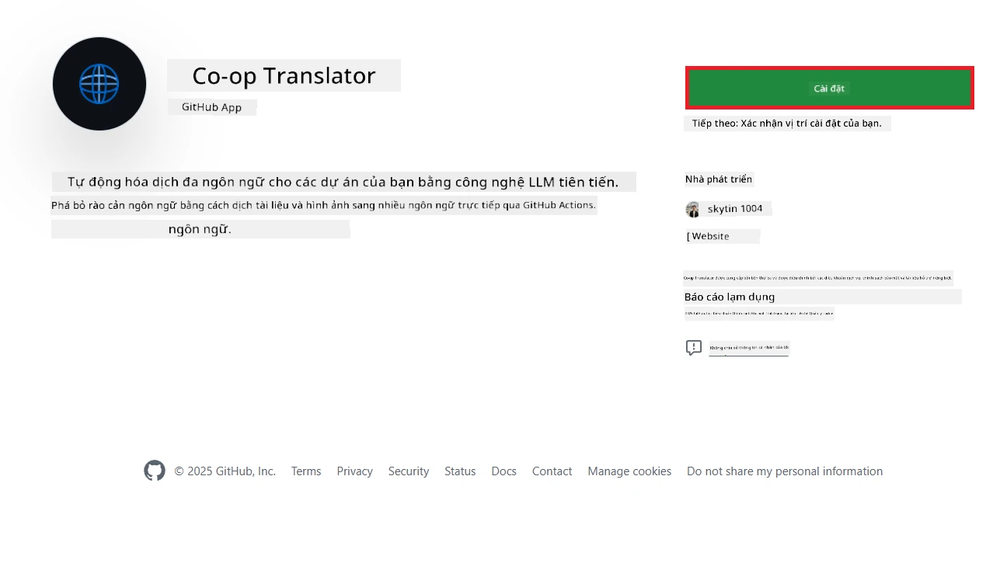
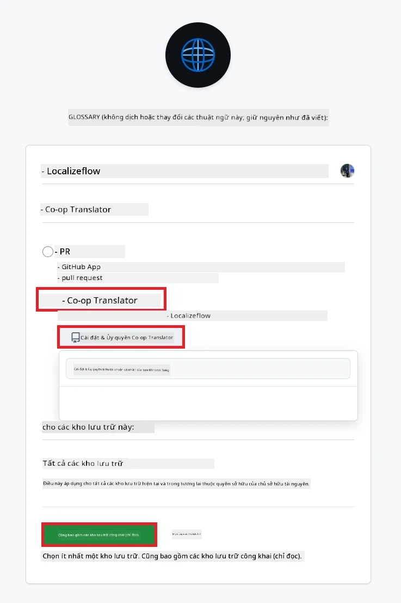
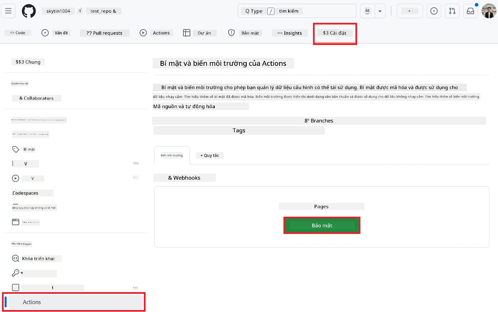
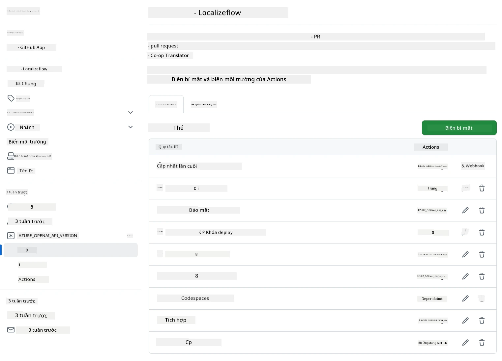

# Sử dụng Co-op Translator GitHub Action (Hướng dẫn cho tổ chức)

**Đối tượng:** Hướng dẫn này dành cho **người dùng nội bộ Microsoft** hoặc **nhóm có quyền truy cập vào thông tin xác thực cần thiết cho Co-op Translator GitHub App đã được xây dựng sẵn** hoặc có thể tự tạo GitHub App riêng.

Tự động hóa việc dịch tài liệu của kho lưu trữ của bạn một cách dễ dàng với Co-op Translator GitHub Action. Hướng dẫn này sẽ giúp bạn thiết lập action để tự động tạo pull request với các bản dịch được cập nhật mỗi khi file Markdown nguồn hoặc hình ảnh thay đổi.

> [!IMPORTANT]
> 
> **Chọn đúng hướng dẫn:**
>
> Hướng dẫn này mô tả cách thiết lập sử dụng **GitHub App ID và Private Key**. Bạn thường cần dùng phương pháp "Hướng dẫn cho tổ chức" này nếu: **`GITHUB_TOKEN` bị giới hạn quyền:** Tổ chức hoặc kho lưu trữ của bạn hạn chế quyền mặc định của `GITHUB_TOKEN`. Cụ thể, nếu `GITHUB_TOKEN` không được phép các quyền `write` cần thiết (như `contents: write` hoặc `pull-requests: write`), workflow trong [Hướng dẫn công khai](./github-actions-guide-public.md) sẽ thất bại do thiếu quyền. Sử dụng GitHub App riêng với quyền được cấp rõ ràng sẽ vượt qua hạn chế này.
>
> **Nếu bạn không gặp trường hợp trên:**
>
> Nếu `GITHUB_TOKEN` tiêu chuẩn có đủ quyền trong kho lưu trữ của bạn (tức là không bị hạn chế bởi tổ chức), hãy sử dụng **[Hướng dẫn công khai sử dụng GITHUB_TOKEN](./github-actions-guide-public.md)**. Hướng dẫn công khai không yêu cầu lấy hoặc quản lý App ID hay Private Key, chỉ dựa vào `GITHUB_TOKEN` và quyền của kho lưu trữ.

## Điều kiện tiên quyết

Trước khi cấu hình GitHub Action, hãy đảm bảo bạn đã có thông tin xác thực dịch vụ AI cần thiết.

**1. Bắt buộc: Thông tin xác thực AI Language Model**
Bạn cần thông tin xác thực cho ít nhất một mô hình ngôn ngữ được hỗ trợ:

- **Azure OpenAI**: Cần Endpoint, API Key, Tên Model/Deployment, API Version.
- **OpenAI**: Cần API Key, (Tùy chọn: Org ID, Base URL, Model ID).
- Xem [Các mô hình và dịch vụ hỗ trợ](../../../../README.md) để biết chi tiết.
- Hướng dẫn thiết lập: [Thiết lập Azure OpenAI](../set-up-resources/set-up-azure-openai.md).

**2. Tùy chọn: Thông tin xác thực Computer Vision (dịch trong hình ảnh)**

- Chỉ cần thiết nếu bạn muốn dịch văn bản trong hình ảnh.
- **Azure Computer Vision**: Cần Endpoint và Subscription Key.
- Nếu không cung cấp, action sẽ mặc định sang [chế độ chỉ Markdown](../markdown-only-mode.md).
- Hướng dẫn thiết lập: [Thiết lập Azure Computer Vision](../set-up-resources/set-up-azure-computer-vision.md).

## Thiết lập và cấu hình

Làm theo các bước sau để cấu hình Co-op Translator GitHub Action trong kho lưu trữ của bạn:

### Bước 1: Cài đặt và cấu hình xác thực GitHub App

Workflow sử dụng xác thực GitHub App để tương tác an toàn với kho lưu trữ của bạn (ví dụ: tạo pull request) thay mặt bạn. Chọn một trong hai cách sau:

#### **Cách A: Cài đặt Co-op Translator GitHub App đã xây dựng sẵn (dành cho nội bộ Microsoft)**

1. Truy cập trang [Co-op Translator GitHub App](https://github.com/apps/co-op-translator).

1. Chọn **Install** và chọn tài khoản hoặc tổ chức chứa kho lưu trữ mục tiêu.

    

1. Chọn **Only select repositories** và chọn kho lưu trữ mục tiêu (ví dụ: `PhiCookBook`). Nhấn **Install**. Có thể bạn sẽ được yêu cầu xác thực.

    

1. **Lấy thông tin xác thực App (Cần quy trình nội bộ):** Để workflow xác thực dưới dạng app, bạn cần hai thông tin do nhóm Co-op Translator cung cấp:
  - **App ID:** Định danh duy nhất cho app Co-op Translator. App ID là: `1164076`.
  - **Private Key:** Bạn phải lấy **toàn bộ nội dung** file private key `.pem` từ người quản lý. **Bảo mật key này như mật khẩu.**

1. Tiếp tục sang Bước 2.

#### **Cách B: Tạo GitHub App riêng của bạn**

- Nếu muốn, bạn có thể tự tạo và cấu hình GitHub App riêng. Đảm bảo app có quyền Read & write với Contents và Pull requests. Bạn sẽ cần App ID và Private Key được tạo ra.

### Bước 2: Cấu hình Repository Secrets

Bạn cần thêm thông tin xác thực GitHub App và dịch vụ AI vào phần secrets của kho lưu trữ.

1. Truy cập kho lưu trữ mục tiêu (ví dụ: `PhiCookBook`).

1. Vào **Settings** > **Secrets and variables** > **Actions**.

1. Trong **Repository secrets**, nhấn **New repository secret** cho từng secret bên dưới.

   

**Secrets bắt buộc (cho xác thực GitHub App):**

| Tên Secret           | Mô tả                                             | Nguồn giá trị                                    |
| :------------------- | :------------------------------------------------ | :----------------------------------------------- |
| `GH_APP_ID`          | App ID của GitHub App (từ Bước 1).                | GitHub App Settings                              |
| `GH_APP_PRIVATE_KEY` | **Toàn bộ nội dung** file `.pem` đã tải về.        | File `.pem` (từ Bước 1)                          |

**Secrets dịch vụ AI (Thêm TẤT CẢ những gì áp dụng theo điều kiện tiên quyết):**

| Tên Secret                          | Mô tả                                    | Nguồn giá trị                     |
| :---------------------------------- | :---------------------------------------- | :------------------------------- |
| `AZURE_AI_SERVICE_API_KEY`            | Key cho Azure AI Service (Computer Vision)  | Azure AI Foundry                    |
| `AZURE_AI_SERVICE_ENDPOINT`         | Endpoint cho Azure AI Service (Computer Vision) | Azure AI Foundry                     |
| `AZURE_OPENAI_API_KEY`              | Key cho dịch vụ Azure OpenAI              | Azure AI Foundry                     |
| `AZURE_OPENAI_ENDPOINT`             | Endpoint cho dịch vụ Azure OpenAI         | Azure AI Foundry                     |
| `AZURE_OPENAI_MODEL_NAME`           | Tên Model Azure OpenAI của bạn            | Azure AI Foundry                     |
| `AZURE_OPENAI_CHAT_DEPLOYMENT_NAME` | Tên Deployment Azure OpenAI của bạn        | Azure AI Foundry                     |
| `AZURE_OPENAI_API_VERSION`          | API Version cho Azure OpenAI              | Azure AI Foundry                     |
| `OPENAI_API_KEY`                    | API Key cho OpenAI                        | OpenAI Platform                  |
| `OPENAI_ORG_ID`                     | OpenAI Organization ID                    | OpenAI Platform                  |
| `OPENAI_CHAT_MODEL_ID`              | Model ID cụ thể của OpenAI                | OpenAI Platform                    |
| `OPENAI_BASE_URL`                   | Base URL API tùy chỉnh của OpenAI         | OpenAI Platform                    |



### Bước 3: Tạo file Workflow

Cuối cùng, tạo file YAML định nghĩa workflow tự động.

1. Ở thư mục gốc của kho lưu trữ, tạo thư mục `.github/workflows/` nếu chưa có.

1. Trong `.github/workflows/`, tạo file tên là `co-op-translator.yml`.

1. Dán nội dung sau vào file co-op-translator.yml.

```
name: Co-op Translator

on:
  push:
    branches:
      - main

jobs:
  co-op-translator:
    runs-on: ubuntu-latest

    permissions:
      contents: write
      pull-requests: write

    steps:
      - name: Checkout repository
        uses: actions/checkout@v4
        with:
          fetch-depth: 0

      - name: Set up Python
        uses: actions/setup-python@v4
        with:
          python-version: '3.10'

      - name: Install Co-op Translator
        run: |
          python -m pip install --upgrade pip
          pip install co-op-translator

      - name: Run Co-op Translator
        env:
          PYTHONIOENCODING: utf-8
          # Azure AI Service Credentials
          AZURE_AI_SERVICE_API_KEY: ${{ secrets.AZURE_AI_SERVICE_API_KEY }}
          AZURE_AI_SERVICE_ENDPOINT: ${{ secrets.AZURE_AI_SERVICE_ENDPOINT }}

          # Azure OpenAI Credentials
          AZURE_OPENAI_API_KEY: ${{ secrets.AZURE_OPENAI_API_KEY }}
          AZURE_OPENAI_ENDPOINT: ${{ secrets.AZURE_OPENAI_ENDPOINT }}
          AZURE_OPENAI_MODEL_NAME: ${{ secrets.AZURE_OPENAI_MODEL_NAME }}
          AZURE_OPENAI_CHAT_DEPLOYMENT_NAME: ${{ secrets.AZURE_OPENAI_CHAT_DEPLOYMENT_NAME }}
          AZURE_OPENAI_API_VERSION: ${{ secrets.AZURE_OPENAI_API_VERSION }}

          # OpenAI Credentials
          OPENAI_API_KEY: ${{ secrets.OPENAI_API_KEY }}
          OPENAI_ORG_ID: ${{ secrets.OPENAI_ORG_ID }}
          OPENAI_CHAT_MODEL_ID: ${{ secrets.OPENAI_CHAT_MODEL_ID }}
          OPENAI_BASE_URL: ${{ secrets.OPENAI_BASE_URL }}
        run: |
          # =====================================================================
          # IMPORTANT: Set your target languages here (REQUIRED CONFIGURATION)
          # =====================================================================
          # Example: Translate to Spanish, French, German. Add -y to auto-confirm.
          translate -l "es fr de" -y  # <--- MODIFY THIS LINE with your desired languages

      - name: Authenticate GitHub App
        id: generate_token
        uses: tibdex/github-app-token@v1
        with:
          app_id: ${{ secrets.GH_APP_ID }}
          private_key: ${{ secrets.GH_APP_PRIVATE_KEY }}

      - name: Create Pull Request with translations
        uses: peter-evans/create-pull-request@v5
        with:
          token: ${{ steps.generate_token.outputs.token }}
          commit-message: "🌐 Update translations via Co-op Translator"
          title: "🌐 Update translations via Co-op Translator"
          body: |
            This PR updates translations for recent changes to the main branch.

            ### 📋 Changes included
            - Translated contents are available in the `translations/` directory
            - Translated images are available in the `translated_images/` directory

            ---
            🌐 Automatically generated by the [Co-op Translator](https://github.com/Azure/co-op-translator) GitHub Action.
          branch: update-translations
          base: main
          labels: translation, automated-pr
          delete-branch: true
          add-paths: |
            translations/
            translated_images/

```

4.  **Tùy chỉnh Workflow:**
  - **[!IMPORTANT] Ngôn ngữ đích:** Trong bước `Run Co-op Translator`, bạn **PHẢI kiểm tra và chỉnh sửa danh sách mã ngôn ngữ** trong lệnh `translate -l "..." -y` cho phù hợp với dự án của bạn. Danh sách ví dụ (`ar de es...`) cần được thay thế hoặc điều chỉnh.
  - **Trigger (`on:`):** Trigger hiện tại chạy mỗi lần push lên `main`. Với kho lưu trữ lớn, hãy cân nhắc thêm bộ lọc `paths:` (xem ví dụ đã comment trong YAML) để workflow chỉ chạy khi file liên quan (ví dụ: tài liệu nguồn) thay đổi, tiết kiệm thời gian runner.
  - **Chi tiết PR:** Tùy chỉnh `commit-message`, `title`, `body`, tên `branch`, và `labels` trong bước `Create Pull Request` nếu cần.

## Quản lý và gia hạn thông tin xác thực

- **Bảo mật:** Luôn lưu thông tin nhạy cảm (API key, private key) dưới dạng GitHub Actions secrets. Không để lộ trong file workflow hoặc mã nguồn kho lưu trữ.
- **[!IMPORTANT] Gia hạn key (người dùng nội bộ Microsoft):** Lưu ý key Azure OpenAI dùng trong Microsoft có thể phải gia hạn định kỳ (ví dụ: mỗi 5 tháng). Hãy cập nhật các secrets GitHub tương ứng (`AZURE_OPENAI_...`) **trước khi hết hạn** để tránh workflow bị lỗi.

## Chạy workflow

> [!WARNING]  
> **Giới hạn thời gian Runner của GitHub-hosted:**  
> Runner như `ubuntu-latest` có **giới hạn thời gian chạy tối đa 6 giờ**.  
> Với kho lưu trữ tài liệu lớn, nếu quá trình dịch vượt quá 6 giờ, workflow sẽ tự động bị dừng.  
> Để tránh điều này, hãy cân nhắc:  
> - Sử dụng **self-hosted runner** (không giới hạn thời gian)  
> - Giảm số lượng ngôn ngữ đích mỗi lần chạy

Khi file `co-op-translator.yml` được merge vào nhánh chính (hoặc nhánh được chỉ định trong trigger `on:`), workflow sẽ tự động chạy mỗi khi có thay đổi được push lên nhánh đó (và khớp với bộ lọc `paths` nếu có cấu hình).

Nếu có bản dịch mới hoặc cập nhật, action sẽ tự động tạo Pull Request chứa các thay đổi, sẵn sàng để bạn kiểm tra và hợp nhất.

---

**Tuyên bố miễn trừ trách nhiệm**:
Tài liệu này đã được dịch bằng dịch vụ dịch thuật AI [Co-op Translator](https://github.com/Azure/co-op-translator). Mặc dù chúng tôi cố gắng đảm bảo độ chính xác, xin lưu ý rằng bản dịch tự động có thể chứa lỗi hoặc không chính xác. Tài liệu gốc bằng ngôn ngữ bản địa nên được coi là nguồn tham khảo chính thức. Đối với các thông tin quan trọng, khuyến nghị sử dụng dịch vụ dịch thuật chuyên nghiệp bởi con người. Chúng tôi không chịu trách nhiệm về bất kỳ sự hiểu lầm hoặc diễn giải sai nào phát sinh từ việc sử dụng bản dịch này.