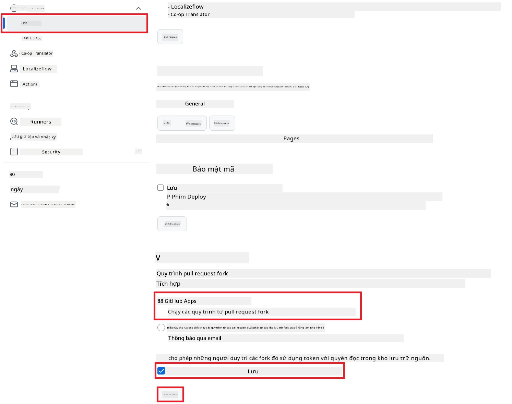

# Sử dụng Co-op Translator GitHub Action (Thiết lập công khai)

**Đối tượng:** Hướng dẫn này dành cho người dùng trong hầu hết các kho công khai hoặc riêng tư, nơi quyền truy cập GitHub Actions tiêu chuẩn là đủ. Hành động này sử dụng sẵn `GITHUB_TOKEN`.

Tự động hóa việc dịch tài liệu của kho lưu trữ của bạn một cách dễ dàng với Co-op Translator GitHub Action. Hướng dẫn này sẽ giúp bạn thiết lập hành động để tự động tạo pull request với bản dịch mới mỗi khi các file Markdown nguồn hoặc hình ảnh của bạn thay đổi.

> [!IMPORTANT]
>
> **Chọn đúng hướng dẫn:**
>
> Hướng dẫn này mô tả **cách thiết lập đơn giản hơn sử dụng `GITHUB_TOKEN` tiêu chuẩn**. Đây là phương pháp khuyến nghị cho hầu hết người dùng vì không cần quản lý các khóa riêng tư nhạy cảm của GitHub App.
>

## Điều kiện tiên quyết

Trước khi cấu hình GitHub Action, hãy đảm bảo bạn đã chuẩn bị sẵn thông tin xác thực dịch vụ AI cần thiết.

**1. Bắt buộc: Thông tin xác thực mô hình ngôn ngữ AI**
Bạn cần thông tin xác thực cho ít nhất một mô hình ngôn ngữ được hỗ trợ:

- **Azure OpenAI**: Cần Endpoint, API Key, Tên Model/Deployment, Phiên bản API.
- **OpenAI**: Cần API Key, (Tùy chọn: Org ID, Base URL, Model ID).
- Xem [Các mô hình và dịch vụ hỗ trợ](../../../../README.md) để biết chi tiết.

**2. Tùy chọn: Thông tin xác thực AI Vision (cho dịch hình ảnh)**

- Chỉ cần thiết nếu bạn muốn dịch văn bản trong hình ảnh.
- **Azure AI Vision**: Cần Endpoint và Subscription Key.
- Nếu không cung cấp, hành động sẽ mặc định sang [chế độ chỉ Markdown](../markdown-only-mode.md).

## Thiết lập và cấu hình

Làm theo các bước sau để cấu hình Co-op Translator GitHub Action trong kho của bạn bằng `GITHUB_TOKEN` tiêu chuẩn.

### Bước 1: Hiểu về xác thực (Sử dụng `GITHUB_TOKEN`)

Workflow này sử dụng `GITHUB_TOKEN` được GitHub Actions cung cấp sẵn. Token này tự động cấp quyền cho workflow tương tác với kho của bạn dựa trên các thiết lập ở **Bước 3**.

### Bước 2: Cấu hình Repository Secrets

Bạn chỉ cần thêm **thông tin xác thực dịch vụ AI** dưới dạng secrets được mã hóa trong phần cài đặt kho lưu trữ.

1.  Truy cập kho GitHub bạn muốn cấu hình.
2.  Vào **Settings** > **Secrets and variables** > **Actions**.
3.  Trong **Repository secrets**, nhấn **New repository secret** cho mỗi secret dịch vụ AI cần thiết bên dưới.

     *(Tham khảo hình ảnh: Vị trí thêm secrets)*

**Các secrets dịch vụ AI cần thiết (Thêm TẤT CẢ những gì phù hợp với điều kiện tiên quyết của bạn):**

| Tên Secret                         | Mô tả                                   | Nguồn giá trị                     |
| :---------------------------------- | :-------------------------------------- | :------------------------------- |
| `AZURE_AI_SERVICE_API_KEY`            | Khóa cho Azure AI Service (Computer Vision)  | Azure AI Foundry của bạn               |
| `AZURE_AI_SERVICE_ENDPOINT`         | Endpoint cho Azure AI Service (Computer Vision) | Azure AI Foundry của bạn               |
| `AZURE_OPENAI_API_KEY`              | Khóa cho dịch vụ Azure OpenAI           | Azure AI Foundry của bạn               |
| `AZURE_OPENAI_ENDPOINT`             | Endpoint cho dịch vụ Azure OpenAI       | Azure AI Foundry của bạn               |
| `AZURE_OPENAI_MODEL_NAME`           | Tên Model Azure OpenAI của bạn          | Azure AI Foundry của bạn               |
| `AZURE_OPENAI_CHAT_DEPLOYMENT_NAME` | Tên Deployment Azure OpenAI của bạn     | Azure AI Foundry của bạn               |
| `AZURE_OPENAI_API_VERSION`          | Phiên bản API cho Azure OpenAI          | Azure AI Foundry của bạn               |
| `OPENAI_API_KEY`                    | API Key cho OpenAI                      | Nền tảng OpenAI của bạn              |
| `OPENAI_ORG_ID`                     | OpenAI Organization ID (Tùy chọn)       | Nền tảng OpenAI của bạn              |
| `OPENAI_CHAT_MODEL_ID`              | ID model OpenAI cụ thể (Tùy chọn)       | Nền tảng OpenAI của bạn              |
| `OPENAI_BASE_URL`                   | Base URL API OpenAI tùy chỉnh (Tùy chọn)| Nền tảng OpenAI của bạn              |

### Bước 3: Cấu hình quyền Workflow

GitHub Action cần được cấp quyền thông qua `GITHUB_TOKEN` để checkout code và tạo pull request.

1.  Trong kho của bạn, vào **Settings** > **Actions** > **General**.
2.  Cuộn xuống phần **Workflow permissions**.
3.  Chọn **Read and write permissions**. Điều này cấp quyền `contents: write` và `pull-requests: write` cho `GITHUB_TOKEN` trong workflow này.
4.  Đảm bảo đã tích vào ô **Allow GitHub Actions to create and approve pull requests**.
5.  Nhấn **Save**.



### Bước 4: Tạo file Workflow

Cuối cùng, hãy tạo file YAML định nghĩa workflow tự động sử dụng `GITHUB_TOKEN`.

1.  Ở thư mục gốc của kho, tạo thư mục `.github/workflows/` nếu chưa có.
2.  Trong `.github/workflows/`, tạo file tên là `co-op-translator.yml`.
3.  Dán nội dung sau vào file `co-op-translator.yml`.

```yaml
name: Co-op Translator

on:
  push:
    branches:
      - main

jobs:
  co-op-translator:
    runs-on: ubuntu-latest

    permissions:
      contents: write
      pull-requests: write

    steps:
      - name: Checkout repository
        uses: actions/checkout@v4
        with:
          fetch-depth: 0

      - name: Set up Python
        uses: actions/setup-python@v4
        with:
          python-version: '3.10'

      - name: Install Co-op Translator
        run: |
          python -m pip install --upgrade pip
          pip install co-op-translator

      - name: Run Co-op Translator
        env:
          PYTHONIOENCODING: utf-8
          # === AI Service Credentials ===
          AZURE_AI_SERVICE_API_KEY: ${{ secrets.AZURE_AI_SERVICE_API_KEY }}
          AZURE_AI_SERVICE_ENDPOINT: ${{ secrets.AZURE_AI_SERVICE_ENDPOINT }}
          AZURE_OPENAI_API_KEY: ${{ secrets.AZURE_OPENAI_API_KEY }}
          AZURE_OPENAI_ENDPOINT: ${{ secrets.AZURE_OPENAI_ENDPOINT }}
          AZURE_OPENAI_MODEL_NAME: ${{ secrets.AZURE_OPENAI_MODEL_NAME }}
          AZURE_OPENAI_CHAT_DEPLOYMENT_NAME: ${{ secrets.AZURE_OPENAI_CHAT_DEPLOYMENT_NAME }}
          AZURE_OPENAI_API_VERSION: ${{ secrets.AZURE_OPENAI_API_VERSION }}
          OPENAI_API_KEY: ${{ secrets.OPENAI_API_KEY }}
          OPENAI_ORG_ID: ${{ secrets.OPENAI_ORG_ID }}
          OPENAI_CHAT_MODEL_ID: ${{ secrets.OPENAI_CHAT_MODEL_ID }}
          OPENAI_BASE_URL: ${{ secrets.OPENAI_BASE_URL }}
        run: |
          # =====================================================================
          # IMPORTANT: Set your target languages here (REQUIRED CONFIGURATION)
          # =====================================================================
          # Example: Translate to Spanish, French, German. Add -y to auto-confirm.
          translate -l "es fr de" -y  # <--- MODIFY THIS LINE with your desired languages

      - name: Create Pull Request with translations
        uses: peter-evans/create-pull-request@v5
        with:
          token: ${{ secrets.GITHUB_TOKEN }}
          commit-message: "🌐 Update translations via Co-op Translator"
          title: "🌐 Update translations via Co-op Translator"
          body: |
            This PR updates translations for recent changes to the main branch.

            ### 📋 Changes included
            - Translated contents are available in the `translations/` directory
            - Translated images are available in the `translated_images/` directory

            ---
            🌐 Automatically generated by the [Co-op Translator](https://github.com/Azure/co-op-translator) GitHub Action.
          branch: update-translations
          base: main
          labels: translation, automated-pr
          delete-branch: true
          add-paths: |
            translations/
            translated_images/
```
4.  **Tùy chỉnh Workflow:**
  - **[!IMPORTANT] Ngôn ngữ đích:** Ở bước `Run Co-op Translator`, bạn **PHẢI kiểm tra và chỉnh sửa danh sách mã ngôn ngữ** trong lệnh `translate -l "..." -y` để phù hợp với dự án của bạn. Danh sách ví dụ (`ar de es...`) cần được thay thế hoặc điều chỉnh.
  - **Trigger (`on:`):** Trigger hiện tại chạy mỗi lần có push lên `main`. Với kho lớn, hãy cân nhắc thêm bộ lọc `paths:` (xem ví dụ đã comment trong YAML) để workflow chỉ chạy khi các file liên quan (ví dụ: tài liệu nguồn) thay đổi, giúp tiết kiệm thời gian runner.
  - **Chi tiết PR:** Tùy chỉnh `commit-message`, `title`, `body`, tên `branch` và `labels` trong bước `Create Pull Request` nếu cần.

## Chạy Workflow

> [!WARNING]  
> **Giới hạn thời gian Runner do GitHub host:**  
> Các runner do GitHub host như `ubuntu-latest` có **giới hạn thời gian chạy tối đa là 6 giờ**.  
> Với các kho tài liệu lớn, nếu quá trình dịch vượt quá 6 giờ, workflow sẽ tự động bị dừng.  
> Để tránh điều này, hãy cân nhắc:  
> - Sử dụng **self-hosted runner** (không giới hạn thời gian)  
> - Giảm số lượng ngôn ngữ đích mỗi lần chạy

Khi file `co-op-translator.yml` được merge vào nhánh chính (hoặc nhánh được chỉ định trong trigger `on:`), workflow sẽ tự động chạy mỗi khi có thay đổi được push lên nhánh đó (và khớp với bộ lọc `paths` nếu đã cấu hình).

---

**Tuyên bố miễn trừ trách nhiệm**:
Tài liệu này đã được dịch bằng dịch vụ dịch thuật AI [Co-op Translator](https://github.com/Azure/co-op-translator). Mặc dù chúng tôi cố gắng đảm bảo độ chính xác, xin lưu ý rằng bản dịch tự động có thể chứa lỗi hoặc không chính xác. Tài liệu gốc bằng ngôn ngữ bản địa nên được xem là nguồn tham khảo chính thức. Đối với các thông tin quan trọng, khuyến nghị sử dụng dịch vụ dịch thuật chuyên nghiệp bởi con người. Chúng tôi không chịu trách nhiệm về bất kỳ sự hiểu lầm hoặc diễn giải sai nào phát sinh từ việc sử dụng bản dịch này.