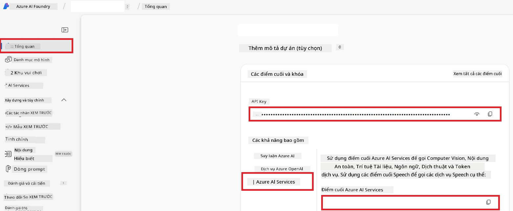

# Thiết Lập Azure AI cho Co-op Translator (Azure OpneAI & Azure AI Vision)

Hướng dẫn này sẽ hướng dẫn bạn cách thiết lập Azure OpenAI cho dịch ngôn ngữ và Azure Computer Vision để phân tích nội dung hình ảnh (sau đó có thể dùng để dịch dựa trên hình ảnh) trong Azure AI Foundry.

**Yêu cầu trước:**
- Một tài khoản Azure với đăng ký hoạt động.
- Quyền đủ để tạo tài nguyên và triển khai trong đăng ký Azure của bạn.

## Tạo Dự Án Azure AI

Bạn sẽ bắt đầu bằng cách tạo một Dự Án Azure AI, đây là nơi trung tâm để quản lý các tài nguyên AI của bạn.

1. Điều hướng tới [https://ai.azure.com](https://ai.azure.com) và đăng nhập bằng tài khoản Azure của bạn.

1. Chọn **+Create** để tạo dự án mới.

1. Thực hiện các tác vụ sau:
   - Nhập **Tên dự án** (ví dụ: `CoopTranslator-Project`).
   - Chọn **AI hub** (ví dụ: `CoopTranslator-Hub`) (Tạo mới nếu cần).

1. Nhấp "**Review and Create**" để thiết lập dự án của bạn. Bạn sẽ được chuyển đến trang tổng quan của dự án.

## Thiết lập Azure OpenAI cho Dịch Ngôn Ngữ

Trong dự án của bạn, bạn sẽ triển khai một mô hình Azure OpenAI để làm backend cho việc dịch văn bản.

### Điều Hướng Đến Dự Án Của Bạn

Nếu chưa, mở dự án bạn vừa tạo (ví dụ: `CoopTranslator-Project`) trong Azure AI Foundry.

### Triển Khai Mô Hình OpenAI

1. Từ menu bên trái của dự án, dưới "My assets", chọn "**Models + endpoints**".

1. Chọn **+ Deploy model**.

1. Chọn **Deploy Base Model**.

1. Một danh sách các mô hình có sẵn sẽ xuất hiện. Lọc hoặc tìm kiếm mô hình GPT phù hợp. Chúng tôi khuyên dùng `gpt-4o`.

1. Chọn mô hình mong muốn và nhấn **Confirm**.

1. Chọn **Deploy**.

### Cấu hình Azure OpenAI

Khi đã triển khai, bạn có thể chọn triển khai từ trang "**Models + endpoints**" để tìm **REST endpoint URL**, **Key**, **Deployment name**, **Model name** và **API version**. Những thông tin này sẽ cần thiết để tích hợp mô hình dịch vào ứng dụng của bạn.

> [!NOTE]
> Bạn có thể chọn phiên bản API từ trang [API version deprecation](https://learn.microsoft.com/azure/ai-services/openai/api-version-deprecation) dựa trên yêu cầu của bạn. Lưu ý rằng **API version** khác với **Model version** được hiển thị trên trang **Models + endpoints** trong Azure AI Foundry.

## Thiết lập Azure Computer Vision cho Dịch Hình Ảnh

Để kích hoạt dịch văn bản trong hình ảnh, bạn cần tìm Khóa API và Endpoint của Dịch Vụ Azure AI.

1. Điều hướng đến Dự Án Azure AI của bạn (ví dụ: `CoopTranslator-Project`). Đảm bảo bạn đang ở trang tổng quan dự án.

### Cấu hình Dịch Vụ Azure AI

Tìm Khóa API và Endpoint từ Dịch Vụ Azure AI.

1. Điều hướng đến Dự Án Azure AI của bạn (ví dụ: `CoopTranslator-Project`). Đảm bảo bạn đang trong trang tổng quan dự án.

1. Tìm **API Key** và **Endpoint** trong tab dịch vụ Azure AI.

    

Kết nối này giúp đưa các khả năng của tài nguyên dịch vụ Azure AI được liên kết (bao gồm phân tích hình ảnh) vào dự án AI Foundry của bạn. Bạn có thể dùng kết nối này trong notebook hoặc ứng dụng của mình để trích xuất văn bản từ hình ảnh, sau đó gửi tới mô hình Azure OpenAI để dịch.

## Tập Hợp Thông Tin Đăng Nhập Của Bạn

Đến giờ, bạn nên đã thu thập được các thông tin sau:

**Đối với Azure OpenAI (Dịch văn bản):**
- Endpoint Azure OpenAI
- API Key Azure OpenAI
- Tên Mô hình Azure OpenAI (ví dụ: `gpt-4o`)
- Tên Triển khai Azure OpenAI (ví dụ: `cooptranslator-gpt4o`)
- Phiên bản API Azure OpenAI

**Đối với Dịch vụ Azure AI (Trích xuất văn bản hình ảnh qua Vision):**
- Endpoint Dịch vụ Azure AI
- API Key Dịch vụ Azure AI

### Ví dụ: Cấu hình Biến Môi Trường (Bản Preview)

Sau này khi xây dựng ứng dụng, bạn có thể sẽ cấu hình bằng cách dùng các thông tin đăng nhập đã thu thập này. Ví dụ, bạn có thể đặt chúng như biến môi trường như sau:

```bash
# Thông tin xác thực Dịch vụ AI Azure (Cần thiết cho dịch hình ảnh)
AZURE_AI_SERVICE_API_KEY="your_azure_ai_service_api_key" # ví dụ, 21xasd...
AZURE_AI_SERVICE_ENDPOINT="https://your_azure_ai_service_endpoint.cognitiveservices.azure.com/"

# Các tập dự phòng tùy chọn: nhân đôi biến với hậu tố _1/_2 (cùng chỉ số cho tất cả biến trong tập)
AZURE_AI_SERVICE_API_KEY_1="your_azure_ai_service_api_key_1"
AZURE_AI_SERVICE_ENDPOINT_1="https://your_azure_ai_service_endpoint_1.cognitiveservices.azure.com/"

# Thông tin xác thực Azure OpenAI (Cần thiết cho dịch văn bản)
AZURE_OPENAI_API_KEY="your_azure_openai_api_key" # ví dụ, 21xasd...
AZURE_OPENAI_ENDPOINT="https://your_azure_openai_endpoint.openai.azure.com/"
AZURE_OPENAI_MODEL_NAME="your_model_name" # ví dụ, gpt-4o
AZURE_OPENAI_CHAT_DEPLOYMENT_NAME="your_deployment_name" # ví dụ, cooptranslator-gpt4o
AZURE_OPENAI_API_VERSION="your_api_version" # ví dụ, 2024-12-01-preview

# Các tập dự phòng tùy chọn: nhân đôi toàn bộ tập AZURE_OPENAI_* với hậu tố _1/_2 (cùng chỉ số cho tất cả biến)
```

---

### Tài liệu tham khảo thêm

- [Cách Tạo dự án trong Azure AI Foundry](https://learn.microsoft.com/azure/ai-foundry/how-to/create-projects?tabs=ai-studio)
- [Cách Tạo tài nguyên Azure AI](https://learn.microsoft.com/azure/ai-foundry/how-to/create-azure-ai-resource?tabs=portal)
- [Cách Triển khai mô hình OpenAI trong Azure AI Foundry](https://learn.microsoft.com/en-us/azure/ai-foundry/how-to/deploy-models-openai)

---

<!-- CO-OP TRANSLATOR DISCLAIMER START -->
**Tuyên bố từ chối trách nhiệm**:  
Tài liệu này đã được dịch bằng dịch vụ dịch thuật AI [Co-op Translator](https://github.com/Azure/co-op-translator). Mặc dù chúng tôi nỗ lực đảm bảo độ chính xác, xin lưu ý rằng các bản dịch tự động có thể chứa lỗi hoặc không chính xác. Tài liệu gốc bằng ngôn ngữ gốc nên được coi là nguồn có thẩm quyền. Đối với thông tin quan trọng, nên sử dụng dịch thuật chuyên nghiệp bởi con người. Chúng tôi không chịu trách nhiệm về bất kỳ sự hiểu nhầm hoặc diễn giải sai nào phát sinh từ việc sử dụng bản dịch này.
<!-- CO-OP TRANSLATOR DISCLAIMER END -->