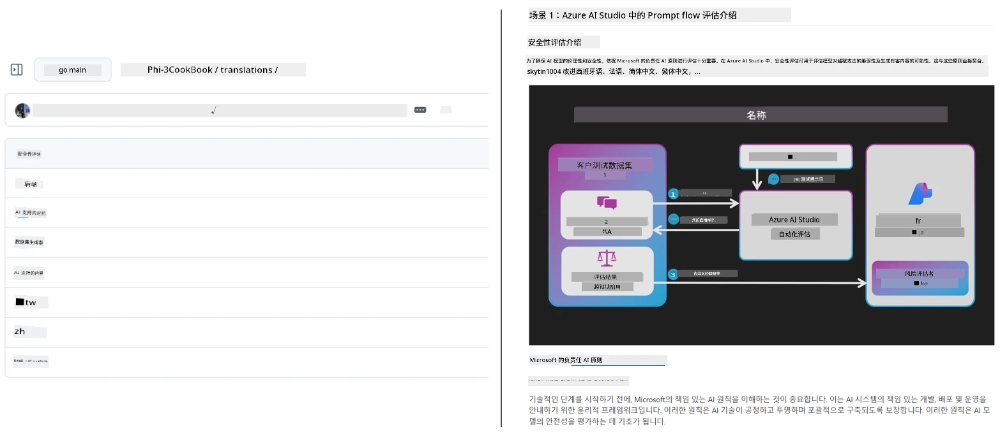
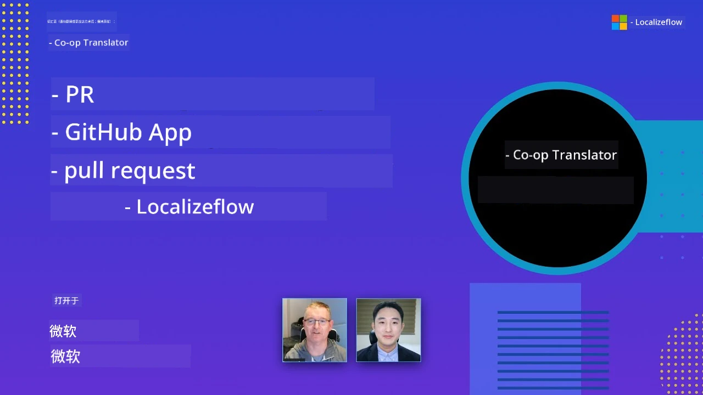

# Co-op Translator

_随着您的项目发展，轻松自动化并维护您的教育 GitHub 内容的多语言翻译。_


[](https://pypi.org/project/co-op-translator/)
[](https://github.com/azure/co-op-translator/blob/main/LICENSE)
[](https://pepy.tech/project/co-op-translator)
[](https://pepy.tech/project/co-op-translator)
[](https://github.com/azure/co-op-translator/pkgs/container/co-op-translator)
[](https://github.com/psf/black)

[](https://GitHub.com/azure/co-op-translator/graphs/contributors/)
[](https://GitHub.com/azure/co-op-translator/issues/)
[](https://GitHub.com/azure/co-op-translator/pulls/)
[](http://makeapullrequest.com)

### 🌐 多语言支持

#### 由 [Co-op Translator](https://github.com/Azure/Co-op-Translator) 支持

<!-- CO-OP TRANSLATOR LANGUAGES TABLE START -->
[阿拉伯语](../ar/README.md) | [孟加拉语](../bn/README.md) | [保加利亚语](../bg/README.md) | [缅甸语 (Myanmar)](../my/README.md) | [中文（简体）](./README.md) | [中文（繁体，香港）](../zh-HK/README.md) | [中文（繁体，澳门）](../zh-MO/README.md) | [中文（繁体，台湾）](../zh-TW/README.md) | [克罗地亚语](../hr/README.md) | [捷克语](../cs/README.md) | [丹麦语](../da/README.md) | [荷兰语](../nl/README.md) | [爱沙尼亚语](../et/README.md) | [芬兰语](../fi/README.md) | [法语](../fr/README.md) | [德语](../de/README.md) | [希腊语](../el/README.md) | [希伯来语](../he/README.md) | [印地语](../hi/README.md) | [匈牙利语](../hu/README.md) | [印尼语](../id/README.md) | [意大利语](../it/README.md) | [日语](../ja/README.md) | [坎纳达语](../kn/README.md) | [高棉语](../km/README.md) | [韩语](../ko/README.md) | [立陶宛语](../lt/README.md) | [马来语](../ms/README.md) | [马拉雅拉姆语](../ml/README.md) | [马拉地语](../mr/README.md) | [尼泊尔语](../ne/README.md) | [尼日利亚皮钦语](../pcm/README.md) | [挪威语](../no/README.md) | [波斯语（法尔西语）](../fa/README.md) | [波兰语](../pl/README.md) | [巴西葡萄牙语](../pt-BR/README.md) | [葡萄牙语（葡萄牙）](../pt-PT/README.md) | [旁遮普语（古鲁姆克希）](../pa/README.md) | [罗马尼亚语](../ro/README.md) | [俄语](../ru/README.md) | [塞尔维亚语（西里尔字母）](../sr/README.md) | [斯洛伐克语](../sk/README.md) | [斯洛文尼亚语](../sl/README.md) | [西班牙语](../es/README.md) | [斯瓦希里语](../sw/README.md) | [瑞典语](../sv/README.md) | [他加禄语（菲律宾语）](../tl/README.md) | [泰米尔语](../ta/README.md) | [泰卢固语](../te/README.md) | [泰语](../th/README.md) | [土耳其语](../tr/README.md) | [乌克兰语](../uk/README.md) | [乌尔都语](../ur/README.md) | [越南语](../vi/README.md)

> **更喜欢本地克隆？**
>
> 本仓库包含 50 多种语言的翻译，显著增加下载大小。若想不包含翻译内容克隆，可使用稀疏检出：
>
> **Bash / macOS / Linux:**
> ```bash
> git clone --filter=blob:none --sparse https://github.com/skytin1004/co-op-translator.git
> cd co-op-translator
> git sparse-checkout set --no-cone '/*' '!translations' '!translated_images'
> ```
>
> **CMD（Windows）:**
> ```cmd
> git clone --filter=blob:none --sparse https://github.com/skytin1004/co-op-translator.git
> cd co-op-translator
> git sparse-checkout set --no-cone "/*" "!translations" "!translated_images"
> ```
>
> 这样您可以更快速下载完成课程所需的所有内容。
<!-- CO-OP TRANSLATOR LANGUAGES TABLE END -->

[](https://GitHub.com/azure/co-op-translator/watchers/)
[](https://GitHub.com/azure/co-op-translator/network/)
[](https://GitHub.com/azure/co-op-translator/stargazers/)

[](https://discord.gg/nTYy5BXMWG)

[](https://codespaces.new/azure/co-op-translator)

## 概述

**Co-op Translator** 助力您轻松将教育 GitHub 内容本地化为多种语言。  
当您更新 Markdown 文件、图片或笔记本时，翻译内容会自动保持同步，确保您的内容对全球学习者始终准确且最新。

翻译内容组织示例：



## 如何管理翻译状态

Co-op Translator 将翻译内容作为<strong>版本化的软件产物</strong>进行管理，  
而非静态文件。

该工具通过<strong>语言范围的元数据</strong>跟踪已翻译的 Markdown、图片和笔记本的状态。

这种设计让 Co-op Translator 能够：

- 可靠检测过时的翻译
- 一致地处理 Markdown、图片和笔记本
- 安全扩展以适应大型、快速变动的多语言仓库

通过将翻译建模成管理的产物，  
翻译工作流自然而然地与现代软件依赖和产物管理实践相匹配。

→ [如何管理翻译状态](https://techcommunity.microsoft.com/blog/azuredevcommunityblog/rethinking-documentation-translation-treating-translations-as-versioned-software/4491755)


## 快速开始

```bash
# 创建并激活虚拟环境（推荐）
python -m venv .venv
# Windows
.venv\Scripts\activate
# macOS/Linux
source .venv/bin/activate
# 安装软件包
pip install co-op-translator
# 翻译
translate -l "ko ja fr" -md
```

Docker:

```bash
# 从 GHCR 拉取公共镜像
docker pull ghcr.io/azure/co-op-translator:latest
# 挂载当前文件夹并提供 .env 运行（Bash/Zsh）
docker run --rm -it --env-file .env -v "${PWD}:/work" ghcr.io/azure/co-op-translator:latest -l "ko ja fr" -md
```

## 最简配置

1. 确认您有支持的 Python 版本（目前为 3.10-3.12）。在 poetry（pyproject.toml）中自动处理。
2. 依据模板创建 `.env` 文件： [.env.template](../../.env.template)
3. 配置一个 LLM 提供商（Azure OpenAI 或 OpenAI）
4. （可选）对于图片翻译（`-img`），配置 Azure AI Vision
5. （可选）可通过添加后缀如 `_1`, `_2` 等，配置多个凭据集。每套凭据的所有变量须共用同一后缀。
6. （推荐）清理之前的翻译以避免冲突（如 `translations/`）
7. （推荐）使用 [README 语言模板](./getting_started/README_languages_template.md) 在 README 增加翻译章节
8. 参见：[设置 Azure AI](./getting_started/set-up-azure-ai.md)

## 使用方法

翻译所有支持类型：

```bash
translate -l "ko ja"
```

仅翻译 Markdown：

```bash
translate -l "de" -md
```

Markdown + 图片：

```bash
translate -l "pt" -md -img
```

仅翻译笔记本：

```bash
translate -l "zh" -nb
```

更多参数： [命令参考](./getting_started/command-reference.md)

## 功能特性

- 自动翻译 Markdown、笔记本和图片
- 保持翻译与源内容同步
- 可在本地（CLI）或 CI（GitHub Actions）中运行
- 使用 Azure OpenAI 或 OpenAI；图片翻译可选 Azure AI Vision
- 保留 Markdown 格式和结构

## 文档

- [命令行指南](./getting_started/command-line-guide/command-line-guide.md)
- [GitHub Actions 指南（公共仓库和标准密钥）](./getting_started/github-actions-guide/github-actions-guide-public.md)
- [GitHub Actions 指南（Microsoft 组织仓库和组织级配置）](./getting_started/github-actions-guide/github-actions-guide-org.md)
- [README 语言模板](./getting_started/README_languages_template.md)
- [支持语言](./getting_started/supported-languages.md)
- [贡献指南](./CONTRIBUTING.md)
- [故障排除](./getting_started/troubleshooting.md)

### 微软专属指南
> [!NOTE]
> 仅针对 Microsoft “初学者”仓库维护者。

- [更新“其他课程”列表（仅限 MS 初学者仓库）](./getting_started/update-other-courses.md)

## 支持我们，促进全球学习

加入我们，革新教育内容的全球共享方式！在 GitHub 上为 [Co-op Translator](https://github.com/azure/co-op-translator) 点⭐，支持我们消除学习与技术中的语言障碍。您的关注和贡献意义重大！欢迎提交代码和功能建议。

### 用您的语言探索 Microsoft 教育内容

- [LangChain4j-for-Beginners](https://github.com/microsoft/LangChain4j-for-Beginners)
- [AZD for Beginners](https://github.com/microsoft/AZD-for-beginners)
- [Edge AI for Beginners](https://github.com/microsoft/edgeai-for-beginners)
- [Model Context Protocol (MCP) For Beginners](https://github.com/microsoft/mcp-for-beginners)
- [AI Agents for Beginners](https://github.com/microsoft/ai-agents-for-beginners)
- [Generative AI for Beginners using .NET](https://github.com/microsoft/Generative-AI-for-beginners-dotnet)
- [Generative AI for Beginners](https://github.com/microsoft/generative-ai-for-beginners)
- [Generative AI for Beginners using Java](https://github.com/microsoft/generative-ai-for-beginners-java)
- [ML for Beginners](https://aka.ms/ml-beginners)
- [Data Science for Beginners](https://aka.ms/datascience-beginners)
- [AI for Beginners](https://aka.ms/ai-beginners)
- [Cybersecurity for Beginners](https://github.com/microsoft/Security-101)
- [Web Dev for Beginners](https://aka.ms/webdev-beginners)
- [IoT for Beginners](https://aka.ms/iot-beginners)
- [PhiCookBook](https://github.com/microsoft/PhiCookBook)

## 视频演示

👉 点击下方图片，在 YouTube 上观看。

- **Open at Microsoft**：一段简短的 18 分钟介绍及快速使用 Co-op Translator 的指南。

  [](https://www.youtube.com/watch?v=jX_swfH_KNU)

## 贡献

欢迎对本项目贡献代码和建议。想为 Azure Co-op Translator 贡献？请查看我们的 [CONTRIBUTING.md](./CONTRIBUTING.md) 了解如何帮助让 Co-op Translator 更加易用。

## 贡献者
[](https://github.com/Azure/co-op-translator/graphs/contributors)

## 行为准则

本项目已采纳[Microsoft开源行为准则](https://opensource.microsoft.com/codeofconduct/)。
有关更多信息，请参阅[行为准则常见问题解答](https://opensource.microsoft.com/codeofconduct/faq/)或通过邮件联系[opencode@microsoft.com](mailto:opencode@microsoft.com) 以获取更多问题或建议。

## 负责任的 AI

微软致力于帮助客户负责任地使用我们的 AI 产品，分享经验教训，并通过透明度说明和影响评估等工具建立基于信任的合作关系。许多相关资源可在[https://aka.ms/RAI](https://aka.ms/RAI)找到。
微软的负责任 AI 方法基于我们的 AI 原则：公平性、可靠性与安全性、隐私与安全、包容性、透明度和问责制。

大规模自然语言、图像和语音模型——例如本示例中使用的模型——可能会出现不公平、不可靠或冒犯性的行为，从而导致危害。请查阅[Azure OpenAI 服务透明度说明](https://learn.microsoft.com/legal/cognitive-services/openai/transparency-note?tabs=text)以了解风险和限制。

缓解这些风险的推荐方法是在你的架构中包含安全系统，以检测并防止有害行为。[Azure AI 内容安全](https://learn.microsoft.com/azure/ai-services/content-safety/overview)提供了独立的保护层，能够检测应用和服务中用户生成和 AI 生成的有害内容。Azure AI 内容安全包括文本和图像 API，可帮助检测有害材料。我们还提供一个交互式内容安全工作室，允许你查看、探索并尝试跨不同模态检测有害内容的示例代码。以下[快速入门文档](https://learn.microsoft.com/azure/ai-services/content-safety/quickstart-text?tabs=visual-studio%2Clinux&pivots=programming-language-rest)引导你如何向该服务发送请求。

另一个需要考虑的方面是整体应用性能。对于多模态和多模型应用，我们认为性能意味着系统按照你和用户的期望运行，包括不生成有害输出。评估你的整体应用性能时，重要的是使用[生成质量及风险和安全指标](https://learn.microsoft.com/azure/ai-studio/concepts/evaluation-metrics-built-in)。

你可以使用[prompt flow SDK](https://microsoft.github.io/promptflow/index.html)在开发环境中评估你的 AI 应用。无论是测试数据集还是目标，你的生成式 AI 应用的生成结果都可以使用内置评估器或你选择的自定义评估器进行定量测量。要开始使用 prompt flow SDK 评估系统，可以参照[快速入门指南](https://learn.microsoft.com/azure/ai-studio/how-to/develop/flow-evaluate-sdk)。执行评估运行后，你可以[在 Azure AI Studio 中可视化结果](https://learn.microsoft.com/azure/ai-studio/how-to/evaluate-flow-results)。

## 商标

本项目可能包含项目、产品或服务的商标或徽标。对于微软商标或徽标的授权使用，需遵守并遵循[微软商标与品牌指南](https://www.microsoft.com/en-us/legal/intellectualproperty/trademarks/usage/general)。
修改版本中使用微软商标或徽标不得导致混淆或暗示微软的赞助。
任何第三方商标或徽标的使用均需遵守该第三方的政策。

## 获得帮助

如果在构建 AI 应用时遇到困难或有任何疑问，请加入：

[](https://discord.gg/nTYy5BXMWG)

如果你在构建过程中有产品反馈或遇到错误，请访问：

[](https://aka.ms/foundry/forum)

---

<!-- CO-OP TRANSLATOR DISCLAIMER START -->
**免责声明**：
本文档使用 AI 翻译服务 [Co-op Translator](https://github.com/Azure/co-op-translator) 进行翻译。虽然我们力求准确，但请注意自动翻译可能包含错误或不准确之处。以原始语言的文档为权威来源。对于关键信息，建议使用专业人工翻译。对于因使用本翻译而产生的任何误解或误读，我们不承担责任。
<!-- CO-OP TRANSLATOR DISCLAIMER END -->