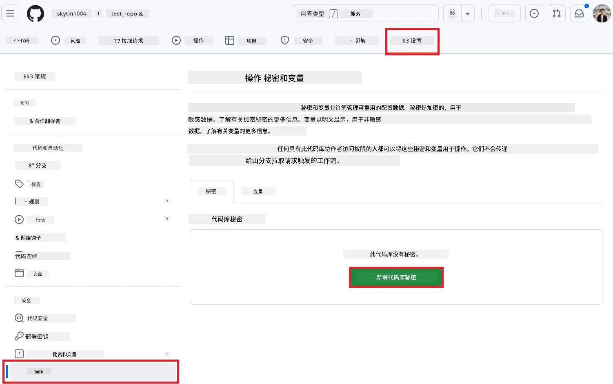
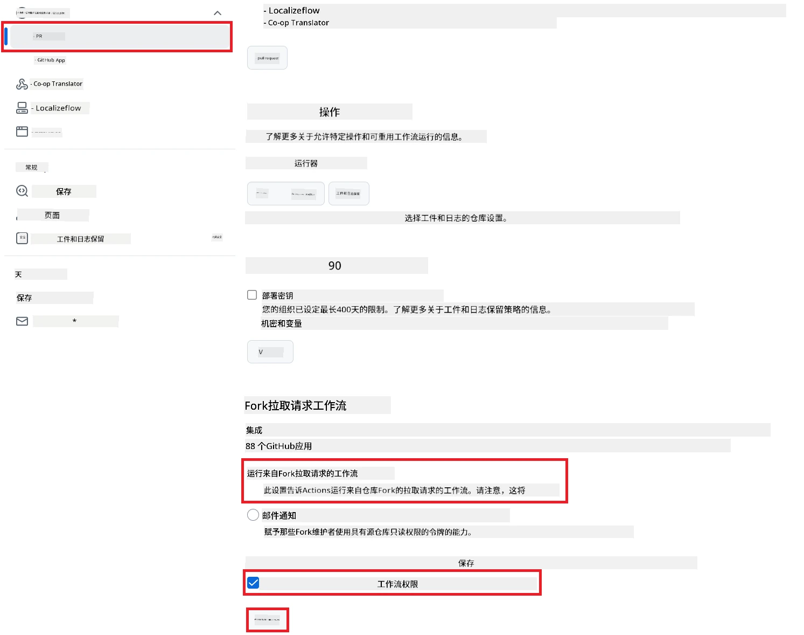

# 使用 Co-op Translator GitHub Action（公开设置）

**目标读者：** 本指南适用于大多数公开或私有仓库，标准 GitHub Actions 权限已足够。它使用内置的 `GITHUB_TOKEN`。

通过 Co-op Translator GitHub Action，您可以轻松自动化仓库文档的翻译。当您的源 Markdown 文件或图片发生更改时，该 Action 会自动创建包含最新翻译的拉取请求。本指南将指导您完成自动化设置流程。

> [!IMPORTANT]
>
> **选择合适的指南：**
>
> 本指南介绍了**使用标准 `GITHUB_TOKEN` 的简单设置方法**。对于大多数用户来说，这是推荐方式，因为无需管理敏感的 GitHub App 私钥。
>

## 前置条件

在配置 GitHub Action 之前，请确保您已准备好所需的 AI 服务凭据。

**1. 必需：AI 语言模型凭据**
您需要至少一种受支持语言模型的凭据：

- **Azure OpenAI**：需要 Endpoint、API Key、模型/部署名称、API 版本。
- **OpenAI**：需要 API Key，（可选：Org ID、Base URL、Model ID）。
- 详细信息请参见 [支持的模型和服务](../../../../README.md)。

**2. 可选：AI 视觉服务凭据（用于图片翻译）**

- 仅当您需要翻译图片中的文本时才需要。
- **Azure AI Vision**：需要 Endpoint 和订阅密钥。
- 如果未提供，将默认进入 [仅 Markdown 模式](../markdown-only-mode.md)。

## 设置与配置

请按照以下步骤，使用标准 `GITHUB_TOKEN` 在您的仓库中配置 Co-op Translator GitHub Action。

### 步骤 1：了解认证方式（使用 `GITHUB_TOKEN`）

此工作流使用 GitHub Actions 提供的内置 `GITHUB_TOKEN`。该 Token 会根据**步骤 3**中配置的设置，自动授予工作流与仓库交互的权限。

### 步骤 2：配置仓库密钥

您只需将**AI 服务凭据**作为加密密钥添加到仓库设置中。

1. 进入目标 GitHub 仓库。
2. 打开 **Settings** > **Secrets and variables** > **Actions**。
3. 在 **Repository secrets** 下，为下方每个所需的 AI 服务密钥点击 **New repository secret**。

     *(图片说明：展示如何添加密钥)*

**所需 AI 服务密钥（根据前置条件添加所有适用项）：**

| 密钥名称                              | 描述                                   | 值来源                         |
| :---------------------------------- | :------------------------------------ | :----------------------------- |
| `AZURE_AI_SERVICE_API_KEY`            | Azure AI Service（计算机视觉）密钥        | 您的 Azure AI Foundry           |
| `AZURE_AI_SERVICE_ENDPOINT`         | Azure AI Service（计算机视觉）Endpoint   | 您的 Azure AI Foundry           |
| `AZURE_OPENAI_API_KEY`              | Azure OpenAI 服务密钥                   | 您的 Azure AI Foundry           |
| `AZURE_OPENAI_ENDPOINT`             | Azure OpenAI 服务 Endpoint              | 您的 Azure AI Foundry           |
| `AZURE_OPENAI_MODEL_NAME`           | Azure OpenAI 模型名称                   | 您的 Azure AI Foundry           |
| `AZURE_OPENAI_CHAT_DEPLOYMENT_NAME` | Azure OpenAI 部署名称                   | 您的 Azure AI Foundry           |
| `AZURE_OPENAI_API_VERSION`          | Azure OpenAI API 版本                   | 您的 Azure AI Foundry           |
| `OPENAI_API_KEY`                    | OpenAI API 密钥                         | 您的 OpenAI 平台                |
| `OPENAI_ORG_ID`                     | OpenAI 组织 ID（可选）                  | 您的 OpenAI 平台                |
| `OPENAI_CHAT_MODEL_ID`              | 指定 OpenAI 模型 ID（可选）             | 您的 OpenAI 平台                |
| `OPENAI_BASE_URL`                   | 自定义 OpenAI API 基础 URL（可选）      | 您的 OpenAI 平台                |

### 步骤 3：配置工作流权限

GitHub Action 需要通过 `GITHUB_TOKEN` 授权，以便检出代码和创建拉取请求。

1. 在仓库中，进入 **Settings** > **Actions** > **General**。
2. 向下滚动到 **Workflow permissions** 部分。
3. 选择 **Read and write permissions**。这将为 `GITHUB_TOKEN` 授予本工作流所需的 `contents: write` 和 `pull-requests: write` 权限。
4. 确保勾选 **Allow GitHub Actions to create and approve pull requests**。
5. 点击 **Save**。



### 步骤 4：创建工作流文件

最后，创建定义自动化工作流的 YAML 文件，使用 `GITHUB_TOKEN`。

1. 在仓库根目录下，若不存在 `.github/workflows/` 目录，请新建该目录。
2. 在 `.github/workflows/` 目录下，新建名为 `co-op-translator.yml` 的文件。
3. 将以下内容粘贴到 `co-op-translator.yml` 文件中。

```yaml
name: Co-op Translator

on:
  push:
    branches:
      - main

jobs:
  co-op-translator:
    runs-on: ubuntu-latest

    permissions:
      contents: write
      pull-requests: write

    steps:
      - name: Checkout repository
        uses: actions/checkout@v4
        with:
          fetch-depth: 0

      - name: Set up Python
        uses: actions/setup-python@v4
        with:
          python-version: '3.10'

      - name: Install Co-op Translator
        run: |
          python -m pip install --upgrade pip
          pip install co-op-translator

      - name: Run Co-op Translator
        env:
          PYTHONIOENCODING: utf-8
          # === AI Service Credentials ===
          AZURE_AI_SERVICE_API_KEY: ${{ secrets.AZURE_AI_SERVICE_API_KEY }}
          AZURE_AI_SERVICE_ENDPOINT: ${{ secrets.AZURE_AI_SERVICE_ENDPOINT }}
          AZURE_OPENAI_API_KEY: ${{ secrets.AZURE_OPENAI_API_KEY }}
          AZURE_OPENAI_ENDPOINT: ${{ secrets.AZURE_OPENAI_ENDPOINT }}
          AZURE_OPENAI_MODEL_NAME: ${{ secrets.AZURE_OPENAI_MODEL_NAME }}
          AZURE_OPENAI_CHAT_DEPLOYMENT_NAME: ${{ secrets.AZURE_OPENAI_CHAT_DEPLOYMENT_NAME }}
          AZURE_OPENAI_API_VERSION: ${{ secrets.AZURE_OPENAI_API_VERSION }}
          OPENAI_API_KEY: ${{ secrets.OPENAI_API_KEY }}
          OPENAI_ORG_ID: ${{ secrets.OPENAI_ORG_ID }}
          OPENAI_CHAT_MODEL_ID: ${{ secrets.OPENAI_CHAT_MODEL_ID }}
          OPENAI_BASE_URL: ${{ secrets.OPENAI_BASE_URL }}
        run: |
          # =====================================================================
          # IMPORTANT: Set your target languages here (REQUIRED CONFIGURATION)
          # =====================================================================
          # Example: Translate to Spanish, French, German. Add -y to auto-confirm.
          translate -l "es fr de" -y  # <--- MODIFY THIS LINE with your desired languages

      - name: Create Pull Request with translations
        uses: peter-evans/create-pull-request@v5
        with:
          token: ${{ secrets.GITHUB_TOKEN }}
          commit-message: "🌐 Update translations via Co-op Translator"
          title: "🌐 Update translations via Co-op Translator"
          body: |
            This PR updates translations for recent changes to the main branch.

            ### 📋 Changes included
            - Translated contents are available in the `translations/` directory
            - Translated images are available in the `translated_images/` directory

            ---
            🌐 Automatically generated by the [Co-op Translator](https://github.com/Azure/co-op-translator) GitHub Action.
          branch: update-translations
          base: main
          labels: translation, automated-pr
          delete-branch: true
          add-paths: |
            translations/
            translated_images/
```
4.  **自定义工作流：**
  - **[!IMPORTANT] 目标语言：** 在 `Run Co-op Translator` 步骤中，您**必须检查并修改** `translate -l "..." -y` 命令中的语言代码列表，以符合您的项目需求。示例列表（`ar de es...`）需要根据实际情况替换或调整。
  - **触发器（`on:`）：** 当前设置为每次推送到 `main` 时触发。对于大型仓库，建议添加 `paths:` 过滤器（见 YAML 中注释示例），仅在相关文件（如源文档）变更时运行工作流，以节省运行时间。
  - **PR 详情：** 如有需要，可自定义 `commit-message`、`title`、`body`、`branch` 名称和 `labels`。

## 运行工作流

> [!WARNING]  
> **GitHub 托管 Runner 时间限制：**  
> GitHub 托管的 runner（如 `ubuntu-latest`）**最长执行时间为 6 小时**。  
> 对于大型文档仓库，如果翻译过程超过 6 小时，工作流将被自动终止。  
> 为避免此问题，建议：  
> - 使用**自托管 runner**（无时间限制）  
> - 每次运行减少目标语言数量

一旦 `co-op-translator.yml` 文件合并到主分支（或 `on:` 触发器指定的分支），每当有更改推送到该分支（并符合 `paths` 过滤条件，如已配置），工作流将自动运行。

---

**免责声明**：
本文件由 AI 翻译服务 [Co-op Translator](https://github.com/Azure/co-op-translator) 翻译。我们力求准确，但请注意，自动翻译可能包含错误或不准确之处。原始语言版本应被视为权威来源。对于关键信息，建议使用专业人工翻译。因使用本翻译而产生的任何误解或误读，我们概不负责。