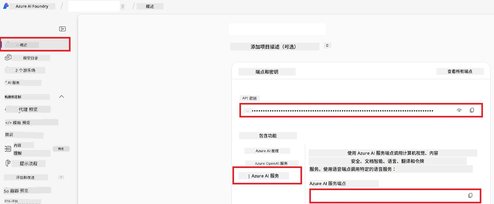

# 为 Co-op Translator 设置 Azure AI（Azure OpenAI 和 Azure AI Vision）

本指南将引导您在 Azure AI Foundry 中设置用于语言翻译的 Azure OpenAI 和用于图像内容分析（可用于基于图像的翻译）的 Azure 计算机视觉。

**先决条件：**
- 拥有有效订阅的 Azure 账户。
- 在您的 Azure 订阅中拥有创建资源和部署的足够权限。

## 创建 Azure AI 项目

首先创建一个 Azure AI 项目，它作为管理您的 AI 资源的中心位置。

1. 访问 [https://ai.azure.com](https://ai.azure.com) 并使用您的 Azure 账户登录。

1. 选择 **+Create** 创建一个新项目。

1. 执行以下任务：
   - 输入 <strong>项目名称</strong>（例如 `CoopTranslator-Project`）。
   - 选择 **AI 中心**（例如 `CoopTranslator-Hub`）（如果需要，创建一个新的）。

1. 点击“<strong>审核并创建</strong>”以设置您的项目。您将被带到项目的概览页面。

## 设置用于语言翻译的 Azure OpenAI

在您的项目中，您将部署一个 Azure OpenAI 模型，作为文本翻译的后端。

### 导航至您的项目

如果尚未进入，请打开新创建的项目（例如 `CoopTranslator-Project`）在 Azure AI Foundry 中。

### 部署 OpenAI 模型

1. 在项目的左侧菜单中，在“我的资产”下选择“**模型 + 端点**”。

1. 选择 **+ 部署模型**。

1. 选择 <strong>部署基础模型</strong>。

1. 您会看到一个可用模型列表。筛选或搜索合适的 GPT 模型。我们推荐 `gpt-4o`。

1. 选择所需模型，点击 <strong>确认</strong>。

1. 选择 <strong>部署</strong>。

### Azure OpenAI 配置

部署完成后，您可以在“**模型 + 端点**”页面选择该部署，查找其 **REST 端点 URL**、<strong>密钥</strong>、<strong>部署名称</strong>、<strong>模型名称</strong> 和 **API 版本**。这些信息在将翻译模型集成到应用程序时非常重要。

> [!NOTE]
> 您可以根据需要从[API 版本弃用](https://learn.microsoft.com/azure/ai-services/openai/api-version-deprecation)页面选择 API 版本。请注意，**API 版本** 与 Azure AI Foundry 的“模型 + 端点”页面显示的<strong>模型版本</strong>不同。

## 设置用于图像翻译的 Azure 计算机视觉

要实现图像中文字的翻译，您需要获取 Azure AI 服务的 API 密钥和端点。

1. 导航至您的 Azure AI 项目（例如 `CoopTranslator-Project`），确保您位于项目概览页面。

### Azure AI 服务配置

从 Azure AI 服务中查找 API 密钥和端点。

1. 导航至您的 Azure AI 项目（例如 `CoopTranslator-Project`），确保您位于项目概览页面。

1. 在 Azure AI 服务标签页找到 **API 密钥** 和 <strong>端点</strong>。

    

此连接使关联的 Azure AI 服务资源（包括图像分析）的功能可用于您的 AI Foundry 项目。然后，您可以在笔记本或应用程序中使用此连接从图像中提取文本，随后将其发送至 Azure OpenAI 模型进行翻译。

## 整理您的凭据

至此，您应该已收集到以下内容：

**针对 Azure OpenAI（文本翻译）：**
- Azure OpenAI 端点
- Azure OpenAI API 密钥
- Azure OpenAI 模型名称（例如 `gpt-4o`）
- Azure OpenAI 部署名称（例如 `cooptranslator-gpt4o`）
- Azure OpenAI API 版本

**针对 Azure AI 服务（通过视觉提取图像文本）：**
- Azure AI 服务端点
- Azure AI 服务 API 密钥

### 示例：环境变量配置（预览）

之后，在构建应用程序时，您可能会使用这些收集到的凭据进行配置。例如，您可能会将它们设置为环境变量，如下所示：

```bash
# Azure AI 服务凭据（图片翻译必需）
AZURE_AI_SERVICE_API_KEY="your_azure_ai_service_api_key" # 例如，21xasd...
AZURE_AI_SERVICE_ENDPOINT="https://your_azure_ai_service_endpoint.cognitiveservices.azure.com/"

# 可选的备用集：带有后缀 _1/_2 的重复变量（集合中所有变量的索引相同）
AZURE_AI_SERVICE_API_KEY_1="your_azure_ai_service_api_key_1"
AZURE_AI_SERVICE_ENDPOINT_1="https://your_azure_ai_service_endpoint_1.cognitiveservices.azure.com/"

# Azure OpenAI 凭据（文本翻译必需）
AZURE_OPENAI_API_KEY="your_azure_openai_api_key" # 例如，21xasd...
AZURE_OPENAI_ENDPOINT="https://your_azure_openai_endpoint.openai.azure.com/"
AZURE_OPENAI_MODEL_NAME="your_model_name" # 例如，gpt-4o
AZURE_OPENAI_CHAT_DEPLOYMENT_NAME="your_deployment_name" # 例如，cooptranslator-gpt4o
AZURE_OPENAI_API_VERSION="your_api_version" # 例如，2024-12-01-preview

# 可选的备用集：带后缀 _1/_2 的完整 AZURE_OPENAI_* 集合副本（所有变量索引相同）
```

---

### 进一步阅读

- [如何在 Azure AI Foundry 中创建项目](https://learn.microsoft.com/azure/ai-foundry/how-to/create-projects?tabs=ai-studio)
- [如何创建 Azure AI 资源](https://learn.microsoft.com/azure/ai-foundry/how-to/create-azure-ai-resource?tabs=portal)
- [如何在 Azure AI Foundry 部署 OpenAI 模型](https://learn.microsoft.com/en-us/azure/ai-foundry/how-to/deploy-models-openai)

---

<!-- CO-OP TRANSLATOR DISCLAIMER START -->
**免责声明**：  
本文件使用 AI 翻译服务 [Co-op Translator](https://github.com/Azure/co-op-translator) 进行翻译。虽然我们力求准确，但请注意自动翻译可能包含错误或不准确之处。原始语言的文档应被视为权威来源。对于关键信息，建议使用专业人工翻译。对于因使用本翻译而产生的任何误解或误释，我们概不负责。
<!-- CO-OP TRANSLATOR DISCLAIMER END -->