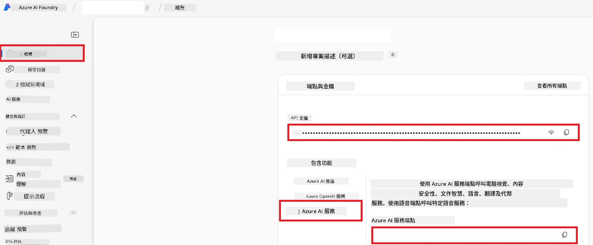

# 設定 Azure AI 用於 Co-op Translator（Azure OpneAI 及 Azure AI Vision）

本指南將引導你設置用於語言翻譯的 Azure OpenAI 及用於圖像內容分析（隨後可用於基於圖像的翻譯）的 Azure Computer Vision，皆在 Azure AI Foundry 中進行。

**先決條件：**
- 擁有有效訂閱的 Azure 帳戶。
- 具有在 Azure 訂閱中建立資源和部署的足夠權限。

## 建立 Azure AI 專案

首先建立一個 Azure AI 專案，作為管理 AI 資源的集中場所。

1. 前往 [https://ai.azure.com](https://ai.azure.com) 並使用你的 Azure 帳戶登入。

1. 選擇 **+Create** 以建立新專案。

1. 執行以下操作：
   - 輸入 **Project name**（例如：`CoopTranslator-Project`）。
   - 選擇 **AI hub** （例如：`CoopTranslator-Hub`）（如需要可建立新的）。

1. 點擊「**Review and Create**」以設置你的專案。你將被導向專案的總覽頁面。

## 設定 Azure OpenAI 用於語言翻譯

在你的專案中，部署 Azure OpenAI 模型，作為文字翻譯的後端。

### 導覽至你的專案

若尚未進入，打開你新建立的專案（例如 `CoopTranslator-Project`）於 Azure AI Foundry。

### 部署 OpenAI 模型

1. 在專案左側選單中，於「My assets」下選擇「**Models + endpoints**」。

1. 選擇 **+ Deploy model**。

1. 選擇 **Deploy Base Model**。

1. 將呈現可用模型列表。篩選或搜尋適合的 GPT 模型。我們推薦使用 `gpt-4o`。

1. 選擇你想要的模型並點擊 **Confirm**。

1. 選擇 **Deploy**。

### Azure OpenAI 配置

部署後，可以在「**Models + endpoints**」頁面選取該部署，查找其 **REST endpoint URL**、**Key**、**Deployment name**、**Model name** 及 **API version**。這些資訊將用於將翻譯模型整合進你的應用程式。

> [!NOTE]
> 你可以根據需求，從 [API version deprecation](https://learn.microsoft.com/azure/ai-services/openai/api-version-deprecation) 頁面選擇 API 版本。請注意，**API version** 與 Azure AI Foundry「Models + endpoints」頁面所示的 **Model version** 是不同的。

## 設定 Azure Computer Vision 用於圖像翻譯

為啟用圖像中文字的翻譯，需要取得 Azure AI Service 的 API Key 及 Endpoint。

1. 前往你的 Azure AI 專案（例如 `CoopTranslator-Project`），確認你位於專案總覽頁面。

### Azure AI Service 配置

從 Azure AI Service 中找到 API Key 及 Endpoint。

1. 前往你的 Azure AI 專案（例如 `CoopTranslator-Project`），確認你位於專案總覽頁面。

1. 從 Azure AI Service 標籤找到 **API Key** 和 **Endpoint**。

    

該連線使得連結的 Azure AI Services 資源（包括圖像分析）功能可用於你的 AI Foundry 專案。你可在筆記本或應用中使用此連線，從圖像中提取文本，隨後將其傳送至 Azure OpenAI 模型以進行翻譯。

## 整理你的憑證

到此為止，你應該已收集到以下資訊：

**Azure OpenAI（文字翻譯）：**
- Azure OpenAI Endpoint
- Azure OpenAI API Key
- Azure OpenAI Model Name（例如 `gpt-4o`）
- Azure OpenAI Deployment Name（例如 `cooptranslator-gpt4o`）
- Azure OpenAI API Version

**Azure AI Services（透過 Vision 的影像文字擷取）：**
- Azure AI Service Endpoint
- Azure AI Service API Key

### 範例：環境變數配置（預覽）

稍後在建置應用程式時，可能會以環境變數方式配置這些憑證，例如：

```bash
# Azure AI 服務憑證（圖像翻譯必填）
AZURE_AI_SERVICE_API_KEY="your_azure_ai_service_api_key" # 例如，21xasd...
AZURE_AI_SERVICE_ENDPOINT="https://your_azure_ai_service_endpoint.cognitiveservices.azure.com/"

# 可選的備用組合：變量重複並加上後綴 _1/_2（同一組內所有變量索引一致）
AZURE_AI_SERVICE_API_KEY_1="your_azure_ai_service_api_key_1"
AZURE_AI_SERVICE_ENDPOINT_1="https://your_azure_ai_service_endpoint_1.cognitiveservices.azure.com/"

# Azure OpenAI 憑證（文字翻譯必填）
AZURE_OPENAI_API_KEY="your_azure_openai_api_key" # 例如，21xasd...
AZURE_OPENAI_ENDPOINT="https://your_azure_openai_endpoint.openai.azure.com/"
AZURE_OPENAI_MODEL_NAME="your_model_name" # 例如，gpt-4o
AZURE_OPENAI_CHAT_DEPLOYMENT_NAME="your_deployment_name" # 例如，cooptranslator-gpt4o
AZURE_OPENAI_API_VERSION="your_api_version" # 例如，2024-12-01-preview

# 可選的備用組合：重複整個 AZURE_OPENAI_* 組合並加上後綴 _1/_2（所有變量索引一致）
```

---

### 延伸閱讀

- [如何在 Azure AI Foundry 建立專案](https://learn.microsoft.com/azure/ai-foundry/how-to/create-projects?tabs=ai-studio)
- [如何建立 Azure AI 資源](https://learn.microsoft.com/azure/ai-foundry/how-to/create-azure-ai-resource?tabs=portal)
- [如何在 Azure AI Foundry 部署 OpenAI 模型](https://learn.microsoft.com/en-us/azure/ai-foundry/how-to/deploy-models-openai)

---

<!-- CO-OP TRANSLATOR DISCLAIMER START -->
**免責聲明**：  
本文件是使用 AI 翻譯服務 [Co-op Translator](https://github.com/Azure/co-op-translator) 翻譯而成。雖然我們致力於確保準確性，但請注意自動翻譯可能包含錯誤或不準確之處。原始語言版本的文件應被視為權威來源。對於重要資訊，建議採用專業人工翻譯。我們不對因使用此翻譯而產生的任何誤解或誤釋負責。
<!-- CO-OP TRANSLATOR DISCLAIMER END -->