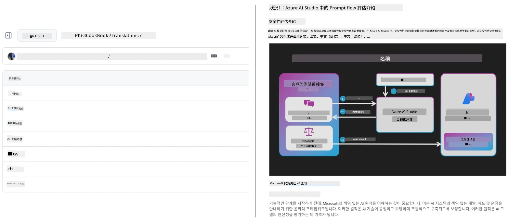
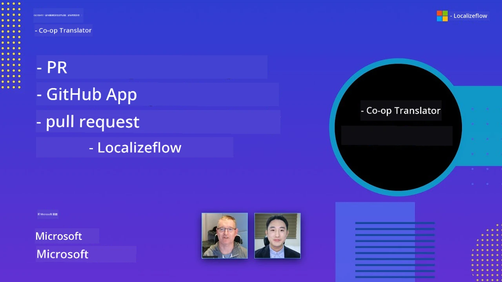

# Co-op Translator

_輕鬆自動化並維護您的教育 GitHub 內容多語言翻譯，隨著您的專案發展。_


[](https://pypi.org/project/co-op-translator/)
[](https://github.com/azure/co-op-translator/blob/main/LICENSE)
[](https://pepy.tech/project/co-op-translator)
[](https://pepy.tech/project/co-op-translator)
[](https://github.com/azure/co-op-translator/pkgs/container/co-op-translator)
[](https://github.com/psf/black)

[](https://GitHub.com/azure/co-op-translator/graphs/contributors/)
[](https://GitHub.com/azure/co-op-translator/issues/)
[](https://GitHub.com/azure/co-op-translator/pulls/)
[](http://makeapullrequest.com)

### 🌐 多語言支援

#### 由 [Co-op Translator](https://github.com/Azure/Co-op-Translator) 支援

<!-- CO-OP TRANSLATOR LANGUAGES TABLE START -->
[Arabic](../ar/README.md) | [Bengali](../bn/README.md) | [Bulgarian](../bg/README.md) | [Burmese (Myanmar)](../my/README.md) | [Chinese (Simplified)](../zh-CN/README.md) | [Chinese (Traditional, Hong Kong)](../zh-HK/README.md) | [Chinese (Traditional, Macau)](./README.md) | [Chinese (Traditional, Taiwan)](../zh-TW/README.md) | [Croatian](../hr/README.md) | [Czech](../cs/README.md) | [Danish](../da/README.md) | [Dutch](../nl/README.md) | [Estonian](../et/README.md) | [Finnish](../fi/README.md) | [French](../fr/README.md) | [German](../de/README.md) | [Greek](../el/README.md) | [Hebrew](../he/README.md) | [Hindi](../hi/README.md) | [Hungarian](../hu/README.md) | [Indonesian](../id/README.md) | [Italian](../it/README.md) | [Japanese](../ja/README.md) | [Kannada](../kn/README.md) | [Khmer](../km/README.md) | [Korean](../ko/README.md) | [Lithuanian](../lt/README.md) | [Malay](../ms/README.md) | [Malayalam](../ml/README.md) | [Marathi](../mr/README.md) | [Nepali](../ne/README.md) | [Nigerian Pidgin](../pcm/README.md) | [Norwegian](../no/README.md) | [Persian (Farsi)](../fa/README.md) | [Polish](../pl/README.md) | [Portuguese (Brazil)](../pt-BR/README.md) | [Portuguese (Portugal)](../pt-PT/README.md) | [Punjabi (Gurmukhi)](../pa/README.md) | [Romanian](../ro/README.md) | [Russian](../ru/README.md) | [Serbian (Cyrillic)](../sr/README.md) | [Slovak](../sk/README.md) | [Slovenian](../sl/README.md) | [Spanish](../es/README.md) | [Swahili](../sw/README.md) | [Swedish](../sv/README.md) | [Tagalog (Filipino)](../tl/README.md) | [Tamil](../ta/README.md) | [Telugu](../te/README.md) | [Thai](../th/README.md) | [Turkish](../tr/README.md) | [Ukrainian](../uk/README.md) | [Urdu](../ur/README.md) | [Vietnamese](../vi/README.md)

> **想本地克隆？**
>
> 此倉庫包含 50 多種語言的翻譯，大幅增加下載大小。若要不含翻譯地克隆，請使用稀疏檢出：
>
> **Bash / macOS / Linux:**  
> ```bash
> git clone --filter=blob:none --sparse https://github.com/Azure/co-op-translator.git
> cd co-op-translator
> git sparse-checkout set --no-cone '/*' '!translations' '!translated_images'
> ```
>
> **CMD (Windows):**  
> ```cmd
> git clone --filter=blob:none --sparse https://github.com/Azure/co-op-translator.git
> cd co-op-translator
> git sparse-checkout set --no-cone "/*" "!translations" "!translated_images"
> ```
>
> 這樣您就能以更快的速度下載並取得完成課程所需的所有內容。
<!-- CO-OP TRANSLATOR LANGUAGES TABLE END -->

[](https://GitHub.com/azure/co-op-translator/watchers/)
[](https://GitHub.com/azure/co-op-translator/network/)
[](https://GitHub.com/azure/co-op-translator/stargazers/)

[](https://discord.gg/nTYy5BXMWG)

[](https://codespaces.new/azure/co-op-translator)

## 概覽

**Co-op Translator** 幫助您輕鬆將教育 GitHub 內容本地化為多種語言。  
當您更新 Markdown 文件、圖片或筆記本時，翻譯會自動同步，確保您的內容對全球學習者持續準確且最新。

翻譯內容組織範例：



## 翻譯狀態如何管理

Co-op Translator 將翻譯內容視為<strong>有版本的軟體工件</strong>，  
而非靜態檔案。

工具利用<strong>語言範圍的元資料</strong>追蹤翻譯的 Markdown、圖片及筆記本的狀態。

此設計使 Co-op Translator 能：

- 可靠檢測過時翻譯
- 一致對待 Markdown、圖片及筆記本
- 安全地擴展至大型、快速變動的多語言倉庫

藉由將翻譯建模為受管理工件，  
翻譯工作流程自然而然與現代軟體相依性與工件管理實踐相結合。

→ [翻譯狀態管理方式](https://techcommunity.microsoft.com/blog/azuredevcommunityblog/rethinking-documentation-translation-treating-translations-as-versioned-software/4491755)


## 快速開始

```bash
# 建立並啟用虛擬環境（建議）
python -m venv .venv
# Windows 系統
.venv\Scripts\activate
# macOS／Linux 系統
source .venv/bin/activate
# 安裝套件
pip install co-op-translator
# 翻譯
translate -l "ko ja fr" -md
```

Docker:

```bash
# 從 GHCR 拉取公共映像
docker pull ghcr.io/azure/co-op-translator:latest
# 以當前文件夾掛載並提供 .env 執行（Bash/Zsh）
docker run --rm -it --env-file .env -v "${PWD}:/work" ghcr.io/azure/co-op-translator:latest -l "ko ja fr" -md
```

## 最小設定

1. 確認您有支援的 Python 版本（目前為 3.10-3.12）。在 poetry (pyproject.toml) 中會自動處理。
2. 依模板建立 `.env` 檔案： [.env.template](../../.env.template)
3. 配置一個 LLM 提供者（Azure OpenAI 或 OpenAI）
4. (選擇性) 若使用圖片翻譯（`-img`），配置 Azure AI Vision
5. (選擇性) 可透過複製變數並加上後綴如 `_1`、`_2` 等，設定多組認證。每組變數需同後綴。
6. (建議) 清理先前翻譯以避免衝突（例如 `translations/`）
7. (建議) 使用 [README 語言模板](./getting_started/README_languages_template.md) 新增翻譯章節到您的 README
8. 參見：[設定 Azure AI](./getting_started/set-up-azure-ai.md)

## 使用方式

翻譯所有支援的類型：

```bash
translate -l "ko ja"
```

只翻譯 Markdown：

```bash
translate -l "de" -md
```

Markdown + 圖片：

```bash
translate -l "pt" -md -img
```

只翻譯筆記本：

```bash
translate -l "zh" -nb
```

更多參數：[命令參考](./getting_started/command-reference.md)

## 功能

- 自動翻譯 Markdown、筆記本與圖片
- 隨原始變更同步翻譯
- 支援本地(命令列)與 CI (GitHub Actions)
- 使用 Azure OpenAI 或 OpenAI；圖片選用 Azure AI Vision
- 保留 Markdown 格式與結構

## 文件

- [指令行指南](./getting_started/command-line-guide/command-line-guide.md)
- [GitHub Actions 指南 (公開倉庫與標準密鑰)](./getting_started/github-actions-guide/github-actions-guide-public.md)
- [GitHub Actions 指南 (Microsoft 組織倉庫與組織層級設定)](./getting_started/github-actions-guide/github-actions-guide-org.md)
- [README 語言模板](./getting_started/README_languages_template.md)
- [支援語言](./getting_started/supported-languages.md)
- [貢獻指南](./CONTRIBUTING.md)
- [故障排除](./getting_started/troubleshooting.md)

### Microsoft 專屬指南
> [!NOTE]
> 僅供 Microsoft 「For Beginners」倉庫維護者使用。

- [更新「其他課程」清單（僅限 MS Beginners 倉庫）](./getting_started/update-other-courses.md)

## 支持我們並促進全球學習

加入我們，革新教育內容於全球的共享方式！為 [Co-op Translator](https://github.com/azure/co-op-translator) 在 GitHub 點 ⭐，支持我們打破學習與科技的語言障礙。您的關注與貢獻將帶來巨大影響！我們熱忱歡迎代碼貢獻與功能建議。

### 探索 Microsoft 教育內容的本地語言版本

- [LangChain4j-for-Beginners](https://github.com/microsoft/LangChain4j-for-Beginners)
- [AZD for Beginners](https://github.com/microsoft/AZD-for-beginners)
- [Edge AI for Beginners](https://github.com/microsoft/edgeai-for-beginners)
- [Model Context Protocol (MCP) For Beginners](https://github.com/microsoft/mcp-for-beginners)
- [AI Agents for Beginners](https://github.com/microsoft/ai-agents-for-beginners)
- [Generative AI for Beginners using .NET](https://github.com/microsoft/Generative-AI-for-beginners-dotnet)
- [Generative AI for Beginners](https://github.com/microsoft/generative-ai-for-beginners)
- [Generative AI for Beginners using Java](https://github.com/microsoft/generative-ai-for-beginners-java)
- [ML for Beginners](https://aka.ms/ml-beginners)
- [Data Science for Beginners](https://aka.ms/datascience-beginners)
- [AI for Beginners](https://aka.ms/ai-beginners)
- [Cybersecurity for Beginners](https://github.com/microsoft/Security-101)
- [Web Dev for Beginners](https://aka.ms/webdev-beginners)
- [IoT for Beginners](https://aka.ms/iot-beginners)
- [PhiCookBook](https://github.com/microsoft/PhiCookBook)

## 影片介紹

👉 點擊下方圖片於 YouTube 觀看。

- **Open at Microsoft**：簡短 18 分鐘介紹及 Co-op Translator 快速使用指南。

  [](https://www.youtube.com/watch?v=jX_swfH_KNU)

## 貢獻

本專案歡迎貢獻與建議。想為 Azure Co-op Translator 貢獻嗎？請參閱我們的 [CONTRIBUTING.md](./CONTRIBUTING.md)，了解如何協助提升 Co-op Translator 的易用性。

## 貢獻者
[](https://github.com/Azure/co-op-translator/graphs/contributors)

## 行為準則

本項目已採用 [Microsoft 開放原始碼行為準則](https://opensource.microsoft.com/codeofconduct/)。
欲了解更多資訊，請參閱 [行為準則常見問題](https://opensource.microsoft.com/codeofconduct/faq/) 或
聯絡 [opencode@microsoft.com](mailto:opencode@microsoft.com) 提出任何額外問題或意見。

## 負責任的 AI

Microsoft 致力於幫助我們的客戶負責任地使用我們的 AI 產品，分享我們的經驗，並透過如 Transparency Notes 和 Impact Assessments 等工具建立以信任為基礎的合作夥伴關係。許多這些資源可以在 [https://aka.ms/RAI](https://aka.ms/RAI) 找到。
Microsoft 在負責任的 AI 方針上，根植於我們的 AI 原則：公平性、可靠性與安全性、隱私與安全、包容性、透明度及問責制。

大型的自然語言、影像及語音模型——例如本範例中使用的模型——可能會表現出不公平、不可靠或冒犯的行為，從而造成傷害。請參閱 [Azure OpenAI 服務透明度說明](https://learn.microsoft.com/legal/cognitive-services/openai/transparency-note?tabs=text) ，以了解風險與限制。

減輕這些風險的推薦方法是在您的架構中包含一個安全系統，可偵測並防止有害行為。[Azure AI Content Safety](https://learn.microsoft.com/azure/ai-services/content-safety/overview) 提供獨立的保護層，能偵測應用程式及服務中使用者產生及 AI 產生的有害內容。Azure AI Content Safety 包括文字和影像 API，讓您能偵測有害內容。我們也有互動式的 Content Safety Studio，讓您檢視、探索並試用用於偵測不同模態有害內容的範例程式碼。以下的 [快速入門文件](https://learn.microsoft.com/azure/ai-services/content-safety/quickstart-text?tabs=visual-studio%2Clinux&pivots=programming-language-rest) 將引導您完成對服務發出請求。

另一個需要考慮的是整體應用的效能。對於多模態及多模型應用，我們認為效能是指系統表現符合您及使用者的期望，包括不產生有害輸出。評估整體應用的效能時，重要的是使用 [生成品質及風險與安全指標](https://learn.microsoft.com/azure/ai-studio/concepts/evaluation-metrics-built-in)。

您可以在開發環境中使用 [prompt flow SDK](https://microsoft.github.io/promptflow/index.html) 評估您的 AI 應用。無論是給定測試資料集或目標，您的生成式 AI 應用產出皆會透過內建或自訂評估器做定量測量。要開始使用 prompt flow sdk 評估您的系統，您可以參考 [快速入門指南](https://learn.microsoft.com/azure/ai-studio/how-to/develop/flow-evaluate-sdk)。執行評估後，您可 [在 Azure AI Studio 中視覺化結果](https://learn.microsoft.com/azure/ai-studio/how-to/evaluate-flow-results)。

## 商標

本專案可能包含專案、產品或服務的商標或標誌。授權使用 Microsoft
商標或標誌須符合並遵守
[Microsoft 商標及品牌使用準則](https://www.microsoft.com/en-us/legal/intellectualproperty/trademarks/usage/general)。
在本專案中使用 Microsoft 商標或標誌的修改版本不得引起混淆或暗示 Microsoft 之贊助。
任何第三方商標或標誌的使用，均須遵守該第三方的政策。

## 尋求協助

如果您遇到困難或對建置 AI 應用有任何疑問，歡迎加入：

[](https://discord.gg/nTYy5BXMWG)

若您在開發過程中有產品回饋或錯誤，請造訪：

[](https://aka.ms/foundry/forum)

---

<!-- CO-OP TRANSLATOR DISCLAIMER START -->
**免責聲明**：  
本文件是使用 AI 翻譯服務 [Co-op Translator](https://github.com/Azure/co-op-translator) 翻譯而成。雖然我們致力於準確性，但請注意，自動翻譯可能包含錯誤或不準確之處。原始文件的母語版本應視為權威來源。對於重要資訊，建議採用專業人工翻譯。我們不對因使用此翻譯而產生的任何誤解或誤譯承擔責任。
<!-- CO-OP TRANSLATOR DISCLAIMER END -->