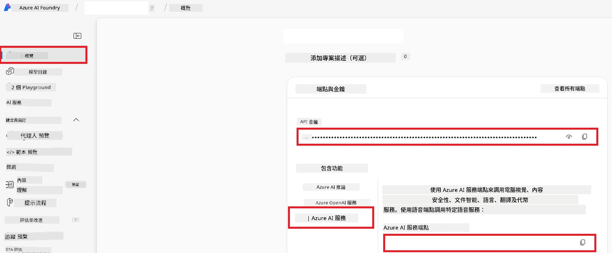

# 設定 Azure AI 用於 Co-op Translator (Azure OpneAI 及 Azure AI Vision)

本指南將帶您完成在 Azure AI Foundry 內設置 Azure OpenAI 用於語言翻譯，以及 Azure 電腦視覺用於圖像內容分析（然後可用於基於圖像的翻譯）。

**先決條件：**
- 具有有效訂閱的 Azure 帳戶。
- 有足夠權限在您的 Azure 訂閱中建立資源和部署。

## 建立 Azure AI 專案

您將從建立一個 Azure AI 專案開始，此專案作為管理您的 AI 資源的中心位置。

1. 前往 [https://ai.azure.com](https://ai.azure.com) 並使用您的 Azure 帳戶登入。

1. 選擇 **+Create** 以建立新專案。

1. 執行以下任務：
   - 輸入 <strong>專案名稱</strong>（例如 `CoopTranslator-Project`）。
   - 選擇 **AI hub**（例如 `CoopTranslator-Hub`）（如有需要可建立新的）。

1. 點擊 "**Review and Create**" 以設置您的專案。您將被帶到專案的概覽頁面。

## 設定 Azure OpenAI 用於語言翻譯

在您的專案內，您將部署 Azure OpenAI 模型，作為文本翻譯的後端。

### 導航到您的專案

如果尚未進入，請在 Azure AI Foundry 中打開您剛建立的專案（例如 `CoopTranslator-Project`）。

### 部署 OpenAI 模型

1. 從專案左側菜單的「我的資產」下，選擇 "**Models + endpoints**"。

1. 選擇 **+ Deploy model**。

1. 選擇 **Deploy Base Model**。

1. 您會看到一個可用模型列表。過濾或搜尋合適的 GPT 模型。我們建議使用 `gpt-4o`。

1. 選擇您想要的模型，然後點擊 **Confirm**。

1. 選擇 **Deploy**。

### Azure OpenAI 配置

部署完成後，您可以在 "**Models + endpoints**" 頁面選擇部署，查看其 **REST endpoint URL**、**Key**、**Deployment name**、**Model name** 和 **API version**。這些資訊將用於將翻譯模型整合到您的應用中。

> [!NOTE]
> 您可以根據需求從 [API 版本淘汰](https://learn.microsoft.com/azure/ai-services/openai/api-version-deprecation) 頁面選擇 API 版本。請注意，**API 版本** 與 Azure AI Foundry 上 "**Models + endpoints**" 頁面所顯示的 <strong>模型版本</strong> 是不同的。

## 設定 Azure 電腦視覺用於圖像翻譯

若要啟用圖像中文字的翻譯，您需要找到 Azure AI 服務的 API Key 和 Endpoint。

1. 前往您的 Azure AI 專案（例如 `CoopTranslator-Project`）。確保您處於專案概覽頁面。

### Azure AI 服務配置

從 Azure AI 服務中找到 API Key 和 Endpoint。

1. 前往您的 Azure AI 專案（例如 `CoopTranslator-Project`）。確保您處於專案概覽頁面。

1. 從 Azure AI 服務頁籤找到 **API Key** 和 **Endpoint**。

    

此連接使連結的 Azure AI 服務資源（包括圖像分析）功能對您的 AI Foundry 專案可用。您可以在筆記本或應用程式中使用此連接從圖像提取文字，然後將該文字傳送至 Azure OpenAI 模型進行翻譯。

## 整合您的憑證

至此，您應該已收集下列資訊：

**Azure OpenAI（文本翻譯）相關：**
- Azure OpenAI Endpoint
- Azure OpenAI API Key
- Azure OpenAI Model Name（例如 `gpt-4o`）
- Azure OpenAI Deployment Name（例如 `cooptranslator-gpt4o`）
- Azure OpenAI API Version

**Azure AI 服務（透過 Vision 進行影像文字提取）相關：**
- Azure AI Service Endpoint
- Azure AI Service API Key

### 範例：環境變數配置（預覽）

稍後建構您的應用程式時，您很可能會使用這些收集的憑證，例如以環境變數方式設定如下：

```bash
# Azure AI 服務憑證（圖像翻譯必需）
AZURE_AI_SERVICE_API_KEY="your_azure_ai_service_api_key" # 例如，21xasd...
AZURE_AI_SERVICE_ENDPOINT="https://your_azure_ai_service_endpoint.cognitiveservices.azure.com/"

# 可選備用組合：變量重複，附加後綴 _1/_2（同一組中所有變量使用相同索引）
AZURE_AI_SERVICE_API_KEY_1="your_azure_ai_service_api_key_1"
AZURE_AI_SERVICE_ENDPOINT_1="https://your_azure_ai_service_endpoint_1.cognitiveservices.azure.com/"

# Azure OpenAI 憑證（文本翻譯必需）
AZURE_OPENAI_API_KEY="your_azure_openai_api_key" # 例如，21xasd...
AZURE_OPENAI_ENDPOINT="https://your_azure_openai_endpoint.openai.azure.com/"
AZURE_OPENAI_MODEL_NAME="your_model_name" # 例如，gpt-4o
AZURE_OPENAI_CHAT_DEPLOYMENT_NAME="your_deployment_name" # 例如，cooptranslator-gpt4o
AZURE_OPENAI_API_VERSION="your_api_version" # 例如，2024-12-01-preview

# 可選備用組合：將完整的 AZURE_OPENAI_* 集合重複，附加後綴 _1/_2（所有變量使用相同索引）
```

---

### 延伸閱讀

- [如何在 Azure AI Foundry 建立專案](https://learn.microsoft.com/azure/ai-foundry/how-to/create-projects?tabs=ai-studio)
- [如何建立 Azure AI 資源](https://learn.microsoft.com/azure/ai-foundry/how-to/create-azure-ai-resource?tabs=portal)
- [如何在 Azure AI Foundry 部署 OpenAI 模型](https://learn.microsoft.com/en-us/azure/ai-foundry/how-to/deploy-models-openai)

---

<!-- CO-OP TRANSLATOR DISCLAIMER START -->
**免責聲明**：  
此文件是使用 AI 翻譯服務 [Co-op Translator](https://github.com/Azure/co-op-translator) 所翻譯。雖然我們盡力確保準確性，但請注意，機器翻譯可能包含錯誤或不準確之處。原始文件的母語版本應被視為權威來源。對於重要資訊，建議使用專業人工翻譯。我們對因使用此翻譯而引起的任何誤解或誤譯不承擔任何責任。
<!-- CO-OP TRANSLATOR DISCLAIMER END -->