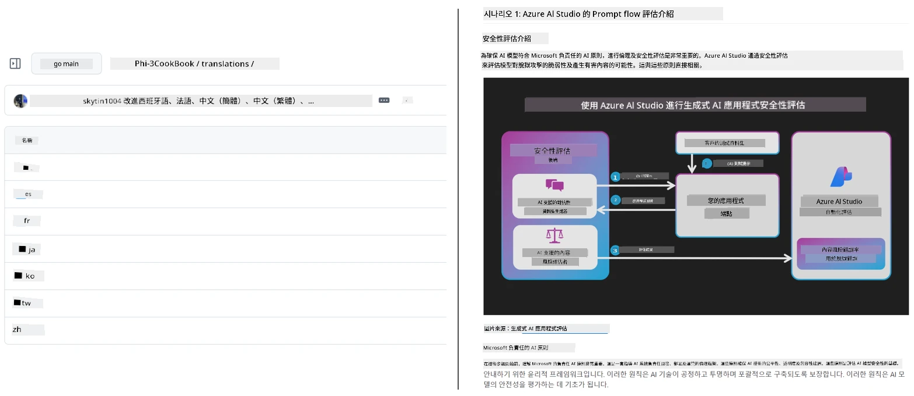
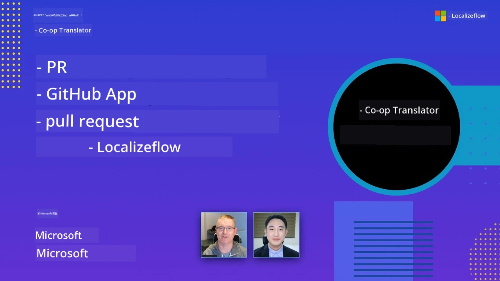

# Co-op Translator

_輕鬆自動化並維護您的教育 GitHub 內容多語言翻譯，隨著專案發展持續更新。_


[](https://pypi.org/project/co-op-translator/)
[](https://github.com/azure/co-op-translator/blob/main/LICENSE)
[](https://pepy.tech/project/co-op-translator)
[](https://pepy.tech/project/co-op-translator)
[](https://github.com/azure/co-op-translator/pkgs/container/co-op-translator)
[](https://github.com/psf/black)

[](https://GitHub.com/azure/co-op-translator/graphs/contributors/)
[](https://GitHub.com/azure/co-op-translator/issues/)
[](https://GitHub.com/azure/co-op-translator/pulls/)
[](http://makeapullrequest.com)

### 🌐 多語言支援

#### 由 [Co-op Translator](https://github.com/Azure/Co-op-Translator) 支援

<!-- CO-OP TRANSLATOR LANGUAGES TABLE START -->
[阿拉伯語](../ar/README.md) | [孟加拉語](../bn/README.md) | [保加利亞語](../bg/README.md) | [緬甸語 (Myanmar)](../my/README.md) | [中文 (簡體)](../zh-CN/README.md) | [中文 (繁體，香港)](../zh-HK/README.md) | [中文 (繁體，澳門)](../zh-MO/README.md) | [中文 (繁體，台灣)](./README.md) | [克羅埃西亞語](../hr/README.md) | [捷克語](../cs/README.md) | [丹麥語](../da/README.md) | [荷蘭語](../nl/README.md) | [愛沙尼亞語](../et/README.md) | [芬蘭語](../fi/README.md) | [法語](../fr/README.md) | [德語](../de/README.md) | [希臘語](../el/README.md) | [希伯來語](../he/README.md) | [印地語](../hi/README.md) | [匈牙利語](../hu/README.md) | [印尼語](../id/README.md) | [義大利語](../it/README.md) | [日語](../ja/README.md) | [坎那達語](../kn/README.md) | [高棉語](../km/README.md) | [韓語](../ko/README.md) | [立陶宛語](../lt/README.md) | [馬來語](../ms/README.md) | [馬拉雅拉姆語](../ml/README.md) | [馬拉地語](../mr/README.md) | [尼泊爾語](../ne/README.md) | [尼日利亞皮欽語](../pcm/README.md) | [挪威語](../no/README.md) | [波斯語 (法爾西語)](../fa/README.md) | [波蘭語](../pl/README.md) | [葡萄牙語 (巴西)](../pt-BR/README.md) | [葡萄牙語 (葡萄牙)](../pt-PT/README.md) | [旁遮普語 (Gurmukhi 字母)](../pa/README.md) | [羅馬尼亞語](../ro/README.md) | [俄語](../ru/README.md) | [塞爾維亞語 (西里爾字母)](../sr/README.md) | [斯洛伐克語](../sk/README.md) | [斯洛維尼亞語](../sl/README.md) | [西班牙語](../es/README.md) | [斯瓦希里語](../sw/README.md) | [瑞典語](../sv/README.md) | [他加祿語 (菲律賓語)](../tl/README.md) | [泰米爾語](../ta/README.md) | [泰盧固語](../te/README.md) | [泰語](../th/README.md) | [土耳其語](../tr/README.md) | [烏克蘭語](../uk/README.md) | [烏爾都語](../ur/README.md) | [越南語](../vi/README.md)

> **想要本地複製？**
>
> 此儲存庫包含超過50種語言的翻譯，將大幅增加下載大小。要無翻譯地複製，使用稀疏檢出：
>
> **Bash / macOS / Linux：**
> ```bash
> git clone --filter=blob:none --sparse https://github.com/skytin1004/co-op-translator.git
> cd co-op-translator
> git sparse-checkout set --no-cone '/*' '!translations' '!translated_images'
> ```
>
> **CMD (Windows)：**
> ```cmd
> git clone --filter=blob:none --sparse https://github.com/skytin1004/co-op-translator.git
> cd co-op-translator
> git sparse-checkout set --no-cone "/*" "!translations" "!translated_images"
> ```
>
> 這將提供您完成課程所需的一切，且下載速度更快。
<!-- CO-OP TRANSLATOR LANGUAGES TABLE END -->

[](https://GitHub.com/azure/co-op-translator/watchers/)
[](https://GitHub.com/azure/co-op-translator/network/)
[](https://GitHub.com/azure/co-op-translator/stargazers/)

[](https://discord.gg/nTYy5BXMWG)

[](https://codespaces.new/azure/co-op-translator)

## 概覽

**Co-op Translator** 幫助您輕鬆將教育 GitHub 內容本地化為多種語言。
當您更新 Markdown 檔案、圖片或筆記本時，翻譯會自動同步，確保您的內容對全球學習者來說準確且持續更新。

翻譯內容組織範例：



## 翻譯狀態如何管理

Co-op Translator 將翻譯內容當作<strong>版本化軟體工件</strong>，
而非靜態檔案。

此工具透過<strong>語言範圍的元資料</strong>追蹤翻譯的 Markdown、圖片和筆記本的狀態。

此設計讓 Co-op Translator 能夠：

- 可靠地檢測翻譯過時狀態
- 一致地處理 Markdown、圖片和筆記本
- 安全地擴展至大型快速多語言儲存庫

透過將翻譯建模為受管理工件，
翻譯流程自然與現代軟體依賴關係與工件管理實務對齊。

→ [翻譯狀態如何管理](https://techcommunity.microsoft.com/blog/azuredevcommunityblog/rethinking-documentation-translation-treating-translations-as-versioned-software/4491755)


## 快速開始

```bash
# 建立並啟用虛擬環境（建議）
python -m venv .venv
# Windows 系統
.venv\Scripts\activate
# macOS/Linux 系統
source .venv/bin/activate
# 安裝套件
pip install co-op-translator
# 翻譯
translate -l "ko ja fr" -md
```

Docker：

```bash
# 從 GHCR 拉取公共映像檔
docker pull ghcr.io/azure/co-op-translator:latest
# 以當前資料夾掛載並提供 .env 執行（Bash/Zsh）
docker run --rm -it --env-file .env -v "${PWD}:/work" ghcr.io/azure/co-op-translator:latest -l "ko ja fr" -md
```

## 最小設定

1. 確認您擁有受支援的 Python 版本（目前支援 3.10-3.12）。在 poetry (pyproject.toml) 中會自動處理。
2. 使用範本建立 `.env` 檔案：[.env.template](../../.env.template)
3. 配置一個 LLM 供應商（Azure OpenAI 或 OpenAI）
4. （選用）對圖片翻譯（`-img`），配置 Azure AI Vision
5. （選用）您也可以透過複製變數並加上如 `_1`、`_2` 等後綴設定多組憑證。單組憑證內所有變數須共用相同後綴。
6. （建議）清理先前的翻譯以避免衝突（例如 `translations/`）
7. （建議）使用 [README 語言範本](./getting_started/README_languages_template.md) 新增翻譯章節至 README
8. 參見：[設定 Azure AI](./getting_started/set-up-azure-ai.md)

## 使用方式

翻譯所有支援類型：

```bash
translate -l "ko ja"
```

僅翻譯 Markdown：

```bash
translate -l "de" -md
```

Markdown + 圖片：

```bash
translate -l "pt" -md -img
```

僅翻譯筆記本：

```bash
translate -l "zh" -nb
```

更多旗標參考：[指令參考](./getting_started/command-reference.md)

## 功能特色

- 自動翻譯 Markdown、筆記本與圖片
- 讓翻譯同步原始內容變更
- 支援本地端（CLI）或持續整合環境（GitHub Actions）
- 使用 Azure OpenAI 或 OpenAI；圖片選用 Azure AI Vision
- 保留 Markdown 格式與結構

## 文件

- [指令列指南](./getting_started/command-line-guide/command-line-guide.md)
- [GitHub Actions 指南（公共儲存庫與標準祕密）](./getting_started/github-actions-guide/github-actions-guide-public.md)
- [GitHub Actions 指南（Microsoft 組織儲存庫與組織層級設定）](./getting_started/github-actions-guide/github-actions-guide-org.md)
- [README 語言範本](./getting_started/README_languages_template.md)
- [支援語言](./getting_started/supported-languages.md)
- [貢獻指南](./CONTRIBUTING.md)
- [疑難排解](./getting_started/troubleshooting.md)

### Microsoft 相關指南
> [!NOTE]
> 僅供 Microsoft “For Beginners” 儲存庫維護者使用。

- [更新「其他課程」清單（僅限 MS Beginners 儲存庫）](./getting_started/update-other-courses.md)

## 支持我們並推動全球學習

加入我們，一起革命性改變教育內容的全球分享方式！請在 GitHub 為 [Co-op Translator](https://github.com/azure/co-op-translator) 點⭐支持我們的使命，打破學習與科技間的語言障礙。您的關注與貢獻對我們影響深遠！歡迎提交程式碼貢獻與功能建議。

### 探索使用您語言的 Microsoft 教育內容

- [LangChain4j-for-Beginners](https://github.com/microsoft/LangChain4j-for-Beginners)
- [AZD for Beginners](https://github.com/microsoft/AZD-for-beginners)
- [Edge AI for Beginners](https://github.com/microsoft/edgeai-for-beginners)
- [Model Context Protocol (MCP) For Beginners](https://github.com/microsoft/mcp-for-beginners)
- [AI Agents for Beginners](https://github.com/microsoft/ai-agents-for-beginners)
- [Generative AI for Beginners using .NET](https://github.com/microsoft/Generative-AI-for-beginners-dotnet)
- [Generative AI for Beginners](https://github.com/microsoft/generative-ai-for-beginners)
- [Generative AI for Beginners using Java](https://github.com/microsoft/generative-ai-for-beginners-java)
- [ML for Beginners](https://aka.ms/ml-beginners)
- [Data Science for Beginners](https://aka.ms/datascience-beginners)
- [AI for Beginners](https://aka.ms/ai-beginners)
- [Cybersecurity for Beginners](https://github.com/microsoft/Security-101)
- [Web Dev for Beginners](https://aka.ms/webdev-beginners)
- [IoT for Beginners](https://aka.ms/iot-beginners)
- [PhiCookBook](https://github.com/microsoft/PhiCookBook)

## 影片簡報

👉 點擊下方圖片於 YouTube 觀看。

- **Open at Microsoft**：18 分鐘簡短介紹及快速使用 Co-op Translator 指南。

  [](https://www.youtube.com/watch?v=jX_swfH_KNU)

## 參與貢獻

本專案歡迎貢獻與建議。有興趣參與 Azure Co-op Translator？請參閱我們的 [CONTRIBUTING.md](./CONTRIBUTING.md) 指南，了解如何幫助 Co-op Translator 更加方便使用。

## 貢獻者
[](https://github.com/Azure/co-op-translator/graphs/contributors)

## 行為準則

本專案已採用[Microsoft 開源行為準則](https://opensource.microsoft.com/codeofconduct/)。
更多資訊請參見[行為準則常見問題](https://opensource.microsoft.com/codeofconduct/faq/)，
或聯絡 [opencode@microsoft.com](mailto:opencode@microsoft.com) 提出任何其他問題或意見。

## 負責任的 AI

Microsoft 致力於協助客戶負責任地使用我們的 AI 產品，分享我們的學習，並透過如透明度說明和影響評估等工具建立基於信任的合作夥伴關係。許多這些資源可在 [https://aka.ms/RAI](https://aka.ms/RAI) 獲得。
Microsoft 關於負責任 AI 的方法，建立在公平性、可靠性與安全性、隱私與安全性、包容性、透明度與問責制的 AI 原則上。

大規模的自然語言、影像和語音模型——如本範例中使用的模型——可能會有不公平、不可靠或冒犯性的行為，進而造成傷害。請參考[Azure OpenAI 服務透明度說明](https://learn.microsoft.com/legal/cognitive-services/openai/transparency-note?tabs=text)以了解其風險與限制。

減輕這些風險的建議方法是在您的架構中包含能檢測並防止有害行為的安全系統。[Azure AI Content Safety](https://learn.microsoft.com/azure/ai-services/content-safety/overview) 提供獨立的防護層，能在應用程式與服務中檢測用戶生成和 AI 生成的有害內容。Azure AI Content Safety 包含文本和影像 API，可讓您偵測有害素材。我們也提供互動式內容安全工作室，讓您查看、探索並試用不同媒介有害內容的偵測範例程式碼。以下的[快速入門文件](https://learn.microsoft.com/azure/ai-services/content-safety/quickstart-text?tabs=visual-studio%2Clinux&pivots=programming-language-rest)將引導您向服務發送請求。

另一個重要面向是整體應用程式效能。對於多模態與多模型應用而言，我們認為效能意味著系統表現如您與使用者所期望，包括不產生有害輸出。評估整體應用程式的效能時，請參考[生成質量與風險及安全性指標](https://learn.microsoft.com/azure/ai-studio/concepts/evaluation-metrics-built-in)。

您可以在開發環境中使用[prompt flow SDK](https://microsoft.github.io/promptflow/index.html)評估您的 AI 應用。給定測試資料集或目標，您的生成式 AI 應用的生成結果可透過內建評估器或您選擇的自訂評估器以量化方式衡量。若要開始使用 prompt flow SDK 評估系統，請參考[快速入門指南](https://learn.microsoft.com/azure/ai-studio/how-to/develop/flow-evaluate-sdk)。執行評估後，您可在[Azure AI Studio 可視化結果](https://learn.microsoft.com/azure/ai-studio/how-to/evaluate-flow-results)。

## 商標

本專案可能包含專案、產品或服務的商標或標誌。授權使用 Microsoft
商標或標誌須遵循
[Microsoft 商標與品牌指南](https://www.microsoft.com/en-us/legal/intellectualproperty/trademarks/usage/general)。
在本專案的修改版本中使用 Microsoft 商標或標誌不得引起混淆或暗示 Microsoft 贊助。
任何第三方商標或標誌的使用須遵守該第三方的相關政策。

## 尋求協助

若您遇到困難或有關於建構 AI 應用程式的任何問題，歡迎加入：

[](https://discord.gg/nTYy5BXMWG)

若您在建構過程中有產品回饋或遇到錯誤，請參訪：

[](https://aka.ms/foundry/forum)

---

<!-- CO-OP TRANSLATOR DISCLAIMER START -->
**免責聲明**：  
本文件係使用 AI 翻譯服務 [Co-op Translator](https://github.com/Azure/co-op-translator) 進行翻譯。雖然我們力求準確，但請注意自動翻譯可能包含錯誤或不準確之處。原始文件之原文版本應視為權威來源。如涉及重要資訊，建議採用專業人工翻譯。我們不對因使用本翻譯所產生之任何誤解或誤譯負責。
<!-- CO-OP TRANSLATOR DISCLAIMER END -->