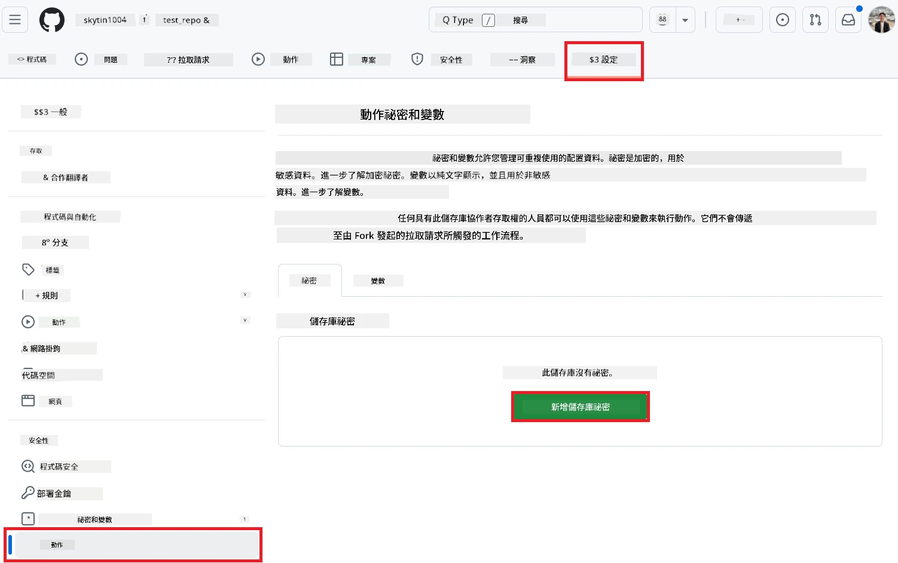
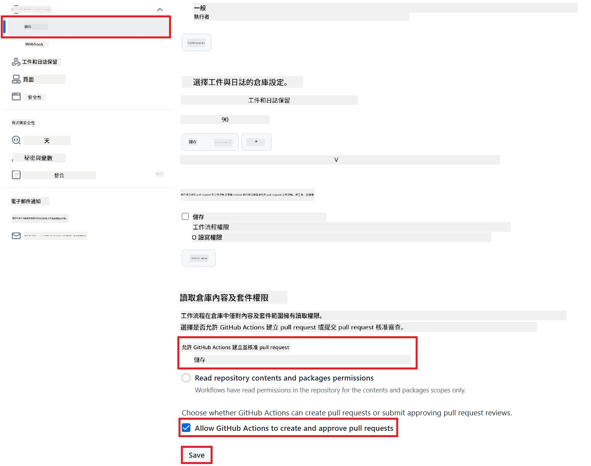

# 使用 Co-op Translator GitHub Action（公開設定）

**目標讀者：** 本指南適用於大多數公開或私人儲存庫，當標準 GitHub Actions 權限已足夠時。它會使用內建的 `GITHUB_TOKEN`。

利用 Co-op Translator GitHub Action，輕鬆自動化翻譯你的儲存庫文件。這份指南將帶你一步步設定，讓每當你的 Markdown 原始檔或圖片有變動時，系統都會自動建立包含最新翻譯的 Pull Request。

> [!IMPORTANT]
>
> **選擇正確的指南：**
>
> 本指南說明的是**使用標準 `GITHUB_TOKEN` 的簡易設定**。這是大多數使用者推薦的方法，因為不需要管理敏感的 GitHub App 私密金鑰。
>

## 先決條件

在設定 GitHub Action 前，請先準備好所需的 AI 服務憑證。

**1. 必要：AI 語言模型憑證**
你需要至少一組支援的語言模型憑證：

- **Azure OpenAI**：需要 Endpoint、API Key、Model/Deployment 名稱、API 版本。
- **OpenAI**：需要 API Key，（可選：Org ID、Base URL、Model ID）。
- 詳細資訊請參考 [支援的模型與服務](../../../../README.md)。

**2. 選用：AI Vision 憑證（用於圖片翻譯）**

- 僅當你需要翻譯圖片中的文字時才需要。
- **Azure AI Vision**：需要 Endpoint 和 Subscription Key。
- 若未提供，Action 會自動採用 [僅 Markdown 模式](../markdown-only-mode.md)。

## 設定與配置

請依照下列步驟，使用標準 `GITHUB_TOKEN` 在你的儲存庫中設定 Co-op Translator GitHub Action。

### 步驟 1：了解認證方式（使用 `GITHUB_TOKEN`）

此工作流程會使用 GitHub Actions 內建的 `GITHUB_TOKEN`。這個 Token 會根據你在**步驟 3**設定的權限，自動授權工作流程與你的儲存庫互動。

### 步驟 2：設定儲存庫密鑰

你只需要將**AI 服務憑證**加入儲存庫設定中的加密密鑰。

1.  前往目標 GitHub 儲存庫。
2.  點選 **Settings** > **Secrets and variables** > **Actions**。
3.  在 **Repository secrets** 下，針對下方每一個所需的 AI 服務密鑰，點選 **New repository secret** 新增。

    （圖片說明：顯示如何新增密鑰）

**所需 AI 服務密鑰（根據你的先決條件，全部都要加）：**

| Secret Name                         | 說明                                   | 來源                           |
| :---------------------------------- | :------------------------------------- | :----------------------------- |
| `AZURE_AI_SERVICE_API_KEY`            | Azure AI Service（Computer Vision）金鑰  | 你的 Azure AI Foundry           |
| `AZURE_AI_SERVICE_ENDPOINT`         | Azure AI Service（Computer Vision）端點  | 你的 Azure AI Foundry           |
| `AZURE_OPENAI_API_KEY`              | Azure OpenAI 服務金鑰                  | 你的 Azure AI Foundry           |
| `AZURE_OPENAI_ENDPOINT`             | Azure OpenAI 服務端點                  | 你的 Azure AI Foundry           |
| `AZURE_OPENAI_MODEL_NAME`           | 你的 Azure OpenAI 模型名稱             | 你的 Azure AI Foundry           |
| `AZURE_OPENAI_CHAT_DEPLOYMENT_NAME` | 你的 Azure OpenAI 部署名稱             | 你的 Azure AI Foundry           |
| `AZURE_OPENAI_API_VERSION`          | Azure OpenAI API 版本                  | 你的 Azure AI Foundry           |
| `OPENAI_API_KEY`                    | OpenAI API 金鑰                        | 你的 OpenAI Platform            |
| `OPENAI_ORG_ID`                     | OpenAI 組織 ID（可選）                 | 你的 OpenAI Platform            |
| `OPENAI_CHAT_MODEL_ID`              | 指定 OpenAI 模型 ID（可選）            | 你的 OpenAI Platform            |
| `OPENAI_BASE_URL`                   | 自訂 OpenAI API Base URL（可選）       | 你的 OpenAI Platform            |

### 步驟 3：設定工作流程權限

GitHub Action 需要透過 `GITHUB_TOKEN` 取得權限，以便檢出程式碼並建立 Pull Request。

1.  在你的儲存庫中，前往 **Settings** > **Actions** > **General**。
2.  往下捲動到 **Workflow permissions** 區塊。
3.  選擇 **Read and write permissions**。這會讓 `GITHUB_TOKEN` 取得本工作流程所需的 `contents: write` 和 `pull-requests: write` 權限。
4.  確認 **Allow GitHub Actions to create and approve pull requests** 的勾選框已**勾選**。
5.  點選 **Save**。



### 步驟 4：建立工作流程檔案

最後，建立一個 YAML 檔案，定義使用 `GITHUB_TOKEN` 的自動化工作流程。

1.  在你的儲存庫根目錄下，若尚未存在，請建立 `.github/workflows/` 目錄。
2.  在 `.github/workflows/` 內建立名為 `co-op-translator.yml` 的檔案。
3.  將下方內容貼到 `co-op-translator.yml`。

```yaml
name: Co-op Translator

on:
  push:
    branches:
      - main

jobs:
  co-op-translator:
    runs-on: ubuntu-latest

    permissions:
      contents: write
      pull-requests: write

    steps:
      - name: Checkout repository
        uses: actions/checkout@v4
        with:
          fetch-depth: 0

      - name: Set up Python
        uses: actions/setup-python@v4
        with:
          python-version: '3.10'

      - name: Install Co-op Translator
        run: |
          python -m pip install --upgrade pip
          pip install co-op-translator

      - name: Run Co-op Translator
        env:
          PYTHONIOENCODING: utf-8
          # === AI Service Credentials ===
          AZURE_AI_SERVICE_API_KEY: ${{ secrets.AZURE_AI_SERVICE_API_KEY }}
          AZURE_AI_SERVICE_ENDPOINT: ${{ secrets.AZURE_AI_SERVICE_ENDPOINT }}
          AZURE_OPENAI_API_KEY: ${{ secrets.AZURE_OPENAI_API_KEY }}
          AZURE_OPENAI_ENDPOINT: ${{ secrets.AZURE_OPENAI_ENDPOINT }}
          AZURE_OPENAI_MODEL_NAME: ${{ secrets.AZURE_OPENAI_MODEL_NAME }}
          AZURE_OPENAI_CHAT_DEPLOYMENT_NAME: ${{ secrets.AZURE_OPENAI_CHAT_DEPLOYMENT_NAME }}
          AZURE_OPENAI_API_VERSION: ${{ secrets.AZURE_OPENAI_API_VERSION }}
          OPENAI_API_KEY: ${{ secrets.OPENAI_API_KEY }}
          OPENAI_ORG_ID: ${{ secrets.OPENAI_ORG_ID }}
          OPENAI_CHAT_MODEL_ID: ${{ secrets.OPENAI_CHAT_MODEL_ID }}
          OPENAI_BASE_URL: ${{ secrets.OPENAI_BASE_URL }}
        run: |
          # =====================================================================
          # IMPORTANT: Set your target languages here (REQUIRED CONFIGURATION)
          # =====================================================================
          # Example: Translate to Spanish, French, German. Add -y to auto-confirm.
          translate -l "es fr de" -y  # <--- MODIFY THIS LINE with your desired languages

      - name: Create Pull Request with translations
        uses: peter-evans/create-pull-request@v5
        with:
          token: ${{ secrets.GITHUB_TOKEN }}
          commit-message: "🌐 Update translations via Co-op Translator"
          title: "🌐 Update translations via Co-op Translator"
          body: |
            This PR updates translations for recent changes to the main branch.

            ### 📋 Changes included
            - Translated contents are available in the `translations/` directory
            - Translated images are available in the `translated_images/` directory

            ---
            🌐 Automatically generated by the [Co-op Translator](https://github.com/Azure/co-op-translator) GitHub Action.
          branch: update-translations
          base: main
          labels: translation, automated-pr
          delete-branch: true
          add-paths: |
            translations/
            translated_images/
```

4.  **自訂工作流程：**
  - **[!IMPORTANT] 目標語言：** 在 `Run Co-op Translator` 步驟中，你**必須檢查並修改 `translate -l "..." -y` 指令中的語言代碼清單**，以符合你的專案需求。範例中的清單（`ar de es...`）需要替換或調整。
  - **觸發條件（`on:`）：** 目前的設定是每次 push 到 `main` 都會觸發。若你的儲存庫很大，建議加上 `paths:` 過濾條件（可參考 YAML 中的註解範例），只在相關檔案（如原始文件）變動時才執行，節省 runner 時間。
  - **PR 詳細資訊：** 如有需要，可自訂 `commit-message`、`title`、`body`、`branch` 名稱及 `labels`。

## 執行工作流程

> [!WARNING]  
> **GitHub-hosted Runner 執行時間限制：**  
> GitHub-hosted runner（如 `ubuntu-latest`）**最長執行時間為 6 小時**。  
> 若你的文件儲存庫很大，翻譯過程超過 6 小時，工作流程會自動被終止。  
> 為避免此情況，建議：  
> - 使用**自架 runner**（無時間限制）  
> - 每次執行時減少目標語言數量

當 `co-op-translator.yml` 檔案合併到你的主分支（或 `on:` 觸發條件指定的分支）後，每當有變更 push 到該分支（且符合 `paths` 過濾條件，如有設定），工作流程就會自動執行。

---

**免責聲明**：
本文件是使用 AI 翻譯服務 [Co-op Translator](https://github.com/Azure/co-op-translator) 進行翻譯。雖然我們力求準確，但請注意，自動翻譯可能包含錯誤或不準確之處。原始語言的文件應視為具權威性的來源。對於重要資訊，建議採用專業人工翻譯。因使用本翻譯而產生的任何誤解或誤釋，我們概不負責。