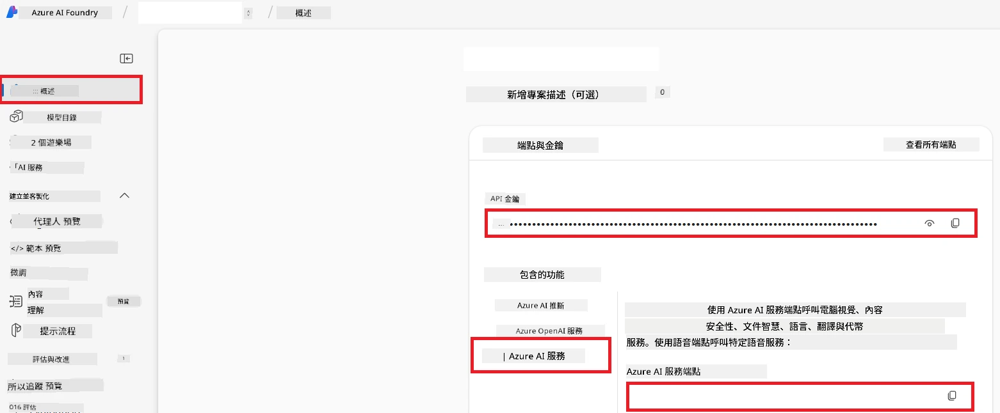

# 為 Co-op Translator 設置 Azure AI（Azure OpneAI 與 Azure AI Vision）

本指南將引導您在 Azure AI Foundry 中設置 Azure OpenAI 以進行語言翻譯，以及設置 Azure 計算機視覺以進行圖像內容分析（該分析可用於基於圖像的翻譯）。

**先決條件：**
- 擁有具備有效訂閱的 Azure 帳戶。
- 在您的 Azure 訂閱中擁有建立資源和部署的足夠權限。

## 建立 Azure AI 項目

您將從建立一個 Azure AI 項目開始，此項目作為管理您的 AI 資源的集中位置。

1. 前往 [https://ai.azure.com](https://ai.azure.com) 並使用您的 Azure 帳戶登入。

1. 選擇 **+Create** 以建立新項目。

1. 執行以下操作：
   - 輸入 **Project name**（例如 `CoopTranslator-Project`）。
   - 選擇 **AI hub**（例如 `CoopTranslator-Hub`）（如有需要可建立新的）。

1. 點擊 "**Review and Create**" 以設置您的項目。系統將帶您到項目概覽頁面。

## 為語言翻譯設置 Azure OpenAI

在您的項目中，您將部署 Azure OpenAI 模型，作為文字翻譯的後端。

### 導航至您的項目

若尚未進入，請在 Azure AI Foundry 中開啟您剛建立的項目（例如 `CoopTranslator-Project`）。

### 部署 OpenAI 模型

1. 從項目左側選單的「My assets」下，選擇 "**Models + endpoints**"。

1. 選擇 **+ Deploy model**。

1. 選擇 **Deploy Base Model**。

1. 系統將呈現可用模型列表。篩選或搜尋合適的 GPT 模型。我們推薦 `gpt-4o`。

1. 選擇您想要的模型，然後點擊 **Confirm**。

1. 選擇 **Deploy**。

### Azure OpenAI 配置

部署完成後，您可以從 "**Models + endpoints**" 頁面選取該部署，來查找其 **REST endpoint URL**、**Key**、**Deployment name**、**Model name** 以及 **API version**。這些資訊將用於將翻譯模型整合到您的應用程式中。

> [!NOTE]
> 您可以根據需求，從 [API 版本停用](https://learn.microsoft.com/azure/ai-services/openai/api-version-deprecation) 頁面選擇 API 版本。請注意，**API 版本** 與 Azure AI Foundry "**Models + endpoints**" 頁面顯示的 **Model 版本** 是不同的。

## 為圖像翻譯設置 Azure 計算機視覺

要啟用圖片中所含文字的翻譯，您需要取得 Azure AI 服務的 API Key 和 Endpoint。

1. 導航至您的 Azure AI 項目（例如 `CoopTranslator-Project`）。確認您處於項目概覽頁面。

### Azure AI 服務配置

從 Azure AI 服務中尋找 API Key 和 Endpoint。

1. 導航至您的 Azure AI 項目（例如 `CoopTranslator-Project`）。確認您處於項目概覽頁面。

1. 從 Azure AI 服務分頁中找到 **API Key** 及 **Endpoint**。

    

此連線將使已連結的 Azure AI 服務資源（包含圖像分析）功能，能夠提供給您的 AI Foundry 項目使用。您隨後可以在筆記本或應用程式中利用此連線從圖像中提取文字，再將這些文字傳送至 Azure OpenAI 模型進行翻譯。

## 集中管理您的憑證

至此，您應該已收集下列資訊：

**對於 Azure OpenAI（文字翻譯）：**
- Azure OpenAI Endpoint
- Azure OpenAI API Key
- Azure OpenAI Model Name（例如 `gpt-4o`）
- Azure OpenAI Deployment Name（例如 `cooptranslator-gpt4o`）
- Azure OpenAI API Version

**對於 Azure AI Services（透過 Vision 擷取圖像文字）：**
- Azure AI Service Endpoint
- Azure AI Service API Key

### 範例：環境變數配置（預覽）

在稍後構建應用時，您很可能會使用這些收集到的憑證來配置應用。例如，您可能會將它們設為環境變數，如下所示：

```bash
# Azure AI 服務憑證（影像翻譯必填）
AZURE_AI_SERVICE_API_KEY="your_azure_ai_service_api_key" # 例如，21xasd...
AZURE_AI_SERVICE_ENDPOINT="https://your_azure_ai_service_endpoint.cognitiveservices.azure.com/"

# 可選的備援組：重複變量並加上後綴 _1/_2（同一組中所有變量使用相同索引）
AZURE_AI_SERVICE_API_KEY_1="your_azure_ai_service_api_key_1"
AZURE_AI_SERVICE_ENDPOINT_1="https://your_azure_ai_service_endpoint_1.cognitiveservices.azure.com/"

# Azure OpenAI 憑證（文字翻譯必填）
AZURE_OPENAI_API_KEY="your_azure_openai_api_key" # 例如，21xasd...
AZURE_OPENAI_ENDPOINT="https://your_azure_openai_endpoint.openai.azure.com/"
AZURE_OPENAI_MODEL_NAME="your_model_name" # 例如，gpt-4o
AZURE_OPENAI_CHAT_DEPLOYMENT_NAME="your_deployment_name" # 例如，cooptranslator-gpt4o
AZURE_OPENAI_API_VERSION="your_api_version" # 例如，2024-12-01-preview

# 可選的備援組：將整組 AZURE_OPENAI_* 變量重複並加上後綴 _1/_2（所有變量使用相同索引）
```

---

### 進一步閱讀

- [如何在 Azure AI Foundry 創建項目](https://learn.microsoft.com/azure/ai-foundry/how-to/create-projects?tabs=ai-studio)
- [如何創建 Azure AI 資源](https://learn.microsoft.com/azure/ai-foundry/how-to/create-azure-ai-resource?tabs=portal)
- [如何在 Azure AI Foundry 部署 OpenAI 模型](https://learn.microsoft.com/en-us/azure/ai-foundry/how-to/deploy-models-openai)

---

<!-- CO-OP TRANSLATOR DISCLAIMER START -->
**免責聲明**：  
本文件係使用 AI 翻譯服務 [Co-op Translator](https://github.com/Azure/co-op-translator) 所翻譯。雖然我們力求準確，但請注意，自動翻譯可能包含錯誤或不準確之處。原始文件之母語版本應視為權威來源。對於重要資訊，建議採用專業人工翻譯。我們不對因使用本翻譯而產生的任何誤解或誤譯負責。
<!-- CO-OP TRANSLATOR DISCLAIMER END -->